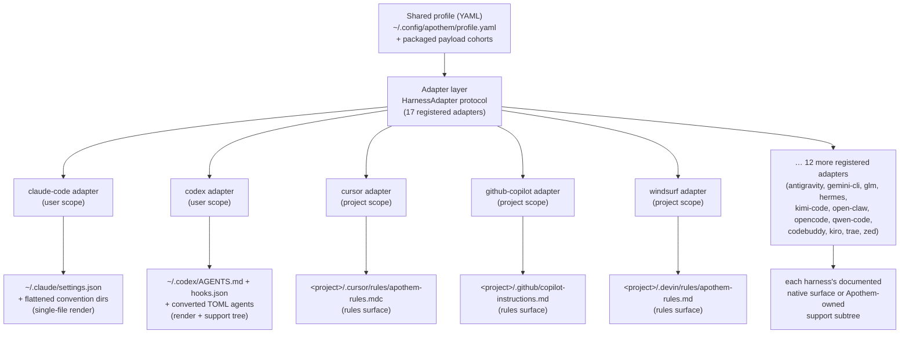

{/* SPDX-License-Identifier: MIT */}

Apothem utilise un unique profil YAML validé par schéma comme source sémantique
de vérité et dérive chaque surface d'installation propre à un environnement via
des classes adaptatrices qui implémentent le protocole `HarnessAdapter`. Chaque
adaptateur écrit dans l'emplacement utilisateur ou projet documenté par
l'environnement et n'utilise des chemins de support propres à Apothem que lorsque
l'environnement n'a pas de primitive native équivalente.

## Pourquoi une abstraction d'adaptateur

Chaque environnement parle un dialecte de configuration différent : l'un veut un
fichier de paramètres JSON, un autre un répertoire de fichiers de règles `.mdc`,
un troisième un unique fichier d'instructions Markdown. Si Apothem codait ces
connaissances en dur dans la CLI, chaque environnement laisserait fuiter ses
hypothèses dans le cœur, et ajouter un environnement signifierait toucher la
logique d'installation, de mise à jour, de désinstallation et de vérification à
l'unisson.

Le motif adaptateur inverse cela. Le cœur ne connaît que le protocole
`HarnessAdapter` — un petit contrat de méthodes de cycle de vie. Le dialecte de
chaque environnement vit à l'intérieur d'un sous-paquet autonome qui implémente le
contrat. Le cœur demande à un adaptateur d'*installer* sans savoir si cela
signifie rendre un fichier JSON, écrire un répertoire de règles ou poser un arbre
de support. Les nouveaux environnements rejoignent en satisfaisant le protocole et
en enregistrant un point d'entrée ; rien dans le cœur ne change. C'est la raison
structurelle pour laquelle Apothem reste agnostique à l'hôte — l'abstraction est
la frontière qui empêche les connaissances propres à un environnement de se
propager.

## La forme d'un adaptateur

Les adaptateurs se répartissent en deux formes de matérialisation, toutes deux
visibles dans le registre :

- **Les moteurs de rendu de fichier unique** traduisent les champs du profil en un
  unique fichier de configuration natif de l'environnement. L'adaptateur Claude
  Code, par exemple, écrit toujours `~/.claude/settings.json` à partir du profil
  partagé et aplatit les répertoires de convention d'Apothem (`agents/`, `rules/`,
  `skills/`, …) à côté.
- **Les adaptateurs de surface de règles et d'arbre de support** propagent le
  cohorte de charge utile d'Apothem vers l'emplacement de règles documenté par
  l'environnement, convertissant les cohortes au format natif lorsqu'il en existe
  un et garant le reste sous un sous-arbre de support propre à Apothem référencé
  depuis l'ancre native. L'adaptateur Cursor écrit un unique
  `.cursor/rules/apothem-rules.mdc` dans la racine de projet fournie et ne livre
  que la surface de règles.

Un adaptateur donné est de **portée utilisateur** (écrit sous le répertoire
personnel) ou de **portée projet** (requiert `--project <path>` et écrit à
l'intérieur de cet arbre) ; le registre indique lequel.

## Topologie actuelle des adaptateurs



L'éventail du centre vers les bords est l'architecture que le nom du projet
encode : un profil au cœur, chaque environnement à une distance égale le long de
son propre adaptateur.

## Définition du protocole

```python
from pathlib import Path
from typing import Protocol

class HarnessAdapter(Protocol):
    name: str
    output_path: Path

    def install(self, profile: dict[str, object]) -> object:
        ...

    def update(self, profile: dict[str, object]) -> object:
        ...

    def uninstall(self) -> None:
        ...

    def is_installed(self) -> bool:
        ...

    def verify(self) -> bool:
        ...
```

Les adaptateurs de portée projet peuvent en outre accepter `project: Path | None`
sur les méthodes de cycle de vie et exposer `resolve_output_path(project)`. La CLI
ne passe `--project PATH` qu'aux adaptateurs dont la signature de méthode
l'accepte.

## Enregistrement du point d'entrée

Les adaptateurs s'enregistrent via le groupe de points d'entrée setuptools
`apothem.harnesses` :

```toml
[project.entry-points."apothem.harnesses"]
cursor = "apothem.harnesses.cursor:CursorAdapter"
```

Le registre central dans `src/apothem/lib/harness_registry.py` consigne les dix-sept
ID publics exacts, les points d'entrée, les chemins de documentation, les chemins
cibles, les exigences de données de paquet, les états de capacité et les chemins
d'épinglage de convention standard. La CLI charge les adaptateurs via ce registre
au lieu de redécouvrir des faits produit dans chaque commande.

## Mappage du profil vers le natif

Chaque adaptateur implémente la logique de traduction appropriée à son
environnement :

```
YAML profile + payload cohort    Harness-native surface
-----------------------------    ----------------------
identity / preferences       --> native config fields or rendered instruction context
commands/*.md                --> native commands or SKILL.md folders
rules/*.md                   --> native rules where supported, otherwise support trees
hooks/messages/*.md          --> native hooks where supported, otherwise support trees
agents/*.md                  --> native agent formats where supported
skills/*/SKILL.md            --> native skill folders where supported
```

Les cellules de capacité non prises en charge et en attente de découverte
deviennent des avertissements structurés avant les écritures. Elles ne sont pas
projetées en silence sur des surfaces de fournisseur inventées.

## Ajouter un nouvel adaptateur

Voir [Écrire un adaptateur d'environnement](/docs/examples/authoring-a-harness-adapter)
pour un guide pas à pas.
