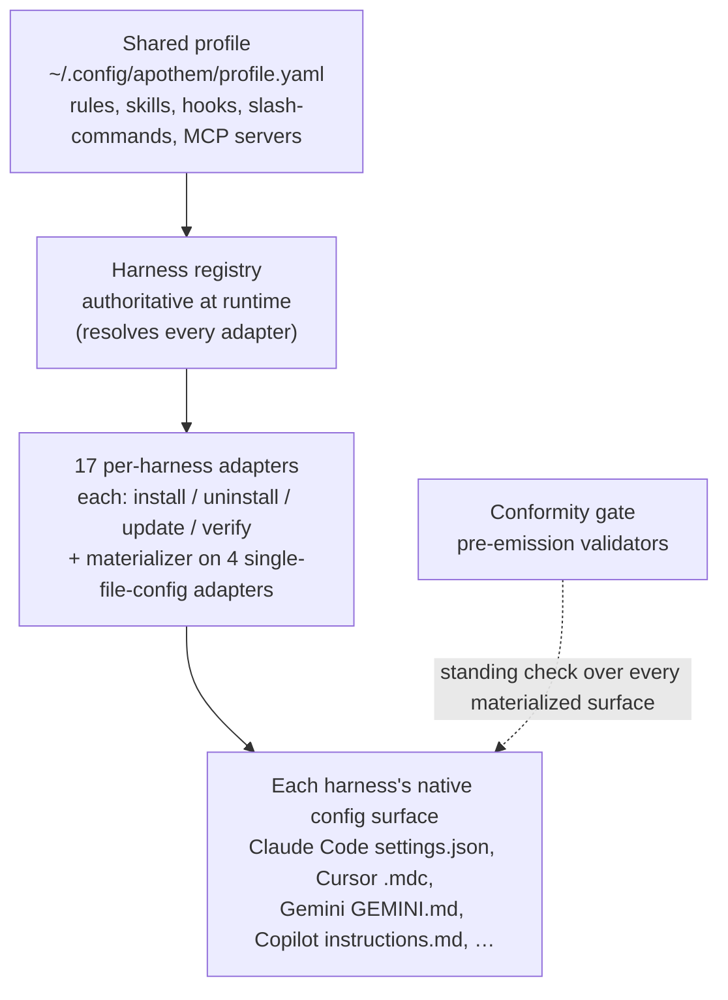

{/* SPDX-License-Identifier: MIT */}

Apothem s'articule autour d'une seule idée : un profil de gouvernance partagé,
matérialisé dans le format de configuration natif de chaque environnement
d'exécution d'assistant par un adaptateur propre à chaque
harness. Cette section explique les pièces structurelles — le protocole de
l'adaptateur, le schéma du profil, l'organisation de l'arborescence des sources
et le flux d'installation qui les relie.

## Vue d'ensemble du système

En un coup d'œil, Apothem est un seul pipeline : un unique profil partagé
alimente le registre de harness, qui résout chaque adaptateur propre à un
harness ; chaque adaptateur matérialise la surface de configuration native de
son harness, et un contrôle de conformité permanent vérifie chaque surface
matérialisée.

## Pages

| Page | Description |
|------|-------------|
| [Abstraction de l'adaptateur de harness](/docs/architecture/harness-adapter-abstraction) | Le protocole `HarnessAdapter` — comment les adaptateurs traduisent le profil partagé en configuration native de la plateforme. |
| [Schéma du profil partagé](/docs/architecture/shared-profile-schema) | Le profil YAML adossé à un schéma dans `~/.config/apothem/profile.yaml` ou `--profile PATH`. |
| [Organisation des sources](/docs/architecture/source-layout) | Pourquoi Apothem utilise une organisation `src/` et comment l'arborescence est structurée. |
| [Flux d'installation](/docs/architecture/installation-workflow) | Comment `apothem install`, `update` et `uninstall` fonctionnent de bout en bout. |
| [Travailleurs délégués](/docs/architecture/agents) | Instructions à portée de dépôt pour les environnements d'exécution multi-travailleurs opérant dans ce dépôt. |
| [Runtime autonome](/docs/architecture/self-contained-runtime) | Comment le moteur d'Apothem s'exécute depuis n'importe quel checkout — dépendances internalisées, le modèle d'invocation PYTHONPATH=src et le bootstrap de l'arbre du plugin. |
| [Stratégie d'internalisation des dépendances](/docs/architecture/vendoring-strategy) | Quels paquets tiers Apothem internalise sous src/apothem/_vendor/, lesquels restent des prérequis système, et comment les copies internalisées sont rafraîchies. |
| [Contrat d'empaquetage des cohortes](/docs/architecture/cohort-packaging-contract) | Le contrat stable, consommable en aval, pour l'empaquetage des cohortes et les manifestes de plugin — énumérer les cohortes et résoudre leurs cibles natives par environnement sans redériver la correspondance. |
| [Diagramme du pipeline CI/CD](/docs/architecture/cicd-pipeline) | Carte visuelle et décomposition par couloirs des étapes du flux de travail de build, de test, de lint, de sécurité et de publication qui contrôlent chaque changement de code et chaque release. |
