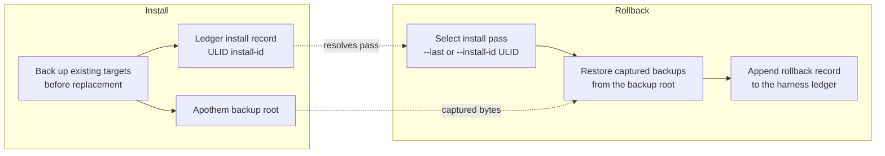

{/* SPDX-License-Identifier: MIT */}

## Flux d'installation

```mermaid
flowchart TD
    accTitle: Apothem install workflow
    accDescr: Top-down flowchart of the apothem install command from CLI invocation through adapter lookup, profile load, adapter install call, native config write, and final apothem verify check.
    A[apothem install --harness X] --> B[Resolve adapter through registry]
    B --> C[Load and validate profile YAML<br/>before writes]
    C --> D[Adapter.install(profile, project)]
    D --> E[Write native config and support cohorts]
    E --> F[apothem verify --harness X]
    F --> G{All checks pass?}
    G -- yes --> H[Done]
    G -- no --> I[Report failures]
```

## Flux de mise à jour

Lors de `apothem update --harness X` :

1. Charge et valide `~/.config/apothem/profile.yaml` ou `--profile PATH`.
2. Résout le harness sélectionné ou `all` via le registre central.
3. Valide le plan de matérialisation complet avant la première écriture.
4. Appelle `Adapter.update(profile, project=...)`.
5. Rapporte les résultats créés, mis à jour, inchangés, ignorés, avec avertissement et avec erreur.

## Flux de désinstallation

Lors de `apothem uninstall --harness X` :

1. Appelle `Adapter.uninstall()`.
2. L'adaptateur supprime uniquement les fichiers qu'il a écrits ; le profil
   partagé YAML et les fichiers non liés rédigés par l'opérateur restent intacts.

## Résolution de portée

Chaque adaptateur écrit dans sa propre racine d'installation fixe : le répertoire
personnel de l'utilisateur pour les adaptateurs de portée utilisateur et le chemin
local du projet pour les adaptateurs de portée projet. La CLI n'expose pas
d'option `--scope` ; les adaptateurs de portée projet exigent `--project <path>`.
Chaque destination est documentée dans
`site/content/docs/harnesses/<harness>.mdx`.

## Gestion des erreurs

Les opérations d'installation/mise à jour valident avant d'écrire, sauvegardent
les cibles correspondantes existantes avant le remplacement, et ne fusionnent que
les entrées enfants gérées par Apothem dans les répertoires de découverte
partagés. `--dry-run` exécute la même validation et renvoie des résultats ignorés
ou inchangés sans créer de répertoires ni de fichiers.

## Reversibility (backup and rollback)

Every install pass is reversible. Replaced bytes are captured into the Apothem
backup root and the pass is recorded in the harness ledger under a ULID
install id; [`apothem rollback`](/docs/cli-reference/rollback) selects a
recorded pass and restores those captured backups.


