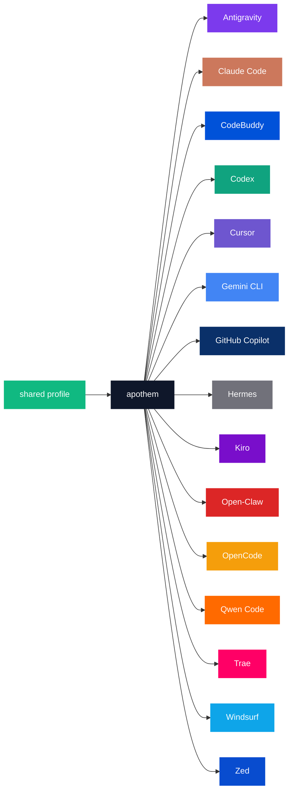

{/* SPDX-License-Identifier: MIT */}

Les énumérations canoniques nom-de-marque × code-couleur ci-dessous sont encadrées dans une clôture `text` afin de préserver les identifiants littéraux par environnement requis par la vocation de catalogue de la palette.

## Cœur d'Apothem

| Jeton | Clair | Sombre | Usage |
|---|---|---|---|
| `apothem-hub` | `#0F172A` | `#F1F5F9` | Le nœud central de distribution (« apothem ») dans chaque diagramme d'architecture et le concentrateur central du logo Apothem. |
| `shared-profile` | `#10B981` | `#34D399` | Le profil source-de-vérité qui alimente le cœur d'apothem. |

## Palette des environnements

Quinze des dix-sept environnements sont colorés pour correspondre à leur identité
de marque principale. Les deux restants — `glm` et `kimi-code` — n'ont pas encore
de couleur de marque définie ; leurs lignes sont ajoutées une fois la couleur de
marque amont fixée, selon l'étape de propagation décrite sous [Mises à jour](#updates).

```text
| Token             | Light     | Dark      | Source                                                                                                                                              |
|-------------------|-----------|-----------|-----------------------------------------------------------------------------------------------------------------------------------------------------|
| `antigravity`     | `#7C3AED` | `#9F67FF` | Google Antigravity deep-purple.                                                                                                                     |
| `claude-code`     | `#CC785C` | `#E89378` | Anthropic terracotta-orange.                                                                                                                        |
| `codebuddy`       | `#0052D9` | `#5E8EF7` | Tencent CodeBuddy blue.                                                                                                                             |
| `codex`           | `#10A37F` | `#19C796` | OpenAI signature teal.                                                                                                                              |
| `cursor`          | `#6E56CF` | `#9B85E3` | Cursor brand purple.                                                                                                                                |
| `gemini-cli`      | `#4285F4` | `#6BA4F7` | Google blue (primary); the Apothem mark renders the node with all four Google brand hues `#4285F4` / `#34A853` / `#FBBC04` / `#EA4335`.             |
| `github-copilot`  | `#0A3069` | `#5B8FE3` | GitHub Mona deep-blue.                                                                                                                              |
| `hermes`          | `#71717A` | `#A1A1AA` | Community silver-grey.                                                                                                                              |
| `kiro`            | `#790ECB` | `#A862DD` | Kiro violet.                                                                                                                                        |
| `open-claw`       | `#DC2626` | `#F87171` | Community red-orange.                                                                                                                               |
| `opencode`        | `#F59E0B` | `#FBBF24` | Community amber.                                                                                                                                    |
| `qwen-code`       | `#FF6A00` | `#FF8C40` | Alibaba Qwen orange.                                                                                                                                |
| `trae`            | `#FF0066` | `#FF599C` | ByteDance Trae magenta.                                                                                                                             |
| `windsurf`        | `#0EA5E9` | `#38BDF8` | Windsurf sky-blue.                                                                                                                                  |
| `zed`             | `#084CCF` | `#5E8BE0` | Zed Industries blue.                                                                                                                                |
```

## Justification des noms

- **`apothem-hub`** — le centre géométrique que le nom évoque (l'apothème d'un polygone régulier pointe vers l'intérieur, vers son cœur).
- **`shared-profile`** — la source amont, distincte de la couleur de tout environnement isolé afin qu'elle se lise comme la flèche d'« entrée » dans chaque diagramme.
- **Les jetons par environnement** reflètent le slug d'environnement utilisé dans toute la base de code (`harnesses/<slug>/`, la clé du point d'entrée, l'argument `--harness <slug>` de la CLI). Un mot par concept ; la même chaîne partout.

## Utilisation de Mermaid



## Accessibilité

Chaque jeton en mode clair satisfait au contraste WCAG 2.2 AA face à du texte blanc (≥4,5 : 1) là où le contraste le permet sans dénaturer la couleur de marque. Lorsque la couleur de marque native d'un environnement passe sous le seuil AA face à du texte blanc à elle seule (notamment la famille ambre / orange et la famille bleu ciel / sarcelle de jetons énumérée ci-dessus), les diagrammes qui ont besoin d'un contraste WCAG AA texte-sur-couleur utilisent la **variante en mode sombre** (la teinte rehaussée) comme remplissage du diagramme afin que le texte blanc se lise nettement. La colonne du mode sombre est calibrée à cette fin : chaque jeton en mode sombre dépasse le seuil AA face à du texte blanc.

## Mises à jour

La palette n'est mise à jour que lorsqu'un environnement ratifie un changement de marque en amont. Les changements de marque par environnement se propagent de manière atomique à travers `site/app/global.css`, cette page et chaque master SVG concerné sous `assets/src/`.
