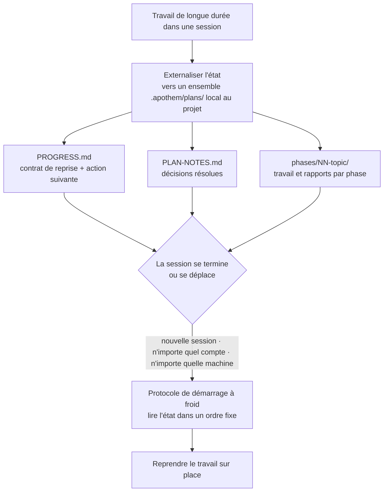

{/* SPDX-License-Identifier: MIT */}

La majeure partie du travail de programmation assistée vit et meurt à l'intérieur
d'une seule conversation. Vous fermez le chat, changez de machine ou vous
connectez sur un autre compte, et le fil de ce que vous faisiez disparaît — la
session suivante repart à froid, sans mémoire des décisions que vous aviez déjà
prises.

Apothem inverse cela. Pour le travail de longue durée et en plusieurs étapes, il
externalise son **état de travail complet** vers un ensemble `.apothem/plans/` local au
projet (`.plans/` conservé comme repli) : des fichiers qui résident dans votre dépôt, et non dans l'historique
d'un quelconque chat hébergé dans le cloud. L'état est l'artefact durable ; la
session est jetable.

## L'idée centrale

Un ensemble de plans dans `<project-root>/.apothem/plans/{suite}/` porte deux choses qui
rendent une session remplaçable :

- **Un contrat de reprise.** `PROGRESS.md` consigne la phase et l'état des tâches
  en cours, l'action suivante précise, les conventions en vigueur, les décisions
  déjà résolues et les fichiers exacts que la session suivante doit lire.
- **Un protocole de démarrage à froid.** Une nouvelle session lit ces fichiers
  dans un ordre fixe et reconstitue le tableau complet avant de faire le moindre
  travail — sans avoir besoin de l'historique de la conversation.

Comme cet état se trouve dans les fichiers de votre projet, une nouvelle session
sur **n'importe quel compte ou machine** pointée vers le même projet reprend le
travail sur place. Rien n'est enfermé dans une seule transcription de chat. C'est
la propriété qui permet au travail structuré, à grande échelle et sur plusieurs
jours — gros corpus, longues migrations, grandes passes de revue — de survivre à
des limites qui, autrement, y mettraient fin.

## Ce que c'est, précisément

Énoncé avec exactitude pour que la garantie soit claire :

- **C'est** un état externalisé vers des fichiers, plus un protocole de reprise à
  froid. Le travail reprend parce que l'état réside dans les fichiers de votre
  projet, indépendant de toute session, compte ou machine.
- **Ce n'est pas** un service automatique de synchronisation entre comptes.
  Apothem ne pousse pas de lui-même l'état de vos plans d'un compte à l'autre —
  les fichiers voyagent de la même manière que les fichiers de votre projet
  voyagent déjà (contrôle de version, un checkout partagé, un répertoire
  synchronisé). Ce qu'Apothem garantit, c'est que partout où atterrissent les
  fichiers du projet, une nouvelle session peut reprendre à partir d'eux.

## Pourquoi c'est important

Plus le travail est long et volumineux, plus une seule conversation devient un
fardeau. Une refonte de plusieurs jours ou un balayage à travers une grande base
de code survivra à n'importe quelle session : les fenêtres de contexte se
compactent, les sessions expirent, les machines changent. En traitant les
fichiers mêmes du projet comme la source de vérité du travail en cours, Apothem
rend le travail résistant aux trois limites : session, compte et machine.

## Où réside l'état

| Artefact | Emplacement | Contient |
|----------|----------|-------|
| Ensemble de plans | `<project-root>/.apothem/plans/{suite}/` | Une unité autonome de travail en cours |
| Contrat de reprise | `<suite>/PROGRESS.md` | État de phase/tâche, action suivante, conventions, manifeste des fichiers critiques |
| Registre de décisions | `<suite>/PLAN-NOTES.md` | Décisions résolues, jamais redemandées |
| Travail par phase | `<suite>/phases/NN-topic/` | Les tâches de la phase et son rapport |

L'arborescence des plans est exclue du contrôle de version par le fragment
canonique de `.gitignore` d'Apothem, de sorte que l'état des plans reste local par
défaut. Pour transporter délibérément le travail en cours entre machines ou
comptes, déplacez l'ensemble `.apothem/plans/` de la même façon que vous déplacez
n'importe quel autre fichier du projet.

## Connexe

- **[Niveaux de sérieux](/docs/concepts/seriousness-tiers)** — comment la
  gouvernance et la discipline d'externalisation de l'état s'adaptent à
  l'engagement.
- **[Le pipeline de commandes](/docs/pipeline)** — les étapes de `/plan` qui
  créent et font avancer un ensemble de plans.

## Recommended Next Step

**Lisez [Niveaux de sérieux](/docs/concepts/seriousness-tiers)** pour voir comment
la discipline d'externalisation s'adapte d'une expérience rapide à un effort de
plusieurs jours qui franchit des limites.
