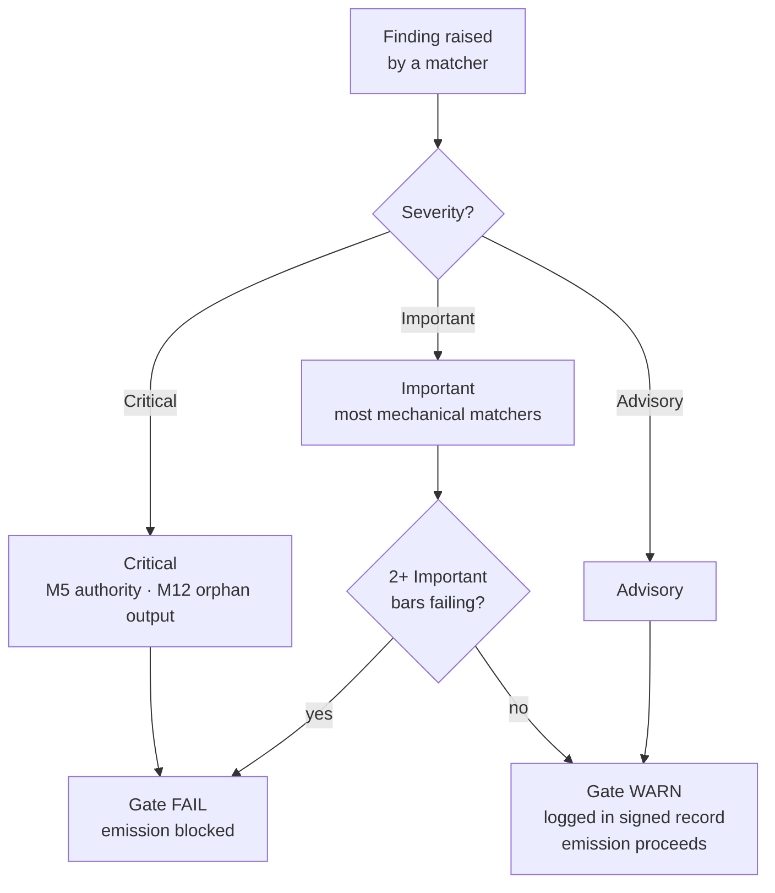

{/* SPDX-License-Identifier: MIT */}

## Les quinze points

| Point | ID | Mandat | Classe de vérification | Échec → action |
|---|---|---|---|---|
| 1 | M1 | Agnosticisme vis-à-vis du projet hôte | Raisonnée | Réviser pour correspondre aux conventions de l'hôte |
| 2 | M2 | Discipline éditoriale (registre de divulgation) | Mécanique | Ajouter les marqueurs de divulgation |
| 3 | M3 | Dix dimensions de qualité | Raisonnée | Réviser sur les dimensions en échec |
| 4 | M4 | Auto-application (bloc de registre signé présent) | Mécanique | Consigner le bloc de registre signé |
| 5 | M5 | Principe d'autorité (aucune identité / point de terminaison / secret fabriqués) | Mécanique | Acheminer vers la demande |
| 6 | M6 | Incorporation d'expertise (lacunes mises au jour) | Raisonnée | Mettre les lacunes au jour ; citer les raffinements |
| 7 | M7 | Annotation des options (marqueur de recommandation + justification) | Mécanique | Annoter les ensembles d'options |
| 8 | M8 | Caractère définitif (aucun atermoiement dans la prose prescriptive) | Mécanique | Promouvoir les atermoiements en conditionnels |
| 9 | M9 | Levier visuel (les sujets structurels portent des diagrammes) | Raisonnée | Créer / actualiser le diagramme |
| 10 | M10 | Liaison bidirectionnelle (pointeurs réciproques fermés) | Mécanique | Fermer les demi-arêtes |
| 11 | M11 | Sprints agiles (Objectif / Backlog / DoR / DoD / Revue / Rétrospective) | Raisonnée | Restructurer en sprints |
| 12 | M12 | Rapports de phase et agencement canonique | Mécanique | Créer la synthèse ; déplacer vers l'agencement canonique |
| 13 | M13 | Métier du code (linter / formateur / vérificateur de types ; nombre magique ; bare-except) | Mécanique | Réviser selon les règles de métier du code par langage |
| 14 | M14 | Systémicité (déclare ascendants / descendants / pairs / applicateurs) | Raisonnée | Déclarer ; indexer dans les registres |
| 15 | M15 | Prêt pour la production (tests + documentation + CHANGELOG + commit conforme + CI au vert + stabilité semver) | Mécanique | Ajouter les surfaces manquantes |

## Échelle de sévérité

| Sévérité | Effet sur le portail |
|---|---|
| **Critique** | Portail FAIL — émission bloquée inconditionnellement |
| **Importante** | Portail FAIL lorsque 2 points Importants ou plus échouent simultanément |
| **Indicative** | Portail WARN — consignée dans le bloc signé ; ne bloque pas l'émission |

La plupart des apparieurs de la fraction mécanique sont par défaut **Importants**. M5 (autorité — secrets, points de terminaison fabriqués) et M12 (sorties orphelines) sont **Critiques**.



## Apparieurs de la fraction mécanique

La fraction mécanique vit dans [`src/apothem/conformity/*_grep.py`](https://github.com/ahmed-g-gad/apothem/tree/main/src/apothem/conformity), orchestrée par [`src/apothem/conformity/gate.py`](https://github.com/ahmed-g-gad/apothem/blob/main/src/apothem/conformity/gate.py).

| Apparieur | Point | Fonction |
|---|---|---|
| `hedging_grep.py` | M8 | Détecte le vocabulaire atermoyant dans la prose prescriptive |
| `option_annotation_grep.py` | M7 | Vérifie le marqueur `**Recommended**` + la justification sur les ensembles d'options |
| `user_confirm_grep.py` | M5 | Bloque les espaces réservés `<USER-CONFIRM:…>` à l'émission |
| `binding_reciprocity_grep.py` | M10 | Détecte les demi-arêtes dans `## Bindings (§0.j five-direction)` |
| `orphan_output_grep.py` | M12 | Signale les artefacts sans consommateur / sans entrée d'index / sans attribution de producteur |
| `bare_except_grep.py` | M13 | Détecte `except:` / `except Exception:` sans commentaire justificatif |
| `magic_number_grep.py` | M13 | Détecte les littéraux numériques dans la logique métier |
| `commented_out_code_grep.py` | M13 | Détecte les blocs de code commentés |
| `file_header_grep.py` | M13 | Vérifie la présence de l'en-tête de licence SPDX sur une seule ligne |
| `frontmatter_grep.py` | M14 | Vérifie les champs de frontmatter requis sur les quatre répertoires de directives canoniques listés ci-dessous |
| `semver_stability_grep.py` | M15 | Détecte les changements rupturistes de l'API publique sans incrément de version MAJOR |
| `production_ready_pr_grep.py` | M15 | Vérifie la discipline du même ensemble de modifications (tests + documentation + CHANGELOG) |
| `secret_leak_grep.py` | M15 | Détecte les secrets / identifiants codés en dur |
| `unpinned_action_grep.py` | M15 | Vérifie l'épinglage des GitHub Actions à un commit SHA |
| `always_on_budget_grep.py` | plafond de budget | Plafonne le corps des règles toujours actives à 500 tokens substantiels |

## Exécuter le portail

Sur un harness installé, le portail s'exécute automatiquement : le
`settings.json` de Claude Code le câble en tant que hook `PreToolUse` qui
invoque la copie matérialisée à `~/.claude/.apothem/support/conformity/gate.py`
avant chaque Write/Edit. Depuis un checkout source, la forme module
exécute le même code :

```shell
# Distribution sur un seul fichier (imite le hook PreToolUse) :
echo '{"tool_input": {"file_path": "path/to/file", "content": "..."}}' \
    | python -m apothem.conformity.gate --hook

# Balayage composite à travers le dépôt :
python -m apothem.conformity.gate --sweep src/ site/content/docs/ rules/
```

Voir [Exécuter le portail de conformité](/docs/usage/conformity-gate) pour la procédure complète.

## Référence

- [Registre du portail de pré-émission](/docs/governance/pre-emission-gate-registry) — définitions canoniques des points
- [Registre de conformité externe](/docs/governance/outward-conformity-registry) — sémantique détaillée de M1-M15
- [Mandats transversaux](/docs/governance/cross-cutting-mandates) — source de vérité des mandats
- [Discipline de performance](https://github.com/ahmed-g-gad/apothem/blob/main/src/apothem/rules/performance-discipline.md) — budgets d'exécution par classe
