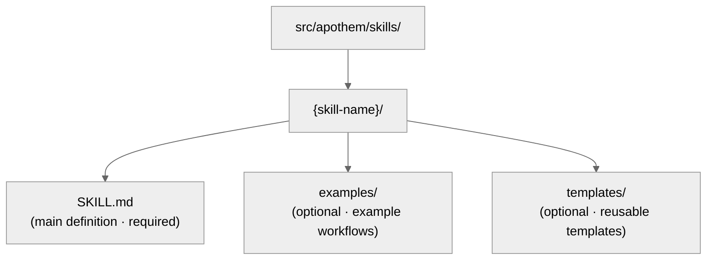

{/* SPDX-License-Identifier: MIT */}

Ce guide aide les développeurs à maintenir et étendre l'écosystème Apothem avec
des standards de qualité SOTA.

## Référence rapide : types d'artefacts

L'écosystème Apothem contient cinq types d'artefacts, chacun avec des finalités
et des exigences de frontmatter spécifiques.

| Artefact | Chemin | Finalité | Quand le créer |
| -------- | ---- | ------- | -------------- |
| **Règle** | `src/apothem/rules/*.md` | Mandat comportemental ou directive opérationnelle | Nouveau principe, politique ou mandat de gouvernance établi |
| **Commande** | `src/apothem/commands/*.md` | Commande slash (`/command-name`) pour des workflows complexes | Nouveau workflow utilisateur multi-étapes |
| **Assistant** | répertoire des assistants (`*.md` par fichier) | Définition persistante de worker délégué pour des tâches parallèles | Nouvelle tâche spécialisée récurrente (audit, exploration, contrôle qualité) |
| **Skill** | `src/apothem/skills/{name}/SKILL.md` | Technique réutilisable avec signal de détection | Nouveau motif de technique réutilisable et détectable |
| **Hook** | `src/apothem/hooks/` + `settings.json` | Validation déclenchée par événement ou gestion d'état | Nouvel événement de cycle de vie ou besoin de validation |

## Contrat d'adaptateur d'environnement

L'identité et les capacités d'un environnement se trouvent dans
`src/apothem/lib/harness_registry.py`. Une modification d'environnement n'est
complète que lorsque ces surfaces concordent :

| Surface | Mise à jour requise |
| --- | --- |
| Ligne du registre | Identifiant public, clé de paquet, point d'entrée, périmètre, format de sortie, chemins cibles, chemins de docs, fichier de capacités, pin de convention, tests de fixtures, clé de package-data, sources de templates et statuts de capacités. |
| Paquet d'adaptateur | `__init__.py`, `install.py`, `update.py`, `uninstall.py`, `verify.py` ; ajoutez `materializer.py` uniquement lorsque l'environnement rend un fichier de configuration natif. |
| Manifeste de propagation | Chemins de templates et de cohortes pour les adaptateurs adossés au manifeste. |
| Capacités | `src/apothem/harnesses/<package>/capabilities.yml` avec chaque capacité requise et le justificatif des états non pris en charge ou en attente de découverte. |
| Pin de convention | `STANDARD-CONVENTION-PIN.md` avec l'URL du fournisseur, la date de capture, le nom/schéma de fichier canonique, la référence des preuves et le justificatif des capacités non prises en charge. |
| Tests | Parité du registre, test de fixture d'adaptateur, ligne golden de plan d'installation, comportement dry-run/sans-écriture, idempotence et couverture de package-data. |
| Docs | Page de référence de l'environnement, page de comparaison, notes de capacités/MCP et exemples utilisant des espaces réservés fictifs. |

Les adaptateurs au niveau projet doivent définir `requires_project = True`,
accepter `project: Path | None` sur les méthodes de cycle de vie et rejeter les
racines de projet manquantes ou non sûres avant toute écriture. Les adaptateurs
au niveau utilisateur doivent conserver les chemins sous la racine de
configuration utilisateur documentée par l'environnement.

## Politique des fixtures golden

`tests/fixtures/harness-golden-plans.json` enregistre la forme publique du plan
d'installation pour les dix-sept environnements du registre : identifiant public,
mode de matérialisation, chemin de cohorte/template source et chemin cible
normalisé sous `<ROOT>`. Lorsque le comportement du registre, du manifeste ou de
la cible de template change intentionnellement, mettez à jour la fixture golden
dans le même commit que la modification source afin que le diff montre le delta
de comportement.

## Validation avant écriture

Le pilote d'installation partagé valide chaque source et cible avant la première
écriture. Il rejette les sources de manifeste manquantes, le franchissement de
cible, les chemins cibles hors de la racine sélectionnée et les traversées de
liens symboliques. Les dry-runs exécutent la même validation et renvoient des
résultats structurés `skipped` ou `unchanged` sans créer de fichiers.

## Caviardage et données d'exemple

Les diagnostics de profil caviardent les champs en forme de token, secret, mot
de passe, identifiant, clé API, clé privée, autorisation, auth et en-tête. La
documentation, les fixtures, les exemples et les extraits JSON utilisent
`example.invalid`, `Example User`, `example-user` et des espaces réservés
évidents plutôt que des secrets ou des comptes personnels d'apparence réelle.

## Avant d'écrire : le schéma canonique

**Tous les artefacts doivent suivre le schéma défini dans `site/content/docs/reference/artifact-schema.mdx`.** C'est
non négociable.

- Lisez `site/content/docs/reference/artifact-schema.mdx` § « Schema » pour votre type d'artefact
- Copiez les champs requis
- Renseignez les valeurs obligatoires
- Ajoutez les champs optionnels selon les besoins

## Vérification rapide du frontmatter

Le frontmatter de chaque artefact doit passer ces vérifications :

```yaml
✓ Valid YAML syntax (use tools: `yamllint` or PowerShell `ConvertFrom-Yaml` where available)
✓ All mandatory fields present (per schema for artifact type)
✓ name: uses kebab-case
✓ version: semantic MAJOR.MINOR.PATCH
✓ updated: ISO 8601 date (YYYY-MM-DD)
✓ description: single-line, non-empty
✓ scope: valid enum (always-on|path-filtered|other)
✓ portability: valid enum (`universal` | `universal-with-windows-caveats` | `unix-only` | `windows-only`)
✓ No typos in field names — must match canonical schema exactly
✓ Optional fields use correct enum values
```

## Conventions de nommage

### Noms d'artefacts (kebab-case)

- **Règles :** `operational-mandates`, `clean-room-generation`, `context-management`
- **Commandes :** `plan-execute`, `plan-spec`, `plan-generate`
- **Assistants :** `codebase-explorer`, `convention-auditor`, `quality-gate`
- **Skills :** `plan-suite`, `ecosystem-audit`

Motif : minuscules, traits d'union entre les mots, pas d'espaces ni de traits de
soulignement.

### Nommage des fichiers

- **Règles :** `{name}.md`
- **Commandes :** `{name}.md`
- **Assistants :** `{name}.md`
- **Skills :** dans le dossier `src/apothem/skills/{name}/SKILL.md` (casse exacte : `SKILL.md`)
- **Hooks :** dans le dossier `src/apothem/hooks/`. Tous les gestionnaires
  d'événements sont en Python. Chaque commande de hook de `settings.json`
  utilise la forme exec (`python` plus `args`) pour invoquer
  `-m apothem.hooks.dispatch <event> [<message-name>]` ou
  `-m apothem.conformity.gate --hook`. `dispatch.py` route `SessionStart` vers
  `session_start_bootstrap.main()` et
  tout autre événement autorisé vers `emit_hook_context.main()`. Les seuls stubs
  shell autorisés sous `src/apothem/hooks/` ou `scripts/` sont les quatre
  fichiers de localisation + bootstrap (`find-python.{ps1,sh}`,
  `bootstrap.{ps1,sh}`) ; tout autre fichier `.ps1` /
  `.sh` échoue à la vérification d'hygiène de `scripts/dev/validate_hooks.py`.

### Références croisées

Lorsque vous référencez d'autres artefacts, utilisez les noms exacts :

- Règles : `"operational-mandates"` (valeur du champ name)
- Commandes : `/plan-execute` (avec la barre oblique pour les docs humaines ; sans, dans le code)
- Assistants : `codebase-explorer` (valeur du champ name)
- Skills : `plan-suite` (valeur du champ name)

N'utilisez jamais de chemins de fichiers ni de noms tronqués dans la prose.

## Portabilité : Windows vs. Unix

Chaque artefact doit déclarer explicitement son statut de portabilité.

### Universel (par défaut)

- Fonctionne à l'identique sur Windows, macOS et Linux
- Aucune hypothèse de shell
- Les chemins utilisent des barres obliques (`/`)
- Aucun chemin absolu codé en dur
- Aucune syntaxe PowerShell spécifique à Windows

```yaml
portability: "universal"
```

### Universel avec réserves Windows

- Universel sur les hôtes POSIX ; la réserve nommée s'applique à la variante de plateforme Windows déclarée dans le contenu
- Documentez explicitement la réserve dans le contenu
- Exemple : « Liens symboliques non pris en charge sur Windows avant Win 10 »

```yaml
portability: "universal-with-windows-caveats"
```

Documentez la réserve dans une note immédiatement après le titre.

### Unix uniquement / Windows uniquement

- Explicitement restreint à une seule plateforme
- Rare dans Apothem — la plupart devraient être universels
- À n'utiliser que si des fonctionnalités spécifiques à la plateforme sont essentielles

```yaml
portability: "unix-only"
```

Documentez la raison dans la première section de la règle.

## Périmètre : Always-On vs. Path-Filtered

### Always-On

La règle s'applique partout.

```yaml
scope: "always-on"
```

### Path-Filtered

La règle s'applique conditionnellement selon le chemin de fichier.

```yaml
scope: "path-filtered"
pathFilter: "**/*.py, **/*.toml"
```

Le `pathFilter` utilise des motifs glob (même format que `.gitignore`). Lorsqu'un
fichier correspond au filtre, la règle s'active.

## Sémantique de version

Chaque artefact porte sa propre version sémantique (`MAJOR.MINOR.PATCH`) :

- **PATCH** — corrections de fautes, mise en forme, rafraîchissement de liens, modifications de commentaires uniquement. Comportement inchangé.
- **MINOR** — changements additifs non cassants : nouvelles sections optionnelles, anti-patterns supplémentaires, nouveaux champs de frontmatter optionnels, nouveaux exemples. Les consommateurs existants continuent de fonctionner sans changement.
- **MAJOR** — changements cassants de schéma ou de contrat : sections supprimées, champs renommés, comportement modifié d'une directive existante, changements qui obligent les artefacts en aval à s'adapter.

Exemples :

- `vX.Y.Z` → `vX.Y.(Z+1)` (PATCH : correction de faute)
- `vX.Y.Z` → `vX.(Y+1).0` (MINOR : ajout d'une nouvelle entrée d'anti-patterns)
- `vX.Y.Z` → `v(X+1).0.0` (MAJOR : contrat déclaré stable)
- `vX.Y.Z` → `v(X+1).0.0` (MAJOR : suppression d'un champ de frontmatter obligatoire)

Incrémentez `version` et `updated` ensemble à chaque modification changeant le
comportement. Ajoutez une ligne correspondante au `CHANGELOG.md` au niveau de
l'écosystème pour les versions qui regroupent des changements d'artefacts.

## Quand modifier un artefact

### Règles

- Traitez la structure Obligatoire/Optionnel comme porteuse — sa restructuration
  se répercute sur chaque artefact dépendant (incrément MAJOR requis).
- Affinez les Anti-patterns, les exemples de mise à l'échelle du niveau de
  sérieux et les citations à mesure que la compréhension s'approfondit (incrément
  MINOR).
- Consignez le justificatif de tout changement structurel dans le fichier de
  sujet de mémoire pertinent.

### Commandes

- La forme des arguments fait partie du contrat public — ne la cassez qu'avec une
  intention explicite et propagez le changement à chaque appelant (incrément
  MAJOR).
- Gardez les étapes de workflow et les contrats de retour serrés et à jour.
- Documentez en ligne le séquençage non évident des étapes.

### Assistants

- Gardez `disallowedTools` minimal mais suffisant ; documentez le justificatif
  quand il change.
- Affinez les Principes de fonctionnement et les Contrats de retour à mesure que
  le rôle de l'assistant mûrit (incrément MINOR).
- Suivez en ligne les évolutions de capacités afin que les appelants puissent
  recalibrer leurs attentes.

### Skills

- Gardez les étapes de Procédure et les Exemples synchronisés avec la réalité.
- Les signaux de détection doivent refléter la formulation réelle des
  utilisateurs dans l'usage actuel.
- Scindez une skill une fois qu'elle dépasse ~150 lignes (voir
  `auto-memory.md` § Gestion des fichiers de sujet).

## Pas à pas : ajouter une nouvelle règle

### 1. Évaluer l'orthogonalité

Cette règle chevauche-t-elle des règles existantes ? Cherchez dans
`src/apothem/rules/` le contenu connexe.

Si le chevauchement est > 50 %, envisagez plutôt d'étendre une règle existante.
Voir `persistent-conventions-vigilance.md` § Évolution des artefacts.

### 2. Rédiger le contenu

Suivez la structure :

- Titre : `# Rule: {Title}`
- Section Purpose
- Obligations / Directives fondamentales (numérotées, liées)
- Tableau de mise à l'échelle du niveau de sérieux (toujours requis)
- Section Anti-Patterns
- Section Enforcement

### 3. Créer le frontmatter

Utilisez le schéma de `site/content/docs/reference/artifact-schema.mdx` § Schema: Rules. Définissez :

- `name:` identifiant kebab-case
- `version:` `"X.Y.Z"` (initiale)
- `updated:` la date du jour en ISO 8601
- `scope:` `always-on` ou `path-filtered`
- `portability:` `universal` (ou avec réserves si nécessaire)
- `implements:` Liste des mandats CM/TM/CP que cette règle couvre

Exemple :

```yaml
---
name: "my-new-rule"
description: "Brief one-liner"
pathFilter: ""
alwaysApply: true
---
```

### 4. Mettre à jour CLAUDE.md

Ajoutez une entrée au tableau du registre `§7.2 Rules` :

```markdown
| My New Rule | `src/apothem/rules/my-new-rule.md` | Always-on | CM-5/CM-21 |
```

Maintenez l'ordre alphabétique dans le tableau.

### 5. Ajouter au CHANGELOG.md

Ajoutez une ligne sous la section `### Added` de la prochaine version décrivant
la nouvelle règle.

### 6. Lancer la validation

Invoquez la skill `ecosystem-audit` pour vérifier la nouvelle règle, en vous
concentrant sur le domaine des règles :

```text
Invoke the ecosystem-audit skill with --focus rules --fix
```

Vérifiez qu'aucune erreur n'est signalée pour votre nouvelle règle.

## Pas à pas : ajouter une nouvelle commande

Les commandes sont des commandes slash comme `/plan-spec`, `/plan-execute`, `/security-audit`, etc.

### 1. Déterminer le rôle

Les commandes ne sont **jamais** destinées à être appelées par le runtime de
le harness de manière isolée. Ce sont des workflows déclenchés par
l'utilisateur. Demandez-vous :

- Est-ce un workflow que l'utilisateur tape `/command-name` ?
- Orchestre-t-il plusieurs étapes ?
- Pourrait-il dépasser un délai d'attente ou nécessiter une intervention de
  l'utilisateur en cours d'exécution ?

Si « non » à l'une de ces questions, c'est probablement une skill, pas une
commande.

### 2. Créer le fichier

Chemin : `src/apothem/commands/{name}.md`

Frontmatter (depuis `site/content/docs/reference/artifact-schema.mdx` § Schema: Commands) :

```yaml
---
name: "my-command"
version: "X.Y.Z"
updated: "2026-04-20"
description: "What this command does"
argument-hint: "[path/to/input] [--flag VALUE]"
disable-model-invocation: true
portability: "universal"
allowed-tools: "Read, Glob, Grep"
---
```

Définissez toujours `disable-model-invocation: true` pour les commandes.

### 3. Rédiger le contenu

Structure :

- Titre : `# /{name} — Human-Readable Title`
- Section Role (qui l'exécute)
- Instructions de haut niveau
- Section Workflow avec étapes
- Contrat de retour / format de sortie

### 4. Mettre à jour CLAUDE.md et CHANGELOG.md

Ligne de registre dans `§7.1 Commands` ; ligne de CHANGELOG sous la section `### Added` de la prochaine version.

### 5. Valider

Invoquez la skill `ecosystem-audit`, en vous concentrant sur les commandes :

```text
Invoke the ecosystem-audit skill with --focus commands --fix
```

## Pas à pas : ajouter un nouvel assistant

Les assistants sont des définitions persistantes de worker délégué pour le
travail parallèle.

### 1. Identifier le motif

Cet assistant correspond-il à l'un des motifs d'équipe listés ci-dessous ?

- Équipe de recherche : lecture seule, collecte d'informations
- Équipe d'audit : vérification, contrôles de cohérence
- Équipe d'implémentation : changements de code parallèles
- Équipe qualité : lint, test, vérification de types, sécurité
- Équipe de documentation : mises à jour de docs
- Autre : tâche spécialisée

### 2. Créer le fichier

Chemin :

```text
src/apothem/agents/{name}.md
```

Frontmatter :

```yaml
---
name: "my-helper"
version: "X.Y.Z"
updated: "2026-04-20"
description: "What this helper specializes in"
tools: "Read, Glob, Grep, Bash"
disallowedTools: "Write, Edit"
maxTurns: 15
portability: "universal"
---
```

### 3. Rédiger le contenu

Sections :

- Principes de fonctionnement (lecture seule, fondé sur des preuves, verdicts binaires, exhaustif)
- Workflow (étapes numérotées)
- Contrat de retour (max de tokens, structure, champs requis)

### 4. Mettre à jour CLAUDE.md et CHANGELOG.md

Ligne de registre dans `§7.3 Helpers` ; ligne de CHANGELOG sous la section `### Added` de la prochaine version.

### 5. Tester

Déployez l'assistant dans un scénario réel et vérifiez qu'il fonctionne comme
documenté.

## Pas à pas : ajouter une nouvelle skill

Les skills sont des techniques réutilisables et détectables.

### 1. Identifier la réutilisabilité

Avant d'écrire une skill :

- Avez-vous rencontré ce problème/technique 3 fois ou plus ?
- Est-il détectable ? (Un motif de requête utilisateur le signale-t-il ?)
- Pouvez-vous le codifier de façon reproductible ?

Si les trois sont oui, écrivez une skill.

### 2. Créer la structure



### 3. Rédiger SKILL.md

Frontmatter :

```yaml
---
name: "skill-name"
version: "X.Y.Z"
updated: "2026-04-20"
description: "What this skill teaches"
archetype: "workflow-template"
userInvocable: true | false
disable-model-invocation: true | false
allowed-tools: "Read, Glob, Grep"
argument-hint: "[args]"               # optional; if userInvocable
---
```

Structure du contenu :

- Purpose
- When to Use This Skill
- Prerequisites
- Step-by-Step Procedure
- Common Mistakes
- Examples

### 4. Mettre à jour CLAUDE.md et CHANGELOG.md

Ligne de registre dans `§7.5 Skills` ; ligne de CHANGELOG sous la section `### Added` de la prochaine version.

### 5. Valider

Invoquez la skill `ecosystem-audit`, en vous concentrant sur les skills :

```text
Invoke the ecosystem-audit skill with --focus skills --fix
```

## Liste de vérification avant le commit

- [ ] Le frontmatter passe la vérification de syntaxe YAML
- [ ] Tous les champs obligatoires sont présents selon le schéma
- [ ] Le champ `name` utilise le kebab-case
- [ ] `version` est sémantique (`MAJOR.MINOR.PATCH`) et a été incrémentée si le comportement a changé
- [ ] `updated` correspond à la date du jour pour tout artefact que vous avez touché
- [ ] Le champ `portability` est défini et valide
- [ ] Le CHANGELOG.md porte le changement dans la catégorie appropriée sous la section de la prochaine version
- [ ] Aucune référence interne au plan (conformité CM-7)
- [ ] Les références croisées sont cohérentes avec les autres artefacts
- [ ] Le nouvel artefact est enregistré dans le registre de CLAUDE.md
- [ ] L'artefact est testé (le cas échéant)
- [ ] La skill `ecosystem-audit` s'exécute sans erreur
- [ ] Le contenu suit les conventions structurelles (format de titre, sections, etc.)

## Référencer d'autres artefacts

Utilisez ces conventions exactes :

### Référencer une règle

```markdown
See `src/apothem/rules/operational-mandates.md` or shorthand: the Operational Mandates rule.
In prose: ... per CM-1–10 (Operational Mandates rule) ...
```

### Référencer une commande

```markdown
See `/plan-execute` command. Or: Run `/plan-execute`.
In prose: The `/plan-execute` command handles phase execution.
```

### Référencer un assistant

```markdown
Deploy the `codebase-explorer` delegated worker.
In prose: The codebase-explorer worker finds patterns.
```

### Référencer une skill

```markdown
Use the `plan-suite` skill.
In prose: The plan-suite skill provides the Master Plan Suite template.
```

### Référencer des sections de CLAUDE.md

```markdown
See CLAUDE.md § 7.2 (Rules registry).
Or: Section 4 (Seriousness-Scaled Governance).
```

## Linting et format

Tous les artefacts utilisent :

- **Markdown :** GFM (GitHub Flavored Markdown)
- **YAML :** conforme à YAML 1.2
- **Fins de ligne :** LF (style Unix)
- **Encodage :** UTF-8
- **Largeur de ligne :** retour à la ligne souple à 100 caractères pour le contenu (pas de coupures dures)

Utilisez le formateur / linter `Ruff` pour les fichiers Python. Pour le
Markdown, utilisez `prettier` ou un équivalent.

## Audit de l'écosystème : exécuter la validation

Deux surfaces de validation complémentaires couvrent l'écosystème :

**Vérifiable par machine (validateurs Python)** — à exécuter avant chaque
commit :

```bash
python scripts/dev/validate_hooks.py       # Hook structure + Python-only hygiene
python scripts/dev/validate_ecosystem.py   # Full tree + frontmatter + delegated hook checks
python scripts/dev/chaos_pass.py           # Adversarial sweep across configured hooks
pytest tests                                    # Unit tests for the hook runtime
```

**Piloté par le harness** — pour les audits de références croisées,
de narration et de conventions :

```bash
/ecosystem-audit --focus all --fix
```

Cela s'exécute en parallèle :

- **Audit de structure :** exactitude du registre, existence des fichiers, validité du frontmatter
- **Audit d'artefacts :** références croisées, couverture des mandats, ordonnancement du pipeline
- **Audit de mémoire :** affirmations des fichiers de mémoire vs. état du système de fichiers

Sortie attendue : `PASS` avec zéro constat des deux surfaces.

Si des `FINDINGS` sont signalés :

- Examinez la gravité de chaque constat (Critique / Important / Indicatif)
- Traitez immédiatement les éléments Critiques
- Planifiez les éléments Importants pour le prochain cycle
- Envisagez les éléments Indicatifs pour la prochaine itération

---

## Des questions ?

Référez-vous à :

- Schéma de frontmatter : `site/content/docs/reference/artifact-schema.mdx`
- Cycle de vie des artefacts : `src/apothem/rules/persistent-conventions-vigilance.md` § Évolution des artefacts
- Mandats opérationnels : `src/apothem/rules/operational-mandates.md` CM-1–10
- Référence de la suite de plans : `src/apothem/skills/plan-suite/master-template.md`
- Notes de version : `CHANGELOG.md`
