{/* SPDX-License-Identifier: MIT */}

ये इस रिपॉज़िटरी में संचालन करते समय बहु-पेशेवर
हार्नेस (ऑर्केस्ट्रेशन प्लेटफ़ॉर्म, डिस्पैचर,
स्वायत्त हार्नेस प्लेटफ़ॉर्म) के लिए रिपॉज़िटरी-स्कोप्ड निर्देश हैं।
ये अनिवार्य हैं और हर प्रकाशित checkout के साथ शिप होते हैं। ये
[`AGENTS.md`](https://github.com/ahmed-g-gad/apothem/blob/main/AGENTS.md),
[`CLAUDE.md`](https://github.com/ahmed-g-gad/apothem/blob/main/CLAUDE.md),
और अन्य समर्थित हार्नेस सतहों के लिए परियोजना-स्कोप्ड
निर्देशों के साथ सुसंगत हैं; जहाँ ये सतहें किसी साझा अनुशासन (Plans
Discipline, फ़ाइल हेडर, अस्पष्टता प्रबंधन, नामकरण, एंटी-पैटर्न,
मोडल पदानुक्रम) पर अतिव्यापन करती हैं, वे शब्दार्थ-दृष्टि से समतुल्य हैं और `AGENTS.md`
विहित परियोजना स्वर है।

## परियोजना संदर्भ

यह रिपॉज़िटरी एक डेवलपर-टूलिंग पारिस्थितिकी तंत्र है जो एक
हार्नेस के लिए कॉन्फ़िगरेशन होस्ट करता है: प्रत्यायोजित वर्कर्स,
slash-command, स्किल, hook, output-style, एक status-line, MCP
एकीकरण, settings, JSON स्कीमा, वैलिडेटर, टेस्ट, और docs। यह
एकल-लेखक द्वारा अनुरक्षित है। ऑन-डिस्क लेआउट रनटाइम लेआउट को
ठीक-ठीक प्रतिबिंबित करता है। इस रिपॉज़िटरी में प्रत्यायोजित वर्कर्स प्रकाशित ट्री के
बाहर कोई state संग्रहीत नहीं करते; प्रकाशित ट्री ही विहित
आर्टिफ़ैक्ट है।

## पेशेवर कन्वेंशन

इस रिपॉज़िटरी में एक बहु-पेशेवर रन तीन कन्वेंशन का पालन करता है:

- **भूमिकाएँ नामित हैं।** बहु-पेशेवर रन में हर प्रत्यायोजित वर्कर
  एक भूमिका पहचानकर्ता वहन करता है (kebab-case, वर्णनात्मक:
  `codebase-explorer`, `convention-auditor`, `quality-gate`,
  `memory-auditor`)। सामान्य भूमिका नाम (`worker`, `helper`) निषिद्ध हैं।
- **रिटर्न कॉन्ट्रैक्ट स्पष्ट हैं।** हर पेशेवर इनवोकेशन अपेक्षित
  रिटर्न आकार निर्दिष्ट करता है — संरचित सारांश, अधिकतम-टोकन बजट,
  आवश्यक फ़ील्ड, विफलता-मोड शब्दावली। डिस्पैचर विकृत रिटर्न को
  चुपचाप पुनः-प्रॉम्प्ट करने के बजाय अस्वीकार करता है।
- **साझा state फ़ाइल सिस्टम है।** प्रत्यायोजित वर्कर्स डिस्पैच सीमा के पार
  मेमोरी साझा नहीं करते। जिस state की दो पेशेवरों को आवश्यकता होती है,
  वह प्रकाशित ट्री के अंतर्गत किसी नामित फ़ाइल (या *Plans
  Discipline* के अनुसार चालू कार्य-state के लिए परियोजना की
  `.apothem/plans/` डायरेक्टरी) के माध्यम से प्रवाहित होती है।
  {/* [Machine-seeded — pending review] */}
  (लीगेसी `.plans/` ट्री को `apothem migrate-workspace` के माध्यम से माइग्रेट किया जाता है।)

जब किसी पेशेवर का कार्य बहु-चरणीय होता है, तो पेशेवर का कार्य-ट्रेस
`<project-root>/.apothem/plans/YYYY-MM-DD--<slug>.md` में *Plans
Discipline* के अनुसार दर्ज होता है; डिस्पैचर अनुप्रवाही पेशेवरों के समन्वय
के लिए plan पढ़ता है। Plans को कभी git में commit नहीं किया जाता।

## फ़ाइल हेडर

सहायक द्वारा जनरेट की गई हर लागू नई फ़ाइल **MUST**
[`site/content/docs/reference/authorship-header.mdx`](/docs/reference/authorship-header) के अनुसार,
फ़ाइलप्रकार से मेल खाने वाले वैरिएंट में, विहित एकल-पंक्ति SPDX
लाइसेंस हेडर से प्रारंभ हो। बाइट-सटीक हेडर फ़िक्सचर
[`src/apothem/schemas/authorship-header.txt`](https://github.com/ahmed-g-gad/apothem/blob/main/src/apothem/schemas/authorship-header.txt) पर है।

हेडर जोड़ने के लिए, सहायक विहित इंजेक्टर इनवोक करता है:

```bash
python scripts/inject-header.py --mode fix-in-place <path>
```

इंजेक्टर idempotent है और पथ से वैरिएंट का पता लगाता है। हेडर
[`src/apothem/schemas/header-exceptions.txt`](https://github.com/ahmed-g-gad/apothem/blob/main/src/apothem/schemas/header-exceptions.txt) पर
सूचीबद्ध वर्गों के लिए **छूट-प्राप्त** है —
LICENSE, JSON फ़ाइलें, lockfile, जनरेट की गई फ़ाइलें, वेंडर की गई सामग्री,
`.audit/` क्षणभंगुर सामग्री, `<project-root>/.apothem/plans/` क्षणभंगुर सामग्री, खाली मार्कर,
बाइनरी।

## Plans Discipline

सहायक **MUST NOT** ऐसा कोड, स्क्रिप्ट, या गद्य जनरेट करे जो किसी
हार्नेस कॉन्फ़िगरेशन डायरेक्टरी या किसी अन्य वैश्विक plans
स्थान पर लिखे। योजना आर्टिफ़ैक्ट — बहु-पेशेवर समन्वय योजनाएँ,
रीफ़ैक्टर रणनीतियाँ, डिबगिंग जर्नल, अन्वेषण नोट्स — विशेष रूप से
`<project-root>/.apothem/plans/` पर रहते हैं
{/* [Machine-seeded — pending review] */}
(कैनोनिकल प्लान्स डायरेक्टरी; लीगेसी `<project-root>/.plans/` ट्री को `apothem migrate-workspace` के माध्यम से माइग्रेट किया जाता है)।

`<project-root>/.apothem/plans/` डायरेक्टरी
{/* [Machine-seeded — pending review] */}
(और लीगेसी `<project-root>/.plans/`)
[`site/content/docs/reference/plans-discipline.mdx`](/docs/reference/plans-discipline) में प्रलेखित
विहित `.gitignore` स्निपेट के अनुसार **gitignored** है। Plans को किसी
परियोजना के git इतिहास में **MUST NEVER** commit किया जाए। Plans
जीवनचक्र अवस्थाओं **draft → in-progress → converged**
(ADR में प्रोमोट) **→ abandoned / superseded** के माध्यम से संक्रमण करते हैं,
जो प्रत्येक plan के frontmatter `status:` फ़ील्ड में दर्ज होती हैं। Plan फ़ाइल नाम

```mermaid
%% provenance: hand-authored %%
%% verified: 2026-07-06 %%
%% cross-reference: the plan status: lifecycle described above; CLAUDE.md Plans Discipline %%
stateDiagram-v2
    accTitle: Apothem plan lifecycle states
    accDescr: A plan's frontmatter status field moves from draft to in-progress to converged, where a converged plan is promoted to an ADR. From draft or in-progress a plan may instead be abandoned; an in-progress or converged plan may be superseded. Abandoned and superseded are terminal.
    state "in-progress" as inprogress
    [*] --> draft
    draft --> inprogress
    inprogress --> converged
    converged --> [*]: promote to ADR
    draft --> abandoned
    inprogress --> abandoned
    inprogress --> superseded
    converged --> superseded
    abandoned --> [*]
    superseded --> [*]
```

`YYYY-MM-DD--<kebab-case-slug>.md` का अनुसरण करते हैं।



जब सहायक का मध्यवर्ती आउटपुट बहु-चरणीय समन्वय
(work-breakdown संरचनाएँ, भूमिका आवंटन, डिस्पैच क्रम) होता है, तो आउटपुट
chat ट्रांसक्रिप्ट या commit संदेश के बजाय एक नई
`<project-root>/.apothem/plans/YYYY-MM-DD--<slug>.md` फ़ाइल पर रूट होता है।

## अस्पष्टता प्रबंधन

जब सहायक किसी ऐसे मान के बारे में अनिश्चित होता है जिसे अन्यथा
उसे आविष्कृत करना पड़ता, तो वह **MUST NOT** चुपचाप गढ़े। सहायक की प्रतिक्रिया
या तो मानव की ओर वापस एक संरचित ऑपरेटर-से-पूछो डिस्पैच
(जहाँ रनटाइम इसका समर्थन करता है) या जनरेट किए गए आर्टिफ़ैक्ट में एक स्पष्ट रूप से चिह्नित
`# TODO(clarify): ...` टिप्पणी वहन करती है। दोनों संरचित-इन्क्वायरी चैनल के
बहु-पेशेवर सतह समकक्ष हैं: एक समीक्षा-योग्य, कभी-मौन-न-होने वाला रिकॉर्ड कि एक
धारणा मानव को स्थगित कर दी गई।

अनिश्चित होने पर, सहायक **MUST NEVER** निम्नलिखित डेटा
वर्गों को गढ़े — पहचान, स्कोप दिशा, वरीयता (formatter /
linter / test-framework / CI प्रदाता जहाँ होस्ट ने किसी एक को
अनुसमर्थित नहीं किया है), सुरक्षा, नामकरण (एक नया कन्वेंशन जो वहाँ पेश किया जाए जहाँ होस्ट के पास
कोई नहीं है), अवसंरचना (endpoint, host, port, region, queue नाम,
table नाम), संस्करण पिन। इनमें से हर मामले में, सही प्रतिक्रिया
एक इन्क्वायरी-समकक्ष सतह है, कभी भी ऐसा प्रशंसनीय-दिखने वाला placeholder नहीं
जो कंपाइल हो जाए।

## निषिद्ध पैटर्न

सहायक द्वारा जनरेट किए गए कोड, गद्य, और commit संदेशों में निम्नलिखित निषिद्ध हैं:

- **मार्केटिंग विशेषण** — `powerful`, `seamless`, `robust`,
  `industry-leading`, `cutting-edge`, `world-class`। उपयोगकर्ता-सामना
  आर्टिफ़ैक्ट में निषिद्ध जब तक कि किसी तत्काल आसन्न माप या उद्धरण द्वारा
  ठोस रूप से प्रमाणित न हो।
- **हेजिंग फ़िलर** — `basically`, `kind of`, `in some sense`,
  `more or less`। निर्देशात्मक पाठ में निषिद्ध। जहाँ अनिश्चितता
  वास्तविक है, उसे सटीक रूप से बताएँ।
- **डिबग अवशेष** — `print()`, `console.log`, `eprintln!`,
  `fmt.Println` जो commit किए गए कोड में तदर्थ डिबगिंग आउटपुट के रूप में छोड़े गए हों।
- **हार्ड-कोडेड उपयोगकर्ता-होम पथ** — `/home/<user>/...`,
  `/Users/<user>/...`, `C:\Users\<user>\...`। `${HOME}`, `~`,
  `pathlib.Path.home()`, या इंस्टॉल-समय प्रतिस्थापन का उपयोग करें।
- **commit में रहस्य** — कभी नहीं। Pre-commit hook इसे ब्लॉक करते हैं;
  सहायक उनके आसपास काम नहीं करता।
- **`<project-root>/.apothem/plans/` के अंतर्गत लेखन जो git तक पहुँचते हैं** — कभी नहीं। डायरेक्टरी
  gitignored है।
- **`AGENTS.md` का विरोधाभास** — जब यह फ़ाइल किसी साझा अनुशासन पर
  `AGENTS.md` के साथ अतिव्यापन करती है, तो दोनों शब्दार्थ-दृष्टि से
  समतुल्य हैं। एक सतह-विशिष्ट override के लिए एक इनलाइन
  `<!-- coherence-override: <claim-id> -->` मार्कर आवश्यक है जो परियोजना के डिज़ाइन
  रजिस्ट्री में ट्रैक किए गए एक Architecture Decision Record (ADR) के साथ युग्मित हो।
  ADR कैटलॉग सतह आगामी है; जब तक यह नहीं आती,
  override इनलाइन मार्कर के साथ-साथ सहायक के frontmatter में औचित्य उद्धृत करते हैं।

## नामकरण

फ़ाइलें / फ़ोल्डर **kebab-case** का उपयोग करते हैं;
`AGENTS.md`, `CLAUDE.md`, `README.md`, `LICENSE`, `CHANGELOG.md`, `SECURITY.md`,
`CODE_OF_CONDUCT.md`, `CONTRIBUTING.md`, और उन कुछ शीर्ष-स्तरीय
फ़ाइलों के लिए विहित-अपरकेस अपवाद जिनके संबंधित कन्वेंशन ऐसा अपेक्षित करते हैं।

Commit **Conventional Commits** का अनुसरण करते हैं: `type(scope): subject` जिसमें
आदेशात्मक मूड और 72 अक्षरों से कम का विषय हो। रिलीज़ टैग
**Semantic Versioning** का अनुसरण करते हैं: `vMAJOR.MINOR.PATCH`। ब्रांच
`type/short-description` का अनुसरण करते हैं।

## मोडल पदानुक्रम

निर्देशात्मक गद्य **RFC 2119** मोडल पदानुक्रम का उपयोग करता है: `MUST`,
`MUST NOT`, `SHOULD`, `SHOULD NOT`, `MAY`। रिटर्न कॉन्ट्रैक्ट आवश्यकताएँ
व्यक्त करते समय वही पदानुक्रम वहन करते हैं (उदा., एक रिटर्न फ़ील्ड
जो बताता है "यह फ़ील्ड MUST एक गैर-रिक्त स्ट्रिंग हो")।

## आउटपुट प्रारूप

सहायक द्वारा जनरेट किया गया कोड वहन करता है:

- एक प्रलेखित सार्वजनिक सतह — हर सार्वजनिक फ़ंक्शन / क्लास / मॉड्यूल
  में एक docstring या हेडर टिप्पणी हो जो पूर्व-शर्तें,
  पश्च-शर्तें, और विफलता मोड बताती हो।
- प्रकार जहाँ भाषा उनका समर्थन करती है (Python type hint; हर export पर
  TypeScript प्रकार; Go रिटर्न प्रकार; Rust प्रकार सर्वत्र)।
- टेस्ट जहाँ टेस्ट स्कैफ़ोल्डिंग मौजूद हो।
- फ़ाइल हेड पर विहित एकल-पंक्ति SPDX लाइसेंस हेडर।
- कोई कमेंट-आउट किया गया कोड नहीं।

सहायक द्वारा जनरेट किए गए commit संदेश Conventional Commits का अनुसरण
एक ऐसे body के साथ करते हैं जो समझाती है कि परिवर्तन *क्यों* किया गया। विषय पंक्तियाँ
आदेशात्मक-मूड हैं और 72 अक्षरों से कम रहती हैं।

## समीक्षा चेकलिस्ट

किसी बहु-पेशेवर डिस्पैच के आउटपुट को merge के लिए स्वीकार किए जाने से पहले —
चाहे समीक्षक मानव हो या अनुप्रवाही समीक्षा पेशेवर — प्रत्येक की
पुष्टि करें:

- विहित एकल-पंक्ति SPDX लाइसेंस हेडर हर लागू नई फ़ाइल के
  शीर्ष पर मौजूद है।
- सभी फ़ाइल नाम kebab-case हैं (विहित-अपरकेस अपवादों के साथ)।
- `<project-root>/.apothem/plans/` के अंतर्गत कोई फ़ाइल commit के लिए स्टेज नहीं है; कोई पथ
  लेखन लक्ष्य के रूप में किसी हार्नेस कॉन्फ़िगरेशन डायरेक्टरी का संदर्भ नहीं देता।
- diff में कोई दावा `AGENTS.md` का विरोधाभास नहीं करता।
- स्थानीय वैलिडेटर हरे चलते हैं।
- पेश किया गया हर `TODO(clarify): ...` कमेंट या तो हल किया गया है या
  औचित्य के साथ स्पष्ट रूप से स्थगित किया गया है।
- कोई मार्केटिंग विशेषण नहीं, कोई हेजिंग फ़िलर नहीं, कोई डिबग अवशेष नहीं, कोई
  हार्ड-कोडेड उपयोगकर्ता-होम पथ नहीं, diff में कोई रहस्य नहीं।
- Commit संदेश Conventional Commits हैं जिनमें आदेशात्मक-मूड विषय
  72 अक्षरों से कम हों।

## पॉइंटर

- [`AGENTS.md`](https://github.com/ahmed-g-gad/apothem/blob/main/AGENTS.md) —
  विहित परियोजना स्वर; इस फ़ाइल का हर साझा दावा वहाँ के एक दावे को
  प्रतिबिंबित करता है।
- [`CLAUDE.md`](https://github.com/ahmed-g-gad/apothem/blob/main/CLAUDE.md) —
  Claude Code मिरर।
- [`site/content/docs/reference/plans-discipline.mdx`](/docs/reference/plans-discipline) — पूर्ण
  Plans Discipline संदर्भ।
- [`site/content/docs/reference/authorship-header.mdx`](/docs/reference/authorship-header) — पूर्ण
  authorship-header संदर्भ।
- [`tests/fixtures/multi-surface-claims.yaml`](https://github.com/ahmed-g-gad/apothem/blob/main/tests/fixtures/multi-surface-claims.yaml) —
  वह दावा सूची जिसके विरुद्ध इस फ़ाइल को
  `multi-surface-coherence` वैलिडेटर द्वारा सत्यापित किया जाता है।
