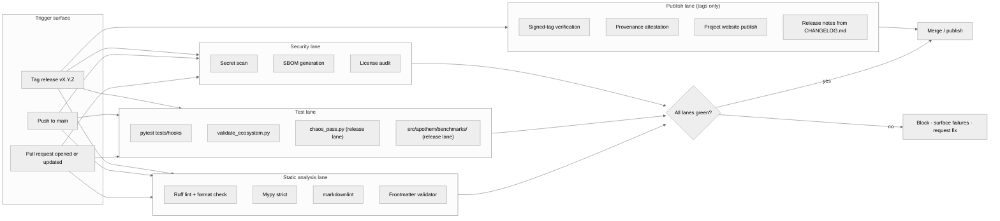

{/* SPDX-License-Identifier: MIT */}

**बिल्ड · सत्यापन · प्रकाशन वर्कफ़्लो का संरचनात्मक मानचित्र, जो Apothem
पारिस्थितिकी-तंत्र के हर परिवर्तन को गेट करता है।** यह दस्तावेज़ दृश्यांकन सतह
संस्थापित करता है; ठोस GitHub Actions वर्कफ़्लो फ़ाइलें और रिलीज़ उपकरण बाद में
उत्पादन-तत्परता संस्थापन के अंतर्गत उतरते हैं।

## पाइपलाइन का आकार

## लेन की भूमिकाएँ

- **स्थैतिक विश्लेषण लेन** — त्वरित प्रतिक्रिया। Ruff Python शैली और एक संक्षेपित
  नियम-समुच्चय को कवर करता है; mypy strict पर प्रकार-अनुशासन लागू करता है;
  markdownlint दस्तावेज़ीकरण सतह की निगरानी करता है; frontmatter सत्यापक नियमों,
  स्किल्स, प्रत्यायोजित कर्मियों और कमांडों के लिए आर्टिफ़ैक्ट-स्कीमा अनुपालन को
  गेट करता है।
- **टेस्ट लेन** — `pytest tests/hooks` hook रनटाइम को पूर्ण इवेंट-मैट्रिक्स के
  विरुद्ध चलाता है; `validate_ecosystem.py` आर्टिफ़ैक्ट-अंतर संगति के लिए प्राथमिक
  संरचनात्मक गेट है; `chaos_pass.py` और `src/apothem/benchmarks/` के अंतर्गत
  प्रति-वर्ग बेंचमार्क सुइट क्षीण इनपुट के अंतर्गत अवनति और रनटाइम-बजट प्रतिगमन को
  पकड़ने हेतु रिलीज़ लेन पर सक्रिय होते हैं।
- **सुरक्षा लेन** — सीक्रेट स्कैन आकस्मिक रूप से कमिट किए गए प्रमाण-पत्रों को
  पकड़ता है; SBOM निर्माण और लाइसेंस ऑडिट किसी भी उत्पादन-तत्परता संस्थापन के लिए
  आपूर्ति-शृंखला सतह को गेट करते हैं।
- **प्रकाशन लेन** — केवल टैग किए गए रिलीज़ों पर चलती है। हस्ताक्षरित-टैग सत्यापन
  रिलीज़-शाखा के उद्गम की पुष्टि करता है; परियोजना की वेबसाइट `site/dist/` से
  GitHub Pages लक्ष्य पर प्रकाशित होती है; रिलीज़ नोट्स `CHANGELOG.md` के
  Keep-A-Changelog प्रारूप से व्युत्पन्न होते हैं।

## ठोस विन्यास

वास्तविक वर्कफ़्लो फ़ाइलें (`.github/workflows/ci.yml`,
`.github/workflows/release.yml`, आदि) उत्पादन-तत्परता पारिस्थितिकी-तंत्र के
निर्माण के दौरान संस्थापित होती हैं। यह आरेख वह विहित आकार परिभाषित करता है जिसे
हर भविष्य का विन्यास प्रतिबिंबित करता है।

## आधिकारिक प्रति-संदर्भ

- `pyproject.toml` — Ruff / mypy / pytest विन्यास का सत्य-स्रोत।
- `scripts/dev/validate_ecosystem.py` — प्राथमिक आर्टिफ़ैक्ट-अंतर गेट।
- `scripts/dev/validate_hooks.py` — hook-विशिष्ट संरचनात्मक सत्यापन।
- `scripts/dev/chaos_pass.py` — प्रत्येक विन्यस्त hook का प्रतिकूल स्वीप।
- `src/apothem/benchmarks/` — प्रति-वर्ग रनटाइम-बजट सत्यापक।
- `site/content/docs/developer-guide.mdx` — संचालक-मुखी योगदानकर्ता वर्कफ़्लो।
- `CHANGELOG.md` — रिलीज़-नोट स्रोत।
