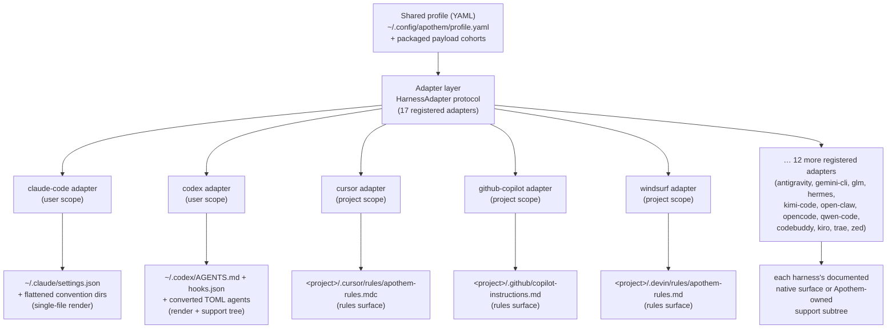

{/* SPDX-License-Identifier: MIT */}

Apothem एक स्कीमा-सत्यापित YAML प्रोफ़ाइल को सत्य के अर्थगत स्रोत के रूप में
उपयोग करता है और `HarnessAdapter` प्रोटोकॉल को लागू करने वाले एडॉप्टर वर्गों के
माध्यम से प्रत्येक हार्नेस-विशिष्ट इंस्टॉल सतह को व्युत्पन्न करता है। प्रत्येक
एडॉप्टर हार्नेस द्वारा प्रलेखित उपयोगकर्ता या परियोजना स्थान पर लिखता है और
Apothem-स्वामित्व वाले समर्थन पथों का उपयोग केवल तब करता है जब हार्नेस के पास कोई
मिलान करने वाला मूल प्रिमिटिव न हो।

## एडॉप्टर अमूर्तन क्यों

प्रत्येक हार्नेस एक भिन्न कॉन्फ़िगरेशन बोली बोलता है: एक को JSON सेटिंग्स फ़ाइल
चाहिए, दूसरे को `.mdc` नियम फ़ाइलों की एक डायरेक्टरी, और तीसरे को एक एकल Markdown
निर्देश फ़ाइल। यदि Apothem उस ज्ञान को CLI में हार्ड-कोड कर देता, तो प्रत्येक
हार्नेस अपनी मान्यताओं को कोर में रिसा देता, और एक हार्नेस जोड़ने का अर्थ होता
इंस्टॉल, अपडेट, अनइंस्टॉल, और सत्यापन तर्क को एक साथ छूना।

एडॉप्टर पैटर्न इसे उलट देता है। कोर केवल `HarnessAdapter`
प्रोटोकॉल को जानता है — जीवनचक्र विधियों का एक छोटा अनुबंध। प्रत्येक हार्नेस की
बोली एक स्व-निहित उप-पैकेज के भीतर रहती है जो उस अनुबंध को लागू करता है। कोर किसी
एडॉप्टर से *इंस्टॉल* करने को कहता है, बिना यह जाने कि इसका अर्थ एक JSON फ़ाइल
रेंडर करना है, एक नियम डायरेक्टरी लिखना है, या एक समर्थन वृक्ष बिछाना है। नए
हार्नेस प्रोटोकॉल को संतुष्ट करके और एक एंट्री पॉइंट पंजीकृत करके जुड़ते हैं; कोर
में कुछ नहीं बदलता। यही वह संरचनात्मक कारण है जिससे Apothem होस्ट-अज्ञेयवादी बना
रहता है — यह अमूर्तन वह सीमा है जो हार्नेस-विशिष्ट ज्ञान को फैलने से रोकती है।

## एक एडॉप्टर का आकार

एडॉप्टर दो मूर्तीकरण आकारों में विभाजित होते हैं, दोनों रजिस्ट्री में दृश्यमान हैं:

- **एकल-फ़ाइल रेंडरर** प्रोफ़ाइल फ़ील्ड्स को एक हार्नेस-मूल कॉन्फ़िग फ़ाइल में
  अनुवाद करते हैं। उदाहरण के लिए, Claude Code एडॉप्टर साझा प्रोफ़ाइल से हमेशा
  `~/.claude/settings.json` लिखता है और Apothem
  कन्वेंशन डायरेक्टरियों (`agents/`, `rules/`, `skills/`, …) को उसके बगल में
  समतल कर देता है।
- **नियम-सतह और समर्थन-वृक्ष एडॉप्टर** Apothem पेलोड
  cohort को हार्नेस द्वारा प्रलेखित नियम स्थान में प्रसारित करते हैं, जहाँ कोई मूल
  प्रारूप मौजूद हो वहाँ cohort को उसमें परिवर्तित करते हैं और शेष को मूल एंकर से
  संदर्भित Apothem-स्वामित्व वाले समर्थन उप-वृक्ष के अंतर्गत रखते हैं। Cursor
  एडॉप्टर आपूर्ति की गई परियोजना रूट में एक एकल `.cursor/rules/apothem-rules.mdc`
  लिखता है और केवल नियम सतह प्रदान करता है।

कोई दिया गया एडॉप्टर या तो **उपयोगकर्ता-दायरे** का होता है (होम डायरेक्टरी के नीचे
लिखता है) या **परियोजना-दायरे** का (`--project <path>` अपेक्षित करता है और उस वृक्ष
के भीतर लिखता है); रजिस्ट्री यह दर्ज करती है कि कौन-सा।

## वर्तमान एडॉप्टर टोपोलॉजी



केंद्र-से-किनारे का यह प्रसार वही वास्तुकला है जिसे परियोजना का नाम अंकित करता है:
कोर में एक प्रोफ़ाइल, और प्रत्येक हार्नेस अपने स्वयं के एडॉप्टर के साथ समान दूरी पर
बाहर की ओर।

## प्रोटोकॉल परिभाषा

```python
from pathlib import Path
from typing import Protocol

class HarnessAdapter(Protocol):
    name: str
    output_path: Path

    def install(self, profile: dict[str, object]) -> object:
        ...

    def update(self, profile: dict[str, object]) -> object:
        ...

    def uninstall(self) -> None:
        ...

    def is_installed(self) -> bool:
        ...

    def verify(self) -> bool:
        ...
```

परियोजना-दायरे के एडॉप्टर जीवनचक्र विधियों पर अतिरिक्त रूप से `project: Path |
None` स्वीकार कर सकते हैं और `resolve_output_path(project)` को उजागर कर सकते हैं।
CLI `--project PATH` को केवल उन्हीं एडॉप्टरों को पास करता है जिनकी विधि हस्ताक्षर
इसे स्वीकार करती है।

## एंट्री-पॉइंट पंजीकरण

एडॉप्टर `apothem.harnesses` setuptools एंट्री-पॉइंट समूह के माध्यम से पंजीकृत होते
हैं:

```toml
[project.entry-points."apothem.harnesses"]
cursor = "apothem.harnesses.cursor:CursorAdapter"
```

`src/apothem/lib/harness_registry.py` पर स्थित केंद्रीय रजिस्ट्री ठीक सत्रह
सार्वजनिक ID, एंट्री पॉइंट, डॉक्स पथ, लक्ष्य पथ, पैकेज-डेटा
आवश्यकताएँ, क्षमता स्थितियाँ, और मानक कन्वेंशन पिन पथ दर्ज करती है। CLI प्रत्येक
कमांड में उत्पाद तथ्यों को फिर से खोजने के बजाय उस रजिस्ट्री के माध्यम से एडॉप्टर
लोड करता है।

## प्रोफ़ाइल-से-मूल मानचित्रण

प्रत्येक एडॉप्टर अपने हार्नेस के लिए उपयुक्त अनुवाद तर्क को लागू करता है:

```
YAML profile + payload cohort    Harness-native surface
-----------------------------    ----------------------
identity / preferences       --> native config fields or rendered instruction context
commands/*.md                --> native commands or SKILL.md folders
rules/*.md                   --> native rules where supported, otherwise support trees
hooks/messages/*.md          --> native hooks where supported, otherwise support trees
agents/*.md                  --> native agent formats where supported
skills/*/SKILL.md            --> native skill folders where supported
```

असमर्थित और खोज-लंबित क्षमता कोशिकाएँ लिखने से पहले संरचित चेतावनियाँ बन जाती हैं।
उन्हें चुपचाप गढ़ी गई विक्रेता सतहों में प्रक्षेपित नहीं किया जाता।

## एक नया एडॉप्टर जोड़ना

चरण-दर-चरण मार्गदर्शिका के लिए [हार्नेस एडॉप्टर लिखना](/docs/examples/authoring-a-harness-adapter)
देखें।
