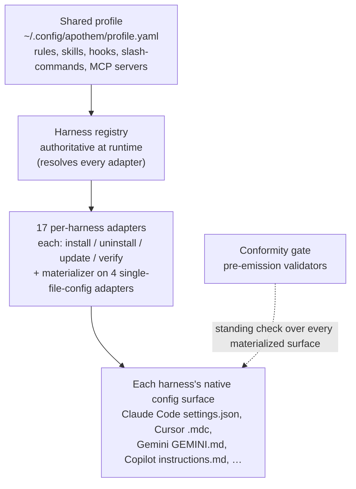

{/* SPDX-License-Identifier: MIT */}

Apothem एक ही विचार के इर्द-गिर्द बना है: एक साझा गवर्नेंस प्रोफ़ाइल, जिसे
प्रति-हार्नेस अडैप्टर द्वारा हर हार्नेस के नेटिव कॉन्फ़िगरेशन
प्रारूप में मूर्त किया जाता है। यह खंड संरचनात्मक घटकों — अडैप्टर प्रोटोकॉल,
प्रोफ़ाइल स्कीमा, सोर्स ट्री लेआउट, और उन्हें आपस में जोड़ने वाले इंस्टॉल
वर्कफ़्लो — की व्याख्या करता है।

## सिस्टम अवलोकन

एक नज़र में, Apothem एक ही पाइपलाइन है: एक साझा प्रोफ़ाइल हार्नेस रजिस्ट्री को फीड
करती है, जो हर प्रति-हार्नेस अडैप्टर को हल करती है; हर अडैप्टर अपने हार्नेस की
नेटिव कॉन्फ़िगरेशन सतह को मूर्त करता है, और एक सतत अनुरूपता गेट हर मूर्त सतह की
जाँच करता है।

## पृष्ठ

| पृष्ठ | विवरण |
|------|-------------|
| [हार्नेस अडैप्टर अमूर्तन](/docs/architecture/harness-adapter-abstraction) | `HarnessAdapter` प्रोटोकॉल — अडैप्टर साझा प्रोफ़ाइल को प्लेटफ़ॉर्म-नेटिव कॉन्फ़िगरेशन में कैसे अनुवादित करते हैं। |
| [साझा प्रोफ़ाइल स्कीमा](/docs/architecture/shared-profile-schema) | `~/.config/apothem/profile.yaml` या `--profile PATH` पर स्कीमा-समर्थित YAML प्रोफ़ाइल। |
| [सोर्स लेआउट](/docs/architecture/source-layout) | Apothem `src/` लेआउट क्यों उपयोग करता है और ट्री किस तरह संगठित है। |
| [इंस्टॉल वर्कफ़्लो](/docs/architecture/installation-workflow) | `apothem install`, `update`, और `uninstall` एंड-टू-एंड कैसे काम करते हैं। |
| [प्रत्यायोजित वर्कर्स](/docs/architecture/agents) | इस रिपॉज़िटरी में काम करने वाले बहु-वर्कर रनटाइम के लिए रिपॉज़िटरी-दायरे के निर्देश। |
