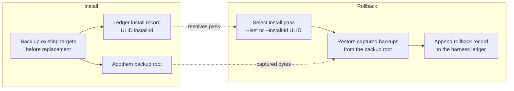

{/* SPDX-License-Identifier: MIT */}

## इंस्टॉल प्रवाह

```mermaid
flowchart TD
    accTitle: Apothem install workflow
    accDescr: Top-down flowchart of the apothem install command from CLI invocation through adapter lookup, profile load, adapter install call, native config write, and final apothem verify check.
    A[apothem install --harness X] --> B[Resolve adapter through registry]
    B --> C[Load and validate profile YAML<br/>before writes]
    C --> D[Adapter.install(profile, project)]
    D --> E[Write native config and support cohorts]
    E --> F[apothem verify --harness X]
    F --> G{All checks pass?}
    G -- yes --> H[Done]
    G -- no --> I[Report failures]
```

## अपडेट प्रवाह

`apothem update --harness X` पर:

1. `~/.config/apothem/profile.yaml` या `--profile PATH` को लोड और सत्यापित करें।
2. केंद्रीय रजिस्ट्री के माध्यम से चयनित harness या `all` को हल करें।
3. पहली राइट से पहले पूर्ण मूर्तीकरण योजना को सत्यापित करें।
4. `Adapter.update(profile, project=...)` को कॉल करें।
5. बनाए गए, अपडेट किए गए, अपरिवर्तित, छोड़े गए, चेतावनी और त्रुटि परिणामों की रिपोर्ट करें।

## अनइंस्टॉल प्रवाह

`apothem uninstall --harness X` पर:

1. `Adapter.uninstall()` को कॉल करें।
2. एडॉप्टर केवल वे फ़ाइलें हटाता है जो उसने लिखी थीं; साझा प्रोफ़ाइल YAML और
   असंबंधित ऑपरेटर-लिखित फ़ाइलें अछूती रहती हैं।

## स्कोप समाधान

प्रत्येक एडॉप्टर अपने स्वयं के निश्चित इंस्टॉल रूट में लिखता है: यूज़र-स्कोप
एडॉप्टर के लिए यूज़र-होम और प्रोजेक्ट-स्कोप एडॉप्टर के लिए प्रोजेक्ट-लोकल। CLI
कोई `--scope` फ़्लैग प्रकट नहीं करती; प्रोजेक्ट-स्कोप एडॉप्टर को `--project <path>`
की आवश्यकता होती है। प्रत्येक गंतव्य `site/content/docs/harnesses/<harness>.mdx`
पर प्रलेखित है।

## त्रुटि प्रबंधन

इंस्टॉल/अपडेट संक्रियाएँ लिखने से पहले सत्यापित करती हैं, प्रतिस्थापन से पहले
मौजूदा मिलान लक्ष्यों का बैकअप लेती हैं, और साझा डिस्कवरी डायरेक्टरी में केवल
Apothem-प्रबंधित चाइल्ड एंट्रीज़ को मर्ज करती हैं। `--dry-run` वही सत्यापन
निष्पादित करता है और डायरेक्टरी या फ़ाइलें बनाए बिना छोड़े गए या अपरिवर्तित
परिणाम लौटाता है।

## Reversibility (backup and rollback)

Every install pass is reversible. Replaced bytes are captured into the Apothem
backup root and the pass is recorded in the harness ledger under a ULID
install id; [`apothem rollback`](/docs/cli-reference/rollback) selects a
recorded pass and restores those captured backups.


