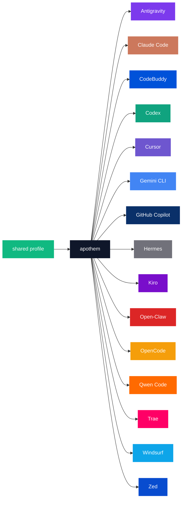

{/* SPDX-License-Identifier: MIT */}

नीचे दी गई विहित ब्रांड-नाम × रंग-कोड गणनाएँ एक `text` फेंस में लपेटी गई हैं ताकि पैलेट के कैटलॉग प्रयोजन द्वारा आवश्यक प्रति-हार्नेस शब्दशः पहचानकर्ता संरक्षित रहें।

## Apothem कोर

| टोकन | हल्का | गहरा | उपयोग |
|---|---|---|---|
| `apothem-hub` | `#0F172A` | `#F1F5F9` | हर आर्किटेक्चर डायग्राम में केंद्रीय वितरण नोड ("apothem"), और Apothem मार्क का केंद्रीय हब। |
| `shared-profile` | `#10B981` | `#34D399` | वह सत्य-का-स्रोत प्रोफ़ाइल जो apothem कोर को फ़ीड करती है। |

## हार्नेस पैलेट

सत्रह में से पंद्रह हार्नेस को उनकी प्राथमिक ब्रांड पहचान से मेल खाने के लिए रंगा
गया है। शेष दो — `glm` और `kimi-code` — का अभी कोई परिभाषित ब्रांड रंग नहीं है;
[अद्यतन](#updates) के अंतर्गत दिए गए प्रसार चरण के अनुसार, ऊपरी-धारा का ब्रांड रंग
तय हो जाने पर उनकी पंक्तियाँ जोड़ी जाती हैं।

```text
| Token             | Light     | Dark      | Source                                                                                                                                              |
|-------------------|-----------|-----------|-----------------------------------------------------------------------------------------------------------------------------------------------------|
| `antigravity`     | `#7C3AED` | `#9F67FF` | Google Antigravity deep-purple.                                                                                                                     |
| `claude-code`     | `#CC785C` | `#E89378` | Anthropic terracotta-orange.                                                                                                                        |
| `codebuddy`       | `#0052D9` | `#5E8EF7` | Tencent CodeBuddy blue.                                                                                                                             |
| `codex`           | `#10A37F` | `#19C796` | OpenAI signature teal.                                                                                                                              |
| `cursor`          | `#6E56CF` | `#9B85E3` | Cursor brand purple.                                                                                                                                |
| `gemini-cli`      | `#4285F4` | `#6BA4F7` | Google blue (primary); the Apothem mark renders the node with all four Google brand hues `#4285F4` / `#34A853` / `#FBBC04` / `#EA4335`.             |
| `github-copilot`  | `#0A3069` | `#5B8FE3` | GitHub Mona deep-blue.                                                                                                                              |
| `hermes`          | `#71717A` | `#A1A1AA` | Community silver-grey.                                                                                                                              |
| `kiro`            | `#790ECB` | `#A862DD` | Kiro violet.                                                                                                                                        |
| `open-claw`       | `#DC2626` | `#F87171` | Community red-orange.                                                                                                                               |
| `opencode`        | `#F59E0B` | `#FBBF24` | Community amber.                                                                                                                                    |
| `qwen-code`       | `#FF6A00` | `#FF8C40` | Alibaba Qwen orange.                                                                                                                                |
| `trae`            | `#FF0066` | `#FF599C` | ByteDance Trae magenta.                                                                                                                             |
| `windsurf`        | `#0EA5E9` | `#38BDF8` | Windsurf sky-blue.                                                                                                                                  |
| `zed`             | `#084CCF` | `#5E8BE0` | Zed Industries blue.                                                                                                                                |
```

## नामकरण का तर्क

- **`apothem-hub`** — वह ज्यामितीय केंद्र जिसे नाम उद्घाटित करता है (एक नियमित बहुभुज का अपोथेम भीतर की ओर, उसके कोर की ओर इंगित करता है)।
- **`shared-profile`** — ऊपरी-धारा का स्रोत, किसी भी एकल हार्नेस रंग से भिन्न, ताकि यह हर डायग्राम में "इनपुट" तीर के रूप में पढ़ा जाए।
- **प्रति-हार्नेस टोकन** कोडबेस भर में उपयोग किए गए हार्नेस slug को प्रतिबिंबित करते हैं (`harnesses/<slug>/`, एंट्री-पॉइंट कुंजी, CLI का `--harness <slug>` तर्क)। प्रति अवधारणा एक शब्द; हर जगह वही स्ट्रिंग।

## Mermaid उपयोग



## अभिगम्यता

प्रत्येक हल्के-मोड टोकन सफ़ेद टेक्स्ट के विरुद्ध WCAG 2.2 AA कंट्रास्ट (≥4.5 : 1) को वहाँ पूरा करता है जहाँ कंट्रास्ट ब्रांड रंग को विकृत किए बिना इसकी अनुमति देता है। जहाँ किसी हार्नेस का मूल ब्रांड रंग अकेले सफ़ेद टेक्स्ट के विरुद्ध AA सीमा से नीचे गिरता है (विशेष रूप से ऊपर सूचीबद्ध एम्बर / नारंगी परिवार और स्काई-ब्लू / टील परिवार के टोकन), वहाँ ऐसे डायग्राम जिन्हें WCAG AA टेक्स्ट-ऑन-कलर कंट्रास्ट चाहिए, डायग्राम भराव के रूप में **डार्क-मोड वैरिएंट** (उठाई गई आभा) का उपयोग करते हैं ताकि सफ़ेद टेक्स्ट स्पष्ट रूप से पढ़ा जाए। डार्क-मोड कॉलम इसी प्रयोजन के लिए कैलिब्रेट किया गया है: प्रत्येक डार्क-मोड टोकन सफ़ेद टेक्स्ट के विरुद्ध AA को पार कर लेता है।

## अद्यतन

पैलेट केवल तभी अद्यतन होती है जब कोई हार्नेस ऊपरी-धारा में किसी ब्रांड परिवर्तन की पुष्टि करता है। प्रति-हार्नेस ब्रांड परिवर्तन `site/app/global.css`, इस पृष्ठ, और `assets/src/` के अंतर्गत प्रत्येक प्रभावित SVG मास्टर भर में परमाणविक रूप से प्रसारित होते हैं।
