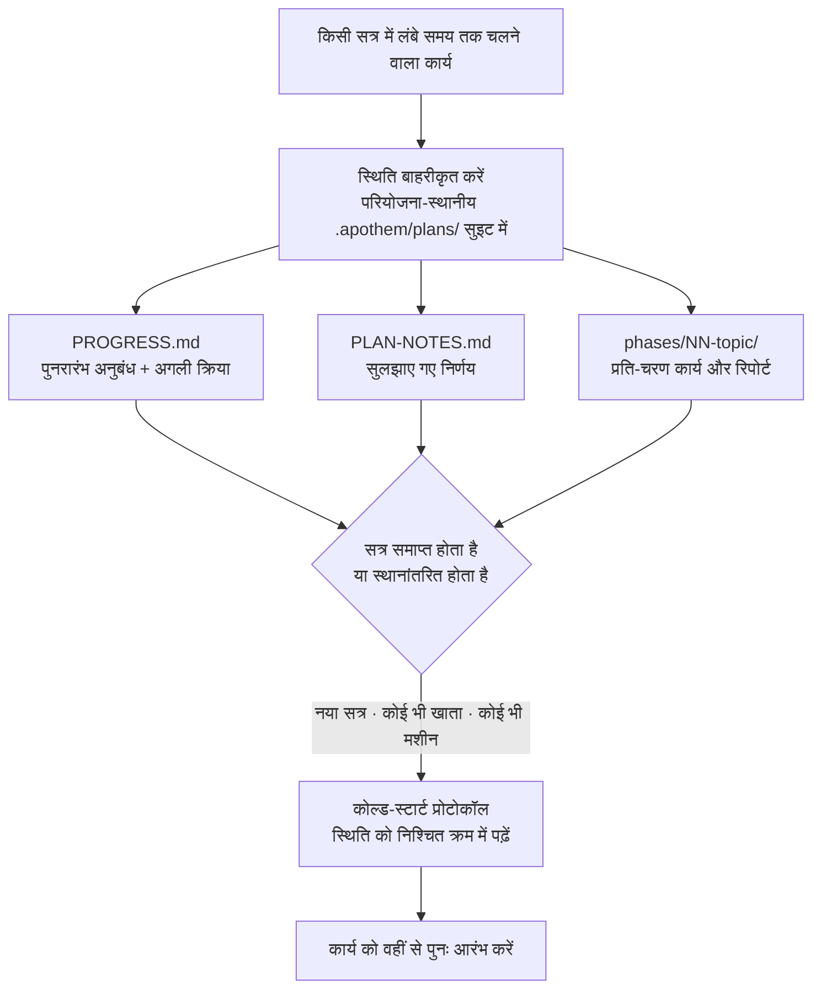

{/* SPDX-License-Identifier: MIT */}

सहायता-प्राप्त अधिकांश कार्य एक ही बातचीत के भीतर जन्म लेता है और वहीं समाप्त
हो जाता है। आप चैट बंद करते हैं, मशीन बदलते हैं, या किसी दूसरे खाते से साइन इन करते
हैं, और जो आप कर रहे थे उसका सूत्र खो जाता है — अगला सत्र ठंडा शुरू होता है, उन
निर्णयों की कोई स्मृति लिए बिना जो आप पहले ही ले चुके थे।

Apothem इसे उलट देता है। लंबे समय तक चलने वाले, बहु-चरणीय कार्य के लिए यह अपनी
**पूर्ण कार्य-स्थिति** को परियोजना-स्थानीय `.apothem/plans/` सुइट में बाहरीकृत करता है (`.plans/` फ़ॉलबैक के रूप में रखा गया) — ये
ऐसी फ़ाइलें हैं जो आपकी रिपॉज़िटरी में रहती हैं, किसी भी क्लाउड चैट इतिहास के भीतर
नहीं। स्थिति ही टिकाऊ कलाकृति है; सत्र निपटाने योग्य है।

## मूल विचार

`<project-root>/.apothem/plans/{suite}/` पर एक योजना सुइट दो चीज़ें वहन करती है जो एक सत्र को
प्रतिस्थापन-योग्य बनाती हैं:

- **पुनरारंभ अनुबंध।** `PROGRESS.md` वर्तमान चरण और कार्य-स्थिति, सटीक अगली क्रिया,
  प्रभावी परिपाटियाँ, पहले से सुलझाए गए निर्णय, और वे ठीक फ़ाइलें दर्ज करता है जिन्हें
  अगला सत्र पढ़ना चाहिए।
- **कोल्ड-स्टार्ट प्रोटोकॉल।** एक नया सत्र उन फ़ाइलों को एक निश्चित क्रम में पढ़ता है
  और कोई भी कार्य करने से पहले पूरी तस्वीर फिर से स्थापित कर लेता है — बातचीत के इतिहास
  की आवश्यकता नहीं।

चूँकि वह स्थिति आपकी परियोजना की फ़ाइलों में है, उसी परियोजना की ओर इंगित किसी भी
**खाते या मशीन** पर एक नया सत्र कार्य को वहीं से उठा लेता है। कुछ भी एक ही चैट
प्रतिलेख के भीतर बंद नहीं रहता। यही वह गुण है जो संरचित, बड़े पैमाने के, बहु-दिवसीय
कार्य — बड़े कोष, लंबे प्रवासन, बड़े समीक्षा-दौर — को उन सीमाओं के पार बनाए रखता है जो
अन्यथा उसे समाप्त कर देतीं।

## यह ठीक-ठीक क्या है

ताकि गारंटी स्पष्ट रहे, इसे सटीक रूप से कहा गया है:

- **यह है** फ़ाइलों में बाहरीकृत स्थिति और एक कोल्ड-स्टार्ट पुनरारंभ प्रोटोकॉल। कार्य
  इसलिए फिर से शुरू होता है क्योंकि स्थिति आपकी परियोजना की फ़ाइलों में रहती है, किसी भी
  सत्र, खाते या मशीन से स्वतंत्र।
- **यह नहीं है** एक स्वचालित खाता-पार समन्वयन सेवा। Apothem स्वयं आपके योजना-स्थिति को
  खातों के बीच नहीं धकेलता — फ़ाइलें उसी तरह यात्रा करती हैं जैसे आपकी परियोजना की
  फ़ाइलें पहले से करती हैं (संस्करण नियंत्रण, एक साझा checkout, एक समन्वित निर्देशिका)।
  Apothem जो गारंटी देता है वह यह है कि परियोजना की फ़ाइलें जहाँ भी पहुँचें, एक नया सत्र
  उनसे पुनः आरंभ कर सकता है।

## यह क्यों मायने रखता है

कार्य जितना लंबा और बड़ा होता है, एक अकेली बातचीत उतनी ही अधिक भार बन जाती है। एक
बहु-दिवसीय कायापलट या किसी बड़े कोडबेस के आर-पार एक झाड़ू किसी भी एकल सत्र से अधिक लंबा
चलेगा — संदर्भ-खिड़कियाँ संघनित होती हैं, सत्र समय-समाप्त होते हैं, मशीनें बदलती हैं।
परियोजना की अपनी फ़ाइलों को चालू कार्य के लिए सत्य के स्रोत के रूप में मानकर, Apothem
कार्य को तीनों सीमाओं — सत्र, खाता और मशीन — के प्रति दृढ़ बनाता है।

## स्थिति कहाँ रहती है

| कलाकृति | स्थान | धारण करती है |
|----------|----------|-------|
| योजना सुइट | `<project-root>/.apothem/plans/{suite}/` | चालू कार्य की एक स्वतःपूर्ण इकाई |
| पुनरारंभ अनुबंध | `<suite>/PROGRESS.md` | चरण/कार्य स्थिति, अगली क्रिया, परिपाटियाँ, महत्वपूर्ण-फ़ाइल मैनिफ़ेस्ट |
| निर्णय बही | `<suite>/PLAN-NOTES.md` | सुलझाए गए निर्णय, कभी दोबारा नहीं पूछे जाते |
| प्रति-चरण कार्य | `<suite>/phases/NN-topic/` | चरण के कार्य और उसकी रिपोर्ट |

योजना-वृक्ष को Apothem के विहित `.gitignore` अंश द्वारा संस्करण नियंत्रण से बाहर रखा
जाता है, इसलिए योजना-स्थिति पूर्वनिर्धारित रूप से स्थानीय बनी रहती है। चालू कार्य को
मशीनों या खातों के बीच जान-बूझकर ले जाने के लिए, `.apothem/plans/` सुइट को उसी तरह स्थानांतरित
करें जैसे आप किसी अन्य परियोजना फ़ाइल को करते हैं।

## संबंधित

- **[गंभीरता स्तर](/docs/concepts/seriousness-tiers)** — शासन और स्थिति-बाहरीकरण का
  अनुशासन सहभागिता के अनुसार कैसे मापित होते हैं।
- **[कमांड पाइपलाइन](/docs/pipeline)** — `/plan` के वे चरण जो एक योजना सुइट को रचते
  और आगे बढ़ाते हैं।

## Recommended Next Step

**[गंभीरता स्तर](/docs/concepts/seriousness-tiers) पढ़ें** ताकि देख सकें कि
बाहरीकरण का अनुशासन एक त्वरित प्रयोग से लेकर सीमाओं को पार करने वाले बहु-दिवसीय
प्रयास तक कैसे मापित होता है।
