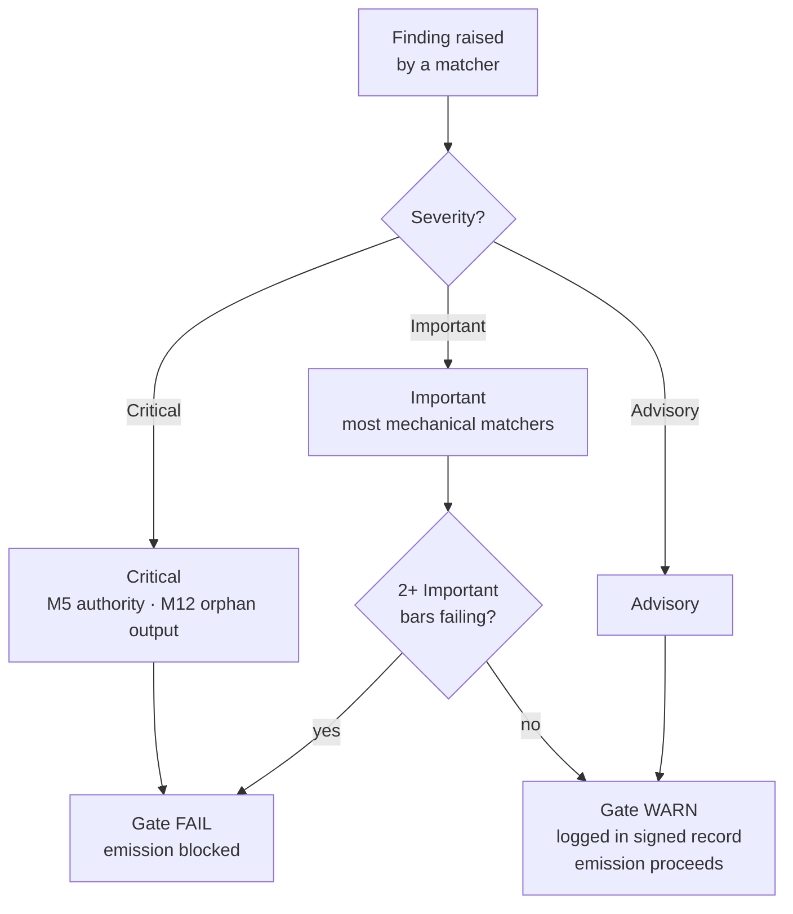

{/* SPDX-License-Identifier: MIT */}

## पंद्रह बार

| बार | ID | मैंडेट | जाँच वर्ग | विफलता → कार्रवाई |
|---|---|---|---|---|
| 1 | M1 | होस्ट-प्रोजेक्ट लाएडरीवाद | तर्कपूर्ण | होस्ट की परंपराओं से मेल खाने के लिए संशोधित करें |
| 2 | M2 | संपादकीय अनुशासन (प्रकटन रजिस्टर) | यांत्रिक | प्रकटन चिह्न जोड़ें |
| 3 | M3 | दस गुणवत्ता आयाम | तर्कपूर्ण | विफल आयामों पर संशोधित करें |
| 4 | M4 | स्व-अनुप्रयोग (हस्ताक्षरित गेट रिकॉर्ड उपस्थित) | यांत्रिक | हस्ताक्षरित-रिकॉर्ड ब्लॉक रिकॉर्ड करें |
| 5 | M5 | प्राधिकार सिद्धांत (कोई मनगढ़ंत पहचान / एंडपॉइंट / सीक्रेट नहीं) | यांत्रिक | पूछताछ की ओर मार्गित करें |
| 6 | M6 | विशेषज्ञता समावेशन (उजागर अंतराल) | तर्कपूर्ण | अंतराल उजागर करें; परिष्करण उद्धृत करें |
| 7 | M7 | विकल्प एनोटेशन (अनुशंसित मार्कर + चालक तर्क) | यांत्रिक | विकल्प सेट को एनोटेट करें |
| 8 | M8 | निश्चयात्मकता (निर्देशात्मक गद्य में कोई हिचकिचाहट नहीं) | यांत्रिक | हिचकिचाहट को शर्तों में पदोन्नत करें |
| 9 | M9 | दृश्य उत्तोलन (संरचनात्मक विषय आरेख वहन करते हैं) | तर्कपूर्ण | आरेख बनाएँ / ताज़ा करें |
| 10 | M10 | द्विदिशीय बंधन (पारस्परिक पश्च-पॉइंटर बंद) | यांत्रिक | अर्ध-किनारे बंद करें |
| 11 | M11 | एजाइल स्प्रिंट (Goal / Backlog / DoR / DoD / Review / Retrospective) | तर्कपूर्ण | स्प्रिंट के रूप में पुनर्संरचित करें |
| 12 | M12 | चरण रिपोर्टिंग और कैनोनिकल लेआउट | यांत्रिक | रोलअप बनाएँ; कैनोनिकल लेआउट पर पुनर्स्थापित करें |
| 13 | M13 | कोड शिल्प (lint / format / type-check; मैजिक नंबर; bare-except) | यांत्रिक | प्रति-भाषा कोड-शिल्प नियमों के अनुसार संशोधित करें |
| 14 | M14 | सिस्टमिकता (upstream / downstream / peers / enforcers घोषित करती है) | तर्कपूर्ण | घोषित करें; रजिस्ट्री में अनुक्रमित करें |
| 15 | M15 | उत्पादन-तैयार (टेस्ट + डॉक्स + CHANGELOG + अनुरूप commit + CI हरा + semver स्थिरता) | यांत्रिक | अनुपस्थित सतहें जोड़ें |

## गंभीरता सीढ़ी

| गंभीरता | गेट पर प्रभाव |
|---|---|
| **क्रिटिकल** | गेट FAIL — उत्सर्जन बिना शर्त अवरुद्ध |
| **महत्वपूर्ण** | जब 2+ महत्वपूर्ण बार एक साथ विफल हों तो गेट FAIL |
| **सलाहकारी** | गेट WARN — हस्ताक्षरित रिकॉर्ड में दर्ज; उत्सर्जन को अवरुद्ध नहीं करता |

यांत्रिक-अंश के अधिकांश मैचर डिफ़ॉल्ट रूप से **महत्वपूर्ण** होते हैं। M5 (प्राधिकार — सीक्रेट, मनगढ़ंत एंडपॉइंट) और M12 (अनाथ आउटपुट) **क्रिटिकल** हैं।



## यांत्रिक-अंश मैचर

यांत्रिक अंश [`src/apothem/conformity/*_grep.py`](https://github.com/ahmed-g-gad/apothem/tree/main/src/apothem/conformity) में रहता है, जिसे [`src/apothem/conformity/gate.py`](https://github.com/ahmed-g-gad/apothem/blob/main/src/apothem/conformity/gate.py) व्यवस्थित करता है।

| मैचर | बार | फ़ंक्शन |
|---|---|---|
| `hedging_grep.py` | M8 | निर्देशात्मक गद्य में हिचकिचाहट वाली शब्दावली का पता लगाता है |
| `option_annotation_grep.py` | M7 | विकल्प सेट पर `**Recommended**` मार्कर + चालक तर्क सत्यापित करता है |
| `user_confirm_grep.py` | M5 | `<USER-CONFIRM:…>` प्लेसहोल्डर को उत्सर्जन से अवरुद्ध करता है |
| `binding_reciprocity_grep.py` | M10 | `## Bindings (§0.j five-direction)` में अर्ध-किनारों का पता लगाता है |
| `orphan_output_grep.py` | M12 | बिना उपभोक्ता / बिना सूचकांक प्रविष्टि / बिना उत्पादक श्रेय वाले आर्टिफ़ैक्ट को चिह्नित करता है |
| `bare_except_grep.py` | M13 | औचित्य टिप्पणी के बिना `except:` / `except Exception:` का पता लगाता है |
| `magic_number_grep.py` | M13 | व्यावसायिक तर्क में संख्यात्मक शाब्दिक का पता लगाता है |
| `commented_out_code_grep.py` | M13 | कमेंटेड-आउट कोड ब्लॉक का पता लगाता है |
| `file_header_grep.py` | M13 | एकल-पंक्ति SPDX लाइसेंस हेडर की उपस्थिति सत्यापित करता है |
| `frontmatter_grep.py` | M14 | नीचे सूचीबद्ध चार कैनोनिकल निर्देश निर्देशिकाओं पर आवश्यक frontmatter फ़ील्ड सत्यापित करता है |
| `semver_stability_grep.py` | M15 | MAJOR संस्करण वृद्धि के बिना भंजक सार्वजनिक-API परिवर्तनों का पता लगाता है |
| `production_ready_pr_grep.py` | M15 | समान चेंज-सेट अनुशासन (टेस्ट + डॉक्स + CHANGELOG) सत्यापित करता है |
| `secret_leak_grep.py` | M15 | हार्डकोडेड सीक्रेट / क्रेडेंशियल का पता लगाता है |
| `unpinned_action_grep.py` | M15 | GitHub Actions के commit SHA पर पिनिंग को सत्यापित करता है |
| `always_on_budget_grep.py` | बजट सीमा | सदा-चालू नियम बॉडी को 500 ठोस token तक सीमित करता है |

## गेट चलाना

स्थापित harness पर गेट स्वचालित रूप से चलता है: Claude Code का
`settings.json` इसे `PreToolUse` हुक के रूप में जोड़ता है जो प्रत्येक
Write/Edit से पहले `~/.claude/.apothem/support/conformity/gate.py` पर मूर्त प्रति को
आह्वान करता है। स्रोत चेकआउट से, मॉड्यूल रूप वही कोड चलाता है:

```shell
# एकल-फ़ाइल डिस्पैच (PreToolUse हुक की नकल):
echo '{"tool_input": {"file_path": "path/to/file", "content": "..."}}' \
    | python -m apothem.conformity.gate --hook

# रिपॉज़िटरी भर में संयुक्त स्वीप:
python -m apothem.conformity.gate --sweep src/ site/content/docs/ rules/
```

पूर्ण प्रक्रिया के लिए [अनुरूपता गेट चलाना](/docs/usage/conformity-gate) देखें।

## संदर्भ

- [पूर्व-उत्सर्जन गेट रजिस्ट्री](/docs/governance/pre-emission-gate-registry) — कैनोनिकल बार परिभाषाएँ
- [बाह्य अनुरूपता रजिस्ट्री](/docs/governance/outward-conformity-registry) — M1-M15 विस्तृत शब्दार्थ
- [क्रॉस-कटिंग मैंडेट](/docs/governance/cross-cutting-mandates) — मैंडेट सत्य स्रोत
- [प्रदर्शन अनुशासन](https://github.com/ahmed-g-gad/apothem/blob/main/src/apothem/rules/performance-discipline.md) — प्रति-वर्ग रनटाइम बजट
