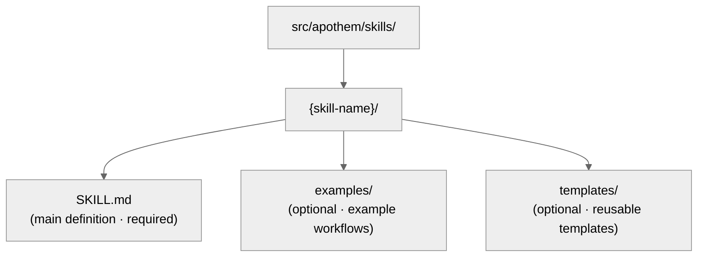

{/* SPDX-License-Identifier: MIT */}

यह मार्गदर्शिका डेवलपरों को Apothem पारिस्थितिकी तंत्र को
SOTA गुणवत्ता मानकों के साथ बनाए रखने और विस्तारित करने में मदद करती है।

## त्वरित संदर्भ: आर्टिफ़ैक्ट प्रकार

Apothem पारिस्थितिकी तंत्र में पाँच आर्टिफ़ैक्ट प्रकार हैं, प्रत्येक के विशिष्ट
उद्देश्य और फ़्रंटमैटर आवश्यकताएँ हैं।

| आर्टिफ़ैक्ट | पथ | उद्देश्य | कब बनाएँ |
| -------- | ---- | ------- | -------------- |
| **नियम** | `src/apothem/rules/*.md` | व्यवहार-संबंधी अधिदेश या परिचालन निर्देश | नया सिद्धांत, नीति, या शासन अधिदेश स्थापित |
| **कमांड** | `src/apothem/commands/*.md` | जटिल वर्कफ़्लो के लिए स्लैश कमांड (`/command-name`) | नया बहु-चरणीय उपयोगकर्ता वर्कफ़्लो |
| **हेल्पर** | हेल्पर निर्देशिका (प्रति फ़ाइल `*.md`) | समानांतर कार्यों के लिए स्थायी डेलीगेटेड-वर्कर परिभाषा | नया आवर्ती विशेष कार्य (ऑडिट, अन्वेषण, गुणवत्ता-जाँच) |
| **कौशल** | `src/apothem/skills/{name}/SKILL.md` | संसूचन संकेत के साथ पुन: प्रयोज्य तकनीक | नया संसूचनीय, पुन: प्रयोज्य तकनीक पैटर्न |
| **हुक** | `src/apothem/hooks/` + `settings.json` | इवेंट-ट्रिगर सत्यापन या स्थिति प्रबंधन | नई लाइफ़साइकल इवेंट या सत्यापन आवश्यकता |

## हार्नेस अडैप्टर अनुबंध

टूल पहचान और क्षमता तथ्य
`src/apothem/lib/harness_registry.py` में रहते हैं। एक टूल परिवर्तन तभी पूर्ण होता है जब
ये सतहें सहमत हों:

| सतह | आवश्यक अद्यतन |
| --- | --- |
| रजिस्ट्री पंक्ति | सार्वजनिक ID, पैकेज कुंजी, एंट्री पॉइंट, दायरा, आउटपुट प्रारूप, लक्ष्य पथ, डॉक्स पथ, क्षमता फ़ाइल, स्टैंडर्ड पिन, फ़िक्स्चर परीक्षण, पैकेज-डेटा कुंजी, टेम्पलेट स्रोत, और क्षमता स्थितियाँ। |
| अडैप्टर पैकेज | `__init__.py`, `install.py`, `update.py`, `uninstall.py`, `verify.py`; `materializer.py` केवल तभी जोड़ें जब टूल एक नेटिव कॉन्फ़िग फ़ाइल रेंडर करे। |
| प्रोपगेशन मैनिफ़ेस्ट | मैनिफ़ेस्ट-समर्थित अडैप्टरों के लिए टेम्पलेट और समूह पथ। |
| क्षमताएँ | `src/apothem/harnesses/<package>/capabilities.yml` हर आवश्यक क्षमता और असमर्थित या खोज-लंबित स्थितियों के लिए तर्क के साथ। |
| कन्वेंशन पिन | `STANDARD-CONVENTION-PIN.md` वेंडर URL, स्नैपशॉट तिथि, केननिकल फ़ाइलनाम/स्कीमा, साक्ष्य संदर्भ, और असमर्थित क्षमता तर्क के साथ। |
| परीक्षण | रजिस्ट्री समता, अडैप्टर फ़िक्स्चर परीक्षण, गोल्डन इंस्टॉल-प्लान पंक्ति, ड्राई-रन/नो-राइट व्यवहार, इडेमपोटेंस, और पैकेज-डेटा कवरेज। |
| डॉक्स | टूल संदर्भ पृष्ठ, तुलना पृष्ठ, क्षमता/MCP टिप्पणियाँ, और उदाहरण जो नकली प्लेसहोल्डर का उपयोग करते हैं। |

प्रोजेक्ट-दायरे के अडैप्टरों को `requires_project = True` सेट करना चाहिए, लाइफ़साइकल विधियों पर
`project: Path | None` स्वीकार करना चाहिए, और राइट से पहले अनुपस्थित या असुरक्षित
प्रोजेक्ट रूट को अस्वीकार करना चाहिए। उपयोगकर्ता-दायरे के अडैप्टरों को पथ
टूल की प्रलेखित उपयोगकर्ता कॉन्फ़िगरेशन रूट के अंतर्गत रखना चाहिए।

## गोल्डन फ़िक्स्चर नीति

`tests/fixtures/harness-golden-plans.json` सभी सत्रह रजिस्ट्री टूल के लिए सार्वजनिक इंस्टॉल-प्लान आकार
दर्ज करता है: सार्वजनिक ID, मटेरियलाइज़ेशन मोड, स्रोत
समूह/टेम्पलेट पथ, और `<ROOT>` के अंतर्गत सामान्यीकृत लक्ष्य पथ। जब रजिस्ट्री,
मैनिफ़ेस्ट, या टेम्पलेट लक्ष्य व्यवहार जानबूझकर बदलता है, तो गोल्डन
फ़िक्स्चर को स्रोत परिवर्तन के समान कमिट में अपडेट करें ताकि डिफ़ व्यवहार
डेल्टा दिखाए।

## राइट से पहले सत्यापन

साझा इंस्टॉल ड्राइवर पहले राइट से पहले प्रत्येक स्रोत और लक्ष्य का सत्यापन करता है।
यह अनुपस्थित मैनिफ़ेस्ट स्रोतों, लक्ष्य ट्रैवर्सल, चयनित रूट के बाहर लक्ष्य पथ,
और सिमलिंक क्रॉसिंग को अस्वीकार करता है। ड्राई-रन वही सत्यापन
निष्पादित करते हैं और फ़ाइलें बनाए बिना संरचित `skipped` या `unchanged` परिणाम
लौटाते हैं।

## रिडैक्शन और उदाहरण डेटा

प्रोफ़ाइल निदान टोकन, सीक्रेट, पासवर्ड, क्रेडेंशियल, API कुंजी,
प्राइवेट कुंजी, ऑथराइज़ेशन, ऑथ, और हेडर-आकार के फ़ील्ड को रिडैक्ट करता है। प्रलेखन,
फ़िक्स्चर, उदाहरण, और JSON स्निपेट असली-दिखने वाले सीक्रेट या
व्यक्तिगत खातों के बजाय `example.invalid`, `Example User`,
`example-user`, और स्पष्ट प्लेसहोल्डर का उपयोग करते हैं।

## लिखने से पहले: केननिकल स्कीमा

**सभी आर्टिफ़ैक्ट को `site/content/docs/reference/artifact-schema.mdx` में स्कीमा का अनुसरण करना चाहिए।** यह
गैर-समझौता-योग्य है।

- अपने आर्टिफ़ैक्ट प्रकार के लिए `site/content/docs/reference/artifact-schema.mdx` § "Schema" पढ़ें
- आवश्यक फ़ील्ड कॉपी करें
- अनिवार्य मान भरें
- आवश्यकतानुसार वैकल्पिक फ़ील्ड जोड़ें

## फ़्रंटमैटर त्वरित-जाँच

प्रत्येक आर्टिफ़ैक्ट फ़्रंटमैटर को इन जाँचों को पास करना चाहिए:

```yaml
✓ Valid YAML syntax (use tools: `yamllint` or PowerShell `ConvertFrom-Yaml` where available)
✓ All mandatory fields present (per schema for artifact type)
✓ name: uses kebab-case
✓ version: semantic MAJOR.MINOR.PATCH
✓ updated: ISO 8601 date (YYYY-MM-DD)
✓ description: single-line, non-empty
✓ scope: valid enum (always-on|path-filtered|other)
✓ portability: valid enum (`universal` | `universal-with-windows-caveats` | `unix-only` | `windows-only`)
✓ No typos in field names — must match canonical schema exactly
✓ Optional fields use correct enum values
```

## नामकरण कन्वेंशन

### आर्टिफ़ैक्ट नाम (kebab-case)

- **नियम:** `operational-mandates`, `clean-room-generation`, `context-management`
- **कमांड:** `plan-execute`, `plan-spec`, `plan-generate`
- **हेल्पर:** `codebase-explorer`, `convention-auditor`, `quality-gate`
- **कौशल:** `plan-suite`, `ecosystem-audit`

पैटर्न: लोअरकेस, शब्दों के बीच हाइफ़न, कोई स्थान या अंडरस्कोर नहीं।

### फ़ाइल नामकरण

- **नियम:** `{name}.md`
- **कमांड:** `{name}.md`
- **हेल्पर:** `{name}.md`
- **कौशल:** फ़ोल्डर `src/apothem/skills/{name}/SKILL.md` के अंदर (सटीक केस: `SKILL.md`)
- **हुक:** फ़ोल्डर `src/apothem/hooks/` के अंदर। सभी इवेंट हैंडलर Python हैं। प्रत्येक
  `settings.json` हुक कमांड
  `-m apothem.hooks.dispatch <event> [<message-name>]` या
  `-m apothem.conformity.gate --hook` को आह्वान करने के लिए exec रूप (`python` साथ ही `args`) का उपयोग करता है।
  `dispatch.py` `SessionStart` को
  `session_start_bootstrap.main()` और
  हर अन्य श्वेतसूचीबद्ध इवेंट को `emit_hook_context.main()` को रूट करता है। `src/apothem/hooks/` या `scripts/` के अंतर्गत अनुमत
  एकमात्र शेल स्टब चार लोकेटर + बूटस्ट्रैप
  फ़ाइलें (`find-python.{ps1,sh}`, `bootstrap.{ps1,sh}`) हैं; कोई भी अन्य `.ps1` /
  `.sh` फ़ाइल `scripts/dev/validate_hooks.py` स्वच्छता जाँच में विफल होती है।

### आर-पार-संदर्भ

अन्य आर्टिफ़ैक्ट का संदर्भ देते समय, सटीक नाम उपयोग करें:

- नियम: `"operational-mandates"` (नाम फ़ील्ड मान)
- कमांड: `/plan-execute` (मानव डॉक्स के लिए स्लैश के साथ; कोड में बिना)
- हेल्पर: `codebase-explorer` (नाम फ़ील्ड मान)
- कौशल: `plan-suite` (नाम फ़ील्ड मान)

गद्य में कभी फ़ाइल पथ या काटे गए नाम उपयोग न करें।

## पोर्टेबिलिटी: Windows बनाम Unix

प्रत्येक आर्टिफ़ैक्ट को अपनी पोर्टेबिलिटी स्थिति स्पष्ट रूप से घोषित करनी चाहिए।

### सार्वभौमिक (डिफ़ॉल्ट)

- Windows, macOS, और Linux पर समान रूप से काम करता है
- कोई शेल धारणा नहीं
- पथ फ़ॉरवर्ड स्लैश (`/`) उपयोग करते हैं
- कोई हार्डकोडेड पूर्ण पथ नहीं
- कोई Windows-विशिष्ट PowerShell सिंटैक्स नहीं

```yaml
portability: "universal"
```

### Windows चेतावनियों के साथ सार्वभौमिक

- POSIX होस्टों के आर-पार सार्वभौमिक; नामित चेतावनी सामग्री में घोषित Windows प्लेटफ़ॉर्म वैरिएंट पर लागू होती है
- चेतावनी को सामग्री में स्पष्ट रूप से प्रलेखित करें
- उदाहरण: "Win 10 से पहले Windows पर सिमलिंक समर्थित नहीं"

```yaml
portability: "universal-with-windows-caveats"
```

चेतावनी को शीर्षक के तुरंत बाद एक नोट में प्रलेखित करें।

### केवल-Unix / केवल-Windows

- स्पष्ट रूप से एक प्लेटफ़ॉर्म तक सीमित
- Apothem में दुर्लभ — अधिकांश सार्वभौमिक होने चाहिए
- केवल तब उपयोग करें जब प्लेटफ़ॉर्म-विशिष्ट सुविधाएँ आवश्यक हों

```yaml
portability: "unix-only"
```

कारण को नियम के पहले अनुभाग में प्रलेखित करें।

## दायरा: सदैव-चालू बनाम पथ-फ़िल्टर्ड

### सदैव-चालू

नियम हर जगह लागू होता है।

```yaml
scope: "always-on"
```

### पथ-फ़िल्टर्ड

नियम फ़ाइल पथ के आधार पर सशर्त रूप से लागू होता है।

```yaml
scope: "path-filtered"
pathFilter: "**/*.py, **/*.toml"
```

`pathFilter` ग्लोब पैटर्न उपयोग करता है (वही प्रारूप जो `.gitignore` का है)। जब कोई फ़ाइल
फ़िल्टर से मेल खाती है, तो नियम सक्रिय हो जाता है।

## संस्करण शब्दार्थ

प्रत्येक आर्टिफ़ैक्ट अपना स्वयं का शब्दार्थ संस्करण (`MAJOR.MINOR.PATCH`) धारण करता है:

- **PATCH** — टाइपो सुधार, फ़ॉर्मेटिंग, लिंक ताज़गी, केवल-टिप्पणी संपादन। व्यवहार अपरिवर्तित।
- **MINOR** — योगात्मक गैर-तोड़क परिवर्तन: नए वैकल्पिक अनुभाग, अतिरिक्त एंटी-पैटर्न, नए वैकल्पिक फ़्रंटमैटर फ़ील्ड, नए उदाहरण। मौजूदा उपभोक्ता बिना बदलाव के काम करते रहते हैं।
- **MAJOR** — तोड़क स्कीमा या अनुबंध परिवर्तन: हटाए गए अनुभाग, पुनर्नामित फ़ील्ड, किसी मौजूदा निर्देश के बदले हुए व्यवहार, ऐसे परिवर्तन जिनके लिए डाउनस्ट्रीम आर्टिफ़ैक्ट को अनुकूलन की आवश्यकता हो।

उदाहरण:

- `vX.Y.Z` → `vX.Y.(Z+1)` (PATCH: टाइपो सुधार)
- `vX.Y.Z` → `vX.(Y+1).0` (MINOR: नई एंटी-पैटर्न प्रविष्टि जोड़ी)
- `vX.Y.Z` → `v(X+1).0.0` (MAJOR: अनुबंध स्थिर घोषित)
- `vX.Y.Z` → `v(X+1).0.0` (MAJOR: अनिवार्य फ़्रंटमैटर फ़ील्ड हटाया)

हर व्यवहार-बदलने वाले संपादन पर `version` और `updated` को एक साथ बढ़ाएँ। आर्टिफ़ैक्ट परिवर्तनों को
बंडल करने वाली रिलीज़ के लिए पारिस्थितिकी-स्तरीय `CHANGELOG.md` में एक
मेल खाती पंक्ति जोड़ें।

## आर्टिफ़ैक्ट कब संपादित करें

### नियम

- अनिवार्य/वैकल्पिक संरचना को भार-वहन करने वाला मानें — इसका पुनर्गठन
  हर निर्भर आर्टिफ़ैक्ट में लहर पैदा करता है (MAJOR वृद्धि आवश्यक)।
- जैसे-जैसे समझ गहरी होती है, एंटी-पैटर्न, गंभीरता मापन उदाहरण, और उद्धरणों को
  परिष्कृत करें (MINOR वृद्धि)।
- किसी भी संरचनात्मक परिवर्तन के तर्क को संबंधित मेमोरी
  विषय फ़ाइल में कैप्चर करें।

### कमांड

- तर्क आकार सार्वजनिक अनुबंध का हिस्सा है — इसे केवल स्पष्ट
  आशय से तोड़ें और परिवर्तन को हर कॉलर तक प्रचारित करें (MAJOR वृद्धि)।
- वर्कफ़्लो चरणों और रिटर्न अनुबंधों को कसा हुआ और वर्तमान रखें।
- गैर-स्पष्ट चरण अनुक्रमण को इनलाइन प्रलेखित करें।

### हेल्पर

- `disallowedTools` को न्यूनतम-पर-पर्याप्त रखें; जब यह बदले तो तर्क
  प्रलेखित करें।
- जैसे-जैसे हेल्पर की भूमिका परिपक्व होती है, परिचालन सिद्धांतों और रिटर्न अनुबंधों को
  परिष्कृत करें (MINOR वृद्धि)।
- क्षमता बदलावों को इनलाइन ट्रैक करें ताकि कॉलर अपेक्षाओं को पुनः-समायोजित कर सकें।

### कौशल

- प्रक्रिया चरणों और उदाहरणों को वास्तविकता के साथ सिंक्रनाइज़ रखें।
- संसूचन संकेतों को वर्तमान उपयोग में वास्तविक उपयोगकर्ता वाक्यांश को परावर्तित करना चाहिए।
- ~150 पंक्तियाँ पार करने के बाद कौशल को विभाजित करें (देखें
  `auto-memory.md` § Topic File Management)।

## चरण-दर-चरण: एक नया नियम जोड़ना

### 1. ऑर्थोगोनैलिटी का आकलन करें

क्या यह नियम मौजूदा नियमों से ओवरलैप करता है? संबंधित सामग्री के लिए `src/apothem/rules/` खोजें।

यदि ओवरलैप >50% है, तो इसके बजाय किसी मौजूदा नियम को विस्तारित करने पर विचार करें। देखें
`persistent-conventions-vigilance.md` § Artifact Evolution।

### 2. सामग्री लिखें

संरचना का अनुसरण करें:

- शीर्षक: `# Rule: {Title}`
- उद्देश्य अनुभाग
- दायित्व / मूल निर्देश (क्रमांकित, लिंक किए गए)
- गंभीरता मापन तालिका (सदैव आवश्यक)
- एंटी-पैटर्न अनुभाग
- प्रवर्तन अनुभाग

### 3. फ़्रंटमैटर बनाएँ

`site/content/docs/reference/artifact-schema.mdx` § Schema: Rules से स्कीमा का उपयोग करें। सेट करें:

- `name:` kebab-case पहचानकर्ता
- `version:` `"X.Y.Z"` (प्रारंभिक)
- `updated:` आज की तिथि ISO 8601 में
- `scope:` `always-on` या `path-filtered`
- `portability:` `universal` (या आवश्यकता हो तो चेतावनियों के साथ)
- `implements:` इस नियम द्वारा कवर किए गए CM/TM/CP अधिदेश सूचीबद्ध करें

उदाहरण:

```yaml
---
name: "my-new-rule"
description: "Brief one-liner"
pathFilter: ""
alwaysApply: true
---
```

### 4. CLAUDE.md अपडेट करें

`§7.2 Rules` रजिस्ट्री तालिका में प्रविष्टि जोड़ें:

```markdown
| My New Rule | `src/apothem/rules/my-new-rule.md` | Always-on | CM-5/CM-21 |
```

तालिका के भीतर वर्णानुक्रम बनाए रखें।

### 5. CHANGELOG.md में जोड़ें

नई नियम का वर्णन करते हुए अगली रिलीज़ के `### Added` अनुभाग के तहत एक पंक्ति जोड़ें।

### 6. सत्यापन चलाएँ

नए नियम का सत्यापन करने के लिए `ecosystem-audit` कौशल को आह्वान करें, नियम क्षेत्र पर केंद्रित:

```text
Invoke the ecosystem-audit skill with --focus rules --fix
```

पुष्टि करें कि आपके नए नियम के लिए कोई त्रुटि रिपोर्ट नहीं हुई।

## चरण-दर-चरण: एक नया कमांड जोड़ना

कमांड `/plan-spec`, `/plan-execute`, `/security-audit`, आदि जैसे स्लैश कमांड हैं।

### 1. भूमिका निर्धारित करें

कमांड **कभी** कोडिंग-सहायक रनटाइम द्वारा अलगाव में बुलाए जाने के लिए नहीं होते। वे
उपयोगकर्ता-ट्रिगर वर्कफ़्लो हैं। पूछें:

- क्या यह एक वर्कफ़्लो है जिसे उपयोगकर्ता `/command-name` टाइप करता है?
- क्या यह कई चरणों को ऑर्केस्ट्रेट करता है?
- क्या यह टाइमआउट हो सकता है या निष्पादन के बीच उपयोगकर्ता इनपुट की आवश्यकता हो सकती है?

यदि इनमें से किसी का "नहीं" है, तो यह संभवतः एक कौशल है, कमांड नहीं।

### 2. फ़ाइल बनाएँ

पथ: `src/apothem/commands/{name}.md`

फ़्रंटमैटर (`site/content/docs/reference/artifact-schema.mdx` § Schema: Commands से):

```yaml
---
name: "my-command"
version: "X.Y.Z"
updated: "2026-04-20"
description: "What this command does"
argument-hint: "[path/to/input] [--flag VALUE]"
disable-model-invocation: true
portability: "universal"
allowed-tools: "Read, Glob, Grep"
---
```

कमांड के लिए सदैव `disable-model-invocation: true` सेट करें।

### 3. सामग्री लिखें

संरचना:

- शीर्षक: `# /{name} — Human-Readable Title`
- भूमिका अनुभाग (इसे कौन निष्पादित करता है)
- उच्च-स्तरीय निर्देश
- चरणों के साथ वर्कफ़्लो अनुभाग
- रिटर्न अनुबंध / आउटपुट प्रारूप

### 4. CLAUDE.md और CHANGELOG.md अपडेट करें

`§7.1 Commands` में रजिस्ट्री पंक्ति; अगली रिलीज़ के `### Added` अनुभाग के तहत CHANGELOG पंक्ति।

### 5. सत्यापित करें

`ecosystem-audit` कौशल को आह्वान करें, कमांड पर केंद्रित:

```text
Invoke the ecosystem-audit skill with --focus commands --fix
```

## चरण-दर-चरण: एक नया हेल्पर जोड़ना

हेल्पर समानांतर कार्य के लिए स्थायी डेलीगेटेड-वर्कर परिभाषाएँ हैं।

### 1. पैटर्न पहचानें

क्या यह हेल्पर नीचे सूचीबद्ध टीम पैटर्नों में से किसी एक में फ़िट होता है?

- रिसर्च टीम: केवल-पढ़ने, सूचना एकत्रण
- ऑडिट टीम: सत्यापन, संगति जाँच
- कार्यान्वयन टीम: समानांतर कोड परिवर्तन
- गुणवत्ता टीम: लिंट, परीक्षण, टाइप-जाँच, सुरक्षा
- प्रलेखन टीम: डॉक्स अपडेट
- अन्य: विशेष कार्य

### 2. फ़ाइल बनाएँ

पथ:

```text
src/apothem/agents/{name}.md
```

फ़्रंटमैटर:

```yaml
---
name: "my-helper"
version: "X.Y.Z"
updated: "2026-04-20"
description: "What this helper specializes in"
tools: "Read, Glob, Grep, Bash"
disallowedTools: "Write, Edit"
maxTurns: 15
portability: "universal"
---
```

### 3. सामग्री लिखें

अनुभाग:

- परिचालन सिद्धांत (केवल-पढ़ने, साक्ष्य-आधारित, द्विआधारी निर्णय, संपूर्ण)
- वर्कफ़्लो (क्रमांकित चरण)
- रिटर्न अनुबंध (अधिकतम टोकन, संरचना, आवश्यक फ़ील्ड)

### 4. CLAUDE.md और CHANGELOG.md अपडेट करें

`§7.3 Helpers` में रजिस्ट्री पंक्ति; अगली रिलीज़ के `### Added` अनुभाग के तहत CHANGELOG पंक्ति।

### 5. परीक्षण करें

एक वास्तविक परिदृश्य में हेल्पर को तैनात करें और पुष्टि करें कि यह प्रलेखित रूप में काम करता है।

## चरण-दर-चरण: एक नया कौशल जोड़ना

कौशल पुन: प्रयोज्य, संसूचनीय तकनीकें हैं।

### 1. पुन: प्रयोज्यता पहचानें

एक कौशल लिखने से पहले:

- क्या आपने यह समस्या/तकनीक 3+ बार देखी है?
- क्या यह संसूचनीय है? (क्या कोई उपयोगकर्ता अनुरोध पैटर्न इसे संकेत देता है?)
- क्या आप इसे पुनरुत्पादनीय रूप से संहिताबद्ध कर सकते हैं?

यदि तीनों का हाँ है, तो एक कौशल लिखें।

### 2. संरचना बनाएँ



### 3. SKILL.md लिखें

फ़्रंटमैटर:

```yaml
---
name: "skill-name"
version: "X.Y.Z"
updated: "2026-04-20"
description: "What this skill teaches"
archetype: "workflow-template"
userInvocable: true | false
disable-model-invocation: true | false
allowed-tools: "Read, Glob, Grep"
argument-hint: "[args]"               # optional; if userInvocable
---
```

सामग्री संरचना:

- उद्देश्य
- इस कौशल का उपयोग कब करें
- पूर्वापेक्षाएँ
- चरण-दर-चरण प्रक्रिया
- सामान्य गलतियाँ
- उदाहरण

### 4. CLAUDE.md और CHANGELOG.md अपडेट करें

`§7.5 Skills` में रजिस्ट्री पंक्ति; अगली रिलीज़ के `### Added` अनुभाग के तहत CHANGELOG पंक्ति।

### 5. सत्यापित करें

`ecosystem-audit` कौशल को आह्वान करें, कौशल पर केंद्रित:

```text
Invoke the ecosystem-audit skill with --focus skills --fix
```

## कमिट से पहले सत्यापन जाँचसूची

- [ ] फ़्रंटमैटर YAML सिंटैक्स जाँच पास करता है
- [ ] स्कीमा के अनुसार सभी अनिवार्य फ़ील्ड मौजूद हैं
- [ ] `name` फ़ील्ड kebab-case उपयोग करता है
- [ ] `version` शब्दार्थ (`MAJOR.MINOR.PATCH`) है और व्यवहार बदलने पर बढ़ाया गया था
- [ ] `updated` आपके द्वारा छुए गए किसी भी आर्टिफ़ैक्ट के लिए आज की तिथि से मेल खाता है
- [ ] `portability` फ़ील्ड सेट और वैध
- [ ] CHANGELOG.md परिवर्तन को अगली रिलीज़ के अनुभाग के तहत उपयुक्त श्रेणी में रखता है
- [ ] कोई प्लान-आंतरिक संदर्भ नहीं (CM-7 अनुपालन)
- [ ] आर-पार-संदर्भ अन्य आर्टिफ़ैक्ट के साथ संगत हैं
- [ ] नया आर्टिफ़ैक्ट CLAUDE.md रजिस्ट्री में पंजीकृत
- [ ] आर्टिफ़ैक्ट परीक्षित (यदि लागू हो)
- [ ] `ecosystem-audit` कौशल बिना त्रुटियों के चलता है
- [ ] सामग्री संरचनात्मक कन्वेंशन का अनुसरण करती है (शीर्षक प्रारूप, अनुभाग, आदि)

## अन्य आर्टिफ़ैक्ट का संदर्भ देना

इन सटीक कन्वेंशन का उपयोग करें:

### एक नियम का संदर्भ दें

```markdown
See `src/apothem/rules/operational-mandates.md` or shorthand: the Operational Mandates rule.
In prose: ... per CM-1–10 (Operational Mandates rule) ...
```

### एक कमांड का संदर्भ दें

```markdown
See `/plan-execute` command. Or: Run `/plan-execute`.
In prose: The `/plan-execute` command handles phase execution.
```

### एक हेल्पर का संदर्भ दें

```markdown
Deploy the `codebase-explorer` delegated worker.
In prose: The codebase-explorer worker finds patterns.
```

### एक कौशल का संदर्भ दें

```markdown
Use the `plan-suite` skill.
In prose: The plan-suite skill provides the Master Plan Suite template.
```

### CLAUDE.md अनुभागों का संदर्भ दें

```markdown
See CLAUDE.md § 7.2 (Rules registry).
Or: Section 4 (Seriousness-Scaled Governance).
```

## लिंटिंग और प्रारूप

सभी आर्टिफ़ैक्ट उपयोग करते हैं:

- **Markdown:** GFM (GitHub Flavored Markdown)
- **YAML:** YAML 1.2 अनुरूप
- **लाइन एंडिंग:** LF (Unix-शैली)
- **एन्कोडिंग:** UTF-8
- **लाइन चौड़ाई:** सामग्री के लिए 100 अक्षरों पर सॉफ़्ट रैप (कोई हार्ड ब्रेक नहीं)

Python फ़ाइलों के लिए `Ruff` फ़ॉर्मेटर / लिंटर उपयोग करें। Markdown के लिए,
`prettier` या समतुल्य उपयोग करें।

## पारिस्थितिकी ऑडिट: सत्यापन चलाना

दो पूरक सत्यापन सतहें पारिस्थितिकी तंत्र को कवर करती हैं:

**मशीन-जाँच-योग्य (Python सत्यापनकर्ता)** — हर कमिट से पहले चलाएँ:

```bash
python scripts/dev/validate_hooks.py       # Hook structure + Python-only hygiene
python scripts/dev/validate_ecosystem.py   # Full tree + frontmatter + delegated hook checks
python scripts/dev/chaos_pass.py           # Adversarial sweep across configured hooks
pytest tests                                    # Unit tests for the hook runtime
```

**कोडिंग-सहायक-संचालित** — आर-पार-संदर्भ, कथा, और कन्वेंशन ऑडिट के लिए:

```bash
/ecosystem-audit --focus all --fix
```

यह समानांतर में चलता है:

- **संरचना ऑडिट:** रजिस्ट्री सटीकता, फ़ाइल अस्तित्व, फ़्रंटमैटर वैधता
- **आर्टिफ़ैक्ट ऑडिट:** आर-पार-संदर्भ, अधिदेश कवरेज, पाइपलाइन क्रमण
- **मेमोरी ऑडिट:** मेमोरी फ़ाइल दावे बनाम फ़ाइलसिस्टम स्थिति

अपेक्षित आउटपुट: दोनों सतहों से शून्य निष्कर्षों के साथ `PASS`।

यदि `FINDINGS` रिपोर्ट किया गया:

- प्रत्येक निष्कर्ष की गंभीरता की समीक्षा करें (क्रिटिकल / इम्पॉर्टेंट / एडवाइज़री)
- क्रिटिकल मदों को तुरंत संबोधित करें
- इम्पॉर्टेंट मदों को अगले चक्र के लिए योजनाबद्ध करें
- एडवाइज़री मदों को अगले पुनरावृत्ति के लिए विचार करें

---

## प्रश्न?

संदर्भ लें:

- फ़्रंटमैटर स्कीमा: `site/content/docs/reference/artifact-schema.mdx`
- आर्टिफ़ैक्ट लाइफ़साइकल: `src/apothem/rules/persistent-conventions-vigilance.md` § Artifact Evolution
- परिचालन अधिदेश: `src/apothem/rules/operational-mandates.md` CM-1–10
- प्लान सूट संदर्भ: `src/apothem/skills/plan-suite/master-template.md`
- रिलीज़ नोट्स: `CHANGELOG.md`
