{/* SPDX-License-Identifier: MIT */}

**Mermaid ग्राफ़ के रूप में रेंडर किया गया Apothem स्रोत वृक्ष का प्रामाणिक संरचनात्मक
मानचित्र।** `src/apothem/harnesses/<harness>/` के अंतर्गत प्रत्येक per-harness अडैप्टर इस
वृक्ष को उस harness की नेटिव कॉन्फ़िगरेशन डायरेक्टरी में प्रक्षेपित करता है (उदाहरण के लिए
Claude Code के लिए `~/.claude/`)। `CLAUDE.md` की धारा 7 में घोषित प्रत्येक आर्टिफ़ैक्ट
वर्ग का यहाँ अपना घर है। रनटाइम-स्थिति डायरेक्टरियाँ (मशीन-लोकल, gitignore की गई)
दिशा-निर्धारण के लिए शामिल हैं परंतु इनमें एकोसिस्टम-कॉन्फ़िग आर्टिफ़ैक्ट कभी नहीं होते।

## लेआउट

```mermaid
%%{ init: { "theme": "neutral" } }%%
%% verified: 2026-06-16 %%
%% provenance: README.md (Quick Start · Location) %%
%% cross-reference: site/content/docs/architecture/source-layout.mdx (Directory Layout summary) %%
graph TD
    accTitle: Apothem repository layout tree
    accDescr: Top-down tree showing every top-level directory of the apothem repository with its purpose and key contents as a comprehensive navigation reference for contributors.
    ROOT["apothem source tree<br/>(materializes into the harness config<br/>directory — e.g. ~/.claude/ for Claude Code)"]
    ROOT --> CONFIG_FILES["Config files<br/>CLAUDE.md · README.md · CHANGELOG.md<br/>settings.json<br/>pyproject.toml · .gitignore · .markdownlint.json"]
    ROOT --> RULES["src/apothem/rules/<br/>(.md files)"]
    ROOT --> COMMANDS["commands/<br/>(slash-command bodies)"]
    ROOT --> SKILLS["src/apothem/skills/<br/>{skill}/SKILL.md"]
    ROOT --> AGENTS["src/apothem/agents/<br/>(flat *.md entry points)"]
    ROOT --> HOOKS["src/apothem/hooks/"]
    HOOKS --> HOOKS_LIB["lib/<br/>bootstrap.{ps1,sh}<br/>find-python.{ps1,sh}<br/>resolve_root.py"]
    HOOKS --> HOOKS_MSGS["messages/<br/>(static context per event)"]
    HOOKS --> HOOKS_PY["dispatch.py<br/>session_start_bootstrap.py<br/>emit_hook_context.py"]
    ROOT --> TOOLS["scripts/<br/>validate_hooks.py<br/>validate_ecosystem.py<br/>chaos_pass.py<br/>src/apothem/benchmarks/<br/>lib/"]
    ROOT --> TESTS["tests/hooks/<br/>(pytest coverage)"]
    ROOT --> DOCS["site/content/docs/<br/>reference/ · architecture/<br/>governance/ · harnesses/<br/>runbooks/ · developer-guide.mdx"]
    ROOT --> MEMORY["memory/<br/>MEMORY.md (index)<br/>promotion-ledger.md<br/>expertise-gap-log.md<br/>{topic}.md files"]
    ROOT --> PLANS["plans/<br/>(per-suite folders<br/>PREAMBLE · MASTER-PLAN<br/>per-phase directories<br/>_spec/ · _inputs/ scratch tiers)"]
    ROOT --> PROJECTS["projects/<br/>{hash}/<br/>memory/ · sessions/<br/>(per-project runtime state)"]
    ROOT --> RUNTIME["runtime-data/<br/>history.jsonl · backups/<br/>(machine-local · gitignored)"]
    classDef cfg fill:#fff5d6,stroke:#aa8800
    classDef runtime fill:#e8f0ff,stroke:#3366aa,stroke-dasharray: 4 2
    class CONFIG_FILES,RULES,COMMANDS,SKILLS,AGENTS,HOOKS,HOOKS_LIB,HOOKS_MSGS,HOOKS_PY,TOOLS,TESTS,DOCS,MEMORY cfg
    class PLANS,PROJECTS,RUNTIME runtime
```

## आरेख पढ़ना

- **ठोस पीले नोड** एकोसिस्टम-कॉन्फ़िग हैं — संस्करण-नियंत्रित, सत्यापित, सोच-समझकर
  लिखे गए।
- **धराशायी नीले नोड** रनटाइम स्तर हैं — मशीन-लोकल स्थिति और per-suite / per-project
  आर्टिफ़ैक्ट जो संरचनात्मक परिपाटियों का पालन करते हैं परंतु शिप की गई कॉन्फ़िगरेशन
  का भाग नहीं हैं।
- तीर की दिशा अंतर्वेशन दर्शाती है, डेटा-प्रवाह नहीं। प्रत्येक संतान अपने जनक की प्रत्यक्ष
  उपडायरेक्टरी है।

## प्रामाणिक पारस्परिक संदर्भ

- `CLAUDE.md` धारा 3 — पूर्ण आर्टिफ़ैक्ट-डायरेक्टरी तालिका।
- `CLAUDE.md` धारा 7 — रजिस्ट्री (कमांड, नियम, प्रत्यायोजित वर्कर, स्किल, हुक)।
- `site/content/docs/architecture/source-layout.mdx` — वर्णनात्मक डायरेक्टरी सारांश।
- `README.md` Quick Start — ऑपरेटर-उन्मुख अवलोकन।
