{/* SPDX-License-Identifier: MIT */}

Ini adalah instruksi berlingkup-repositori untuk harness
multi-pekerja (platform orkestrasi, dispatcher,
platform harness otonom) saat beroperasi di repositori ini.
Instruksi-instruksi ini bersifat wajib dan disertakan dengan setiap checkout
yang dipublikasikan. Instruksi-instruksi ini koheren dengan [`AGENTS.md`](https://github.com/ahmed-g-gad/apothem/blob/main/AGENTS.md),
[`CLAUDE.md`](https://github.com/ahmed-g-gad/apothem/blob/main/CLAUDE.md),
dan instruksi berlingkup-proyek untuk permukaan harness
lain yang didukung; ketika permukaan-permukaan tersebut tumpang-tindih pada
disiplin bersama (Disiplin Plans, Header Berkas, penanganan ambiguitas,
penamaan, anti-pola, hierarki modal), keduanya secara semantik setara dan `AGENTS.md`
adalah suara proyek yang kanonis.

## Konteks Proyek

Repositori ini adalah ekosistem perkakas-pengembang yang menampung
konfigurasi untuk sebuah harness: pekerja terdelegasi,
slash-command, skill, hook, output-style, sebuah status-line, integrasi MCP,
settings, skema JSON, validator, tes, dan docs. Repositori ini
dipelihara oleh satu penulis. Tata letak on-disk mencerminkan tata letak runtime
secara persis. Pekerja terdelegasi di repositori ini tidak menyimpan state
di luar pohon yang dipublikasikan; pohon yang dipublikasikan adalah artefak
kanonis.

## Konvensi Pekerja

Sebuah eksekusi multi-pekerja di repositori ini mengikuti tiga konvensi:

- **Peran diberi nama.** Setiap pekerja terdelegasi dalam eksekusi multi-pekerja
  membawa pengenal peran (kebab-case, deskriptif:
  `codebase-explorer`, `convention-auditor`, `quality-gate`,
  `memory-auditor`). Nama peran generik (`worker`, `helper`) dilarang.
- **Kontrak return bersifat eksplisit.** Setiap invokasi pekerja menentukan
  bentuk return yang diharapkan — ringkasan terstruktur, anggaran maks-token,
  bidang wajib, kata-kata mode-kegagalan. Dispatcher menolak
  return yang cacat alih-alih diam-diam mengulang prompt.
- **State bersama adalah sistem berkas.** Pekerja terdelegasi tidak berbagi
  memori melintasi batas dispatch. State yang dibutuhkan dua pekerja
  mengalir melalui sebuah berkas bernama di bawah pohon yang dipublikasikan (atau direktori
  `.apothem/plans/` proyek untuk state kerja yang sedang berjalan per *Disiplin
  Plans*).
{/* [Machine-seeded — pending review] */}
  (`.apothem/plans/` adalah direktori plans kanonik; pohon `.plans/` lama dimigrasikan melalui `apothem migrate-workspace`.)

Ketika tugas seorang pekerja bersifat multi-langkah, jejak kerja pekerja tersebut
dicatat di `<project-root>/.apothem/plans/YYYY-MM-DD--<slug>.md` per *Disiplin
Plans*; dispatcher membaca plan untuk mengoordinasikan pekerja hilir.
Plans tidak pernah di-commit ke git.

## Header Berkas

Setiap berkas baru yang dapat diterapkan yang dihasilkan asisten **HARUS** dimulai dengan
header lisensi SPDX satu-baris kanonis per
[`site/content/docs/reference/authorship-header.mdx`](/docs/reference/authorship-header), dalam varian
yang sesuai dengan tipe berkas. Fixture header yang persis-byte berada di
[`src/apothem/schemas/authorship-header.txt`](https://github.com/ahmed-g-gad/apothem/blob/main/src/apothem/schemas/authorship-header.txt).

Untuk menambahkan header, asisten menjalankan injektor kanonis:

```bash
python scripts/inject-header.py --mode fix-in-place <path>
```

Injektor bersifat idempoten dan mendeteksi varian dari path. Header
**dikecualikan** untuk kelas-kelas yang disebutkan di
[`src/apothem/schemas/header-exceptions.txt`](https://github.com/ahmed-g-gad/apothem/blob/main/src/apothem/schemas/header-exceptions.txt) —
LICENSE, berkas JSON, lockfile, berkas yang dihasilkan, konten vendor,
ephemera `.audit/`, ephemera `<project-root>/.apothem/plans/`, penanda kosong,
biner.

## Disiplin Plans

Asisten **TIDAK BOLEH** menghasilkan kode, skrip, atau prosa yang menulis
ke direktori konfigurasi harness atau lokasi plans global lainnya.
Artefak perencanaan — plan koordinasi multi-pekerja, strategi
refaktor, jurnal debugging, catatan eksplorasi — berada
secara eksklusif di `<project-root>/.apothem/plans/`.
{/* [Machine-seeded — pending review] */}
(direktori plans kanonik; pohon `<project-root>/.plans/` lama dimigrasikan melalui `apothem migrate-workspace`)

Direktori `<project-root>/.apothem/plans/` bersifat **gitignored** per
{/* [Machine-seeded — pending review] */}
(dan `<project-root>/.plans/` lama)
snippet `.gitignore` kanonis yang didokumentasikan di
[`site/content/docs/reference/plans-discipline.mdx`](/docs/reference/plans-discipline). Plans **TIDAK
BOLEH** di-commit ke riwayat git sebuah proyek. Plans bertransisi
melalui state siklus-hidup **draft → in-progress → converged**
(promosikan ke ADR) **→ abandoned / superseded**, yang dicatat dalam
bidang frontmatter `status:` setiap plan. Nama berkas plan mengikuti

```mermaid
%% provenance: hand-authored %%
%% verified: 2026-07-06 %%
%% cross-reference: the plan status: lifecycle described above; CLAUDE.md Plans Discipline %%
stateDiagram-v2
    accTitle: Apothem plan lifecycle states
    accDescr: A plan's frontmatter status field moves from draft to in-progress to converged, where a converged plan is promoted to an ADR. From draft or in-progress a plan may instead be abandoned; an in-progress or converged plan may be superseded. Abandoned and superseded are terminal.
    state "in-progress" as inprogress
    [*] --> draft
    draft --> inprogress
    inprogress --> converged
    converged --> [*]: promote to ADR
    draft --> abandoned
    inprogress --> abandoned
    inprogress --> superseded
    converged --> superseded
    abandoned --> [*]
    superseded --> [*]
```

`YYYY-MM-DD--<kebab-case-slug>.md`.



Ketika output antara asisten adalah koordinasi multi-langkah
(struktur work-breakdown, penugasan peran, pengurutan dispatch), output
tersebut dialihkan ke berkas `<project-root>/.apothem/plans/YYYY-MM-DD--<slug>.md`
baru alih-alih ke transkrip chat atau pesan commit.

## Penanganan Ambiguitas

Ketika asisten tidak yakin tentang sebuah nilai yang jika tidak akan
harus diciptakan, asisten **TIDAK BOLEH** diam-diam mengarang. Respons asisten
membawa baik sebuah dispatch tanya-operator terstruktur kembali ke manusia
(di mana runtime mendukungnya) atau sebuah komentar
`# TODO(clarify): ...` yang ditandai jelas dalam artefak yang dihasilkan. Keduanya adalah
padanan permukaan multi-pekerja dari kanal inkuiri-terstruktur: sebuah
catatan yang dapat ditinjau, tidak pernah senyap, bahwa sebuah asumsi ditangguhkan ke
manusia.

Ketika tidak yakin, asisten **TIDAK PERNAH BOLEH** mengarang kelas
data berikut — identitas, arah lingkup, preferensi (formatter /
linter / test-framework / penyedia CI di mana host belum meratifikasi
satu pun), keamanan, penamaan (sebuah konvensi baru yang diperkenalkan di mana host
tidak memilikinya), infrastruktur (endpoint, host, port, region, nama queue,
nama tabel), pin versi. Dalam setiap kasus ini, respons yang benar
adalah sebuah permukaan setara-inkuiri, tidak pernah sebuah placeholder yang terlihat masuk akal
yang terkompilasi.

## Pola Terlarang

Berikut ini dilarang dalam kode, prosa, dan pesan commit yang dihasilkan asisten:

- **Kata sifat pemasaran** — `powerful`, `seamless`, `robust`,
  `industry-leading`, `cutting-edge`, `world-class`. Dilarang dalam
  artefak yang dihadapkan ke pengguna kecuali secara konkret dibuktikan oleh
  sebuah pengukuran atau kutipan yang berdekatan langsung.
- **Pengisi hedging** — `basically`, `kind of`, `in some sense`,
  `more or less`. Dilarang dalam teks direktif. Di mana ketidakpastian
  bersifat genuin, nyatakan secara presisi.
- **Detritus debug** — `print()`, `console.log`, `eprintln!`,
  `fmt.Println` yang ditinggalkan dalam kode yang di-commit sebagai output debugging ad-hoc.
- **Path home-pengguna yang di-hardcode** — `/home/<user>/...`,
  `/Users/<user>/...`, `C:\Users\<user>\...`. Gunakan `${HOME}`, `~`,
  `pathlib.Path.home()`, atau substitusi waktu-instalasi.
- **Rahasia dalam commit** — tidak pernah. Hook pre-commit memblokir ini;
  asisten tidak mengakalinya.
- **Tulisan di bawah `<project-root>/.apothem/plans/` yang mencapai git** — tidak pernah. Direktori
  tersebut gitignored.
- **Bertentangan dengan `AGENTS.md`** — ketika berkas ini tumpang-tindih dengan
  `AGENTS.md` pada sebuah disiplin bersama, keduanya secara semantik
  setara. Sebuah override khusus-permukaan memerlukan penanda inline
  `<!-- coherence-override: <claim-id> -->` yang dipasangkan dengan sebuah
  Architecture Decision Record (ADR) yang dilacak di registri desain proyek.
  Permukaan katalog ADR akan datang; sampai ia mendarat,
  override mengutip penanda inline ditambah rasional dalam frontmatter asisten.

## Penamaan

Berkas / folder menggunakan **kebab-case**; pengecualian kanonis-huruf-besar untuk
`AGENTS.md`, `CLAUDE.md`, `README.md`, `LICENSE`, `CHANGELOG.md`, `SECURITY.md`,
`CODE_OF_CONDUCT.md`, `CONTRIBUTING.md`, dan beberapa berkas tingkat-atas
huruf-besar-semua yang konvensi masing-masingnya butuhkan.

Commit mengikuti **Conventional Commits**: `type(scope): subject` dengan
mood imperatif dan subjek di bawah 72 karakter. Tag rilis mengikuti
**Semantic Versioning**: `vMAJOR.MINOR.PATCH`. Branch mengikuti
`type/short-description`.

## Hierarki Modal

Prosa direktif menggunakan hierarki modal **RFC 2119**: `MUST`,
`MUST NOT`, `SHOULD`, `SHOULD NOT`, `MAY`. Kontrak return membawa
hierarki yang sama saat mengekspresikan persyaratan (mis., sebuah bidang return
yang menyatakan "bidang ini MUST berupa string non-kosong").

## Format Output

Kode yang dihasilkan asisten membawa:

- Sebuah permukaan publik yang terdokumentasi — setiap fungsi / kelas / modul publik
  memiliki docstring atau komentar header yang menyatakan prakondisi,
  pascakondisi, dan mode kegagalan.
- Tipe di mana bahasa mendukungnya (type hint Python; tipe TypeScript
  pada setiap export; tipe return Go; tipe Rust di seluruhnya).
- Tes di mana scaffolding tes ada.
- Header lisensi SPDX satu-baris kanonis di kepala berkas.
- Tidak ada kode yang dikomentari-keluar.

Pesan commit yang dihasilkan asisten mengikuti Conventional Commits dengan
body yang menjelaskan *mengapa* perubahan dibuat. Baris subjek
bermood-imperatif dan tetap di bawah 72 karakter.

## Checklist Tinjauan

Sebelum output sebuah dispatch multi-pekerja diterima untuk merge —
baik peninjau adalah manusia atau pekerja tinjauan hilir — verifikasi
masing-masing:

- Header lisensi SPDX satu-baris kanonis hadir di kepala setiap
  berkas baru yang dapat diterapkan.
- Semua nama berkas adalah kebab-case (dengan pengecualian kanonis-huruf-besar).
- Tidak ada berkas di bawah `<project-root>/.apothem/plans/` yang di-stage untuk commit; tidak ada path
  yang merujuk ke direktori konfigurasi harness sebagai target tulis.
- Tidak ada klaim dalam diff yang bertentangan dengan `AGENTS.md`.
- Validator lokal berjalan hijau.
- Setiap komentar `TODO(clarify): ...` yang diperkenalkan diselesaikan atau
  ditangguhkan secara eksplisit dengan rasional.
- Tidak ada kata sifat pemasaran, tidak ada pengisi hedging, tidak ada detritus debug, tidak ada
  path home-pengguna yang di-hardcode, tidak ada rahasia dalam diff.
- Pesan commit adalah Conventional Commits dengan subjek bermood-imperatif
  di bawah 72 karakter.

## Pointer

- [`AGENTS.md`](https://github.com/ahmed-g-gad/apothem/blob/main/AGENTS.md) —
  suara proyek yang kanonis; setiap klaim bersama dalam berkas ini mencerminkan sebuah klaim
  di sana.
- [`CLAUDE.md`](https://github.com/ahmed-g-gad/apothem/blob/main/CLAUDE.md) —
  cermin Claude Code.
- [`site/content/docs/reference/plans-discipline.mdx`](/docs/reference/plans-discipline) — referensi
  Disiplin Plans yang lengkap.
- [`site/content/docs/reference/authorship-header.mdx`](/docs/reference/authorship-header) — referensi
  authorship-header yang lengkap.
- [`tests/fixtures/multi-surface-claims.yaml`](https://github.com/ahmed-g-gad/apothem/blob/main/tests/fixtures/multi-surface-claims.yaml) —
  daftar klaim yang dengannya berkas ini divalidasi oleh
  validator `multi-surface-coherence`.
