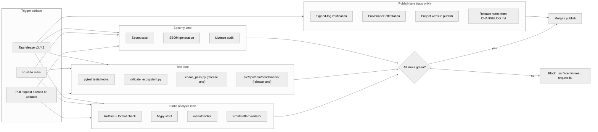

{/* SPDX-License-Identifier: MIT */}

**Peta struktural alur kerja build · validasi · publikasi yang mengawal setiap
perubahan pada ekosistem Apothem.** Dokumen ini memasang permukaan visualisasi;
berkas alur kerja GitHub Actions yang konkret dan perkakas rilis hadir kemudian
di bawah pemasangan kesiapan produksi.

## Bentuk pipeline

## Peran jalur

- **Jalur analisis statis** — umpan balik cepat. Ruff mencakup gaya Python dan
  satu set aturan yang dikurasi; mypy menegakkan disiplin tipe pada strict;
  markdownlint mengatur permukaan dokumentasi; validator frontmatter mengawal
  kepatuhan skema artefak untuk aturan, skill, pekerja yang didelegasikan, dan
  perintah.
- **Jalur uji** — `pytest tests/hooks` menjalankan runtime hook terhadap matriks
  peristiwa lengkap; `validate_ecosystem.py` adalah gerbang struktural utama
  untuk konsistensi lintas-artefak; `chaos_pass.py` dan suite benchmark per-kelas
  di bawah `src/apothem/benchmarks/` aktif pada jalur rilis untuk menangkap
  degradasi di bawah masukan yang terdegradasi dan regresi anggaran runtime.
- **Jalur keamanan** — pemindaian rahasia menangkap kredensial yang tidak sengaja
  di-commit; pembuatan SBOM dan audit lisensi mengawal permukaan rantai pasok
  untuk setiap pemasangan kesiapan produksi.
- **Jalur publikasi** — berjalan hanya pada rilis bertag. Verifikasi tag yang
  ditandatangani memastikan asal-usul cabang rilis; situs web proyek
  dipublikasikan dari `site/dist/` ke target GitHub Pages; catatan rilis berasal
  dari format Keep-A-Changelog `CHANGELOG.md`.

## Konfigurasi konkret

Berkas alur kerja yang sebenarnya (`.github/workflows/ci.yml`,
`.github/workflows/release.yml`, dst.) dipasang selama pembangunan ekosistem
kesiapan produksi. Diagram ini mendefinisikan bentuk kanonik yang dicerminkan
oleh setiap konfigurasi mendatang.

## Referensi silang otoritatif

- `pyproject.toml` — sumber kebenaran konfigurasi Ruff / mypy / pytest.
- `scripts/dev/validate_ecosystem.py` — gerbang lintas-artefak utama.
- `scripts/dev/validate_hooks.py` — validasi struktural khusus hook.
- `scripts/dev/chaos_pass.py` — sapuan adversarial pada setiap hook yang dikonfigurasi.
- `src/apothem/benchmarks/` — verifikator anggaran runtime per-kelas.
- `site/content/docs/developer-guide.mdx` — alur kerja kontributor yang berorientasi operator.
- `CHANGELOG.md` — sumber catatan rilis.
