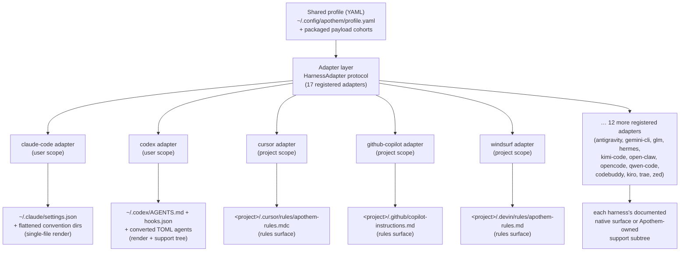

{/* SPDX-License-Identifier: MIT */}

Apothem menggunakan satu profil YAML tervalidasi-skema sebagai sumber kebenaran
semantik dan menurunkan setiap permukaan pemasangan spesifik-harness melalui kelas
adapter yang mengimplementasikan protokol `HarnessAdapter`. Setiap adapter menulis
ke lokasi pengguna atau proyek yang didokumentasikan oleh harness dan menggunakan
jalur dukungan milik Apothem hanya ketika harness tidak memiliki primitif asli
yang setara.

## Mengapa abstraksi adapter

Setiap harness berbicara dengan dialek konfigurasi yang berbeda: satu menginginkan
berkas pengaturan JSON, yang lain sebuah direktori berkas aturan `.mdc`, yang
ketiga sebuah berkas instruksi Markdown tunggal. Jika Apothem mengodekan
pengetahuan itu secara keras ke dalam CLI, setiap harness akan membocorkan
asumsinya ke inti, dan menambahkan sebuah harness berarti menyentuh logika
pemasangan, pembaruan, pencopotan, dan verifikasi secara serentak.

Pola adapter membalikkan hal itu. Inti hanya mengetahui protokol `HarnessAdapter`
— sebuah kontrak kecil berisi metode siklus-hidup. Dialek setiap harness hidup di
dalam satu subpaket mandiri yang mengimplementasikan kontrak tersebut. Inti
meminta sebuah adapter untuk *memasang* tanpa mengetahui apakah itu berarti
merender berkas JSON, menulis sebuah direktori aturan, atau meletakkan sebuah
pohon dukungan. Harness baru bergabung dengan memenuhi protokol dan mendaftarkan
sebuah titik masuk; tidak ada yang berubah di inti. Inilah alasan struktural
mengapa Apothem tetap agnostik-host — abstraksi adalah batas yang menjaga
pengetahuan spesifik-harness agar tidak menyebar.

## Bentuk sebuah adapter

Adapter terbagi menjadi dua bentuk materialisasi, keduanya terlihat di registri:

- **Perender berkas-tunggal** menerjemahkan bidang profil menjadi satu berkas
  konfigurasi asli-harness. Adapter Claude Code, misalnya, selalu menulis
  `~/.claude/settings.json` dari profil bersama dan meratakan direktori konvensi
  Apothem (`agents/`, `rules/`, `skills/`, …) di sampingnya.
- **Adapter permukaan-aturan dan pohon-dukungan** menyebarkan cohort muatan
  Apothem ke lokasi aturan yang didokumentasikan oleh harness, mengonversi cohort
  ke format asli di tempat yang memilikinya dan memarkir sisanya di bawah subpohon
  dukungan milik Apothem yang dirujuk dari jangkar asli. Adapter Cursor menulis
  satu `.cursor/rules/apothem-rules.mdc` ke akar proyek yang disuplai dan hanya
  mengirimkan permukaan aturan.

Sebuah adapter tertentu bersifat **lingkup-pengguna** (menulis di bawah direktori
home) atau **lingkup-proyek** (memerlukan `--project <path>` dan menulis di dalam
pohon itu); registri mencatat yang mana.

## Topologi adapter saat ini



Pemencaran dari pusat-ke-tepi adalah arsitektur yang dikodekan oleh nama proyek:
satu profil di inti, setiap harness berada pada jarak yang sama di sepanjang
adapternya sendiri.

## Definisi protokol

```python
from pathlib import Path
from typing import Protocol

class HarnessAdapter(Protocol):
    name: str
    output_path: Path

    def install(self, profile: dict[str, object]) -> object:
        ...

    def update(self, profile: dict[str, object]) -> object:
        ...

    def uninstall(self) -> None:
        ...

    def is_installed(self) -> bool:
        ...

    def verify(self) -> bool:
        ...
```

Adapter lingkup-proyek dapat secara tambahan menerima `project: Path | None` pada
metode siklus-hidup dan mengekspos `resolve_output_path(project)`. CLI hanya
meneruskan `--project PATH` ke adapter yang tanda tangan metodenya menerimanya.

## Pendaftaran titik masuk

Adapter mendaftar melalui grup titik-masuk setuptools `apothem.harnesses`:

```toml
[project.entry-points."apothem.harnesses"]
cursor = "apothem.harnesses.cursor:CursorAdapter"
```

Registri pusat di `src/apothem/lib/harness_registry.py` mencatat tujuh belas ID
publik yang persis, titik masuk, jalur dokumentasi, jalur target, persyaratan
data-paket, status kapabilitas, dan jalur pin konvensi standar. CLI memuat adapter
melalui registri itu alih-alih menemukan kembali fakta produk di setiap perintah.

## Pemetaan profil-ke-asli

Setiap adapter mengimplementasikan logika penerjemahan yang sesuai untuk
harness-nya:

```
YAML profile + payload cohort    Harness-native surface
-----------------------------    ----------------------
identity / preferences       --> native config fields or rendered instruction context
commands/*.md                --> native commands or SKILL.md folders
rules/*.md                   --> native rules where supported, otherwise support trees
hooks/messages/*.md          --> native hooks where supported, otherwise support trees
agents/*.md                  --> native agent formats where supported
skills/*/SKILL.md            --> native skill folders where supported
```

Sel kapabilitas yang tidak didukung dan yang menunggu-penemuan menjadi peringatan
terstruktur sebelum penulisan. Sel-sel itu tidak diproyeksikan secara diam-diam ke
permukaan vendor yang direka.

## Menambahkan adapter baru

Lihat [Menulis adapter harness](/docs/examples/authoring-a-harness-adapter)
untuk panduan langkah demi langkah.
