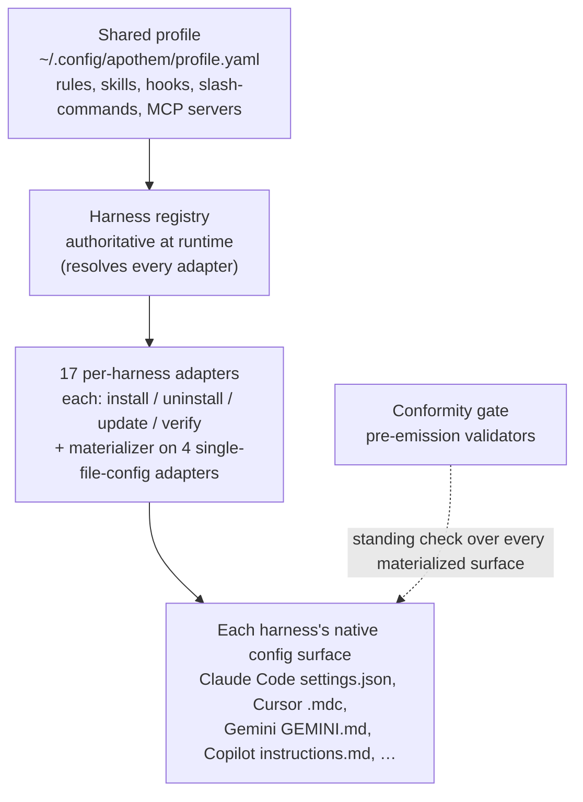

{/* SPDX-License-Identifier: MIT */}

Apothem dibangun di sekitar satu gagasan: satu profil tata kelola bersama,
dimaterialisasi ke dalam format konfigurasi native setiap harness
oleh adapter per harness. Bagian ini menjelaskan bagian-bagian
struktural — protokol adapter, skema profil, tata letak pohon sumber, dan alur
pemasangan yang menghubungkannya.

## Ikhtisar sistem

Sekilas, Apothem adalah satu alur: satu profil bersama memberi masukan ke
registry harness, yang menyelesaikan setiap adapter per harness; tiap adapter
mewujudkan permukaan konfigurasi native harness-nya, dan gerbang konformitas
yang selalu aktif memeriksa setiap permukaan yang diwujudkan.

## Halaman

| Halaman | Deskripsi |
|------|-------------|
| [Abstraksi adapter harness](/docs/architecture/harness-adapter-abstraction) | Protokol `HarnessAdapter` — bagaimana adapter menerjemahkan profil bersama menjadi konfigurasi native platform. |
| [Skema profil bersama](/docs/architecture/shared-profile-schema) | Profil YAML yang didukung skema di `~/.config/apothem/profile.yaml` atau `--profile PATH`. |
| [Tata letak sumber](/docs/architecture/source-layout) | Mengapa Apothem memakai tata letak `src/` dan bagaimana pohon diatur. |
| [Alur pemasangan](/docs/architecture/installation-workflow) | Bagaimana `apothem install`, `update`, dan `uninstall` bekerja dari ujung ke ujung. |
| [Pekerja terdelegasi](/docs/architecture/agents) | Instruksi bercakupan repositori untuk runtime multi-pekerja yang beroperasi di repositori ini. |
| [Runtime mandiri](/docs/architecture/self-contained-runtime) | Bagaimana mesin Apothem berjalan dari checkout mana pun — dependensi yang diinternalkan, model invokasi PYTHONPATH=src, dan bootstrap pohon plugin. |
| [Strategi internalisasi dependensi](/docs/architecture/vendoring-strategy) | Paket pihak ketiga mana yang diinternalkan Apothem di bawah src/apothem/_vendor/, mana yang tetap menjadi prasyarat sistem, dan bagaimana salinan yang diinternalkan disegarkan. |
| [Kontrak pemaketan cohort](/docs/architecture/cohort-packaging-contract) | Kontrak yang stabil dan dapat dikonsumsi hilir untuk pemaketan cohort dan manifes plugin — menyebutkan cohort dan menyelesaikan target asli per-harness-nya tanpa menurunkan ulang pemetaan. |
| [Diagram pipeline CI/CD](/docs/architecture/cicd-pipeline) | Peta visual dan rincian per jalur dari tahap alur kerja build, uji, lint, keamanan, dan publikasi yang mengawal setiap perubahan kode dan rilis. |
