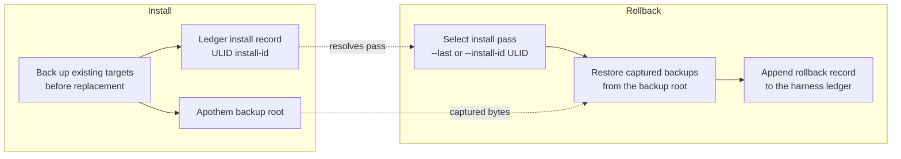

{/* SPDX-License-Identifier: MIT */}

## Alur instalasi

```mermaid
flowchart TD
    accTitle: Apothem install workflow
    accDescr: Top-down flowchart of the apothem install command from CLI invocation through adapter lookup, profile load, adapter install call, native config write, and final apothem verify check.
    A[apothem install --harness X] --> B[Resolve adapter through registry]
    B --> C[Load and validate profile YAML<br/>before writes]
    C --> D[Adapter.install(profile, project)]
    D --> E[Write native config and support cohorts]
    E --> F[apothem verify --harness X]
    F --> G{All checks pass?}
    G -- yes --> H[Done]
    G -- no --> I[Report failures]
```

## Alur pembaruan

Pada `apothem update --harness X`:

1. Memuat dan memvalidasi `~/.config/apothem/profile.yaml` atau `--profile PATH`.
2. Menyelesaikan harness yang dipilih atau `all` melalui registri pusat.
3. Memvalidasi seluruh rencana materialisasi sebelum penulisan pertama.
4. Memanggil `Adapter.update(profile, project=...)`.
5. Melaporkan hasil yang dibuat, diperbarui, tidak berubah, dilewati, peringatan, dan kesalahan.

## Alur penghapusan instalasi

Pada `apothem uninstall --harness X`:

1. Memanggil `Adapter.uninstall()`.
2. Adapter hanya menghapus berkas yang ditulisnya; profil bersama YAML dan berkas
   tak terkait yang ditulis operator tetap utuh.

## Resolusi cakupan

Setiap adapter menulis ke root instalasi tetapnya sendiri: direktori home pengguna
untuk adapter bercakupan pengguna dan path lokal proyek untuk adapter bercakupan
proyek. CLI tidak mengekspos flag `--scope`; adapter bercakupan proyek memerlukan
`--project <path>`. Setiap tujuan didokumentasikan di
`site/content/docs/harnesses/<harness>.mdx`.

## Penanganan kesalahan

Operasi instalasi/pembaruan memvalidasi sebelum menulis, mencadangkan target yang
cocok yang sudah ada sebelum penggantian, dan hanya menggabungkan entri anak yang
dikelola Apothem di direktori penemuan bersama. `--dry-run` menjalankan validasi
yang sama dan mengembalikan hasil dilewati atau tidak berubah tanpa membuat
direktori atau berkas.

## Reversibility (backup and rollback)

Every install pass is reversible. Replaced bytes are captured into the Apothem
backup root and the pass is recorded in the harness ledger under a ULID
install id; [`apothem rollback`](/docs/cli-reference/rollback) selects a
recorded pass and restores those captured backups.


