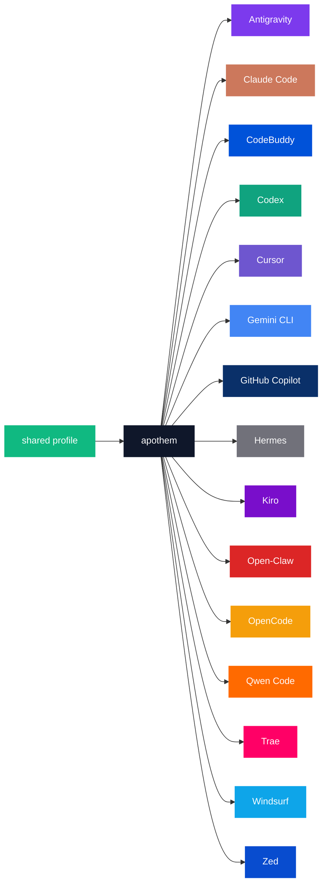

{/* SPDX-License-Identifier: MIT */}

Enumerasi kanonik nama-merek × kode-warna di bawah ini dibungkus dalam pagar `text` untuk mempertahankan identifier harfiah per harness yang dibutuhkan oleh tujuan katalog palet.

## Inti Apothem

| Token | Terang | Gelap | Penggunaan |
|---|---|---|---|
| `apothem-hub` | `#0F172A` | `#F1F5F9` | Simpul distribusi pusat ("apothem") di setiap diagram arsitektur dan hub pusat dari tanda Apothem. |
| `shared-profile` | `#10B981` | `#34D399` | Profil sumber-kebenaran yang memberi masukan ke inti apothem. |

## Palet harness

Lima belas dari tujuh belas harness diwarnai agar cocok dengan identitas merek
utamanya. Dua sisanya — `glm` dan `kimi-code` — belum memiliki warna merek yang
didefinisikan; barisnya ditambahkan setelah warna merek di hulu ditetapkan, sesuai
langkah propagasi di bawah [Pembaruan](#updates).

```text
| Token             | Light     | Dark      | Source                                                                                                                                              |
|-------------------|-----------|-----------|-----------------------------------------------------------------------------------------------------------------------------------------------------|
| `antigravity`     | `#7C3AED` | `#9F67FF` | Google Antigravity deep-purple.                                                                                                                     |
| `claude-code`     | `#CC785C` | `#E89378` | Anthropic terracotta-orange.                                                                                                                        |
| `codebuddy`       | `#0052D9` | `#5E8EF7` | Tencent CodeBuddy blue.                                                                                                                             |
| `codex`           | `#10A37F` | `#19C796` | OpenAI signature teal.                                                                                                                              |
| `cursor`          | `#6E56CF` | `#9B85E3` | Cursor brand purple.                                                                                                                                |
| `gemini-cli`      | `#4285F4` | `#6BA4F7` | Google blue (primary); the Apothem mark renders the node with all four Google brand hues `#4285F4` / `#34A853` / `#FBBC04` / `#EA4335`.             |
| `github-copilot`  | `#0A3069` | `#5B8FE3` | GitHub Mona deep-blue.                                                                                                                              |
| `hermes`          | `#71717A` | `#A1A1AA` | Community silver-grey.                                                                                                                              |
| `kiro`            | `#790ECB` | `#A862DD` | Kiro violet.                                                                                                                                        |
| `open-claw`       | `#DC2626` | `#F87171` | Community red-orange.                                                                                                                               |
| `opencode`        | `#F59E0B` | `#FBBF24` | Community amber.                                                                                                                                    |
| `qwen-code`       | `#FF6A00` | `#FF8C40` | Alibaba Qwen orange.                                                                                                                                |
| `trae`            | `#FF0066` | `#FF599C` | ByteDance Trae magenta.                                                                                                                             |
| `windsurf`        | `#0EA5E9` | `#38BDF8` | Windsurf sky-blue.                                                                                                                                  |
| `zed`             | `#084CCF` | `#5E8BE0` | Zed Industries blue.                                                                                                                                |
```

## Alasan penamaan

- **`apothem-hub`** — pusat geometris yang dievokasi oleh nama (apotema dari poligon beraturan mengarah ke dalam menuju intinya).
- **`shared-profile`** — sumber di hulu, berbeda dari warna harness mana pun secara tunggal sehingga terbaca sebagai panah "masukan" di setiap diagram.
- **Token per harness** mencerminkan slug harness yang digunakan di seluruh basis kode (`harnesses/<slug>/`, kunci entry-point, argumen `--harness <slug>` pada CLI). Satu kata per konsep; string yang sama di mana pun.

## Penggunaan Mermaid



## Aksesibilitas

Setiap token mode terang memenuhi kontras WCAG 2.2 AA terhadap teks putih (≥4,5 : 1) di mana kontras memungkinkannya tanpa mendistorsi warna merek. Ketika warna merek native sebuah harness jatuh di bawah ambang AA terhadap teks putih dengan sendirinya (khususnya keluarga amber / oranye dan keluarga biru-langit / teal dari token yang dienumerasi di atas), diagram yang membutuhkan kontras WCAG AA teks-pada-warna menggunakan **varian mode gelap** (rona yang diangkat) sebagai isian diagram agar teks putih terbaca jernih. Kolom mode gelap dikalibrasi untuk tujuan ini: setiap token mode gelap melampaui AA terhadap teks putih.

## Pembaruan

Palet diperbarui hanya ketika sebuah harness meratifikasi perubahan merek di hulu. Perubahan merek per harness merambat secara atomik melintasi `site/app/global.css`, halaman ini, dan setiap master SVG terdampak di bawah `assets/src/`.
