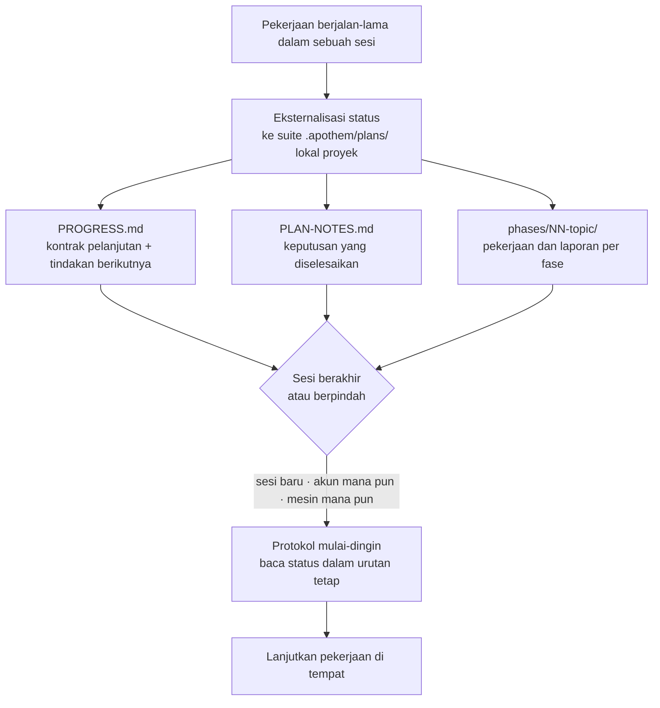

{/* SPDX-License-Identifier: MIT */}

Sebagian besar pekerjaan berbantuan hidup dan mati di dalam satu
percakapan. Anda menutup obrolan, berpindah mesin, atau masuk dengan akun lain,
dan alur dari apa yang sedang Anda kerjakan pun hilang — sesi berikutnya mulai
dingin, tanpa ingatan akan keputusan yang sudah Anda buat.

Apothem membalik hal itu. Untuk pekerjaan berjalan-lama dan bertahap, ia
mengeksternalisasi **status kerja lengkapnya** ke sebuah suite `.apothem/plans/` lokal
proyek (`.plans/` dipertahankan sebagai fallback) — berkas-berkas yang berada di repositori Anda, bukan di dalam riwayat
obrolan awan mana pun. Status adalah artefak yang awet; sesi bisa dibuang.

## Gagasan inti

Sebuah suite rencana di `<project-root>/.apothem/plans/{suite}/` membawa dua hal yang
membuat sebuah sesi dapat digantikan:

- **Kontrak pelanjutan.** `PROGRESS.md` mencatat fase dan status tugas saat ini,
  tindakan berikutnya yang tepat, konvensi yang berlaku, keputusan yang sudah
  diselesaikan, dan berkas persis yang harus dibaca sesi berikutnya.
- **Protokol mulai-dingin.** Sesi baru membaca berkas-berkas itu dalam urutan
  tetap dan menyusun ulang gambaran penuhnya sebelum melakukan pekerjaan apa pun
  — tanpa perlu riwayat percakapan.

Karena status itu ada di dalam berkas proyek Anda, sesi baru pada **akun atau
mesin mana pun** yang diarahkan ke proyek yang sama melanjutkan pekerjaan di
tempat. Tidak ada yang terkunci di dalam satu transkrip obrolan. Inilah sifat
yang membuat pekerjaan terstruktur, berskala besar, dan berhari-hari — korpus
besar, migrasi panjang, lintasan tinjauan besar — bertahan melewati batas yang
jika tidak demikian akan mengakhirinya.

## Apa itu, secara tepat

Dinyatakan secara saksama agar jaminannya jelas:

- **Ia adalah** status yang dieksternalisasi ke berkas ditambah protokol
  pelanjutan dari mulai-dingin. Pekerjaan dilanjutkan karena status hidup di
  dalam berkas proyek Anda, lepas dari sesi, akun, atau mesin mana pun.
- **Ia bukan** layanan sinkronisasi antar-akun otomatis. Apothem tidak mendorong
  status rencana Anda antar-akun dengan sendirinya — berkas berpindah dengan cara
  yang sama seperti berkas proyek Anda sudah berpindah (kendali versi, sebuah
  checkout bersama, sebuah direktori tersinkron). Yang dijamin Apothem adalah di
  mana pun berkas proyek mendarat, sesi baru dapat melanjutkan darinya.

## Mengapa ini penting

Semakin panjang dan besar pekerjaannya, semakin satu percakapan menjadi beban.
Sebuah perombakan berhari-hari atau sapuan melintasi basis kode yang besar akan
bertahan lebih lama daripada sesi mana pun: jendela konteks dipadatkan, sesi
kehabisan waktu, mesin berganti. Dengan memperlakukan berkas proyek itu sendiri
sebagai sumber kebenaran untuk pekerjaan yang sedang berjalan, Apothem membuat
pekerjaan tahan terhadap ketiga batas: sesi, akun, dan mesin.

## Di mana status berada

| Artefak | Lokasi | Memuat |
|----------|----------|-------|
| Suite rencana | `<project-root>/.apothem/plans/{suite}/` | Satu unit mandiri pekerjaan yang sedang berjalan |
| Kontrak pelanjutan | `<suite>/PROGRESS.md` | Status fase/tugas, tindakan berikutnya, konvensi, manifes berkas penting |
| Buku besar keputusan | `<suite>/PLAN-NOTES.md` | Keputusan yang diselesaikan, tidak pernah ditanyakan ulang |
| Pekerjaan per fase | `<suite>/phases/NN-topic/` | Tugas-tugas fase dan laporannya |

Pohon rencana diabaikan dari kendali versi oleh cuplikan `.gitignore` kanonik
Apothem, sehingga status rencana tetap lokal secara bawaan. Untuk membawa
pekerjaan yang sedang berjalan antar mesin atau akun secara sengaja, pindahkan
suite `.apothem/plans/` dengan cara yang sama seperti Anda memindahkan berkas proyek
lainnya.

## Terkait

- **[Tingkat keseriusan](/docs/concepts/seriousness-tiers)** — bagaimana tata
  kelola dan disiplin eksternalisasi status menyesuaikan dengan keterlibatan.
- **[Saluran perintah](/docs/pipeline)** — tahapan `/plan` yang membuat dan
  memajukan sebuah suite rencana.

## Recommended Next Step

**Baca [Tingkat keseriusan](/docs/concepts/seriousness-tiers)** untuk melihat
bagaimana disiplin eksternalisasi menyesuaikan dari eksperimen cepat hingga upaya
berhari-hari yang melintasi batas.
