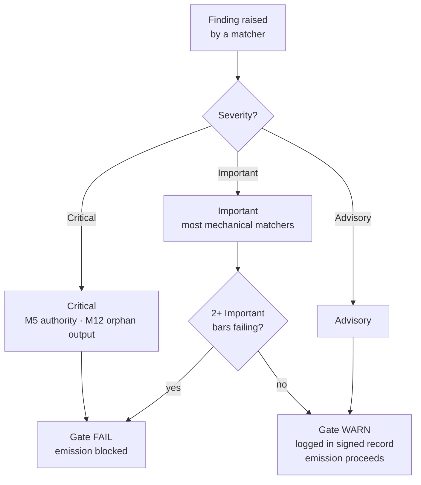

{/* SPDX-License-Identifier: MIT */}

## Lima belas poin

| Poin | ID | Mandat | Kelas pemeriksaan | Kegagalan → tindakan |
|---|---|---|---|---|
| 1 | M1 | Agnostisisme Proyek-Inang | Penalaran | Revisi agar sesuai dengan konvensi inang |
| 2 | M2 | Disiplin Editorial (registri pengungkapan) | Mekanis | Tambahkan penanda pengungkapan |
| 3 | M3 | Sepuluh Dimensi Kualitas | Penalaran | Revisi pada dimensi yang gagal |
| 4 | M4 | Penerapan-Diri (blok rekaman bertanda tangan hadir) | Mekanis | Catat blok rekaman bertanda tangan |
| 5 | M5 | Prinsip Otoritas (tanpa identitas / endpoint / rahasia yang dibuat-buat) | Mekanis | Arahkan ke pertanyaan |
| 6 | M6 | Penyertaan Keahlian (celah yang dimunculkan) | Penalaran | Munculkan celah; kutip penyempurnaan |
| 7 | M7 | Anotasi Opsi (penanda rekomendasi + alasan pendorong) | Mekanis | Anotasi set opsi |
| 8 | M8 | Kepastian (tanpa pengelakan dalam prosa preskriptif) | Mekanis | Naikkan pengelakan menjadi kondisional |
| 9 | M9 | Daya-Ungkit Visual (materi pokok struktural membawa diagram) | Penalaran | Buat / segarkan diagram |
| 10 | M10 | Pengikatan Dua-Arah (penunjuk balik timbal-balik tertutup) | Mekanis | Tutup setengah-sisi |
| 11 | M11 | Sprint Agile (Tujuan / Backlog / DoR / DoD / Review / Retrospektif) | Penalaran | Struktur-ulang sebagai sprint |
| 12 | M12 | Pelaporan Fase & Tata-Letak Kanonis | Mekanis | Buat ringkasan; pindahkan ke tata-letak kanonis |
| 13 | M13 | Kerajinan Kode (linter / formatter / pemeriksa-tipe; angka ajaib; bare-except) | Mekanis | Revisi sesuai aturan kerajinan kode per-bahasa |
| 14 | M14 | Sistemikitas (mendeklarasikan hulu / hilir / sejawat / penegak) | Penalaran | Deklarasikan; indeks dalam registri |
| 15 | M15 | Siap-Produksi (tes + dokumen + CHANGELOG + commit yang patuh + CI hijau + stabilitas semver) | Mekanis | Tambahkan permukaan yang hilang |

## Tangga keparahan

| Keparahan | Efek pada gerbang |
|---|---|
| **Kritis** | Gerbang FAIL — emisi diblokir tanpa syarat |
| **Penting** | Gerbang FAIL ketika 2+ poin Penting gagal bersamaan |
| **Anjuran** | Gerbang WARN — dicatat dalam rekaman bertanda tangan; tidak memblokir emisi |

Sebagian besar pencocok fraksi mekanis berdefault ke **Penting**. M5 (otoritas — rahasia, endpoint yang dibuat-buat) dan M12 (keluaran yatim) bersifat **Kritis**.



## Pencocok fraksi mekanis

Fraksi mekanis berada di [`src/apothem/conformity/*_grep.py`](https://github.com/ahmed-g-gad/apothem/tree/main/src/apothem/conformity), diorkestrasi oleh [`src/apothem/conformity/gate.py`](https://github.com/ahmed-g-gad/apothem/blob/main/src/apothem/conformity/gate.py).

| Pencocok | Poin | Fungsi |
|---|---|---|
| `hedging_grep.py` | M8 | Mendeteksi kosakata pengelakan dalam prosa preskriptif |
| `option_annotation_grep.py` | M7 | Memverifikasi penanda `**Recommended**` + alasan pendorong pada set opsi |
| `user_confirm_grep.py` | M5 | Memblokir placeholder `<USER-CONFIRM:…>` dari emisi |
| `binding_reciprocity_grep.py` | M10 | Mendeteksi setengah-sisi dalam `## Bindings (§0.j five-direction)` |
| `orphan_output_grep.py` | M12 | Menandai artefak tanpa konsumen / tanpa entri indeks / tanpa atribusi produsen |
| `bare_except_grep.py` | M13 | Mendeteksi `except:` / `except Exception:` tanpa komentar pembenaran |
| `magic_number_grep.py` | M13 | Mendeteksi literal numerik dalam logika bisnis |
| `commented_out_code_grep.py` | M13 | Mendeteksi blok kode yang dikomentari |
| `file_header_grep.py` | M13 | Memverifikasi keberadaan header lisensi SPDX satu-baris |
| `frontmatter_grep.py` | M14 | Memverifikasi field frontmatter wajib pada empat direktori direktif kanonis yang tercantum di bawah |
| `semver_stability_grep.py` | M15 | Mendeteksi perubahan API publik yang merusak tanpa kenaikan versi MAJOR |
| `production_ready_pr_grep.py` | M15 | Memverifikasi disiplin set-perubahan yang sama (tes + dokumen + CHANGELOG) |
| `secret_leak_grep.py` | M15 | Mendeteksi rahasia / kredensial yang dikodekan-keras |
| `unpinned_action_grep.py` | M15 | Memverifikasi penyematan GitHub Actions ke commit SHA |
| `always_on_budget_grep.py` | batas anggaran | Membatasi badan rule selalu-aktif pada 500 token substantif |

## Menjalankan gerbang

Pada harness yang terpasang, gerbang berjalan otomatis: `settings.json`
Claude Code mengaitkannya sebagai hook `PreToolUse` yang memanggil salinan
 termaterialisasi di `~/.claude/.apothem/support/conformity/gate.py` sebelum setiap
Write/Edit. Dari checkout sumber, bentuk modul menjalankan kode yang sama:

```shell
# Pengiriman berkas-tunggal (meniru hook PreToolUse):
echo '{"tool_input": {"file_path": "path/to/file", "content": "..."}}' \
    | python -m apothem.conformity.gate --hook

# Sapuan komposit di seluruh repositori:
python -m apothem.conformity.gate --sweep src/ site/content/docs/ rules/
```

Lihat [Menjalankan gerbang konformitas](/docs/usage/conformity-gate) untuk prosedur lengkap.

## Referensi

- [Registri gerbang pra-emisi](/docs/governance/pre-emission-gate-registry) — definisi poin kanonis
- [Registri konformitas eksternal](/docs/governance/outward-conformity-registry) — semantik terperinci M1-M15
- [Mandat lintas-bidang](/docs/governance/cross-cutting-mandates) — sumber kebenaran mandat
- [Disiplin kinerja](https://github.com/ahmed-g-gad/apothem/blob/main/src/apothem/rules/performance-discipline.md) — anggaran waktu-jalan per-kelas
