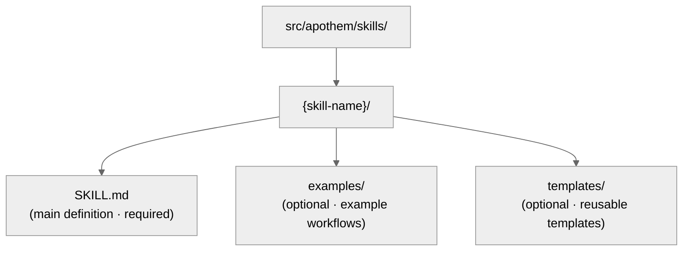

{/* SPDX-License-Identifier: MIT */}

Panduan ini membantu pengembang memelihara dan memperluas ekosistem Apothem dengan
standar mutu SOTA.

## Rujukan Cepat: Jenis Artefak

Ekosistem Apothem berisi lima jenis artefak, masing-masing dengan tujuan
spesifik dan persyaratan frontmatter.

| Artefak | Jalur | Tujuan | Kapan Dibuat |
| -------- | ---- | ------- | -------------- |
| **Rule** | `src/apothem/rules/*.md` | Mandat perilaku atau direktif operasional | Prinsip, kebijakan, atau mandat tata kelola baru ditetapkan |
| **Command** | `src/apothem/commands/*.md` | Slash command (`/command-name`) untuk alur kerja kompleks | Alur kerja pengguna multi-langkah baru |
| **Helper** | direktori pembantu (`*.md` per berkas) | Definisi pekerja-terdelegasi persisten untuk tugas paralel | Tugas khusus berulang baru (audit, eksplorasi, pemeriksaan-mutu) |
| **Skill** | `src/apothem/skills/{name}/SKILL.md` | Teknik dapat-pakai-ulang dengan sinyal deteksi | Pola teknik baru yang dapat-dideteksi dan dapat-dipakai-ulang |
| **Hook** | `src/apothem/hooks/` + `settings.json` | Validasi atau pengelolaan keadaan yang dipicu-peristiwa | Peristiwa siklus-hidup atau kebutuhan validasi baru |

## Kontrak Adapter Perkakas

Identitas perkakas dan fakta kapabilitas berada di
`src/apothem/lib/harness_registry.py`. Perubahan perkakas selesai hanya ketika
permukaan-permukaan ini sepakat:

| Permukaan | Pembaruan yang diperlukan |
| --- | --- |
| Baris registri | ID publik, kunci paket, entry point, cakupan, format keluaran, jalur target, jalur dokumen, berkas kapabilitas, pin standar, tes fixture, kunci data-paket, sumber templat, dan status kapabilitas. |
| Paket adapter | `__init__.py`, `install.py`, `update.py`, `uninstall.py`, `verify.py`; tambah `materializer.py` hanya ketika perkakas merender berkas konfigurasi native. |
| Manifest propagasi | Jalur templat dan kohor untuk adapter yang didukung-manifest. |
| Kapabilitas | `src/apothem/harnesses/<package>/capabilities.yml` dengan setiap kapabilitas yang diperlukan dan rasional untuk keadaan tak-didukung atau menunggu-penemuan. |
| Pin konvensi | `STANDARD-CONVENTION-PIN.md` dengan URL vendor, tanggal snapshot, nama-berkas/skema kanonik, rujukan bukti, dan rasional kapabilitas tak-didukung. |
| Tes | Paritas registri, tes fixture adapter, baris install-plan golden, perilaku dry-run/tanpa-tulis, idempotensi, dan cakupan data-paket. |
| Dokumen | Halaman rujukan perkakas, halaman perbandingan, catatan kapabilitas/MCP, dan contoh yang menggunakan placeholder palsu. |

Adapter bercakupan-proyek harus menyetel `requires_project = True`, menerima
`project: Path | None` pada metode siklus-hidup, dan menolak akar proyek yang hilang atau tidak aman
sebelum penulisan. Adapter bercakupan-pengguna harus menjaga jalur di bawah
akar konfigurasi pengguna perkakas yang terdokumentasi.

## Kebijakan Fixture Golden

`tests/fixtures/harness-golden-plans.json` mencatat bentuk install-plan publik
untuk seluruh tujuh belas perkakas registri: ID publik, mode materialisasi, jalur
kohor/templat sumber, dan jalur target ternormalisasi di bawah `<ROOT>`. Ketika perilaku
target registri, manifest, atau templat berubah secara sengaja, perbarui fixture
golden dalam commit yang sama dengan perubahan sumber agar diff menunjukkan delta
perilaku.

## Validasi Sebelum Penulisan

Pendorong pemasangan bersama memvalidasi setiap sumber dan target sebelum penulisan
pertama. Ia menolak sumber manifest yang hilang, traversal target, jalur target
di luar akar yang dipilih, dan persilangan symlink. Dry-run mengeksekusi validasi
yang sama dan mengembalikan hasil `skipped` atau `unchanged` terstruktur tanpa
membuat berkas.

## Redaksi dan Data Contoh

Diagnostik profil meredaksi medan berbentuk token, secret, password, kredensial, API key,
private key, authorization, auth, dan header. Dokumentasi,
fixture, contoh, dan cuplikan JSON menggunakan `example.invalid`, `Example User`,
`example-user`, dan placeholder yang jelas ketimbang secret atau akun pribadi yang tampak-nyata.

## Sebelum Anda Menulis: Skema Kanonik

**Semua artefak harus mengikuti skema di `site/content/docs/reference/artifact-schema.mdx`.** Ini
tidak dapat ditawar.

- Baca `site/content/docs/reference/artifact-schema.mdx` § "Schema" untuk jenis artefak Anda
- Salin medan yang diperlukan
- Isi nilai-nilai wajib
- Tambahkan medan opsional sesuai kebutuhan

## Pemeriksaan-Cepat Frontmatter

Setiap frontmatter artefak harus lolos pemeriksaan ini:

```yaml
✓ Sintaks YAML valid (gunakan alat: `yamllint` atau PowerShell `ConvertFrom-Yaml` jika tersedia)
✓ Semua medan wajib hadir (per skema untuk jenis artefak)
✓ name: menggunakan kebab-case
✓ version: semantik MAJOR.MINOR.PATCH
✓ updated: tanggal ISO 8601 (YYYY-MM-DD)
✓ description: satu-baris, tidak-kosong
✓ scope: enum valid (always-on|path-filtered|other)
✓ portability: enum valid (`universal` | `universal-with-windows-caveats` | `unix-only` | `windows-only`)
✓ Tidak ada salah-ketik dalam nama medan — harus cocok dengan skema kanonik persis
✓ Medan opsional menggunakan nilai enum yang benar
```

## Konvensi Penamaan

### Nama Artefak (kebab-case)

- **Rules:** `operational-mandates`, `clean-room-generation`, `context-management`
- **Commands:** `plan-execute`, `plan-spec`, `plan-generate`
- **Helpers:** `codebase-explorer`, `convention-auditor`, `quality-gate`
- **Skills:** `plan-suite`, `ecosystem-audit`

Pola: huruf-kecil, tanda-hubung antar kata, tanpa spasi atau garis-bawah.

### Penamaan Berkas

- **Rules:** `{name}.md`
- **Commands:** `{name}.md`
- **Helpers:** `{name}.md`
- **Skills:** Di dalam folder `src/apothem/skills/{name}/SKILL.md` (huruf persis: `SKILL.md`)
- **Hooks:** Di dalam folder `src/apothem/hooks/`. Semua penangan peristiwa adalah Python. Setiap
  command hook `settings.json` menggunakan bentuk exec (`python` plus `args`) untuk memanggil
  `-m apothem.hooks.dispatch <event> [<message-name>]` atau
  `-m apothem.conformity.gate --hook`. `dispatch.py` merutekan `SessionStart` ke
  `session_start_bootstrap.main()` dan
  setiap peristiwa lain yang diizinkan ke `emit_hook_context.main()`. Satu-satunya stub shell
  yang diizinkan di bawah `src/apothem/hooks/` atau `scripts/` adalah keempat berkas pelokasi + bootstrap
  (`find-python.{ps1,sh}`, `bootstrap.{ps1,sh}`); berkas `.ps1` /
  `.sh` lain mana pun gagal pemeriksaan kebersihan `scripts/dev/validate_hooks.py`.

### Rujukan-Silang

Saat merujuk artefak lain, gunakan nama persis:

- Rules: `"operational-mandates"` (nilai medan name)
- Commands: `/plan-execute` (dengan slash untuk dokumen manusia; tanpa di kode)
- Helpers: `codebase-explorer` (nilai medan name)
- Skills: `plan-suite` (nilai medan name)

Jangan pernah gunakan jalur berkas atau nama terpotong dalam prosa.

## Portabilitas: Windows vs. Unix

Setiap artefak harus mendeklarasikan status portabilitasnya secara eksplisit.

### Universal (Default)

- Bekerja identik pada Windows, macOS, dan Linux
- Tanpa asumsi shell
- Jalur menggunakan garis-miring-maju (`/`)
- Tanpa jalur absolut yang dipaku-kode
- Tanpa sintaks PowerShell spesifik-Windows

```yaml
portability: "universal"
```

### Universal dengan Catatan Windows

- Universal di seluruh host POSIX; catatan yang disebut berlaku pada varian platform Windows yang dideklarasikan dalam konten
- Dokumentasikan catatan secara eksplisit dalam konten
- Contoh: "Symlink tidak didukung pada Windows sebelum Win 10"

```yaml
portability: "universal-with-windows-caveats"
```

Dokumentasikan catatan dalam sebuah note tepat setelah judul.

### Hanya-Unix / Hanya-Windows

- Dibatasi secara eksplisit ke satu platform
- Jarang di Apothem — sebagian besar seharusnya universal
- Gunakan hanya jika fitur spesifik-platform esensial

```yaml
portability: "unix-only"
```

Dokumentasikan alasannya di bagian pertama aturan.

## Cakupan: Always-On vs. Path-Filtered

### Always-On

Aturan berlaku di mana saja.

```yaml
scope: "always-on"
```

### Path-Filtered

Aturan berlaku secara kondisional berdasarkan jalur berkas.

```yaml
scope: "path-filtered"
pathFilter: "**/*.py, **/*.toml"
```

`pathFilter` menggunakan pola glob (format yang sama dengan `.gitignore`). Ketika sebuah berkas
cocok dengan filter, aturan aktif.

## Semantik Versi

Setiap artefak membawa versi semantiknya sendiri (`MAJOR.MINOR.PATCH`):

- **PATCH** — perbaikan salah-ketik, pemformatan, penyegaran tautan, suntingan komentar-saja. Perilaku tidak berubah.
- **MINOR** — perubahan aditif tak-merusak: bagian opsional baru, anti-pola tambahan, medan frontmatter opsional baru, contoh baru. Konsumen yang ada terus bekerja tanpa perubahan.
- **MAJOR** — perubahan skema atau kontrak yang merusak: bagian yang dihapus, medan yang diganti-nama, perilaku direktif yang ada yang diubah, perubahan yang mengharuskan artefak hilir beradaptasi.

Contoh:

- `vX.Y.Z` → `vX.Y.(Z+1)` (PATCH: perbaikan salah-ketik)
- `vX.Y.Z` → `vX.(Y+1).0` (MINOR: menambah entri Anti-Pola baru)
- `vX.Y.Z` → `v(X+1).0.0` (MAJOR: menyatakan kontrak stabil)
- `vX.Y.Z` → `v(X+1).0.0` (MAJOR: menghapus medan frontmatter wajib)

Naikkan `version` dan `updated` bersama-sama pada setiap suntingan yang mengubah-perilaku. Tambahkan
baris yang cocok ke `CHANGELOG.md` tingkat-ekosistem untuk rilis yang membundel
perubahan artefak.

## Kapan Menyunting Artefak

### Rules

- Perlakukan struktur Wajib/Opsional sebagai pemikul-beban — merestrukturisasinya
  beriak ke setiap artefak dependen (kenaikan MAJOR diperlukan).
- Perhalus Anti-Pola, contoh Penskalaan Keseriusan, dan kutipan saat
  pemahaman mendalam (kenaikan MINOR).
- Tangkap rasional untuk perubahan struktural apa pun di berkas topik memori
  yang relevan.

### Commands

- Bentuk argumen adalah bagian dari kontrak publik — patahkan hanya dengan maksud
  eksplisit dan propagasikan perubahan ke setiap pemanggil (kenaikan MAJOR).
- Jaga langkah alur kerja dan kontrak pengembalian tetap ketat dan terkini.
- Dokumentasikan pengurutan langkah yang tidak-jelas secara inline.

### Helpers

- Jaga `disallowedTools` minimal-tetapi-memadai; dokumentasikan rasional saat ia
  berubah.
- Perhalus Prinsip Operasi dan Kontrak Pengembalian saat peran pembantu
  matang (kenaikan MINOR).
- Lacak pergeseran kapabilitas secara inline agar pemanggil dapat mengkalibrasi-ulang ekspektasi.

### Skills

- Jaga langkah Prosedur dan Contoh tersinkronisasi dengan kenyataan.
- Sinyal deteksi harus mencerminkan ungkapan pengguna aktual dalam penggunaan saat ini.
- Pecah sebuah skill setelah ia melewati ~150 baris (lihat
  `auto-memory.md` § Topic File Management).

## Langkah-demi-Langkah: Menambah Aturan Baru

### 1. Nilai Ortogonalitas

Apakah aturan ini tumpang-tindih dengan aturan yang ada? Cari `src/apothem/rules/` untuk konten terkait.

Jika tumpang-tindih >50%, pertimbangkan memperluas aturan yang ada. Lihat
`persistent-conventions-vigilance.md` § Artifact Evolution.

### 2. Tulis Konten

Ikuti struktur:

- Judul: `# Rule: {Title}`
- Bagian Purpose
- Obligations / Core directives (bernomor, tertaut)
- Tabel Seriousness Scaling (selalu diperlukan)
- Bagian Anti-Patterns
- Bagian Enforcement

### 3. Buat Frontmatter

Gunakan skema dari `site/content/docs/reference/artifact-schema.mdx` § Schema: Rules. Setel:

- `name:` pengenal kebab-case
- `version:` `"X.Y.Z"` (awal)
- `updated:` tanggal hari ini dalam ISO 8601
- `scope:` `always-on` atau `path-filtered`
- `portability:` `universal` (atau dengan catatan jika diperlukan)
- `implements:` Daftar mandat CM/TM/CP yang dicakup aturan ini

Contoh:

```yaml
---
name: "my-new-rule"
description: "Brief one-liner"
pathFilter: ""
alwaysApply: true
---
```

### 4. Perbarui CLAUDE.md

Tambahkan entri ke tabel registri `§7.2 Rules`:

```markdown
| My New Rule | `src/apothem/rules/my-new-rule.md` | Always-on | CM-5/CM-21 |
```

Pertahankan urutan abjad dalam tabel.

### 5. Tambahkan ke CHANGELOG.md

Tambahkan baris di bawah bagian `### Added` rilis berikutnya yang menjelaskan aturan baru.

### 6. Jalankan Validasi

Panggil skill `ecosystem-audit` untuk memverifikasi aturan baru, berfokus pada area aturan:

```text
Invoke the ecosystem-audit skill with --focus rules --fix
```

Verifikasi tidak ada kesalahan dilaporkan untuk aturan baru Anda.

## Langkah-demi-Langkah: Menambah Command Baru

Command adalah slash command seperti `/plan-spec`, `/plan-execute`, `/security-audit`, dll.

### 1. Tentukan Peran

Command **tidak pernah** dimaksudkan untuk dipanggil oleh runtime asisten-pengkodean secara terisolasi. Mereka adalah
alur kerja yang dipicu-pengguna. Tanyakan:

- Apakah ini alur kerja yang diketik pengguna `/command-name`?
- Apakah ia mengorkestrasi beberapa langkah?
- Bisakah ia timeout atau memerlukan masukan pengguna di tengah-eksekusi?

Jika "tidak" untuk salah satu dari ini, ia mungkin sebuah skill, bukan command.

### 2. Buat Berkas

Jalur: `src/apothem/commands/{name}.md`

Frontmatter (dari `site/content/docs/reference/artifact-schema.mdx` § Schema: Commands):

```yaml
---
name: "my-command"
version: "X.Y.Z"
updated: "2026-04-20"
description: "What this command does"
argument-hint: "[path/to/input] [--flag VALUE]"
disable-model-invocation: true
portability: "universal"
allowed-tools: "Read, Glob, Grep"
---
```

Selalu setel `disable-model-invocation: true` untuk command.

### 3. Tulis Konten

Struktur:

- Judul: `# /{name} — Human-Readable Title`
- Bagian Role (siapa yang mengeksekusi ini)
- Instruksi tingkat-tinggi
- Bagian Workflow dengan langkah-langkah
- Kontrak pengembalian / format keluaran

### 4. Perbarui CLAUDE.md dan CHANGELOG.md

Baris registri di `§7.1 Commands`; baris CHANGELOG di bawah bagian `### Added` rilis berikutnya.

### 5. Validasi

Panggil skill `ecosystem-audit`, berfokus pada command:

```text
Invoke the ecosystem-audit skill with --focus commands --fix
```

## Langkah-demi-Langkah: Menambah Pembantu Baru

Pembantu adalah definisi pekerja-terdelegasi persisten untuk kerja paralel.

### 1. Identifikasi Pola

Apakah pembantu ini cocok dengan salah satu pola tim yang tercantum di bawah?

- Research Team: hanya-baca, pengumpulan informasi
- Audit Team: verifikasi, pemeriksaan konsistensi
- Implementation Team: perubahan kode paralel
- Quality Team: lint, tes, pemeriksaan-tipe, keamanan
- Documentation Team: pembaruan dokumen
- Other: tugas khusus

### 2. Buat Berkas

Jalur:

```text
src/apothem/agents/{name}.md
```

Frontmatter:

```yaml
---
name: "my-helper"
version: "X.Y.Z"
updated: "2026-04-20"
description: "What this helper specializes in"
tools: "Read, Glob, Grep, Bash"
disallowedTools: "Write, Edit"
maxTurns: 15
portability: "universal"
---
```

### 3. Tulis Konten

Bagian:

- Operating Principles (hanya-baca, berbasis-bukti, putusan biner, ekshaustif)
- Workflow (langkah-langkah bernomor)
- Return Contract (token maks, struktur, medan yang diperlukan)

### 4. Perbarui CLAUDE.md dan CHANGELOG.md

Baris registri di `§7.3 Helpers`; baris CHANGELOG di bawah bagian `### Added` rilis berikutnya.

### 5. Tes

Sebarkan pembantu dalam skenario nyata dan verifikasi ia bekerja sebagaimana didokumentasikan.

## Langkah-demi-Langkah: Menambah Skill Baru

Skill adalah teknik yang dapat-dipakai-ulang dan dapat-dideteksi.

### 1. Identifikasi Keterpakaian-Ulang

Sebelum menulis skill:

- Apakah Anda telah melihat masalah/teknik ini 3+ kali?
- Apakah ia dapat-dideteksi? (Apakah pola permintaan pengguna menyinyalkannya?)
- Bisakah Anda mengkodifikasinya secara reproduktif?

Jika ketiganya ya, tulis skill.

### 2. Buat Struktur



### 3. Tulis SKILL.md

Frontmatter:

```yaml
---
name: "skill-name"
version: "X.Y.Z"
updated: "2026-04-20"
description: "What this skill teaches"
archetype: "workflow-template"
userInvocable: true | false
disable-model-invocation: true | false
allowed-tools: "Read, Glob, Grep"
argument-hint: "[args]"               # optional; if userInvocable
---
```

Struktur konten:

- Purpose
- When to Use This Skill
- Prerequisites
- Step-by-Step Procedure
- Common Mistakes
- Examples

### 4. Perbarui CLAUDE.md dan CHANGELOG.md

Baris registri di `§7.5 Skills`; baris CHANGELOG di bawah bagian `### Added` rilis berikutnya.

### 5. Validasi

Panggil skill `ecosystem-audit`, berfokus pada skill:

```text
Invoke the ecosystem-audit skill with --focus skills --fix
```

## Daftar Periksa Validasi Sebelum Commit

- [ ] Frontmatter lolos pemeriksaan sintaks YAML
- [ ] Semua medan wajib hadir per skema
- [ ] Medan `name` menggunakan kebab-case
- [ ] `version` semantik (`MAJOR.MINOR.PATCH`) dan dinaikkan jika perilaku berubah
- [ ] `updated` cocok dengan tanggal hari ini untuk artefak apa pun yang Anda sentuh
- [ ] Medan `portability` disetel dan valid
- [ ] CHANGELOG.md membawa perubahan di kategori yang sesuai di bawah bagian rilis berikutnya
- [ ] Tanpa rujukan plan-internal (kepatuhan CM-7)
- [ ] Rujukan-silang konsisten dengan artefak lain
- [ ] Artefak baru terdaftar dalam registri CLAUDE.md
- [ ] Artefak teruji (jika berlaku)
- [ ] Skill `ecosystem-audit` berjalan tanpa kesalahan
- [ ] Konten mengikuti konvensi struktural (format judul, bagian, dll.)

## Merujuk Artefak Lain

Gunakan konvensi persis ini:

### Merujuk Aturan

```markdown
See `src/apothem/rules/operational-mandates.md` or shorthand: the Operational Mandates rule.
In prose: ... per CM-1–10 (Operational Mandates rule) ...
```

### Merujuk Command

```markdown
See `/plan-execute` command. Or: Run `/plan-execute`.
In prose: The `/plan-execute` command handles phase execution.
```

### Merujuk Pembantu

```markdown
Deploy the `codebase-explorer` delegated worker.
In prose: The codebase-explorer worker finds patterns.
```

### Merujuk Skill

```markdown
Use the `plan-suite` skill.
In prose: The plan-suite skill provides the Master Plan Suite template.
```

### Merujuk Bagian CLAUDE.md

```markdown
See CLAUDE.md § 7.2 (Rules registry).
Or: Section 4 (Seriousness-Scaled Governance).
```

## Linting dan Format

Semua artefak menggunakan:

- **Markdown:** GFM (GitHub Flavored Markdown)
- **YAML:** Patuh YAML 1.2
- **Akhiran baris:** LF (gaya-Unix)
- **Pengodean:** UTF-8
- **Lebar baris:** Bungkus-lunak pada 100 karakter untuk konten (tanpa pemutus-keras)

Gunakan formatter / linter `Ruff` untuk berkas Python. Untuk Markdown, gunakan
`prettier` atau setara.

## Audit Ekosistem: Menjalankan Validasi

Dua permukaan validasi yang saling melengkapi mencakup ekosistem:

**Dapat-dicek-mesin (validator Python)** — jalankan sebelum setiap commit:

```bash
python scripts/dev/validate_hooks.py       # Hook structure + Python-only hygiene
python scripts/dev/validate_ecosystem.py   # Full tree + frontmatter + delegated hook checks
python scripts/dev/chaos_pass.py           # Adversarial sweep across configured hooks
pytest tests                                    # Unit tests for the hook runtime
```

**Didorong-asisten-pengkodean** — untuk audit rujukan-silang, naratif, dan konvensi:

```bash
/ecosystem-audit --focus all --fix
```

Ini berjalan secara paralel:

- **Audit struktur:** Akurasi registri, keberadaan berkas, validitas frontmatter
- **Audit artefak:** Rujukan-silang, cakupan mandat, pengurutan pipeline
- **Audit memori:** Klaim berkas memori vs. keadaan sistem-berkas

Keluaran yang diharapkan: `PASS` dengan nol temuan dari kedua permukaan.

Jika `FINDINGS` dilaporkan:

- Tinjau severitas setiap temuan (Critical / Important / Advisory)
- Tangani butir Critical segera
- Rencanakan butir Important untuk siklus berikutnya
- Pertimbangkan butir Advisory untuk iterasi berikutnya

---

## Pertanyaan?

Lihat:

- Skema frontmatter: `site/content/docs/reference/artifact-schema.mdx`
- Siklus-hidup artefak: `src/apothem/rules/persistent-conventions-vigilance.md` § Artifact Evolution
- Mandat operasional: `src/apothem/rules/operational-mandates.md` CM-1–10
- Rujukan plan suite: `src/apothem/skills/plan-suite/master-template.md`
- Catatan rilis: `CHANGELOG.md`
