{/* SPDX-License-Identifier: MIT */}

これらは、マルチワーカーのハーネス（オーケストレーション
プラットフォーム、ディスパッチャー、自律的なヘルパープラットフォーム）が
このリポジトリで動作する際の、リポジトリスコープの指示です。これらは必須であり、
公開されるすべてのチェックアウトに同梱されます。これらは
[`AGENTS.md`](https://github.com/ahmed-g-gad/apothem/blob/main/AGENTS.md)、
[`CLAUDE.md`](https://github.com/ahmed-g-gad/apothem/blob/main/CLAUDE.md)、
および他のサポート対象ハーネス面向けのプロジェクトスコープの指示と
整合します。これらの面が共有された規律（プランの規律、ファイルヘッダー、曖昧さの扱い、
命名、アンチパターン、モーダル階層）で重なる場合、それらは意味的に等価であり、
`AGENTS.md` が正規のプロジェクトボイスです。

## プロジェクトの背景

このリポジトリは、ハーネスの構成をホストする開発者ツール
エコシステムです。委譲ワーカー、スラッシュコマンド、スキル、フック、出力スタイル、
ステータスライン、MCP 統合、設定、JSON スキーマ、バリデーター、テスト、ドキュメントを
含みます。単一の作者によって保守されています。ディスク上のレイアウトはランタイムの
レイアウトを正確に反映します。このリポジトリの委譲ワーカーは、公開ツリーの外部に状態を
保存しません。公開ツリーが正規のアーティファクトです。

## ワーカー規約

このリポジトリにおけるマルチワーカー実行は、3 つの規約に従います。

- **ロールには名前が付けられている。** マルチワーカー実行におけるすべての委譲ワーカーは、
  ロール識別子（kebab-case、説明的: `codebase-explorer`、`convention-auditor`、
  `quality-gate`、`memory-auditor`）を持ちます。汎用的なロール名
  （`worker`、`helper`）は禁止されています。
- **戻り値の契約は明示的である。** すべてのワーカー呼び出しは、期待される戻り値の形
  ——構造化された要約、最大トークン予算、必須フィールド、失敗モードの文言——を指定します。
  ディスパッチャーは、不正な形式の戻り値を黙って再プロンプトするのではなく、拒否します。
- **共有状態はファイルシステムである。** 委譲ワーカーは、ディスパッチ境界を越えて
  メモリを共有しません。2 つのワーカーが必要とする状態は、公開ツリー下の名前付き
  ファイル（または進行中の作業状態については、*プランの規律* に従いプロジェクトの
  `.apothem/plans/` ディレクトリ）を通じて流れます。
{/* [Machine-seeded — pending review] */}
  （`.apothem/plans/` が正規のプラン保存先です。レガシーの `.plans/`
  ツリーは `apothem migrate-workspace` で移行します。）

ワーカーのタスクが複数ステップにわたる場合、ワーカーの作業トレースは *プランの規律* に
従い `<project-root>/.apothem/plans/YYYY-MM-DD--<slug>.md` に記録されます。ディスパッチャーは
そのプランを読み、下流のワーカーを調整します。プランは決して git にコミットされません。

## ファイルヘッダー

アシスタントが生成するすべての該当する新規ファイルは、ファイルタイプに一致するバリアントで、
[`site/content/docs/reference/authorship-header.mdx`](/docs/reference/authorship-header)
に従った正規の単一行 SPDX ライセンスヘッダーで開始 **しなければなりません（MUST）**。
バイト単位で正確なヘッダーフィクスチャは
[`src/apothem/schemas/authorship-header.txt`](https://github.com/ahmed-g-gad/apothem/blob/main/src/apothem/schemas/authorship-header.txt)
にあります。

ヘッダーを追加するには、アシスタントは正規のインジェクターを呼び出します。

```bash
python scripts/inject-header.py --mode fix-in-place <path>
```

インジェクターは冪等であり、パスからバリアントを検出します。ヘッダーは
[`src/apothem/schemas/header-exceptions.txt`](https://github.com/ahmed-g-gad/apothem/blob/main/src/apothem/schemas/header-exceptions.txt)
に列挙されたクラスについては **免除** されます——LICENSE、JSON ファイル、ロックファイル、
生成ファイル、vendored コンテンツ、`.audit/` の一時ファイル、
`<project-root>/.apothem/plans/` の一時ファイル、空マーカー、バイナリです。

## プランの規律

アシスタントは、ハーネス構成ディレクトリやその他のグローバルなプランの場所に書き込む
コード、スクリプト、または散文を生成 **してはなりません（MUST NOT）**。計画
アーティファクト——マルチワーカー調整プラン、リファクタリング戦略、デバッグジャーナル、
探索ノート——は、`<project-root>/.apothem/plans/` にのみ存在します
（正規のプラン保存先。レガシーの `<project-root>/.plans/` ツリーは `apothem migrate-workspace` で移行します）。
{/* [Machine-seeded — pending review] */}

`<project-root>/.apothem/plans/` ディレクトリ（およびレガシーの
`<project-root>/.plans/`）は、
[`site/content/docs/reference/plans-discipline.mdx`](/docs/reference/plans-discipline)
に文書化された正規の `.gitignore` スニペットに従って **gitignore** されます。プランは、
{/* [Machine-seeded — pending review] */}
プロジェクトの git 履歴に **決してコミットしてはなりません（MUST NEVER）**。プランは
ライフサイクル状態 **draft → in-progress → converged**（ADR に昇格）
**→ abandoned / superseded** を遷移し、各プランの frontmatter の `status:` フィールドに

```mermaid
%% provenance: hand-authored %%
%% verified: 2026-07-06 %%
%% cross-reference: the plan status: lifecycle described above; CLAUDE.md Plans Discipline %%
stateDiagram-v2
    accTitle: Apothem plan lifecycle states
    accDescr: A plan's frontmatter status field moves from draft to in-progress to converged, where a converged plan is promoted to an ADR. From draft or in-progress a plan may instead be abandoned; an in-progress or converged plan may be superseded. Abandoned and superseded are terminal.
    state "in-progress" as inprogress
    [*] --> draft
    draft --> inprogress
    inprogress --> converged
    converged --> [*]: promote to ADR
    draft --> abandoned
    inprogress --> abandoned
    inprogress --> superseded
    converged --> superseded
    abandoned --> [*]
    superseded --> [*]
```

記録されます。プランのファイル名は `YYYY-MM-DD--<kebab-case-slug>.md` に従います。



アシスタントの中間出力が複数ステップの調整（作業分解構造、ロール割り当て、
ディスパッチ順序）である場合、出力はチャットトランスクリプトやコミットメッセージでは
なく、新しい `<project-root>/.apothem/plans/YYYY-MM-DD--<slug>.md` ファイルにルーティングされます。

## 曖昧さの扱い

アシスタントが、本来であれば捏造しなければならない値について不確かである場合、黙って
でっち上げては **なりません（MUST NOT）**。アシスタントの応答は、（ランタイムが
サポートする場合）人間へ戻すオペレーターへの構造化された問い合わせディスパッチ、または
生成されたアーティファクト内の明確にマークされた `# TODO(clarify): ...` コメントのいずれかを
伴います。どちらも、構造化問い合わせチャネルのマルチワーカー面での相当物です。すなわち、
ある仮定が人間に委ねられたことを示す、レビュー可能で決して黙されない記録です。

不確かな場合、アシスタントは次のデータクラスを **決して捏造してはなりません
（MUST NEVER）**——アイデンティティ、スコープの方向、設定（ホストがいずれも批准していない
場合の formatter / linter / テストフレームワーク / CI プロバイダー）、セキュリティ、
命名（ホストが規約を持たない場所に導入される新しい規約）、インフラストラクチャ
（エンドポイント、ホスト、ポート、リージョン、キュー名、テーブル名）、バージョンピン。
これらのいずれの場合も、正しい応答は問い合わせに相当する面であり、コンパイルが通る
もっともらしいプレースホルダーでは決してありません。

## 禁止パターン

以下は、アシスタントが生成するコード、散文、コミットメッセージで禁止されています。

- **マーケティング形容詞** —— `powerful`、`seamless`、`robust`、
  `industry-leading`、`cutting-edge`、`world-class`。直近に測定や引用で具体的に
  裏付けられない限り、ユーザー向けアーティファクトでは禁止されます。
- **ぼかしのフィラー** —— `basically`、`kind of`、`in some sense`、
  `more or less`。指示テキストでは禁止です。不確実性が本物である場合は、それを正確に
  述べてください。
- **デバッグの残骸** —— `print()`、`console.log`、`eprintln!`、
  `fmt.Println`。コミット済みのコードにアドホックなデバッグ出力として残されたもの。
- **ハードコードされたユーザーホームパス** —— `/home/<user>/...`、
  `/Users/<user>/...`、`C:\Users\<user>\...`。`${HOME}`、`~`、
  `pathlib.Path.home()`、またはインストール時の置換を使用してください。
- **コミット内のシークレット** —— 決して。pre-commit フックがこれをブロックします。
  アシスタントはそれらを回避しません。
- **`<project-root>/.apothem/plans/` 下の書き込みが git に到達すること** —— 決して。ディレクトリは
  gitignore されています。
- **`AGENTS.md` との矛盾** —— このファイルが共有された規律で `AGENTS.md` と重なる場合、
  両者は意味的に等価です。面固有のオーバーライドには、インラインの
  `<!-- coherence-override: <claim-id> -->` マーカーと、プロジェクトの設計レジストリで
  追跡されるアーキテクチャ決定記録（ADR）の組み合わせが必要です。ADR カタログ面は近日
  公開予定です。それが整うまで、オーバーライドはインラインマーカーに加えてアシスタントの
  frontmatter に根拠を引用します。

## 命名

ファイル / フォルダーは **kebab-case** を使用します。`AGENTS.md`、`CLAUDE.md`、
`README.md`、`LICENSE`、`CHANGELOG.md`、`SECURITY.md`、`CODE_OF_CONDUCT.md`、
`CONTRIBUTING.md`、およびそれぞれの規約が要求する少数の全大文字トップレベルファイルには、
正規の大文字例外があります。

コミットは **Conventional Commits** に従います: `type(scope): subject`、命令形で件名は
72 文字未満。リリースタグは **セマンティックバージョニング** に従います:
`vMAJOR.MINOR.PATCH`。ブランチは `type/short-description` に従います。

## モーダル階層

指示的な散文は **RFC 2119** のモーダル階層を使用します: `MUST`、`MUST NOT`、
`SHOULD`、`SHOULD NOT`、`MAY`。戻り値の契約は、要件を表現する際に同じ階層を伴います
（例: 「このフィールドは空でない文字列で MUST」と述べる戻り値フィールド）。

## 出力フォーマット

アシスタントが生成するコードは次を伴います。

- 文書化された公開面 —— すべての公開関数 / クラス / モジュールに、前提条件、事後条件、
  失敗モードを記述した docstring またはヘッダーコメントがあります。
- 言語がサポートする場合の型（Python の型ヒント、すべてのエクスポートにおける
  TypeScript の型、Go の戻り値の型、全体にわたる Rust の型）。
- テストの足場が存在する場合のテスト。
- ファイル先頭の正規の単一行 SPDX ライセンスヘッダー。
- コメントアウトされたコードがないこと。

アシスタントが生成するコミットメッセージは、変更が行われた *理由* を説明する本文を伴う
Conventional Commits に従います。件名行は命令形で、72 文字未満を維持します。

## レビューチェックリスト

マルチワーカーディスパッチの出力がマージのために受け入れられる前に——レビュアーが人間で
あれ下流のレビューワーカーであれ——各項目を検証してください。

- 正規の単一行 SPDX ライセンスヘッダーが、すべての該当する新規ファイルの先頭に存在する。
- すべてのファイル名が kebab-case である（正規の大文字例外を伴う）。
- `<project-root>/.apothem/plans/` 下のファイルがコミットのためにステージングされていない。
  書き込み先としてハーネス構成ディレクトリを参照するパスがない。
- diff 内のいかなる主張も `AGENTS.md` と矛盾しない。
- ローカルバリデーターがグリーンで実行される。
- 導入されたすべての `TODO(clarify): ...` コメントが、解決されているか、根拠とともに
  明示的に延期されている。
- マーケティング形容詞、ぼかしのフィラー、デバッグの残骸、ハードコードされたユーザー
  ホームパス、diff 内のシークレットがない。
- コミットメッセージが、72 文字未満の命令形の件名を持つ Conventional Commits である。

## ポインター

- [`AGENTS.md`](https://github.com/ahmed-g-gad/apothem/blob/main/AGENTS.md) ——
  正規のプロジェクトボイス。このファイルのすべての共有された主張は、そこにある主張を
  反映します。
- [`CLAUDE.md`](https://github.com/ahmed-g-gad/apothem/blob/main/CLAUDE.md) ——
  Claude Code ミラー。
- [`site/content/docs/reference/plans-discipline.mdx`](/docs/reference/plans-discipline) ——
  プランの規律の完全なリファレンス。
- [`site/content/docs/reference/authorship-header.mdx`](/docs/reference/authorship-header) ——
  著者ヘッダーの完全なリファレンス。
- [`tests/fixtures/multi-surface-claims.yaml`](https://github.com/ahmed-g-gad/apothem/blob/main/tests/fixtures/multi-surface-claims.yaml) ——
  このファイルが `multi-surface-coherence` バリデーターによって照合検証される主張リスト。
