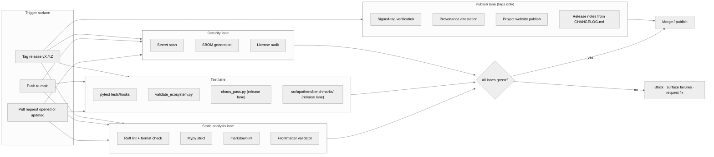

{/* SPDX-License-Identifier: MIT */}

**Apothem エコシステムへのあらゆる変更を門にかける、ビルド · 検証 · 公開
ワークフローの構造マップです。** 本ドキュメントは可視化の表面を設置します。
具体的な GitHub Actions のワークフローファイルとリリースツールは、後に
本番準備のインストールのもとで配置されます。

## パイプラインの形

## レーンの役割

- **静的解析レーン** —— 高速なフィードバック。Ruff は Python のスタイルと
  厳選されたルールセットを扱います。mypy は strict で型の規律を強制します。
  markdownlint はドキュメント表面を取り締まります。frontmatter バリデーターは、
  ルール・スキル・委任されたワーカー・コマンドのアーティファクトスキーマ準拠を
  門にかけます。
- **テストレーン** —— `pytest tests/hooks` はフックランタイムを完全な
  イベントマトリクスに対して走らせます。`validate_ecosystem.py` は
  アーティファクト横断の整合性に対する主要な構造ゲートです。`chaos_pass.py` と
  `src/apothem/benchmarks/` 配下のクラス別ベンチマークスイートは、劣化した入力下
  での退化と実行時予算のリグレッションを捕捉するため、リリースレーンで起動します。
- **セキュリティレーン** —— シークレットスキャンは誤ってコミットされた認証情報を
  捕捉します。SBOM 生成とライセンス監査は、あらゆる本番準備インストールに対して
  サプライチェーンの表面を門にかけます。
- **公開レーン** —— タグ付きリリースのみで実行されます。署名済みタグの検証は
  リリースブランチの来歴を確認します。プロジェクトのウェブサイトは
  `site/dist/` から GitHub Pages のターゲットへ公開されます。リリースノートは
  `CHANGELOG.md` の Keep-A-Changelog 形式から派生します。

## 具体的な構成

実際のワークフローファイル（`.github/workflows/ci.yml`、
`.github/workflows/release.yml` など）は、本番準備エコシステムの構築の際に
インストールされます。この図は、将来のあらゆる構成が反映する正規の形を定義します。

## 権威ある相互参照

- `pyproject.toml` —— Ruff / mypy / pytest 構成の真実の源。
- `scripts/dev/validate_ecosystem.py` —— 主要なアーティファクト横断ゲート。
- `scripts/dev/validate_hooks.py` —— フック固有の構造検証。
- `scripts/dev/chaos_pass.py` —— 構成された各フックへの敵対的スイープ。
- `src/apothem/benchmarks/` —— クラス別の実行時予算検証器。
- `site/content/docs/developer-guide.mdx` —— オペレーター向けの貢献者ワークフロー。
- `CHANGELOG.md` —— リリースノートの源。
