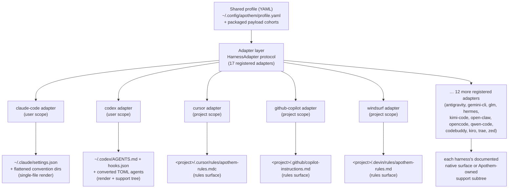

{/* SPDX-License-Identifier: MIT */}

Apothem は、スキーマ検証済みの単一の YAML プロファイルを意味論上の信頼できる情報源として用い、
`HarnessAdapter` プロトコルを実装するアダプタークラスを通じて、各ハーネス固有のインストール面を
すべて派生させます。各アダプターは、そのハーネスがドキュメント化したユーザー位置または
プロジェクト位置に書き込み、そのハーネスに対応するネイティブのプリミティブが存在しない場合に限り、
Apothem 所有のサポートパスを使用します。

## なぜアダプター抽象化なのか

ハーネスはそれぞれ異なる設定方言を話します。あるものは JSON 設定ファイルを求め、
別のものは `.mdc` ルールファイルのディレクトリを求め、3 つめのものは単一の Markdown 指示
ファイルを求めます。もし Apothem がその知識を CLI にハードコードしていたら、各ハーネスは
その前提をコアに漏れ出させてしまい、ハーネスを 1 つ追加するたびに、インストール・更新・
アンインストール・検証のロジックを足並みをそろえて変更しなければならなくなります。

アダプターパターンはそれを反転させます。コアは `HarnessAdapter`
プロトコル — ライフサイクルメソッドからなる小さな契約 — だけを知っています。各ハーネスの方言は、
その契約を実装する 1 つの自己完結したサブパッケージの内部に住みます。コアはアダプターに
*インストール*するよう求めますが、それが JSON
ファイルのレンダリングを意味するのか、ルールディレクトリの書き込みを意味するのか、
サポートツリーの敷設を意味するのかを知りません。新しいハーネスは
プロトコルを満たしてエントリーポイントを登録することで加わります。コアには何の変更も要りません。
これこそ Apothem が
ホスト非依存であり続ける構造的な理由です — その抽象化こそが、ハーネス固有の知識が
広がるのを食い止める境界なのです。

## アダプターの形

アダプターは 2 つの物質化形態に分かれ、どちらもレジストリで確認できます。

- **単一ファイルレンダラー**は、プロファイルのフィールドを 1 つのハーネスネイティブな
  設定ファイルへ変換します。たとえば Claude Code アダプターは、共有プロファイルから常に
  `~/.claude/settings.json` を書き出し、Apothem
  の規約ディレクトリ（`agents/`、`rules/`、`skills/`、…）をその隣に平坦化して配置します。
- **ルール面およびサポートツリーアダプター**は、Apothem のペイロード
  cohort を、そのハーネスがドキュメント化したルール位置へ伝播させ、ネイティブ形式が存在する場合は
  cohort をその形式へ変換し、残りはネイティブアンカーから参照される
  Apothem 所有のサポートサブツリーの下に置きます。Cursor
  アダプターは、与えられたプロジェクトルートへ単一の `.cursor/rules/apothem-rules.mdc`
  を書き込み、ルール面のみを提供します。

ある特定のアダプターは、**ユーザースコープ**（ホームディレクトリの下に書き込む）か、
**プロジェクトスコープ**（`--project <path>` を要求し、そのツリー内部に書き込む）のいずれかで、
レジストリがそのどちらであるかを記録します。

## 現在のアダプタートポロジー



中心から端への扇形展開は、プロジェクト名がエンコードしているアーキテクチャそのものです。
1 つのプロファイルが核にあり、すべてのハーネスがそれぞれのアダプターに沿って等距離の外側にあります。

## プロトコル定義

```python
from pathlib import Path
from typing import Protocol

class HarnessAdapter(Protocol):
    name: str
    output_path: Path

    def install(self, profile: dict[str, object]) -> object:
        ...

    def update(self, profile: dict[str, object]) -> object:
        ...

    def uninstall(self) -> None:
        ...

    def is_installed(self) -> bool:
        ...

    def verify(self) -> bool:
        ...
```

プロジェクトスコープのアダプターは、ライフサイクルメソッドで追加的に `project: Path | None`
を受け取り、`resolve_output_path(project)` を公開してもかまいません。CLI は、メソッドシグネチャが
`--project PATH` を受け取るアダプターにのみ、それを渡します。

## エントリーポイント登録

アダプターは、`apothem.harnesses` という setuptools エントリーポイントグループ経由で登録します。

```toml
[project.entry-points."apothem.harnesses"]
cursor = "apothem.harnesses.cursor:CursorAdapter"
```

`src/apothem/lib/harness_registry.py` にある中央レジストリは、正確に
17 個の公開 ID、エントリーポイント、ドキュメントパス、ターゲットパス、パッケージデータ
要件、能力状態、標準規約ピンのパスを記録します。CLI
は、各コマンドで製品事実を再発見する代わりに、そのレジストリを通じてアダプターをロードします。

## プロファイルからネイティブへのマッピング

各アダプターは、そのハーネスに適した変換ロジックを実装します。

```
YAML profile + payload cohort    Harness-native surface
-----------------------------    ----------------------
identity / preferences       --> native config fields or rendered instruction context
commands/*.md                --> native commands or SKILL.md folders
rules/*.md                   --> native rules where supported, otherwise support trees
hooks/messages/*.md          --> native hooks where supported, otherwise support trees
agents/*.md                  --> native agent formats where supported
skills/*/SKILL.md            --> native skill folders where supported
```

未対応および発見保留中の能力セルは、書き込みの前に構造化された警告になります。
それらは、臆造されたベンダー面へ静かに投影されることはありません。

## 新しいアダプターの追加

ステップバイステップのガイドは、[ハーネスアダプターの作成](/docs/examples/authoring-a-harness-adapter)
を参照してください。
