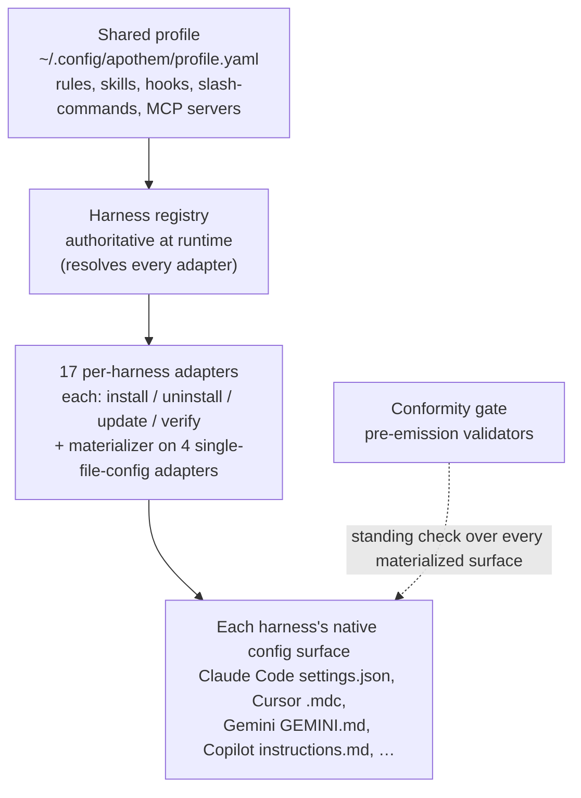

{/* SPDX-License-Identifier: MIT */}

Apothem は 1 つの考え方を中心に構築されています。すなわち、単一の共有ガバナンス
プロファイルを、環境ごとのアダプターによって各環境ランタイムの
ネイティブな設定形式へ物化する、という考え方です。本セクションでは
構造的な構成要素——アダプタープロトコル、プロファイルスキーマ、ソースツリー
レイアウト、そしてそれらを結びつけるインストールワークフロー——を解説します。

## システム概要

ひと目で言えば、Apothem は 1 つのパイプラインです。単一の共有プロファイルが
環境レジストリに渡され、レジストリが環境ごとのアダプターをすべて解決します。
各アダプターはその環境のネイティブな設定面を物化し、常時稼働する適合性ゲートが
物化されたすべての面を検査します。

## ページ

| ページ | 説明 |
|------|-------------|
| [環境アダプター抽象](/docs/architecture/harness-adapter-abstraction) | `HarnessAdapter` プロトコル——アダプターが共有プロファイルをプラットフォーム固有の設定へどのように変換するか。 |
| [共有プロファイルスキーマ](/docs/architecture/shared-profile-schema) | `~/.config/apothem/profile.yaml` または `--profile PATH` にあるスキーマで裏付けられた YAML プロファイル。 |
| [ソースレイアウト](/docs/architecture/source-layout) | Apothem が `src/` レイアウトを使う理由と、ツリーの構成方法。 |
| [インストールワークフロー](/docs/architecture/installation-workflow) | `apothem install`、`update`、`uninstall` がエンドツーエンドでどのように動作するか。 |
| [委譲ワーカー](/docs/architecture/agents) | 本リポジトリ内で動作するマルチワーカーランタイム向けのリポジトリスコープの指示。 |
| [自己完結型ランタイム](/docs/architecture/self-contained-runtime) | Apothem のエンジンが任意のチェックアウトからどのように動くか — 内蔵された依存関係、PYTHONPATH=src の呼び出しモデル、そしてプラグインツリーのブートストラップ。 |
| [依存関係内蔵戦略](/docs/architecture/vendoring-strategy) | Apothem が src/apothem/_vendor/ 配下にどのサードパーティパッケージを内蔵し、どれをシステム前提条件として残すか、そして内蔵されたコピーがどのようにリフレッシュされるか。 |
| [Cohort パッケージング契約](/docs/architecture/cohort-packaging-contract) | Cohort パッケージングとプラグインマニフェストのための、安定した下流消費可能な契約 — マッピングを再導出することなく cohort を列挙し、各ハーネス固有のネイティブターゲットを解決する。 |
| [CI/CD パイプライン図](/docs/architecture/cicd-pipeline) | あらゆるコード変更とリリースを門にかけるビルド・テスト・lint・セキュリティ・公開のワークフロー段階の視覚マップとレーン分解。 |
