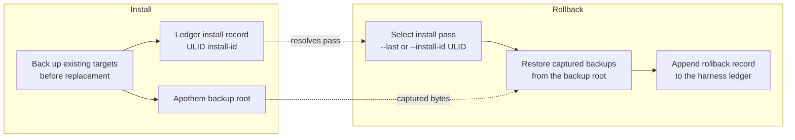

{/* SPDX-License-Identifier: MIT */}

## インストールフロー

```mermaid
flowchart TD
    accTitle: Apothem install workflow
    accDescr: Top-down flowchart of the apothem install command from CLI invocation through adapter lookup, profile load, adapter install call, native config write, and final apothem verify check.
    A[apothem install --harness X] --> B[Resolve adapter through registry]
    B --> C[Load and validate profile YAML<br/>before writes]
    C --> D[Adapter.install(profile, project)]
    D --> E[Write native config and support cohorts]
    E --> F[apothem verify --harness X]
    F --> G{All checks pass?}
    G -- yes --> H[Done]
    G -- no --> I[Report failures]
```

## 更新フロー

`apothem update --harness X` の実行時：

1. `~/.config/apothem/profile.yaml` または `--profile PATH` を読み込んで検証します。
2. 選択した harness または `all` を中央レジストリを通じて解決します。
3. 最初の書き込みの前に、完全な物化計画を検証します。
4. `Adapter.update(profile, project=...)` を呼び出します。
5. 作成済み、更新済み、変更なし、スキップ、警告、エラーの結果を報告します。

## アンインストールフロー

`apothem uninstall --harness X` の実行時：

1. `Adapter.uninstall()` を呼び出します。
2. アダプターは自身が書き込んだファイルのみを削除します。共有プロファイル
   YAML と、無関係なオペレーター作成ファイルには手を付けません。

## スコープ解決

各アダプターは自身の固定インストールルートに書き込みます。ユーザースコープの
アダプターはユーザーホームに、プロジェクトスコープのアダプターはプロジェクト
ローカルに書き込みます。CLI は `--scope` フラグを公開しません。プロジェクト
スコープのアダプターには `--project <path>` が必要です。各書き込み先は
`site/content/docs/harnesses/<harness>.mdx` に文書化されています。

## エラー処理

インストール/更新操作は、書き込み前に検証し、置き換えの前に既存の一致する
ターゲットをバックアップし、共有された発見ディレクトリ内では Apothem が管理する
子エントリのみをマージします。`--dry-run` は同じ検証を実行し、ディレクトリや
ファイルを作成せずに、スキップまたは変更なしの結果を返します。

## Reversibility (backup and rollback)

Every install pass is reversible. Replaced bytes are captured into the Apothem
backup root and the pass is recorded in the harness ledger under a ULID
install id; [`apothem rollback`](/docs/cli-reference/rollback) selects a
recorded pass and restores those captured backups.


