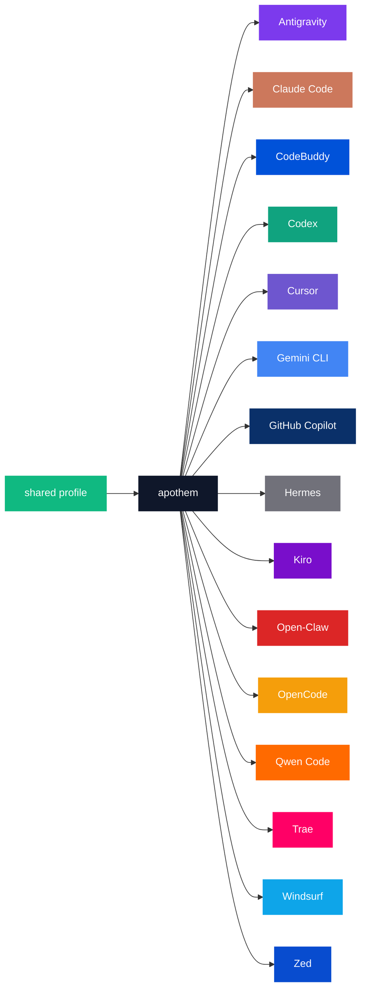

{/* SPDX-License-Identifier: MIT */}

以下の正規のブランド名 × カラーコードの列挙は、パレットのカタログ目的が要求するハーネスごとの逐語的な識別子を保持するため、`text` フェンスで囲まれています。

## Apothem コア

| トークン | ライト | ダーク | 用途 |
|---|---|---|---|
| `apothem-hub` | `#0F172A` | `#F1F5F9` | すべてのアーキテクチャ図における中央配布ノード（「apothem」）であり、Apothem のマークの中央ハブ。 |
| `shared-profile` | `#10B981` | `#34D399` | apothem コアに供給する信頼できる情報源のプロファイル。 |

## ハーネスパレット

17 のハーネスのうち 15 は、その主要なブランドアイデンティティに合わせて着色されています。
残りの 2 つ —— `glm` と `kimi-code` —— にはまだ定義されたブランドカラーがありません。
それらの行は、[更新](#updates)の伝播ステップに従い、上流のブランドカラーが設定され次第
追加されます。

```text
| Token             | Light     | Dark      | Source                                                                                                                                              |
|-------------------|-----------|-----------|-----------------------------------------------------------------------------------------------------------------------------------------------------|
| `antigravity`     | `#7C3AED` | `#9F67FF` | Google Antigravity deep-purple.                                                                                                                     |
| `claude-code`     | `#CC785C` | `#E89378` | Anthropic terracotta-orange.                                                                                                                        |
| `codebuddy`       | `#0052D9` | `#5E8EF7` | Tencent CodeBuddy blue.                                                                                                                             |
| `codex`           | `#10A37F` | `#19C796` | OpenAI signature teal.                                                                                                                              |
| `cursor`          | `#6E56CF` | `#9B85E3` | Cursor brand purple.                                                                                                                                |
| `gemini-cli`      | `#4285F4` | `#6BA4F7` | Google blue (primary); the Apothem mark renders the node with all four Google brand hues `#4285F4` / `#34A853` / `#FBBC04` / `#EA4335`.             |
| `github-copilot`  | `#0A3069` | `#5B8FE3` | GitHub Mona deep-blue.                                                                                                                              |
| `hermes`          | `#71717A` | `#A1A1AA` | Community silver-grey.                                                                                                                              |
| `kiro`            | `#790ECB` | `#A862DD` | Kiro violet.                                                                                                                                        |
| `open-claw`       | `#DC2626` | `#F87171` | Community red-orange.                                                                                                                               |
| `opencode`        | `#F59E0B` | `#FBBF24` | Community amber.                                                                                                                                    |
| `qwen-code`       | `#FF6A00` | `#FF8C40` | Alibaba Qwen orange.                                                                                                                                |
| `trae`            | `#FF0066` | `#FF599C` | ByteDance Trae magenta.                                                                                                                             |
| `windsurf`        | `#0EA5E9` | `#38BDF8` | Windsurf sky-blue.                                                                                                                                  |
| `zed`             | `#084CCF` | `#5E8BE0` | Zed Industries blue.                                                                                                                                |
```

## 命名の根拠

- **`apothem-hub`** — 名前が喚起する幾何学的中心（正多角形の辺心距はその中心へ内向きに指します）。
- **`shared-profile`** — 上流のソースであり、単一のハーネスの色とは区別され、すべての図で「入力」の矢印として読めるようになっています。
- **ハーネスごとのトークン**は、コードベース全体で使用されるハーネスの slug（`harnesses/<slug>/`、エントリーポイントのキー、CLI の `--harness <slug>` 引数）を反映します。概念ごとに 1 つの語、どこでも同じ文字列。

## Mermaid の使用



## アクセシビリティ

すべてのライトモードトークンは、ブランドカラーを歪めずにコントラストが許す範囲で、白色テキストに対して WCAG 2.2 AA のコントラスト（≥4.5 : 1）を満たします。あるハーネスのネイティブなブランドカラーが、それ単独で白色テキストに対して AA のしきい値を下回る場合（特に上に列挙したアンバー／オレンジ系のトークンとスカイブルー／ティール系のトークン）、WCAG AA のテキスト・オン・カラーのコントラストを必要とする図は、白色テキストが鮮明に読めるよう、図の塗りつぶしに**ダークモードのバリアント**（持ち上げた色相）を使用します。ダークモードの列はこの目的のために調整されており、すべてのダークモードトークンは白色テキストに対して AA をクリアします。

## 更新

パレットは、ハーネスが上流でブランド変更を批准したときにのみ更新されます。ハーネスごとのブランド変更は、`site/app/global.css`、このページ、そして `assets/src/` 配下の影響を受けるすべての SVG マスターにわたって原子的に伝播します。
