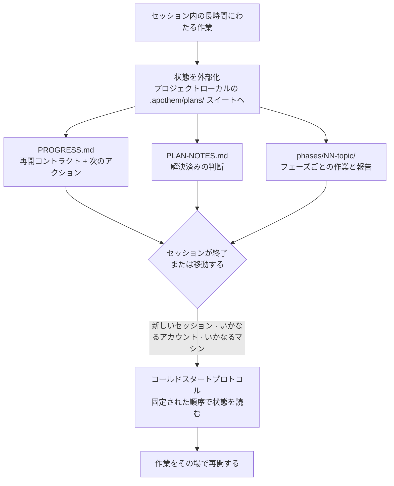

{/* SPDX-License-Identifier: MIT */}

支援を受けたコーディング作業のほとんどは、ひとつの会話の中で生まれ、そして消えていきます。チャットを閉じ、マシンを切り替え、別のアカウントでサインインすると、それまで進めていた作業の文脈は失われます。次のセッションは、すでに下した判断の記憶を持たないまま、ゼロから始まります。

Apothem はこれを反転させます。長時間・多段階の作業については、その**完全な作業状態**をプロジェクトローカルの `.apothem/plans/` スイート（`.plans/` は引き続きサポートされる後方互換フォールバックです）へ外部化します——それらはあなたのリポジトリに置かれるファイルであり、いずれかのクラウドチャット履歴の内側にあるのではありません。状態こそが永続的な成果物であり、セッションは使い捨てです。

## 中心となる考え方

`<project-root>/.apothem/plans/{suite}/` にあるプランスイートは、セッションを置き換え可能にする二つのものを備えています。

- **再開コントラクト。** `PROGRESS.md` は、現在のフェーズとタスクの状態、正確な次のアクション、有効な規約、すでに解決された判断、そして次のセッションが読むべき正確なファイルを記録します。
- **コールドスタートプロトコル。** 新しいセッションはそれらのファイルを固定された順序で読み、いかなる作業に着手する前に全体像を再構築します——会話履歴は不要です。

その状態はあなたのプロジェクトのファイルの中にあるため、同じプロジェクトを指す**いかなるアカウント・マシン**上の新しいセッションも、作業をその場で引き継ぎます。ひとつのチャットの記録の中に閉じ込められるものは何もありません。これこそが、構造化された大規模で複数日にわたる作業——大規模なコーパス、長い移行、大きなレビューの通し作業——を、そうでなければ終わらせてしまう境界を越えて存続させる性質です。

## それが正確には何であるか

保証を明確にするために、正確に述べます。

- **これは**、ファイルへ外部化された状態と、コールドスタートの再開プロトコルです。状態があなたのプロジェクトのファイルの中に存在し、いかなるセッション・アカウント・マシンからも独立しているため、作業は再開されます。
- **これは**、アカウント間の自動同期サービス**ではありません**。Apothem が自らアカウント間でプラン状態をプッシュすることはありません——ファイルは、あなたのプロジェクトのファイルがすでに移動するのと同じ方法で移動します（バージョン管理、共有チェックアウト、同期されたディレクトリ）。Apothem が保証するのは、プロジェクトのファイルがどこに着いても、新しいセッションがそこから再開できるということです。

## なぜこれが重要なのか

作業が長く大きくなるほど、ひとつの会話は重荷になります。複数日にわたる大規模な改修や、大きなコードベースを横断する通し作業は、いかなる単一のセッションよりも長く続きます——コンテキストウィンドウは圧縮され、セッションはタイムアウトし、マシンは変わります。プロジェクト自身のファイルを進行中の作業の信頼できる情報源として扱うことで、Apothem は作業をセッション・アカウント・マシンという三つの境界すべてに対して頑健にします。

## 状態がどこにあるか

| 成果物 | 場所 | 保持するもの |
|----------|----------|-------|
| プランスイート | `<project-root>/.apothem/plans/{suite}/` | 進行中の作業の自己完結したひとつの単位 |
| 再開コントラクト | `<suite>/PROGRESS.md` | フェーズ/タスクの状態、次のアクション、規約、重要ファイルのマニフェスト |
| 判断台帳 | `<suite>/PLAN-NOTES.md` | 解決済みの判断。二度と問われない |
| フェーズごとの作業 | `<suite>/phases/NN-topic/` | そのフェーズのタスクとその報告 |

プランのツリーは Apothem の標準的な `.gitignore` スニペットによってバージョン管理から除外されるため、プラン状態は既定でローカルにとどまります。進行中の作業をマシンやアカウント間で意図的に持ち運ぶには、ほかのプロジェクトファイルを移動するのと同じ方法で `.apothem/plans/` スイートを移動してください。

## 関連

- **[シリアスネスティア](/docs/concepts/seriousness-tiers)** — ガバナンスと状態外部化の規律が取り組みに合わせてどのように調整されるか。
- **[コマンドパイプライン](/docs/pipeline)** — プランスイートを作成し前進させる `/plan` の各ステージ。

## Recommended Next Step

**[シリアスネスティア](/docs/concepts/seriousness-tiers)を読んでください**——外部化の規律が、手早い実験から、複数日にわたって境界を越える取り組みまで、どのように調整されるかがわかります。
