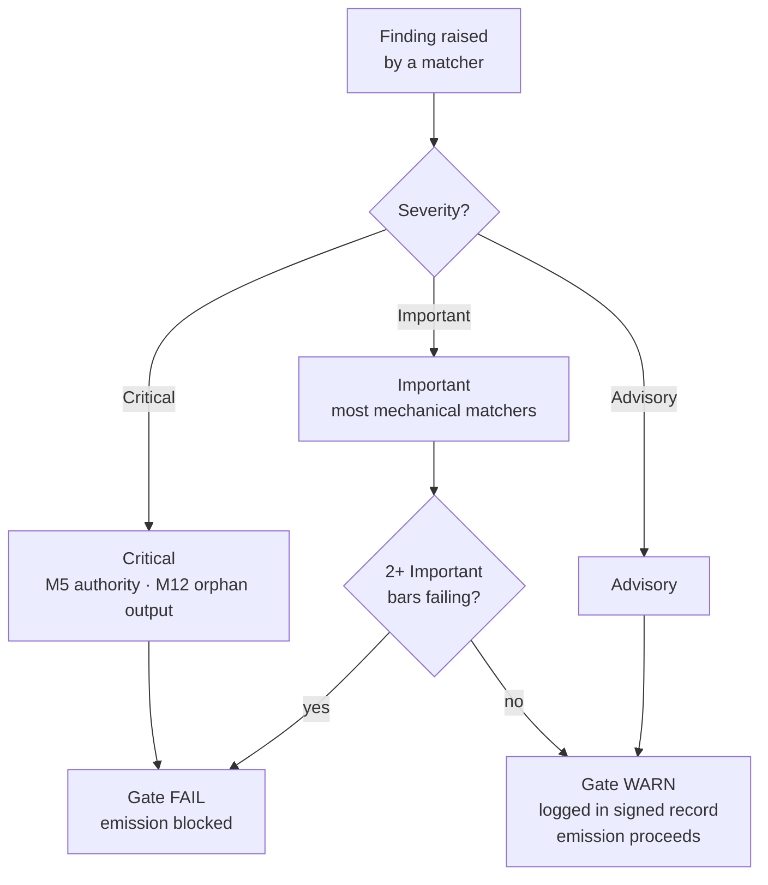

{/* SPDX-License-Identifier: MIT */}

## 十五項目

| 項目 | ID | マンデート | チェック種別 | 失敗 → 行動 |
|---|---|---|---|---|
| 1 | M1 | ホストプロジェクト非依存 | 推論型 | ホストの慣習に合わせて修正する |
| 2 | M2 | 編集規律（開示登録簿） | 機械型 | 開示マーカーを追加する |
| 3 | M3 | 十の品質次元 | 推論型 | 失敗した次元で修正する |
| 4 | M4 | 自己適用（署名済みゲート記録が存在） | 機械型 | 署名済み記録ブロックを記録する |
| 5 | M5 | 権威原則（捏造されたアイデンティティ／エンドポイント／シークレットなし） | 機械型 | 照会へ回す |
| 6 | M6 | 専門知識の取り込み（浮上したギャップ） | 推論型 | ギャップを浮上させ、改良を引用する |
| 7 | M7 | 選択肢注釈（推奨マーカー＋根拠の理由） | 機械型 | 選択肢セットに注釈を付ける |
| 8 | M8 | 確定性（規定的な散文に曖昧化なし） | 機械型 | 曖昧化を条件分岐へ昇格する |
| 9 | M9 | 視覚的レバレッジ（構造的な主題は図を担う） | 推論型 | 図を作成／更新する |
| 10 | M10 | 双方向バインディング（相互的な後方ポインターが閉じている） | 機械型 | ハーフエッジを閉じる |
| 11 | M11 | アジャイルスプリント（目標／バックログ／DoR／DoD／レビュー／レトロスペクティブ） | 推論型 | スプリントとして再構成する |
| 12 | M12 | フェーズ報告と正規レイアウト | 機械型 | 集約を作成し、正規レイアウトへ移動する |
| 13 | M13 | コード技巧（リンター／フォーマッター／型チェック；マジックナンバー；bare-except） | 機械型 | 言語ごとのコード技巧ルールに従って修正する |
| 14 | M14 | 体系性（上流／下流／同位／強制者を宣言する） | 推論型 | 宣言し、登録簿でインデックス化する |
| 15 | M15 | 本番対応（テスト＋ドキュメント＋CHANGELOG＋準拠コミット＋CI グリーン＋semver 安定性） | 機械型 | 欠けている面を追加する |

## 重大度の階梯

| 重大度 | ゲートへの影響 |
|---|---|
| **クリティカル** | ゲート FAIL——無条件に発行をブロック |
| **重要** | 重要項目が 2 つ以上同時に失敗したときゲート FAIL |
| **助言的** | ゲート WARN——署名済み記録に記録される；発行をブロックしない |

機械的部分のマッチャーのほとんどは既定で**重要**です。M5（権威——シークレット、捏造されたエンドポイント）と M12（孤児出力）は**クリティカル**です。



## 機械的部分のマッチャー

機械的部分は [`src/apothem/conformity/*_grep.py`](https://github.com/ahmed-g-gad/apothem/tree/main/src/apothem/conformity) に存在し、[`src/apothem/conformity/gate.py`](https://github.com/ahmed-g-gad/apothem/blob/main/src/apothem/conformity/gate.py) によってオーケストレーションされます。

| マッチャー | 項目 | 機能 |
|---|---|---|
| `hedging_grep.py` | M8 | 規定的な散文の曖昧な語彙を検出する |
| `option_annotation_grep.py` | M7 | 選択肢セット上の `**Recommended**` マーカー＋根拠の理由を検証する |
| `user_confirm_grep.py` | M5 | `<USER-CONFIRM:…>` プレースホルダーの発行をブロックする |
| `binding_reciprocity_grep.py` | M10 | `## Bindings (§0.j five-direction)` のハーフエッジを検出する |
| `orphan_output_grep.py` | M12 | 消費者なし／インデックスエントリなし／生成者帰属なしの成果物にフラグを立てる |
| `bare_except_grep.py` | M13 | 正当化コメントのない `except:` ／ `except Exception:` を検出する |
| `magic_number_grep.py` | M13 | ビジネスロジック中の数値リテラルを検出する |
| `commented_out_code_grep.py` | M13 | コメントアウトされたコードブロックを検出する |
| `file_header_grep.py` | M13 | 単一行 SPDX ライセンスヘッダーの存在を検証する |
| `frontmatter_grep.py` | M14 | 下記の四つの正規ディレクティブディレクトリ上の必須フロントマターフィールドを検証する |
| `semver_stability_grep.py` | M15 | MAJOR バージョン引き上げのない破壊的な公開 API 変更を検出する |
| `production_ready_pr_grep.py` | M15 | 同一変更セット規律（テスト＋ドキュメント＋CHANGELOG）を検証する |
| `secret_leak_grep.py` | M15 | ハードコードされたシークレット／資格情報を検出する |
| `unpinned_action_grep.py` | M15 | GitHub Actions が commit SHA に固定されていることを検証する |
| `always_on_budget_grep.py` | 予算上限 | 常時オンルール本体を 500 の実質的な token に制限する |

## ゲートの実行

インストール済みの harness では、ゲートは自動的に実行されます。Claude Code の
`settings.json` がこれを `PreToolUse` フックとして配線し、各 Write/Edit の前に
`~/.claude/.apothem/support/conformity/gate.py` の物化されたコピーを呼び出します。
ソースチェックアウトからは、モジュール形式が同じコードを駆動します。

```shell
# 単一ファイルディスパッチ（PreToolUse フックを模倣）：
echo '{"tool_input": {"file_path": "path/to/file", "content": "..."}}' \
    | python -m apothem.conformity.gate --hook

# リポジトリ全体にわたる複合スイープ：
python -m apothem.conformity.gate --sweep src/ site/content/docs/ rules/
```

完全な手順は[コンフォーマンスゲートの実行](/docs/usage/conformity-gate)を参照してください。

## リファレンス

- [事前発行ゲート登録簿](/docs/governance/pre-emission-gate-registry)——正規の項目定義
- [対外コンフォーマンス登録簿](/docs/governance/outward-conformity-registry)——M1-M15 の詳細なセマンティクス
- [横断的マンデート](/docs/governance/cross-cutting-mandates)——マンデートの真実の源
- [パフォーマンス規律](https://github.com/ahmed-g-gad/apothem/blob/main/src/apothem/rules/performance-discipline.md)——クラスごとの実行時予算
