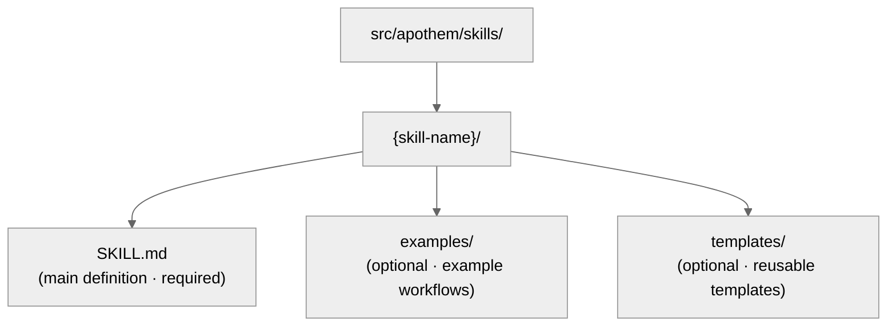

{/* SPDX-License-Identifier: MIT */}

このガイドは、開発者が SOTA 品質基準で Apothem エコシステムを保守・拡張する
ことを支援します。

## クイックリファレンス: アーティファクトの種類

Apothem エコシステムには 5 つのアーティファクトの種類があり、それぞれ
固有の目的とフロントマターの要件を持ちます。

| アーティファクト | パス | 目的 | 作成する時機 |
| -------- | ---- | ------- | -------------- |
| **ルール** | `src/apothem/rules/*.md` | 振る舞いに関するマンデートまたは運用上の指令 | 新しい原則、ポリシー、ガバナンスマンデートが確立されたとき |
| **コマンド** | `src/apothem/commands/*.md` | 複雑なワークフロー向けのスラッシュコマンド(`/command-name`) | 新しい複数手順のユーザーワークフロー |
| **ヘルパー** | ヘルパーディレクトリ(ファイルごとに `*.md`) | 並行タスク向けの永続的な委任ワーカー定義 | 新しい繰り返しの専門タスク(監査、探索、品質チェック) |
| **スキル** | `src/apothem/skills/{name}/SKILL.md` | 検出シグナルを伴う再利用可能な手法 | 新しい検出可能で再利用可能な手法パターン |
| **フック** | `src/apothem/hooks/` + `settings.json` | イベント駆動の検証または状態管理 | 新しいライフサイクルイベントまたは検証ニーズ |

## ハーネスアダプターの契約

ハーネスのアイデンティティと能力に関する事実は
`src/apothem/lib/harness_registry.py` にあります。ハーネスの変更は、
これらの面が合致して初めて完了します:

| 面 | 必要な更新 |
| --- | --- |
| レジストリの行 | 公開 ID、パッケージキー、エントリーポイント、スコープ、出力形式、ターゲットパス、ドキュメントパス、能力ファイル、標準ピン、フィクスチャテスト、package-data キー、テンプレートソース、能力ステータス。 |
| アダプターパッケージ | `__init__.py`、`install.py`、`update.py`、`uninstall.py`、`verify.py`。`materializer.py` はハーネスがネイティブ構成ファイルをレンダリングする場合にのみ追加。 |
| 伝播マニフェスト | マニフェスト裏付けのアダプター向けのテンプレートおよびコホートパス。 |
| 能力 | `src/apothem/harnesses/<package>/capabilities.yml` に、必須の各能力、ならびにサポートされていない状態や discovery-pending 状態の根拠を記載。 |
| 規約ピン | `STANDARD-CONVENTION-PIN.md` に、ベンダー URL、スナップショット日付、正規ファイル名/スキーマ、根拠の参照、サポートされていない能力の根拠を記載。 |
| テスト | レジストリのパリティ、アダプターのフィクスチャテスト、ゴールデン install-plan の行、dry-run/書き込みなしの挙動、冪等性、package-data のカバレッジ。 |
| ドキュメント | ハーネスのリファレンスページ、比較ページ、能力/MCP に関する注記、偽のプレースホルダーを使用した例。 |

プロジェクトスコープのアダプターは `requires_project = True` を設定し、
ライフサイクルメソッドで `project: Path | None` を受け取り、書き込みの前に
存在しないか安全でないプロジェクトルートを拒否しなければなりません。
ユーザースコープのアダプターは、パスをハーネスが文書化しているユーザー
構成ルート配下に保たなければなりません。

## ゴールデンフィクスチャのポリシー

`tests/fixtures/harness-golden-plans.json` は、17 のレジストリハーネス
すべてについて公開 install-plan の形 —— 公開 ID、マテリアライズモード、
ソースのコホート/テンプレートパス、`<ROOT>` 配下に正規化されたターゲット
パス —— を記録します。レジストリ、マニフェスト、またはテンプレートの
ターゲット挙動が意図的に変わる場合は、差分が挙動の変化を示すよう、ソースの
変更と同じコミットでゴールデンフィクスチャを更新してください。

## 書き込み前の検証

共有のインストールドライバーは、最初の書き込みの前にすべてのソースと
ターゲットを検証します。存在しないマニフェストソース、ターゲットのトラバーサル、
選択したルート外のターゲットパス、シンボリックリンクの越境を拒否します。
dry-run も同じ検証を実行し、ファイルを作成することなく構造化された
`skipped` または `unchanged` の結果を返します。

## 編集除去とサンプルデータ

プロファイル診断は、token、secret、password、credential、API key、
private key、authorization、auth、および header 形のフィールドを編集除去します。
ドキュメント、フィクスチャ、例、JSON スニペットでは、本物らしいシークレットや
個人アカウントの代わりに `example.invalid`、`Example User`、`example-user`、
そして明白なプレースホルダーを使用します。

## 書き始める前に: 正規スキーマ

**すべてのアーティファクトは `site/content/docs/reference/artifact-schema.mdx` の
スキーマに従わなければなりません。** これは交渉の余地がありません。

- お使いのアーティファクトの種類について `site/content/docs/reference/artifact-schema.mdx` の §「Schema」を読む
- 必須フィールドをコピーする
- 必須の値を埋める
- 必要に応じて任意フィールドを追加する

## フロントマターのクイックチェック

すべてのアーティファクトのフロントマターは、これらのチェックを通過しなければ
なりません:

```yaml
✓ Valid YAML syntax (use tools: `yamllint` or PowerShell `ConvertFrom-Yaml` where available)
✓ All mandatory fields present (per schema for artifact type)
✓ name: uses kebab-case
✓ version: semantic MAJOR.MINOR.PATCH
✓ updated: ISO 8601 date (YYYY-MM-DD)
✓ description: single-line, non-empty
✓ scope: valid enum (always-on|path-filtered|other)
✓ portability: valid enum (`universal` | `universal-with-windows-caveats` | `unix-only` | `windows-only`)
✓ No typos in field names — must match canonical schema exactly
✓ Optional fields use correct enum values
```

## 命名規約

### アーティファクト名(kebab-case)

- **ルール:** `operational-mandates`、`clean-room-generation`、`context-management`
- **コマンド:** `plan-execute`、`plan-spec`、`plan-generate`
- **ヘルパー:** `codebase-explorer`、`convention-auditor`、`quality-gate`
- **スキル:** `plan-suite`、`ecosystem-audit`

パターン: 小文字、単語間はハイフン、スペースやアンダースコアは使わない。

### ファイルの命名

- **ルール:** `{name}.md`
- **コマンド:** `{name}.md`
- **ヘルパー:** `{name}.md`
- **スキル:** フォルダ内 `src/apothem/skills/{name}/SKILL.md`(大文字小文字は厳密に `SKILL.md`)
- **フック:** フォルダ `src/apothem/hooks/` 内。すべてのイベントハンドラーは
  Python です。すべての `settings.json` フックコマンドは exec 形式
  (`python` と `args`)を使用して `-m apothem.hooks.dispatch <event> [<message-name>]`
  または `-m apothem.conformity.gate --hook` を呼び出します。`dispatch.py` は
  `SessionStart` を `session_start_bootstrap.main()` へ、それ以外の許可された
  すべてのイベントを `emit_hook_context.main()` へルーティングします。
  `src/apothem/hooks/` または `scripts/` 配下で許可される唯一のシェルスタブは、
  4 つのロケーター + ブートストラップファイル(`find-python.{ps1,sh}`、
  `bootstrap.{ps1,sh}`)です。それ以外の `.ps1` / `.sh` ファイルは
  `scripts/dev/validate_hooks.py` の衛生チェックで失敗します。

### 相互参照

他のアーティファクトを参照する際は、正確な名前を使用します:

- ルール: `"operational-mandates"`(name フィールドの値)
- コマンド: `/plan-execute`(人間向けドキュメントではスラッシュ付き。コード内ではスラッシュなし)
- ヘルパー: `codebase-explorer`(name フィールドの値)
- スキル: `plan-suite`(name フィールドの値)

散文の中でファイルパスや省略名を使ってはいけません。

## ポータビリティ: Windows と Unix

すべてのアーティファクトは、そのポータビリティステータスを明示的に
宣言しなければなりません。

### ユニバーサル(デフォルト)

- Windows、macOS、Linux で同一に動作する
- シェルに関する前提がない
- パスにスラッシュ(`/`)を使用する
- ハードコードされた絶対パスがない
- Windows 固有の PowerShell 構文がない

```yaml
portability: "universal"
```

### Windows 注意点付きのユニバーサル

- POSIX ホスト全体でユニバーサルだが、コンテンツで宣言された Windows プラットフォームのバリアントには、名指しされた注意点が適用される
- 注意点をコンテンツ内に明示的に文書化する
- 例: 「シンボリックリンクは Win 10 より前の Windows ではサポートされない」

```yaml
portability: "universal-with-windows-caveats"
```

注意点はタイトル直後の注記に文書化します。

### Unix 専用 / Windows 専用

- 明示的に一つのプラットフォームに制限される
- Apothem では稀 —— ほとんどはユニバーサルであるべき
- プラットフォーム固有の機能が不可欠な場合にのみ使用する

```yaml
portability: "unix-only"
```

理由をルールの最初のセクションに文書化します。

## スコープ: 常時オン と パスフィルター

### 常時オン(Always-On)

ルールがどこでも適用される。

```yaml
scope: "always-on"
```

### パスフィルター(Path-Filtered)

ファイルパスに基づいて条件付きでルールが適用される。

```yaml
scope: "path-filtered"
pathFilter: "**/*.py, **/*.toml"
```

`pathFilter` は glob パターン(`.gitignore` と同じ形式)を使用します。
ファイルがフィルターに一致すると、ルールが有効化されます。

## バージョンのセマンティクス

すべてのアーティファクトは独自のセマンティックバージョン
(`MAJOR.MINOR.PATCH`)を持ちます:

- **PATCH** —— 誤字修正、整形、リンク更新、コメントのみの編集。挙動は変わらない。
- **MINOR** —— 追加的で非破壊的な変更: 新しい任意セクション、追加のアンチパターン、新しい任意フロントマターフィールド、新しい例。既存の利用者は変更なしで動作し続ける。
- **MAJOR** —— 破壊的なスキーマまたは契約の変更: 削除されたセクション、名前が変わったフィールド、既存の指令の挙動の変更、下流アーティファクトの適応を要する変更。

例:

- `vX.Y.Z` → `vX.Y.(Z+1)`(PATCH: 誤字修正)
- `vX.Y.Z` → `vX.(Y+1).0`(MINOR: 新しいアンチパターンの項目を追加)
- `vX.Y.Z` → `v(X+1).0.0`(MAJOR: 契約を安定版と宣言)
- `vX.Y.Z` → `v(X+1).0.0`(MAJOR: 必須フロントマターフィールドを削除)

挙動を変える編集のたびに `version` と `updated` を一緒に更新します。
アーティファクトの変更を束ねるリリースについては、エコシステムレベルの
`CHANGELOG.md` に対応する行を追加します。

## アーティファクトを編集する時機

### ルール

- 必須/任意の構造を負荷を担うものとして扱う —— それを再構成すると、
  依存するすべてのアーティファクトに波及する(MAJOR の引き上げが必要)。
- 理解が深まるにつれて、アンチパターン、重大度スケーリングの例、引用を
  洗練する(MINOR の引き上げ)。
- いかなる構造変更の根拠も、該当するメモリトピックファイルに記録する。

### コマンド

- 引数の形は公開契約の一部 —— 明示的な意図がある場合にのみ破壊し、その
  変更をすべての呼び出し元に伝播する(MAJOR の引き上げ)。
- ワークフローの手順と返却契約を簡潔かつ最新に保つ。
- 自明でない手順の順序付けはインラインで文書化する。

### ヘルパー

- `disallowedTools` は最小限かつ十分に保ち、変更時にはその根拠を文書化する。
- ヘルパーの役割が成熟するにつれて、運用原則と返却契約を洗練する(MINOR の引き上げ)。
- 呼び出し元が期待値を再調整できるよう、能力の変化をインラインで追跡する。

### スキル

- 手順の各ステップと例を現実と同期させ続ける。
- 検出シグナルは、現在の利用における実際のユーザーの言い回しを反映しなければならない。
- スキルが約 150 行を超えたら分割する(`auto-memory.md` の §トピックファイル管理を参照)。

## 手順を追って: 新しいルールの追加

### 1. 直交性の評価

このルールは既存のルールと重複するか。関連する内容について
`src/apothem/rules/` を検索します。

重複が 50% を超える場合は、代わりに既存のルールを拡張することを検討します。
`persistent-conventions-vigilance.md` の §アーティファクトの進化を参照してください。

### 2. 内容を書く

次の構造に従います:

- タイトル: `# Rule: {Title}`
- Purpose セクション
- Obligations / 中核となる指令(番号付き、リンク付き)
- 重大度スケーリングの表(常に必須)
- Anti-Patterns セクション
- Enforcement セクション

### 3. フロントマターを作成する

`site/content/docs/reference/artifact-schema.mdx` の § Schema: Rules の
スキーマを使用します。次を設定します:

- `name:` kebab-case の識別子
- `version:` `"X.Y.Z"`(初期値)
- `updated:` ISO 8601 の今日の日付
- `scope:` `always-on` または `path-filtered`
- `portability:` `universal`(必要なら注意点付き)
- `implements:` このルールが扱う CM/TM/CP マンデートを列挙

例:

```yaml
---
name: "my-new-rule"
description: "Brief one-liner"
pathFilter: ""
alwaysApply: true
---
```

### 4. CLAUDE.md を更新する

`§7.2 Rules` レジストリ表にエントリを追加します:

```markdown
| My New Rule | `src/apothem/rules/my-new-rule.md` | Always-on | CM-5/CM-21 |
```

表内のアルファベット順を保ちます。

### 5. CHANGELOG.md に追記する

新しいルールを説明する行を、次のリリースの `### Added` セクションの下に
追加します。

### 6. 検証を実行する

`ecosystem-audit` スキルを起動して新しいルールを検証し、ルール領域に
焦点を当てます:

```text
Invoke the ecosystem-audit skill with --focus rules --fix
```

新しいルールについてエラーが報告されないことを確認します。

## 手順を追って: 新しいコマンドの追加

コマンドは `/plan-spec`、`/plan-execute`、`/security-audit` などの
スラッシュコマンドです。

### 1. 役割を決める

コマンドは、ハーネスのランタイムが単独で呼び出すことを
**決して** 意図していません。それらはユーザーが起動するワークフローです。
次を問います:

- これはユーザーが `/command-name` と入力するワークフローか。
- 複数の手順をオーケストレーションするか。
- タイムアウトしたり、実行の途中でユーザー入力を要したりする可能性があるか。

これらのいずれかが「いいえ」なら、それはおそらくコマンドではなくスキルです。

### 2. ファイルを作成する

パス: `src/apothem/commands/{name}.md`

フロントマター(`site/content/docs/reference/artifact-schema.mdx` の
§ Schema: Commands より):

```yaml
---
name: "my-command"
version: "X.Y.Z"
updated: "2026-04-20"
description: "What this command does"
argument-hint: "[path/to/input] [--flag VALUE]"
disable-model-invocation: true
portability: "universal"
allowed-tools: "Read, Glob, Grep"
---
```

コマンドには常に `disable-model-invocation: true` を設定します。

### 3. 内容を書く

構造:

- タイトル: `# /{name} — Human-Readable Title`
- Role セクション(誰がこれを実行するか)
- 概要レベルの指示
- 手順を伴う Workflow セクション
- 返却契約 / 出力形式

### 4. CLAUDE.md と CHANGELOG.md を更新する

`§7.1 Commands` のレジストリ行。CHANGELOG の行は次のリリースの
`### Added` セクションの下。

### 5. 検証する

`ecosystem-audit` スキルを起動し、コマンドに焦点を当てます:

```text
Invoke the ecosystem-audit skill with --focus commands --fix
```

## 手順を追って: 新しいヘルパーの追加

ヘルパーは並行作業向けの永続的な委任ワーカー定義です。

### 1. パターンを特定する

このヘルパーは以下に挙げるチームパターンのいずれかに当てはまるか。

- Research Team: 読み取り専用、情報収集
- Audit Team: 検証、一貫性チェック
- Implementation Team: 並行コード変更
- Quality Team: リント、テスト、型チェック、セキュリティ
- Documentation Team: ドキュメント更新
- その他: 専門タスク

### 2. ファイルを作成する

パス:

```text
src/apothem/agents/{name}.md
```

フロントマター:

```yaml
---
name: "my-helper"
version: "X.Y.Z"
updated: "2026-04-20"
description: "What this helper specializes in"
tools: "Read, Glob, Grep, Bash"
disallowedTools: "Write, Edit"
maxTurns: 15
effort: "high"
permissionMode: "default"
memory: false
portability: "universal"
---
```

### 3. 内容を書く

セクション:

- Operating Principles(読み取り専用、証拠ベース、二択の評定、網羅的)
- Workflow(番号付きの手順)
- Return Contract(最大トークン数、構造、必須フィールド)

### 4. CLAUDE.md と CHANGELOG.md を更新する

`§7.3 Helpers` のレジストリ行。CHANGELOG の行は次のリリースの
`### Added` セクションの下。

### 5. テストする

ヘルパーを実際のシナリオに投入し、文書化どおりに動作することを確認します。

## 手順を追って: 新しいスキルの追加

スキルは再利用可能で検出可能な手法です。

### 1. 再利用性を見極める

スキルを書く前に:

- この問題/手法を 3 回以上見たことがあるか。
- それは検出可能か。(ユーザーのリクエストのパターンがそれを合図するか。)
- それを再現可能な形で体系化できるか。

3 つすべてが「はい」なら、スキルを書きます。

### 2. 構造を作る



### 3. SKILL.md を書く

フロントマター:

```yaml
---
name: "skill-name"
version: "X.Y.Z"
updated: "2026-04-20"
description: "What this skill teaches"
archetype: "workflow-template"
userInvocable: true | false
disable-model-invocation: true | false
allowed-tools: "Read, Glob, Grep"
argument-hint: "[args]"               # optional; if userInvocable
---
```

内容の構造:

- Purpose
- When to Use This Skill
- Prerequisites
- Step-by-Step Procedure
- Common Mistakes
- Examples

### 4. CLAUDE.md と CHANGELOG.md を更新する

`§7.5 Skills` のレジストリ行。CHANGELOG の行は次のリリースの
`### Added` セクションの下。

### 5. 検証する

`ecosystem-audit` スキルを起動し、スキルに焦点を当てます:

```text
Invoke the ecosystem-audit skill with --focus skills --fix
```

## コミット前の検証チェックリスト

- [ ] フロントマターが YAML 構文チェックを通る
- [ ] スキーマに従って必須フィールドがすべて存在する
- [ ] `name` フィールドが kebab-case を使用している
- [ ] `version` がセマンティック(`MAJOR.MINOR.PATCH`)であり、挙動が変わった場合は引き上げられている
- [ ] 触れたアーティファクトについて `updated` が今日の日付と一致している
- [ ] `portability` フィールドが設定され、妥当である
- [ ] CHANGELOG.md が、変更を次のリリースのセクション下の適切なカテゴリに記載している
- [ ] プラン内部参照がない(CM-7 への準拠)
- [ ] 相互参照が他のアーティファクトと一貫している
- [ ] 新しいアーティファクトが CLAUDE.md レジストリに登録されている
- [ ] アーティファクトがテストされている(該当する場合)
- [ ] `ecosystem-audit` スキルがエラーなしで実行される
- [ ] 内容が構造上の規約(タイトル形式、セクションなど)に従っている

## 他のアーティファクトの参照

これらの正確な規約を使用します:

### ルールを参照する

```markdown
See `src/apothem/rules/operational-mandates.md` or shorthand: the Operational Mandates rule.
In prose: ... per CM-1–10 (Operational Mandates rule) ...
```

### コマンドを参照する

```markdown
See `/plan-execute` command. Or: Run `/plan-execute`.
In prose: The `/plan-execute` command handles phase execution.
```

### ヘルパーを参照する

```markdown
Deploy the `codebase-explorer` delegated worker.
In prose: The codebase-explorer worker finds patterns.
```

### スキルを参照する

```markdown
Use the `plan-suite` skill.
In prose: The plan-suite skill provides the Master Plan Suite template.
```

### CLAUDE.md のセクションを参照する

```markdown
See CLAUDE.md § 7.2 (Rules registry).
Or: Section 4 (Seriousness-Scaled Governance).
```

## リントと整形

すべてのアーティファクトは次を使用します:

- **Markdown:** GFM(GitHub Flavored Markdown)
- **YAML:** YAML 1.2 準拠
- **改行コード:** LF(Unix スタイル)
- **エンコーディング:** UTF-8
- **行幅:** コンテンツは 100 文字でのソフトラップ(ハードな改行なし)

Python ファイルには `Ruff` フォーマッター / リンターを使用します。Markdown には
`prettier` または同等のものを使用します。

## エコシステム監査: 検証の実行

2 つの補完的な検証面がエコシステムをカバーします:

**機械チェック可能(Python バリデーター)** —— すべてのコミット前に実行:

```bash
python scripts/dev/validate_hooks.py       # Hook structure + Python-only hygiene
python scripts/dev/validate_ecosystem.py   # Full tree + frontmatter + delegated hook checks
python scripts/dev/chaos_pass.py           # Adversarial sweep across configured hooks
pytest tests                                    # Unit tests for the hook runtime
```

**ハーネス駆動** —— 相互参照、ナラティブ、規約の監査向け:

```bash
/ecosystem-audit --focus all --fix
```

これは並行して実行されます:

- **構造監査:** レジストリの正確さ、ファイルの存在、フロントマターの妥当性
- **アーティファクト監査:** 相互参照、マンデートのカバレッジ、パイプラインの順序付け
- **メモリ監査:** メモリファイルの主張とファイルシステムの状態の対比

期待される出力: 両方の面から所見ゼロの `PASS`。

`FINDINGS` が報告された場合:

- 各所見の重大度(Critical / Important / Advisory)を確認する
- Critical 項目は直ちに対処する
- Important 項目は次のサイクルに計画する
- Advisory 項目は次の反復で検討する

---

## 質問は?

次を参照してください:

- フロントマタースキーマ: `site/content/docs/reference/artifact-schema.mdx`
- アーティファクトのライフサイクル: `src/apothem/rules/persistent-conventions-vigilance.md` の §アーティファクトの進化
- 運用マンデート: `src/apothem/rules/operational-mandates.md` の CM-1–10
- プランスイートのリファレンス: `src/apothem/skills/plan-suite/master-template.md`
- リリースノート: `CHANGELOG.md`
