{/* SPDX-License-Identifier: MIT */}

이것은 다중 작업자 하니스(오케스트레이션 플랫폼, 디스패처, 자율 하니스
플랫폼)가 이 저장소에서 작동할 때의 저장소 범위 지시입니다. 이 지시는 필수이며 게시되는 모든
체크아웃에 함께 제공됩니다. 이 지시는
[`AGENTS.md`](https://github.com/ahmed-g-gad/apothem/blob/main/AGENTS.md),
[`CLAUDE.md`](https://github.com/ahmed-g-gad/apothem/blob/main/CLAUDE.md),
그리고 다른 지원 하니스 표면을 위한 프로젝트 범위 지시와 일관됩니다. 이 표면들이
공유된 규율(플랜 규율, 파일 헤더, 모호성 처리, 명명, 안티패턴, 모달 계층)에서 겹치는 경우,
그것들은 의미상 동등하며 `AGENTS.md`가 정규 프로젝트 보이스입니다.

## 프로젝트 맥락

이 저장소는 하니스의 구성을 호스팅하는 개발자 도구 생태계입니다. 위임 작업자,
슬래시 명령, 스킬, 훅, 출력 스타일, 상태 줄, MCP 통합, 설정, JSON 스키마, 검증기, 테스트,
문서를 포함합니다. 단일 작성자가 유지 관리합니다. 디스크상의 레이아웃은 런타임 레이아웃을
정확히 반영합니다. 이 저장소의 위임 작업자는 게시된 트리 외부에 상태를 저장하지 않습니다.
게시된 트리가 정규 아티팩트입니다.

## 작업자 규약

이 저장소의 다중 작업자 실행은 세 가지 규약을 따릅니다:

- **역할에는 이름이 있다.** 다중 작업자 실행의 모든 위임 작업자는 역할 식별자(kebab-case,
  서술적: `codebase-explorer`, `convention-auditor`, `quality-gate`,
  `memory-auditor`)를 가집니다. 일반적인 역할 이름(`worker`, `helper`)은 금지됩니다.
- **반환 계약은 명시적이다.** 모든 작업자 호출은 기대되는 반환 형태——구조화된 요약, 최대 토큰
  예산, 필수 필드, 실패 모드 표현——를 지정합니다. 디스패처는 잘못된 형식의 반환을 조용히
  다시 프롬프트하지 않고 거부합니다.
- **공유 상태는 파일 시스템이다.** 위임 작업자는 디스패치 경계를 넘어 메모리를 공유하지
  않습니다. 두 작업자가 필요로 하는 상태는 게시된 트리 아래의 명명된 파일(또는 진행 중인 작업
  상태의 경우 *플랜 규율* 에 따라 프로젝트의 `.apothem/plans/` 디렉터리)을 통해 흐릅니다.
  {/* [Machine-seeded — pending review] */}
  (정규 플랜 디렉터리이며, 레거시 `.plans/` 트리는 `apothem migrate-workspace`
  로 마이그레이션됩니다.)

작업자의 작업이 여러 단계로 이루어질 때, 작업자의 작업 추적은 *플랜 규율* 에 따라
`<project-root>/.apothem/plans/YYYY-MM-DD--<slug>.md`에 기록됩니다. 디스패처는 그 플랜을 읽어 하류
작업자를 조율합니다. 플랜은 결코 git에 커밋되지 않습니다.

## 파일 헤더

어시스턴트가 생성하는 모든 해당 신규 파일은, 파일 타입에 일치하는 변형으로
[`site/content/docs/reference/authorship-header.mdx`](/docs/reference/authorship-header)
에 따른 정규 단일 행 SPDX 라이선스 헤더로 시작 **해야 합니다(MUST)**. 바이트 단위로 정확한
헤더 픽스처는
[`src/apothem/schemas/authorship-header.txt`](https://github.com/ahmed-g-gad/apothem/blob/main/src/apothem/schemas/authorship-header.txt)
에 있습니다.

헤더를 추가하려면, 어시스턴트는 정규 인젝터를 호출합니다:

```bash
python scripts/inject-header.py --mode fix-in-place <path>
```

인젝터는 멱등적이며 경로로부터 변형을 감지합니다. 헤더는
[`src/apothem/schemas/header-exceptions.txt`](https://github.com/ahmed-g-gad/apothem/blob/main/src/apothem/schemas/header-exceptions.txt)
에 열거된 클래스에 대해서는 **면제**됩니다 —— LICENSE, JSON 파일, 잠금 파일, 생성된 파일,
vendored 콘텐츠, `.audit/` 임시 파일, `<project-root>/.apothem/plans/` 임시 파일, 빈 마커, 바이너리.

## 플랜 규율

어시스턴트는 하니스 구성 디렉터리나 다른 모든 전역 플랜 위치에 쓰는 코드, 스크립트, 또는
산문을 생성 **해서는 안 됩니다(MUST NOT)**. 계획 아티팩트 —— 다중 작업자 조율 플랜,
리팩터링 전략, 디버깅 저널, 탐색 노트 —— 는 `<project-root>/.apothem/plans/` 에만 존재합니다.
{/* [Machine-seeded — pending review] */}
(정규 플랜 디렉터리이며, 레거시 `<project-root>/.plans/` 트리는 `apothem migrate-workspace`
로 마이그레이션됩니다)

`<project-root>/.apothem/plans/` 디렉터리(그리고 레거시 `<project-root>/.plans/`)는
[`site/content/docs/reference/plans-discipline.mdx`](/docs/reference/plans-discipline)
에 문서화된 정규 `.gitignore` 스니펫에 따라 **gitignore** 됩니다.
{/* [Machine-seeded — pending review] */} 플랜은 프로젝트의 git
히스토리에 **결코 커밋되어서는 안 됩니다(MUST NEVER)**. 플랜은 생명 주기 상태
**draft → in-progress → converged**(ADR로 승격) **→ abandoned / superseded** 를 거치며,
각 플랜의 frontmatter `status:` 필드에 기록됩니다. 플랜 파일 이름은

```mermaid
%% provenance: hand-authored %%
%% verified: 2026-07-06 %%
%% cross-reference: the plan status: lifecycle described above; CLAUDE.md Plans Discipline %%
stateDiagram-v2
    accTitle: Apothem plan lifecycle states
    accDescr: A plan's frontmatter status field moves from draft to in-progress to converged, where a converged plan is promoted to an ADR. From draft or in-progress a plan may instead be abandoned; an in-progress or converged plan may be superseded. Abandoned and superseded are terminal.
    state "in-progress" as inprogress
    [*] --> draft
    draft --> inprogress
    inprogress --> converged
    converged --> [*]: promote to ADR
    draft --> abandoned
    inprogress --> abandoned
    inprogress --> superseded
    converged --> superseded
    abandoned --> [*]
    superseded --> [*]
```

`YYYY-MM-DD--<kebab-case-slug>.md` 를 따릅니다.



어시스턴트의 중간 출력이 다단계 조율(작업 분해 구조, 역할 할당, 디스패치 순서)일 때, 출력은
채팅 트랜스크립트나 커밋 메시지가 아니라 새로운
`<project-root>/.apothem/plans/YYYY-MM-DD--<slug>.md` 파일로 라우팅됩니다.

## 모호성 처리

어시스턴트가 그렇지 않으면 지어내야 할 값에 대해 불확실할 때, 조용히 날조 **해서는 안
됩니다(MUST NOT)**. 어시스턴트의 응답은 (런타임이 지원하는 경우) 사람에게 되돌리는
구조화된 운영자 질의 디스패치이거나, 생성된 아티팩트 내의 명확하게 표시된
`# TODO(clarify): ...` 주석 중 하나를 담습니다. 둘 다 구조화 질의 채널의 다중 작업자 표면
대응물입니다. 즉, 어떤 가정이 사람에게 미뤄졌다는 검토 가능하고 결코 침묵하지 않는 기록입니다.

불확실할 때, 어시스턴트는 다음 데이터 클래스를 **결코 날조해서는 안 됩니다(MUST NEVER)** ——
신원, 범위 방향, 선호(호스트가 어느 것도 비준하지 않은 경우의 formatter / linter / 테스트
프레임워크 / CI 제공자), 보안, 명명(호스트에 규약이 없는 곳에 도입되는 새로운 규약),
인프라(엔드포인트, 호스트, 포트, 리전, 큐 이름, 테이블 이름), 버전 핀. 이러한 경우 각각에서,
올바른 응답은 질의에 상응하는 표면이지, 컴파일되는 그럴듯한 플레이스홀더가 결코 아닙니다.

## 금지 패턴

다음은 어시스턴트가 생성한 코드, 산문, 커밋 메시지에서 금지됩니다:

- **마케팅 형용사** —— `powerful`, `seamless`, `robust`,
  `industry-leading`, `cutting-edge`, `world-class`. 바로 인접한 측정이나 인용으로 구체적으로
  뒷받침되지 않는 한 사용자 대면 아티팩트에서 금지됩니다.
- **모호한 채움말** —— `basically`, `kind of`, `in some sense`,
  `more or less`. 지시 텍스트에서 금지됩니다. 불확실성이 진짜인 경우, 그것을 정확하게
  진술하세요.
- **디버그 잔여물** —— `print()`, `console.log`, `eprintln!`,
  `fmt.Println`. 임시 디버깅 출력으로 커밋된 코드에 남겨진 것.
- **하드코딩된 사용자 홈 경로** —— `/home/<user>/...`,
  `/Users/<user>/...`, `C:\Users\<user>\...`. `${HOME}`, `~`,
  `pathlib.Path.home()`, 또는 설치 시점 치환을 사용하세요.
- **커밋 내의 시크릿** —— 결코 안 됩니다. pre-commit 훅이 이를 차단합니다. 어시스턴트는 그것을
  우회하지 않습니다.
- **`<project-root>/.apothem/plans/` 아래의 쓰기가 git에 도달하는 것** —— 결코 안 됩니다. 디렉터리는
  gitignore 됩니다.
- **`AGENTS.md` 와의 모순** —— 이 파일이 공유된 규율에서 `AGENTS.md` 와 겹칠 때, 둘은 의미상
  동등합니다. 표면별 재정의에는 인라인 `<!-- coherence-override: <claim-id> -->` 마커와
  프로젝트의 설계 레지스트리에서 추적되는 아키텍처 결정 기록(ADR)의 짝이 필요합니다. ADR
  카탈로그 표면은 곧 제공될 예정입니다. 그것이 도착할 때까지, 재정의는 인라인 마커와 더불어
  어시스턴트의 frontmatter에 근거를 인용합니다.

## 명명

파일 / 폴더는 **kebab-case** 를 사용합니다. `AGENTS.md`, `CLAUDE.md`, `README.md`,
`LICENSE`, `CHANGELOG.md`, `SECURITY.md`, `CODE_OF_CONDUCT.md`, `CONTRIBUTING.md`,
그리고 각각의 규약이 요구하는 소수의 전부 대문자 최상위 파일에 대해 정규 대문자 예외가
있습니다.

커밋은 **Conventional Commits** 를 따릅니다: `type(scope): subject`, 명령형이며 제목은 72자
미만. 릴리스 태그는 **시맨틱 버저닝** 을 따릅니다: `vMAJOR.MINOR.PATCH`. 브랜치는
`type/short-description` 를 따릅니다.

## 모달 계층

지시 산문은 **RFC 2119** 모달 계층을 사용합니다: `MUST`, `MUST NOT`, `SHOULD`,
`SHOULD NOT`, `MAY`. 반환 계약은 요구사항을 표현할 때 동일한 계층을 담습니다(예: "이 필드는
비어 있지 않은 문자열이어야 MUST" 라고 진술하는 반환 필드).

## 출력 형식

어시스턴트가 생성한 코드는 다음을 담습니다:

- 문서화된 공개 표면 —— 모든 공개 함수 / 클래스 / 모듈에 전제 조건, 사후 조건, 실패 모드를
  진술하는 docstring 또는 헤더 주석이 있습니다.
- 언어가 지원하는 경우의 타입(Python 타입 힌트, 모든 export에서의 TypeScript 타입, Go 반환
  타입, 전반에 걸친 Rust 타입).
- 테스트 스캐폴딩이 존재하는 곳의 테스트.
- 파일 머리의 정규 단일 행 SPDX 라이선스 헤더.
- 주석 처리된 코드 없음.

어시스턴트가 생성한 커밋 메시지는 변경이 이루어진 *이유* 를 설명하는 본문을 가진 Conventional
Commits 를 따릅니다. 제목 줄은 명령형이며 72자 미만으로 유지됩니다.

## 검토 체크리스트

다중 작업자 디스패치의 출력이 병합을 위해 수락되기 전에 —— 검토자가 사람이든 하류 검토
작업자이든 —— 각 항목을 검증하세요:

- 정규 단일 행 SPDX 라이선스 헤더가 모든 해당 신규 파일의 머리에 존재한다.
- 모든 파일 이름이 kebab-case 이다(정규 대문자 예외 포함).
- `<project-root>/.apothem/plans/` 아래의 어떤 파일도 커밋을 위해 스테이징되지 않았다. 어떤 경로도
  쓰기 대상으로 하니스 구성 디렉터리를 참조하지 않는다.
- diff 내의 어떤 주장도 `AGENTS.md` 와 모순되지 않는다.
- 로컬 검증기가 그린으로 실행된다.
- 도입된 모든 `TODO(clarify): ...` 주석이 해결되었거나 근거와 함께 명시적으로 미뤄졌다.
- 마케팅 형용사, 모호한 채움말, 디버그 잔여물, 하드코딩된 사용자 홈 경로가 없고, diff 내에
  시크릿이 없다.
- 커밋 메시지가 72자 미만의 명령형 제목을 가진 Conventional Commits 이다.

## 포인터

- [`AGENTS.md`](https://github.com/ahmed-g-gad/apothem/blob/main/AGENTS.md) ——
  정규 프로젝트 보이스. 이 파일의 모든 공유된 주장은 그곳의 주장을 반영합니다.
- [`CLAUDE.md`](https://github.com/ahmed-g-gad/apothem/blob/main/CLAUDE.md) ——
  Claude Code 미러.
- [`site/content/docs/reference/plans-discipline.mdx`](/docs/reference/plans-discipline) ——
  플랜 규율의 완전한 참조.
- [`site/content/docs/reference/authorship-header.mdx`](/docs/reference/authorship-header) ——
  작성자 헤더의 완전한 참조.
- [`tests/fixtures/multi-surface-claims.yaml`](https://github.com/ahmed-g-gad/apothem/blob/main/tests/fixtures/multi-surface-claims.yaml) ——
  이 파일이 `multi-surface-coherence` 검증기에 의해 대조 검증되는 주장 목록.
