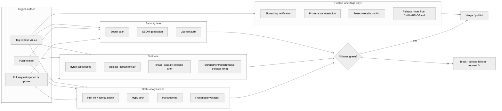

{/* SPDX-License-Identifier: MIT */}

**Apothem 생태계의 모든 변경을 게이트하는 빌드 · 검증 · 배포 워크플로의
구조적 지도입니다.** 이 문서는 시각화 표면을 설치합니다. 구체적인 GitHub
Actions 워크플로 파일과 릴리스 도구는 이후 프로덕션 준비 설치 아래에서
배치됩니다.

## 파이프라인 형태

## 레인 역할

- **정적 분석 레인** — 빠른 피드백. Ruff는 Python 스타일과 엄선된 규칙 집합을
  다룹니다. mypy는 strict로 타입 규율을 강제합니다. markdownlint는 문서 표면을
  단속합니다. frontmatter 검증기는 규칙, 스킬, 위임된 워커, 명령에 대한
  아티팩트 스키마 준수를 게이트합니다.
- **테스트 레인** — `pytest tests/hooks`는 hook 런타임을 완전한 이벤트
  매트릭스에 대해 실행합니다. `validate_ecosystem.py`는 아티팩트 간 일관성을
  위한 주요 구조 게이트입니다. `chaos_pass.py`와 `src/apothem/benchmarks/`
  아래의 클래스별 벤치마크 스위트는 저하된 입력 아래에서의 퇴화와 런타임 예산
  회귀를 잡아내기 위해 릴리스 레인에서 활성화됩니다.
- **보안 레인** — 시크릿 스캔은 실수로 커밋된 자격 증명을 잡아냅니다. SBOM
  생성과 라이선스 감사는 모든 프로덕션 준비 설치에 대해 공급망 표면을
  게이트합니다.
- **배포 레인** — 태그된 릴리스에서만 실행됩니다. 서명된 태그 검증은 릴리스
  브랜치의 출처를 확인합니다. 프로젝트 웹사이트는 `site/dist/`에서 GitHub
  Pages 대상으로 배포됩니다. 릴리스 노트는 `CHANGELOG.md`의 Keep-A-Changelog
  형식에서 파생됩니다.

## 구체적 구성

실제 워크플로 파일(`.github/workflows/ci.yml`,
`.github/workflows/release.yml` 등)은 프로덕션 준비 생태계 구축 중에
설치됩니다. 이 다이어그램은 향후 모든 구성이 반영하는 정규 형태를 정의합니다.

## 권위 있는 상호 참조

- `pyproject.toml` — Ruff / mypy / pytest 구성의 진실의 출처.
- `scripts/dev/validate_ecosystem.py` — 주요 아티팩트 간 게이트.
- `scripts/dev/validate_hooks.py` — hook 전용 구조 검증.
- `scripts/dev/chaos_pass.py` — 구성된 각 hook에 대한 적대적 스윕.
- `src/apothem/benchmarks/` — 클래스별 런타임 예산 검증기.
- `site/content/docs/developer-guide.mdx` — 운영자 대상 기여자 워크플로.
- `CHANGELOG.md` — 릴리스 노트 출처.
