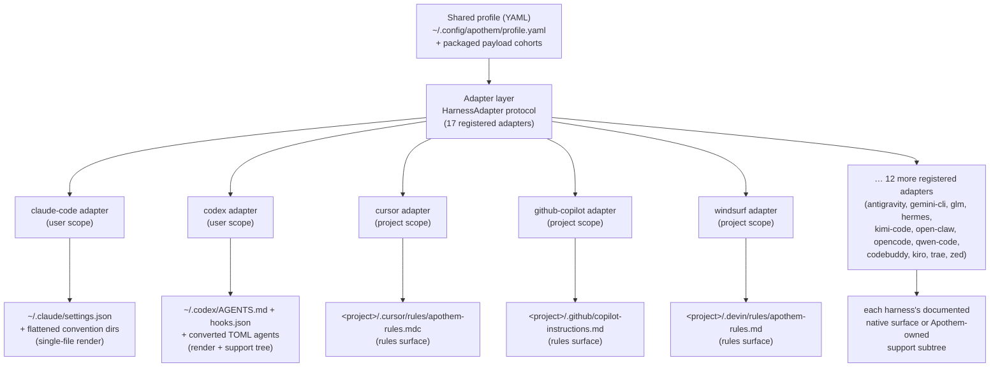

{/* SPDX-License-Identifier: MIT */}

Apothem은 스키마로 검증된 단일 YAML 프로파일을 의미상의 정보원으로 사용하며,
`HarnessAdapter` 프로토콜을 구현하는 어댑터 클래스를 통해 각 하니스에 특화된 설치 표면을
모두 파생시킵니다. 각 어댑터는 하니스가 문서화한 사용자 위치 또는 프로젝트 위치에 쓰며,
하니스에 대응하는 네이티브 프리미티브가 없을 때에만 Apothem 소유의 지원 경로를 사용합니다.

## 왜 어댑터 추상화인가

모든 하니스는 서로 다른 구성 방언을 사용합니다. 하나는 JSON 설정 파일을 원하고,
다른 하나는 `.mdc` 규칙 파일의 디렉터리를 원하며, 세 번째는 단일 Markdown 지시
파일을 원합니다. 만약 Apothem이 그 지식을 CLI에 하드코딩한다면, 모든 하니스가
자신의 가정을 코어로 누출시킬 것이고, 하니스를 하나 추가하는 것은 설치, 업데이트,
제거, 검증 로직을 보조를 맞춰 손대는 일이 될 것입니다.

어댑터 패턴은 이를 뒤집습니다. 코어는 오직 `HarnessAdapter`
프로토콜 — 라이프사이클 메서드로 이루어진 작은 계약 — 만 알고 있습니다. 각 하니스의 방언은
그 계약을 구현하는 하나의 자기완결적 하위 패키지 안에 살아 있습니다. 코어는 어댑터에게
*설치*하라고 요청하면서도, 그것이 JSON
파일을 렌더링하는 것을 뜻하는지, 규칙 디렉터리를 쓰는 것을 뜻하는지, 지원 트리를 까는 것을
뜻하는지 알지 못합니다. 새 하니스는
프로토콜을 충족하고 진입점을 등록함으로써 합류하며, 코어에서는 아무것도 변경되지 않습니다. 이것이
Apothem이 호스트 비종속을 유지하는 구조적 이유입니다 — 그 추상화야말로 하니스 특화 지식이
퍼져나가는 것을 막는 경계입니다.

## 어댑터의 형태

어댑터는 두 가지 구체화 형태로 나뉘며, 둘 다 레지스트리에서 확인할 수 있습니다.

- **단일 파일 렌더러**는 프로파일 필드를 하나의 하니스 네이티브
  구성 파일로 변환합니다. 예를 들어 Claude Code 어댑터는 공유 프로파일로부터 항상
  `~/.claude/settings.json`을 써내고, Apothem
  규약 디렉터리(`agents/`, `rules/`, `skills/`, …)를 그 옆에 평탄화하여 배치합니다.
- **규칙 표면 및 지원 트리 어댑터**는 Apothem 페이로드
  cohort를 하니스가 문서화한 규칙 위치로 전파하며, 네이티브 형식이 존재하는 경우 cohort를
  네이티브 형식으로 변환하고, 나머지는 네이티브 앵커에서 참조되는
  Apothem 소유의 지원 하위 트리 아래에 둡니다. Cursor
  어댑터는 제공된 프로젝트 루트에 단일 `.cursor/rules/apothem-rules.mdc`를
  쓰고 규칙 표면만 전달합니다.

주어진 어댑터는 **사용자 범위**(홈 디렉터리 아래에 씀)이거나
**프로젝트 범위**(`--project <path>`를 요구하고 그 트리 내부에 씀)이며,
레지스트리가 그중 어느 쪽인지 기록합니다.

## 현재 어댑터 토폴로지



중심에서 가장자리로 부채꼴로 펼쳐지는 것은 프로젝트 이름이 인코딩하는 아키텍처입니다.
하나의 프로파일이 핵심에 있고, 모든 하니스가 자신만의 어댑터를 따라 동일한 거리만큼 바깥에 있습니다.

## 프로토콜 정의

```python
from pathlib import Path
from typing import Protocol

class HarnessAdapter(Protocol):
    name: str
    output_path: Path

    def install(self, profile: dict[str, object]) -> object:
        ...

    def update(self, profile: dict[str, object]) -> object:
        ...

    def uninstall(self) -> None:
        ...

    def is_installed(self) -> bool:
        ...

    def verify(self) -> bool:
        ...
```

프로젝트 범위 어댑터는 라이프사이클 메서드에서 추가로 `project: Path | None`을 받고
`resolve_output_path(project)`를 노출할 수 있습니다. CLI는 메서드 시그니처가
`--project PATH`를 받는 어댑터에만 이를 전달합니다.

## 진입점 등록

어댑터는 `apothem.harnesses` setuptools 진입점 그룹을 통해 등록됩니다.

```toml
[project.entry-points."apothem.harnesses"]
cursor = "apothem.harnesses.cursor:CursorAdapter"
```

`src/apothem/lib/harness_registry.py`에 있는 중앙 레지스트리는 정확한
열일곱 개의 공개 ID, 진입점, 문서 경로, 대상 경로, 패키지 데이터
요구 사항, 능력 상태, 표준 규약 핀 경로를 기록합니다. CLI는
각 명령에서 제품 사실을 다시 발견하는 대신 그 레지스트리를 통해 어댑터를 로드합니다.

## 프로파일에서 네이티브로의 매핑

각 어댑터는 자신의 하니스에 적합한 변환 로직을 구현합니다.

```
YAML profile + payload cohort    Harness-native surface
-----------------------------    ----------------------
identity / preferences       --> native config fields or rendered instruction context
commands/*.md                --> native commands or SKILL.md folders
rules/*.md                   --> native rules where supported, otherwise support trees
hooks/messages/*.md          --> native hooks where supported, otherwise support trees
agents/*.md                  --> native agent formats where supported
skills/*/SKILL.md            --> native skill folders where supported
```

지원되지 않거나 발견 보류 중인 능력 셀은 쓰기 전에 구조화된 경고가 됩니다.
이들은 임의로 지어낸 공급자 표면으로 조용히 투영되지 않습니다.

## 새 어댑터 추가하기

단계별 안내는 [하니스 어댑터 작성하기](/docs/examples/authoring-a-harness-adapter)를
참조하세요.
