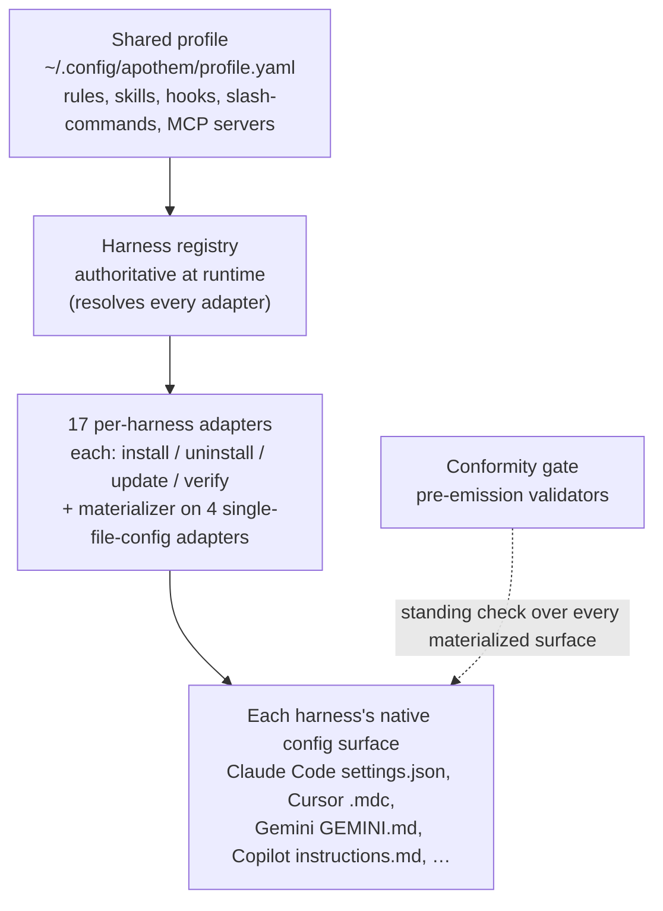

{/* SPDX-License-Identifier: MIT */}

Apothem은 하나의 아이디어를 중심으로 구축됩니다. 단일 공유 거버넌스 프로파일을,
하네스별 어댑터를 통해 각 프로그래밍 도우미 런타임의 네이티브 구성 형식으로
물화하는 것입니다. 이 섹션에서는 구조적 구성 요소 — 어댑터 프로토콜, 프로파일
스키마, 소스 트리 레이아웃, 그리고 이들을 연결하는 설치 워크플로 — 를
설명합니다.

## 시스템 개요

한눈에 보면 Apothem은 하나의 파이프라인입니다. 단일 공유 프로파일이 하네스
레지스트리에 입력되고, 레지스트리는 모든 하네스별 어댑터를 해석합니다. 각
어댑터는 해당 하네스의 네이티브 구성 표면을 물화하며, 상시 적합성 게이트가
물화된 모든 표면을 검사합니다.

## 페이지

| 페이지 | 설명 |
|------|-------------|
| [하네스 어댑터 추상화](/docs/architecture/harness-adapter-abstraction) | `HarnessAdapter` 프로토콜 — 어댑터가 공유 프로파일을 플랫폼 네이티브 구성으로 변환하는 방법. |
| [공유 프로파일 스키마](/docs/architecture/shared-profile-schema) | `~/.config/apothem/profile.yaml` 또는 `--profile PATH`에 있는 스키마 기반 YAML 프로파일. |
| [소스 레이아웃](/docs/architecture/source-layout) | Apothem이 `src/` 레이아웃을 사용하는 이유와 트리의 구성 방식. |
| [설치 워크플로](/docs/architecture/installation-workflow) | `apothem install`, `update`, `uninstall`이 처음부터 끝까지 작동하는 방식. |
| [위임 작업자](/docs/architecture/agents) | 이 저장소에서 작동하는 멀티 워커 런타임을 위한 저장소 범위 지침. |
| [자기완결적 런타임](/docs/architecture/self-contained-runtime) | Apothem의 엔진이 임의의 체크아웃에서 어떻게 실행되는가 — 내장된 의존성, PYTHONPATH=src 호출 모델, 그리고 플러그인 트리 부트스트랩. |
| [의존성 내장 전략](/docs/architecture/vendoring-strategy) | Apothem이 src/apothem/_vendor/ 아래에 어떤 서드파티 패키지를 내장하는지, 어떤 것이 시스템 전제 조건으로 남는지, 그리고 내장된 사본이 어떻게 갱신되는지. |
| [Cohort 패키징 계약](/docs/architecture/cohort-packaging-contract) | Cohort 패키징과 플러그인 매니페스트를 위한 안정적이고 다운스트림에서 소비 가능한 계약 — 매핑을 다시 도출하지 않고 cohort를 열거하고 하니스별 네이티브 타깃을 해석한다. |
| [CI/CD 파이프라인 다이어그램](/docs/architecture/cicd-pipeline) | 모든 코드 변경과 릴리스를 게이트하는 빌드, 테스트, lint, 보안, 배포 워크플로 단계의 시각적 지도와 레인 분해. |
