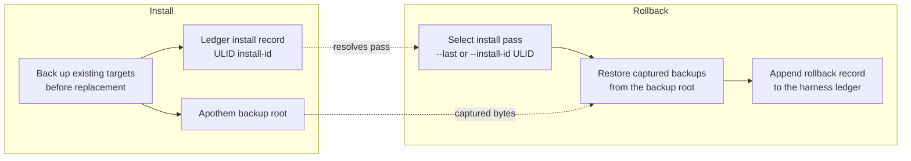

{/* SPDX-License-Identifier: MIT */}

## 설치 흐름

```mermaid
flowchart TD
    accTitle: Apothem install workflow
    accDescr: Top-down flowchart of the apothem install command from CLI invocation through adapter lookup, profile load, adapter install call, native config write, and final apothem verify check.
    A[apothem install --harness X] --> B[Resolve adapter through registry]
    B --> C[Load and validate profile YAML<br/>before writes]
    C --> D[Adapter.install(profile, project)]
    D --> E[Write native config and support cohorts]
    E --> F[apothem verify --harness X]
    F --> G{All checks pass?}
    G -- yes --> H[Done]
    G -- no --> I[Report failures]
```

## 업데이트 흐름

`apothem update --harness X` 실행 시:

1. `~/.config/apothem/profile.yaml` 또는 `--profile PATH`를 로드하고 검증합니다.
2. 선택한 harness 또는 `all`을 중앙 레지스트리를 통해 해석합니다.
3. 첫 쓰기 전에 전체 물화 계획을 검증합니다.
4. `Adapter.update(profile, project=...)`를 호출합니다.
5. 생성됨, 업데이트됨, 변경 없음, 건너뜀, 경고, 오류 결과를 보고합니다.

## 제거 흐름

`apothem uninstall --harness X` 실행 시:

1. `Adapter.uninstall()`을 호출합니다.
2. 어댑터는 자신이 쓴 파일만 제거합니다. 공유 프로파일 YAML과 관련 없는
   운영자 작성 파일은 그대로 둡니다.

## 범위 해석

각 어댑터는 자신의 고정 설치 루트에 씁니다. 사용자 범위 어댑터는 사용자 홈에,
프로젝트 범위 어댑터는 프로젝트 로컬에 씁니다. CLI는 `--scope` 플래그를 노출하지
않습니다. 프로젝트 범위 어댑터는 `--project <path>`가 필요합니다. 각 대상 위치는
`site/content/docs/harnesses/<harness>.mdx`에 문서화되어 있습니다.

## 오류 처리

설치/업데이트 작업은 쓰기 전에 검증하고, 교체 전에 기존의 일치하는 대상을
백업하며, 공유 디스커버리 디렉터리에서는 Apothem이 관리하는 하위 항목만
병합합니다. `--dry-run`은 동일한 검증을 수행하고, 디렉터리나 파일을 생성하지 않은
채 건너뜀 또는 변경 없음 결과를 반환합니다.

## Reversibility (backup and rollback)

Every install pass is reversible. Replaced bytes are captured into the Apothem
backup root and the pass is recorded in the harness ledger under a ULID
install id; [`apothem rollback`](/docs/cli-reference/rollback) selects a
recorded pass and restores those captured backups.


