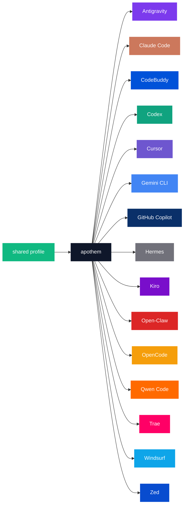

{/* SPDX-License-Identifier: MIT */}

아래의 정규 브랜드 이름 × 색상 코드 열거는 팔레트의 카탈로그 목적이 요구하는 하니스별 그대로의 식별자를 보존하기 위해 `text` 펜스로 감싸여 있습니다.

## Apothem 코어

| 토큰 | 라이트 | 다크 | 용도 |
|---|---|---|---|
| `apothem-hub` | `#0F172A` | `#F1F5F9` | 모든 아키텍처 다이어그램에서의 중앙 배포 노드("apothem")이자 Apothem 마크의 중앙 허브. |
| `shared-profile` | `#10B981` | `#34D399` | apothem 코어에 공급하는 진실 공급원 프로필. |

## 하니스 팔레트

열일곱 개 하니스 중 열다섯 개는 주요 브랜드 정체성에 맞게 색을 입혔습니다.
나머지 둘 — `glm`과 `kimi-code` — 은 아직 정의된 브랜드 색상이 없습니다. 이들의
행은 [업데이트](#updates)의 전파 단계에 따라 상류 브랜드 색상이 설정되면
추가됩니다.

```text
| Token             | Light     | Dark      | Source                                                                                                                                              |
|-------------------|-----------|-----------|-----------------------------------------------------------------------------------------------------------------------------------------------------|
| `antigravity`     | `#7C3AED` | `#9F67FF` | Google Antigravity deep-purple.                                                                                                                     |
| `claude-code`     | `#CC785C` | `#E89378` | Anthropic terracotta-orange.                                                                                                                        |
| `codebuddy`       | `#0052D9` | `#5E8EF7` | Tencent CodeBuddy blue.                                                                                                                             |
| `codex`           | `#10A37F` | `#19C796` | OpenAI signature teal.                                                                                                                              |
| `cursor`          | `#6E56CF` | `#9B85E3` | Cursor brand purple.                                                                                                                                |
| `gemini-cli`      | `#4285F4` | `#6BA4F7` | Google blue (primary); the Apothem mark renders the node with all four Google brand hues `#4285F4` / `#34A853` / `#FBBC04` / `#EA4335`.             |
| `github-copilot`  | `#0A3069` | `#5B8FE3` | GitHub Mona deep-blue.                                                                                                                              |
| `hermes`          | `#71717A` | `#A1A1AA` | Community silver-grey.                                                                                                                              |
| `kiro`            | `#790ECB` | `#A862DD` | Kiro violet.                                                                                                                                        |
| `open-claw`       | `#DC2626` | `#F87171` | Community red-orange.                                                                                                                               |
| `opencode`        | `#F59E0B` | `#FBBF24` | Community amber.                                                                                                                                    |
| `qwen-code`       | `#FF6A00` | `#FF8C40` | Alibaba Qwen orange.                                                                                                                                |
| `trae`            | `#FF0066` | `#FF599C` | ByteDance Trae magenta.                                                                                                                             |
| `windsurf`        | `#0EA5E9` | `#38BDF8` | Windsurf sky-blue.                                                                                                                                  |
| `zed`             | `#084CCF` | `#5E8BE0` | Zed Industries blue.                                                                                                                                |
```

## 명명 근거

- **`apothem-hub`** — 이름이 환기하는 기하학적 중심(정다각형의 변심거리는 그 중심을 향해 안쪽을 가리킵니다).
- **`shared-profile`** — 상류의 소스로, 단일 하니스 색상과 구별되어 모든 다이어그램에서 "입력" 화살표로 읽히도록 합니다.
- **하니스별 토큰**은 코드베이스 전반에서 사용되는 하니스 slug(`harnesses/<slug>/`, 진입점 키, CLI의 `--harness <slug>` 인자)를 반영합니다. 개념당 한 단어, 어디서나 같은 문자열.

## Mermaid 사용



## 접근성

모든 라이트 모드 토큰은 브랜드 색상을 왜곡하지 않고 대비가 허용하는 범위에서 흰색 텍스트에 대해 WCAG 2.2 AA 대비(≥4.5 : 1)를 충족합니다. 어떤 하니스의 네이티브 브랜드 색상이 단독으로 흰색 텍스트에 대해 AA 임계값 아래로 떨어질 때(특히 위에 열거한 앰버 / 오렌지 계열 토큰과 스카이블루 / 틸 계열 토큰), WCAG AA의 텍스트-온-컬러 대비가 필요한 다이어그램은 흰색 텍스트가 선명하게 읽히도록 다이어그램 채움 색으로 **다크 모드 변형**(끌어올린 색조)을 사용합니다. 다크 모드 열은 이 목적에 맞게 보정되어 있으며, 모든 다크 모드 토큰은 흰색 텍스트에 대해 AA를 통과합니다.

## 업데이트

팔레트는 하니스가 상류에서 브랜드 변경을 비준할 때만 업데이트됩니다. 하니스별 브랜드 변경은 `site/app/global.css`, 이 페이지, 그리고 `assets/src/` 아래 영향을 받는 모든 SVG 마스터에 걸쳐 원자적으로 전파됩니다.
