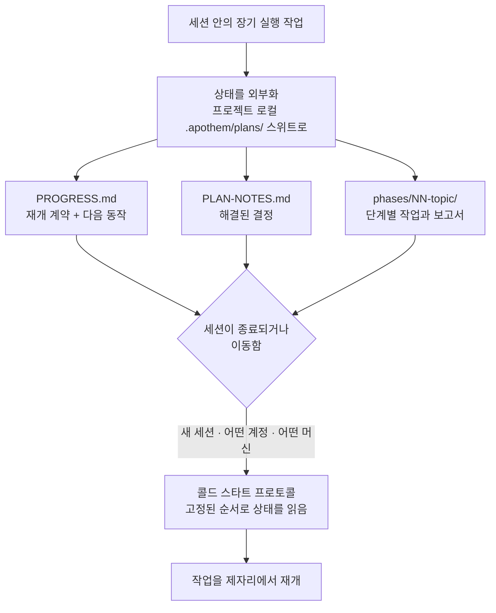

{/* SPDX-License-Identifier: MIT */}

지원을 받는 작업의 대부분은 하나의 대화 안에서 생겨나고 사라집니다. 채팅을 닫거나, 머신을 바꾸거나, 다른 계정으로 로그인하면 진행하던 작업의 맥락이 사라집니다. 다음 세션은 이미 내린 결정에 대한 기억 없이 차갑게 처음부터 시작됩니다.

Apothem은 이것을 뒤집습니다. 장기 실행되는 여러 단계의 작업에 대해, 그 **전체 작업 상태**를 프로젝트 로컬 `.apothem/plans/` 스위트(`.plans/`는 계속 지원되는 하위 호환 폴백입니다)로 외부화합니다 — 이는 어느 클라우드 채팅 기록 안이 아니라 여러분의 리포지터리에 놓이는 파일들입니다. 상태가 영속적인 산출물이고, 세션은 일회용입니다.

## 핵심 아이디어

`<project-root>/.apothem/plans/{suite}/`에 있는 계획 스위트는 세션을 교체 가능하게 만드는 두 가지를 담고 있습니다.

- **재개 계약.** `PROGRESS.md`는 현재 단계와 작업 상태, 정확한 다음 동작, 적용 중인 규약, 이미 해결된 결정, 그리고 다음 세션이 읽어야 할 정확한 파일들을 기록합니다.
- **콜드 스타트 프로토콜.** 새 세션은 그 파일들을 고정된 순서로 읽고, 어떤 작업에 착수하기 전에 전체 그림을 다시 세웁니다 — 대화 기록은 필요하지 않습니다.

그 상태가 여러분 프로젝트의 파일 안에 있기 때문에, 같은 프로젝트를 가리키는 **어떤 계정이나 머신**에서의 새 세션이라도 작업을 제자리에서 이어받습니다. 하나의 채팅 기록 안에 갇히는 것은 아무것도 없습니다. 이것이 바로 구조화된 대규모의 여러 날에 걸친 작업 — 큰 코퍼스, 긴 마이그레이션, 큰 검토 패스 — 이 그렇지 않았다면 끝나버렸을 경계를 넘어 살아남게 하는 속성입니다.

## 정확히 무엇인가

보장을 분명히 하기 위해 정확하게 진술합니다.

- **이것은** 파일로 외부화된 상태에 콜드 스타트 재개 프로토콜을 더한 것입니다. 상태가 여러분 프로젝트의 파일 안에 있고 어떤 세션·계정·머신과도 독립적이기 때문에 작업이 재개됩니다.
- **이것은** 계정 간 자동 동기화 서비스가 **아닙니다**. Apothem이 스스로 여러분의 계획 상태를 계정 사이로 밀어 보내지는 않습니다 — 파일들은 여러분 프로젝트의 파일이 이미 이동하는 방식 그대로 이동합니다(버전 관리, 공유 체크아웃, 동기화된 디렉터리). Apothem이 보장하는 것은, 프로젝트 파일이 어디에 도착하든 새 세션이 그것들로부터 재개할 수 있다는 점입니다.

## 이것이 왜 중요한가

작업이 길고 클수록 하나의 대화는 점점 더 부담이 됩니다. 여러 날에 걸친 대대적인 개편이나 큰 코드베이스를 가로지르는 패스는 어느 단일 세션보다 오래 지속됩니다 — 컨텍스트 윈도우는 압축되고, 세션은 시간 초과되며, 머신은 바뀝니다. 프로젝트 자체의 파일을 진행 중 작업의 진실 공급원으로 다룸으로써, Apothem은 작업을 세션·계정·머신이라는 세 경계 모두에 대해 견고하게 만듭니다.

## 상태가 어디에 있는가

| 산출물 | 위치 | 담는 것 |
|----------|----------|-------|
| 계획 스위트 | `<project-root>/.apothem/plans/{suite}/` | 진행 중 작업의 자기완결적인 하나의 단위 |
| 재개 계약 | `<suite>/PROGRESS.md` | 단계/작업 상태, 다음 동작, 규약, 핵심 파일 매니페스트 |
| 결정 원장 | `<suite>/PLAN-NOTES.md` | 해결된 결정, 다시 묻지 않음 |
| 단계별 작업 | `<suite>/phases/NN-topic/` | 해당 단계의 작업과 그 보고서 |

계획 트리는 Apothem의 표준 `.gitignore` 스니펫에 의해 버전 관리에서 제외되므로, 계획 상태는 기본적으로 로컬에 머뭅니다. 진행 중 작업을 머신이나 계정 사이로 의도적으로 옮기려면, 다른 프로젝트 파일을 옮기는 것과 같은 방식으로 `.apothem/plans/` 스위트를 옮기십시오.

## 관련

- **[심각도 등급](/docs/concepts/seriousness-tiers)** — 거버넌스와 상태 외부화 규율이 참여 수준에 맞춰 어떻게 조정되는지.
- **[명령 파이프라인](/docs/pipeline)** — 계획 스위트를 작성하고 전진시키는 `/plan` 단계들.

## Recommended Next Step

**[심각도 등급](/docs/concepts/seriousness-tiers)을 읽으십시오** — 외부화 규율이 빠른 실험에서 여러 날에 걸쳐 경계를 넘는 노력까지 어떻게 조정되는지 확인할 수 있습니다.
