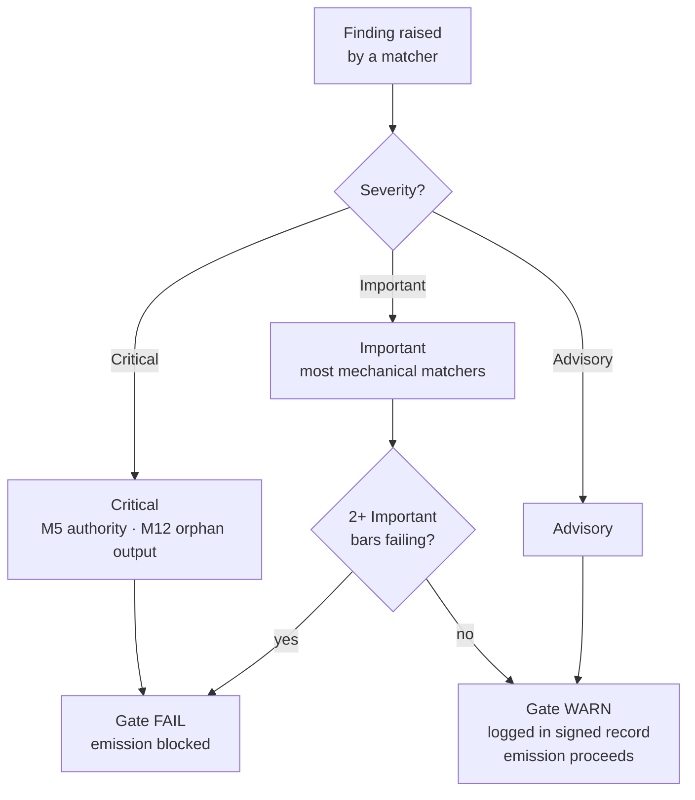

{/* SPDX-License-Identifier: MIT */}

## 열다섯 항목

| 항목 | ID | 명령 | 점검 분류 | 실패 → 행동 |
|---|---|---|---|---|
| 1 | M1 | 호스트 프로젝트 불가지론 | 추론형 | 호스트 관례에 맞춰 수정 |
| 2 | M2 | 편집 규율(공개 레지스터) | 기계형 | 공개 표시 추가 |
| 3 | M3 | 열 가지 품질 차원 | 추론형 | 실패한 차원에서 수정 |
| 4 | M4 | 자기 적용(서명된 게이트 기록 존재) | 기계형 | 서명된 기록 블록 기록 |
| 5 | M5 | 권위 원칙(날조된 정체성／엔드포인트／비밀 없음) | 기계형 | 질의로 회부 |
| 6 | M6 | 전문성 통합(부각된 공백) | 추론형 | 공백을 부각하고 정련을 인용 |
| 7 | M7 | 선택지 주석(권장 표시 + 근거 이유) | 기계형 | 선택지 집합에 주석 부여 |
| 8 | M8 | 확정성(규정적 산문에 얼버무림 없음) | 기계형 | 얼버무림을 조건 분기로 승격 |
| 9 | M9 | 시각적 지렛대(구조적 주제는 다이어그램을 담음) | 추론형 | 다이어그램 작성／갱신 |
| 10 | M10 | 양방향 바인딩(상호적 역방향 포인터 닫힘) | 기계형 | 하프 에지 닫기 |
| 11 | M11 | 애자일 스프린트(목표／백로그／DoR／DoD／리뷰／회고) | 추론형 | 스프린트로 재구성 |
| 12 | M12 | 단계 보고 및 정규 레이아웃 | 기계형 | 롤업 작성; 정규 레이아웃으로 재배치 |
| 13 | M13 | 코드 장인정신(린트／포맷／타입 검사; 매직 넘버; bare-except) | 기계형 | 언어별 코드 장인정신 규칙에 따라 수정 |
| 14 | M14 | 체계성(상류／하류／동료／집행자를 선언) | 추론형 | 선언; 레지스트리에 색인 |
| 15 | M15 | 프로덕션 준비(테스트 + 문서 + CHANGELOG + 준수 커밋 + CI 그린 + semver 안정성) | 기계형 | 누락된 표면 추가 |

## 심각도 사다리

| 심각도 | 게이트에 대한 효과 |
|---|---|
| **치명적** | 게이트 FAIL — 발행 무조건 차단 |
| **중요** | 중요 항목이 2개 이상 동시에 실패할 때 게이트 FAIL |
| **권고** | 게이트 WARN — 서명된 기록에 기록됨; 발행을 차단하지 않음 |

기계적 부분의 매처 대부분은 기본값이 **중요**입니다. M5(권위 — 비밀, 날조된 엔드포인트)와 M12(고아 출력)는 **치명적**입니다.



## 기계적 부분의 매처

기계적 부분은 [`src/apothem/conformity/*_grep.py`](https://github.com/ahmed-g-gad/apothem/tree/main/src/apothem/conformity)에 있으며 [`src/apothem/conformity/gate.py`](https://github.com/ahmed-g-gad/apothem/blob/main/src/apothem/conformity/gate.py)에 의해 오케스트레이션됩니다.

| 매처 | 항목 | 기능 |
|---|---|---|
| `hedging_grep.py` | M8 | 규정적 산문의 얼버무리는 어휘를 탐지 |
| `option_annotation_grep.py` | M7 | 선택지 집합의 `**Recommended**` 표시 + 근거 이유를 검증 |
| `user_confirm_grep.py` | M5 | `<USER-CONFIRM:…>` 자리표시자의 발행을 차단 |
| `binding_reciprocity_grep.py` | M10 | `## Bindings (§0.j five-direction)`의 하프 에지를 탐지 |
| `orphan_output_grep.py` | M12 | 소비자 없음／색인 항목 없음／생산자 귀속 없음 아티팩트에 표시 |
| `bare_except_grep.py` | M13 | 정당화 주석 없는 `except:` ／ `except Exception:`을 탐지 |
| `magic_number_grep.py` | M13 | 비즈니스 로직의 숫자 리터럴을 탐지 |
| `commented_out_code_grep.py` | M13 | 주석 처리된 코드 블록을 탐지 |
| `file_header_grep.py` | M13 | 단일 행 SPDX 라이선스 헤더의 존재를 검증 |
| `frontmatter_grep.py` | M14 | 아래 열거된 네 개의 정규 지시 디렉터리상의 필수 프런트매터 필드를 검증 |
| `semver_stability_grep.py` | M15 | MAJOR 버전 상향 없는 파괴적 공개 API 변경을 탐지 |
| `production_ready_pr_grep.py` | M15 | 동일 변경 세트 규율(테스트 + 문서 + CHANGELOG)을 검증 |
| `secret_leak_grep.py` | M15 | 하드코딩된 비밀／자격 증명을 탐지 |
| `unpinned_action_grep.py` | M15 | GitHub Actions가 commit SHA에 고정되었는지 검증 |
| `always_on_budget_grep.py` | 예산 상한 | 상시 활성 규칙 본문을 500개의 실질적 token으로 제한 |

## 게이트 실행

설치된 harness에서는 게이트가 자동으로 실행됩니다: Claude Code의
`settings.json`은 이를 `PreToolUse` 훅으로 연결하여, 각 Write/Edit 전에
`~/.claude/.apothem/support/conformity/gate.py`의 물화된 사본을 호출합니다.
소스 체크아웃에서는 모듈 형식이 같은 코드를 구동합니다:

```shell
# 단일 파일 디스패치(PreToolUse 훅 모방):
echo '{"tool_input": {"file_path": "path/to/file", "content": "..."}}' \
    | python -m apothem.conformity.gate --hook

# 저장소 전반의 복합 스윕:
python -m apothem.conformity.gate --sweep src/ site/content/docs/ rules/
```

전체 절차는 [적합성 게이트 실행](/docs/usage/conformity-gate)을 참조하세요.

## 참조

- [사전 발행 게이트 레지스트리](/docs/governance/pre-emission-gate-registry) — 정규 항목 정의
- [대외 적합성 레지스트리](/docs/governance/outward-conformity-registry) — M1-M15 상세 의미론
- [교차 명령](/docs/governance/cross-cutting-mandates) — 명령의 진실 출처
- [성능 규율](https://github.com/ahmed-g-gad/apothem/blob/main/src/apothem/rules/performance-discipline.md) — 분류별 런타임 예산
