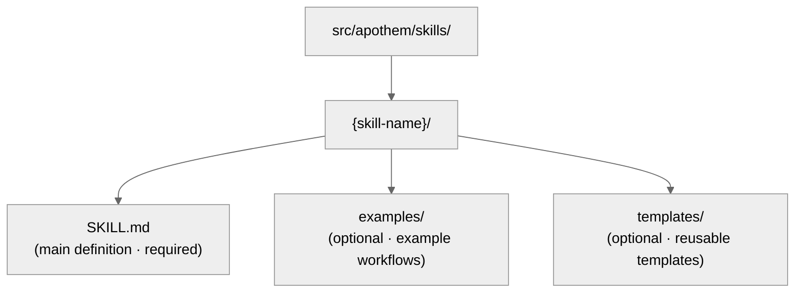

{/* SPDX-License-Identifier: MIT */}

이 가이드는 개발자가 SOTA 품질 기준으로 Apothem 생태계를 유지보수하고
확장하도록 돕습니다.

## 빠른 참조: 아티팩트 유형

Apothem 생태계에는 다섯 가지 아티팩트 유형이 있으며, 각각 특정 목적과
프런트매터 요구 사항을 가집니다.

| 아티팩트 | 경로 | 목적 | 생성 시점 |
| -------- | ---- | ------- | -------------- |
| **규칙(Rule)** | `src/apothem/rules/*.md` | 행동 의무 또는 운영 지침 | 새 원칙, 정책, 또는 거버넌스 의무 확립 |
| **커맨드(Command)** | `src/apothem/commands/*.md` | 복잡한 워크플로를 위한 슬래시 커맨드(`/command-name`) | 새 다단계 사용자 워크플로 |
| **헬퍼(Helper)** | 헬퍼 디렉터리(파일당 `*.md`) | 병렬 작업을 위한 영속 위임 워커 정의 | 새 반복 전문 작업(감사, 탐색, 품질 검사) |
| **스킬(Skill)** | `src/apothem/skills/{name}/SKILL.md` | 탐지 신호가 있는 재사용 가능 기법 | 새 탐지 가능, 재사용 가능 기법 패턴 |
| **훅(Hook)** | `src/apothem/hooks/` + `settings.json` | 이벤트 트리거 검증 또는 상태 관리 | 새 라이프사이클 이벤트 또는 검증 필요 |

## 도구 어댑터 계약

도구 정체성 및 역량 사실은 `src/apothem/lib/harness_registry.py`에 있습니다.
도구 변경은 다음 표면들이 일치할 때에만 완료됩니다:

| 표면 | 필수 업데이트 |
| --- | --- |
| 레지스트리 행 | 공개 ID, 패키지 키, 엔트리 포인트, 범위, 출력 형식, 대상 경로, 문서 경로, 역량 파일, 표준 핀, 픽스처 테스트, 패키지 데이터 키, 템플릿 소스, 역량 상태. |
| 어댑터 패키지 | `__init__.py`, `install.py`, `update.py`, `uninstall.py`, `verify.py`; 도구가 네이티브 구성 파일을 렌더링할 때에만 `materializer.py` 추가. |
| 전파 매니페스트 | 매니페스트 기반 어댑터의 템플릿 및 코호트 경로. |
| 역량 | 지원되지 않거나 디스커버리 대기 상태에 대한 모든 필수 역량 및 근거를 담은 `src/apothem/harnesses/<package>/capabilities.yml`. |
| 규약 핀 | 벤더 URL, 스냅샷 날짜, 정식 파일명/스키마, 증거 참조, 지원되지 않는 역량 근거를 담은 `STANDARD-CONVENTION-PIN.md`. |
| 테스트 | 레지스트리 패리티, 어댑터 픽스처 테스트, 골든 설치 계획 행, 드라이런/쓰기 없음 동작, 멱등성, 패키지 데이터 커버리지. |
| 문서 | 도구 레퍼런스 페이지, 비교 페이지, 역량/MCP 노트, 가짜 플레이스홀더를 사용하는 예시. |

프로젝트 범위 어댑터는 `requires_project = True`를 설정하고, 라이프사이클
메서드에서 `project: Path | None`을 받아들이며, 쓰기 전에 누락되거나 안전하지
않은 프로젝트 루트를 거부해야 합니다. 사용자 범위 어댑터는 경로를 도구의
문서화된 사용자 구성 루트 아래에 유지해야 합니다.

## 골든 픽스처 정책

`tests/fixtures/harness-golden-plans.json`은 열일곱 개 레지스트리 도구 전체의
공개 설치 계획 형태를 기록합니다: 공개 ID, 머티리얼라이즈 모드, 소스
코호트/템플릿 경로, `<ROOT>` 아래의 정규화된 대상 경로. 레지스트리, 매니페스트,
또는 템플릿 대상 동작이 의도적으로 변경되면, diff가 동작 차이를 보이도록 소스
변경과 동일한 커밋에서 골든 픽스처를 업데이트하십시오.

## 쓰기 전 검증

공유 설치 드라이버는 첫 쓰기 전에 모든 소스와 대상을 검증합니다. 누락된
매니페스트 소스, 대상 탐색(traversal), 선택된 루트 밖의 대상 경로, 심링크
횡단을 거부합니다. 드라이런은 동일한 검증을 수행하고 파일을 생성하지 않은 채
구조화된 `skipped` 또는 `unchanged` 결과를 반환합니다.

## 비식별화 및 예시 데이터

프로파일 진단은 token, secret, password, credential, API key, private key,
authorization, auth, 그리고 헤더 형태 필드를 비식별화합니다. 문서, 픽스처,
예시, JSON 스니펫은 실제처럼 보이는 시크릿이나 개인 계정 대신
`example.invalid`, `Example User`, `example-user`, 그리고 명백한
플레이스홀더를 사용합니다.

## 쓰기 전: 정식 스키마

**모든 아티팩트는 `site/content/docs/reference/artifact-schema.mdx`의 스키마를
따라야 합니다.** 이는 협상 불가능합니다.

- 사용하는 아티팩트 유형에 대해 `site/content/docs/reference/artifact-schema.mdx` § "Schema"를 읽으십시오
- 필수 필드를 복사하십시오
- 의무 값을 채우십시오
- 필요에 따라 선택 필드를 추가하십시오

## 프런트매터 빠른 점검

모든 아티팩트 프런트매터는 다음 점검을 통과해야 합니다:

```yaml
✓ Valid YAML syntax (use tools: `yamllint` or PowerShell `ConvertFrom-Yaml` where available)
✓ All mandatory fields present (per schema for artifact type)
✓ name: uses kebab-case
✓ version: semantic MAJOR.MINOR.PATCH
✓ updated: ISO 8601 date (YYYY-MM-DD)
✓ description: single-line, non-empty
✓ scope: valid enum (always-on|path-filtered|other)
✓ portability: valid enum (`universal` | `universal-with-windows-caveats` | `unix-only` | `windows-only`)
✓ No typos in field names — must match canonical schema exactly
✓ Optional fields use correct enum values
```

## 명명 규약

### 아티팩트 이름 (kebab-case)

- **규칙:** `operational-mandates`, `clean-room-generation`, `context-management`
- **커맨드:** `plan-execute`, `plan-spec`, `plan-generate`
- **헬퍼:** `codebase-explorer`, `convention-auditor`, `quality-gate`
- **스킬:** `plan-suite`, `ecosystem-audit`

패턴: 소문자, 단어 사이 하이픈, 공백이나 밑줄 없음.

### 파일 명명

- **규칙:** `{name}.md`
- **커맨드:** `{name}.md`
- **헬퍼:** `{name}.md`
- **스킬:** 폴더 `src/apothem/skills/{name}/SKILL.md` 내부 (정확한 대소문자: `SKILL.md`)
- **훅:** 폴더 `src/apothem/hooks/` 내부. 모든 이벤트 핸들러는 Python입니다. 모든
  `settings.json` 훅 커맨드는 `-m apothem.hooks.dispatch <event> [<message-name>]`
  또는 `-m apothem.conformity.gate --hook`을 호출하기 위해 exec 형식(`python`
  더하기 `args`)을 사용합니다. `dispatch.py`는 `SessionStart`를
  `session_start_bootstrap.main()`으로 라우팅하고, 다른 모든 화이트리스트 이벤트를
  `emit_hook_context.main()`으로 라우팅합니다. `src/apothem/hooks/` 또는 `scripts/`
  아래에 허용되는 유일한 셸 스텁은 네 개의 로케이터 + 부트스트랩 파일
  (`find-python.{ps1,sh}`, `bootstrap.{ps1,sh}`)입니다. 그 외의 어떤 `.ps1` /
  `.sh` 파일도 `scripts/dev/validate_hooks.py` 위생 검사에 실패합니다.

### 상호 참조

다른 아티팩트를 참조할 때는 정확한 이름을 사용하십시오:

- 규칙: `"operational-mandates"` (name 필드 값)
- 커맨드: `/plan-execute` (사람 대상 문서에서는 슬래시 포함; 코드에서는 제외)
- 헬퍼: `codebase-explorer` (name 필드 값)
- 스킬: `plan-suite` (name 필드 값)

산문에서 파일 경로나 잘린 이름을 결코 사용하지 마십시오.

## 이식성: Windows 대 Unix

모든 아티팩트는 이식성 상태를 명시적으로 선언해야 합니다.

### 보편적 (기본값)

- Windows, macOS, Linux에서 동일하게 작동
- 셸 가정 없음
- 경로는 슬래시(`/`) 사용
- 하드코딩된 절대 경로 없음
- Windows 고유 PowerShell 구문 없음

```yaml
portability: "universal"
```

### Windows 주의 사항이 있는 보편적

- POSIX 호스트 전반에서 보편적; 명명된 주의 사항은 콘텐츠에 선언된 Windows 플랫폼 변형에 적용됨
- 콘텐츠에 주의 사항을 명시적으로 문서화
- 예: "Win 10 이전 Windows에서는 심링크 미지원"

```yaml
portability: "universal-with-windows-caveats"
```

제목 바로 뒤의 노트에 주의 사항을 문서화하십시오.

### Unix 전용 / Windows 전용

- 명시적으로 한 플랫폼으로 제한됨
- Apothem에서 드묾 — 대부분 보편적이어야 함
- 플랫폼 고유 기능이 필수일 때에만 사용

```yaml
portability: "unix-only"
```

규칙의 첫 섹션에 이유를 문서화하십시오.

## 범위: 항상 활성 대 경로 필터링

### 항상 활성

규칙이 모든 곳에 적용됩니다.

```yaml
scope: "always-on"
```

### 경로 필터링

규칙이 파일 경로에 따라 조건부로 적용됩니다.

```yaml
scope: "path-filtered"
pathFilter: "**/*.py, **/*.toml"
```

`pathFilter`는 glob 패턴(`.gitignore`와 동일한 형식)을 사용합니다. 파일이
필터에 매치되면 규칙이 활성화됩니다.

## 버전 의미론

모든 아티팩트는 고유한 시맨틱 버전(`MAJOR.MINOR.PATCH`)을 가집니다:

- **PATCH** — 오타 수정, 서식, 링크 갱신, 주석 전용 편집. 동작 변경 없음.
- **MINOR** — 추가적 비파괴 변경: 새 선택 섹션, 추가 안티패턴, 새 선택 프런트매터 필드, 새 예시. 기존 소비자는 변경 없이 계속 작동.
- **MAJOR** — 파괴적 스키마 또는 계약 변경: 제거된 섹션, 이름 변경된 필드, 기존 지침의 동작 변경, 다운스트림 아티팩트의 적응을 요구하는 변경.

예시:

- `vX.Y.Z` → `vX.Y.(Z+1)` (PATCH: 오타 수정)
- `vX.Y.Z` → `vX.(Y+1).0` (MINOR: 새 안티패턴 항목 추가)
- `vX.Y.Z` → `v(X+1).0.0` (MAJOR: 계약 안정 선언)
- `vX.Y.Z` → `v(X+1).0.0` (MAJOR: 의무 프런트매터 필드 제거)

동작을 변경하는 모든 편집에서 `version`과 `updated`를 함께 올리십시오. 아티팩트
변경을 묶는 릴리스에 대해 생태계 수준 `CHANGELOG.md`에 대응하는 행을
추가하십시오.

## 아티팩트를 편집할 시점

### 규칙

- 의무/선택 구조를 하중 지지(load-bearing)로 취급하십시오 — 그것을 재구성하면
  모든 종속 아티팩트로 파급됩니다(MAJOR 올림 필요).
- 이해가 깊어짐에 따라 안티패턴, 진지도 스케일링 예시, 인용을 다듬으십시오
  (MINOR 올림).
- 모든 구조적 변경의 근거를 관련 메모리 토픽 파일에 담으십시오.

### 커맨드

- 인자 형태는 공개 계약의 일부입니다 — 명시적 의도로만 깨고 모든 호출자에게
  변경을 전파하십시오(MAJOR 올림).
- 워크플로 단계와 반환 계약을 타이트하고 최신으로 유지하십시오.
- 자명하지 않은 단계 순서를 인라인으로 문서화하십시오.

### 헬퍼

- `disallowedTools`를 최소이지만 충분하게 유지하고, 변경 시 근거를
  문서화하십시오.
- 헬퍼의 역할이 성숙함에 따라 운영 원칙과 반환 계약을 다듬으십시오(MINOR 올림).
- 호출자가 기대를 재조정할 수 있도록 역량 변화를 인라인으로 추적하십시오.

### 스킬

- 절차 단계와 예시를 현실과 동기화 유지하십시오.
- 탐지 신호는 현재 사용에서의 실제 사용자 표현을 반영해야 합니다.
- 스킬이 약 150줄을 넘으면 분할하십시오
  (`auto-memory.md` § Topic File Management 참조).

## 단계별: 새 규칙 추가하기

### 1. 직교성 평가

이 규칙이 기존 규칙과 겹칩니까? `src/apothem/rules/`에서 관련 콘텐츠를
검색하십시오.

겹침이 50% 초과이면 기존 규칙을 확장하는 것을 고려하십시오. 참조:
`persistent-conventions-vigilance.md` § Artifact Evolution.

### 2. 콘텐츠 작성

구조를 따르십시오:

- 제목: `# Rule: {Title}`
- Purpose 섹션
- Obligations / Core directives (번호 매김, 링크됨)
- Seriousness Scaling 표 (항상 필수)
- Anti-Patterns 섹션
- Enforcement 섹션

### 3. 프런트매터 생성

`site/content/docs/reference/artifact-schema.mdx` § Schema: Rules의 스키마를
사용하십시오. 설정:

- `name:` kebab-case 식별자
- `version:` `"X.Y.Z"` (초기)
- `updated:` ISO 8601 형식의 오늘 날짜
- `scope:` `always-on` 또는 `path-filtered`
- `portability:` `universal` (필요 시 주의 사항 포함)
- `implements:` 이 규칙이 다루는 CM/TM/CP 의무 나열

예시:

```yaml
---
name: "my-new-rule"
description: "Brief one-liner"
pathFilter: ""
alwaysApply: true
---
```

### 4. CLAUDE.md 업데이트

`§7.2 Rules` 레지스트리 표에 항목 추가:

```markdown
| My New Rule | `src/apothem/rules/my-new-rule.md` | Always-on | CM-5/CM-21 |
```

표 내에서 알파벳 순서를 유지하십시오.

### 5. CHANGELOG.md에 추가

다음 릴리스의 `### Added` 섹션 아래에 새 규칙을 설명하는 행을 추가하십시오.

### 6. 검증 실행

`ecosystem-audit` 스킬을 호출하여 규칙 영역에 집중해 새 규칙을 검증하십시오:

```text
Invoke the ecosystem-audit skill with --focus rules --fix
```

새 규칙에 대해 오류가 보고되지 않는지 확인하십시오.

## 단계별: 새 커맨드 추가하기

커맨드는 `/plan-spec`, `/plan-execute`, `/security-audit` 등과 같은 슬래시
커맨드입니다.

### 1. 역할 결정

커맨드는 하니스 런타임이 단독으로 호출하도록 의도된 것이 **결코**
아닙니다. 사용자가 트리거하는 워크플로입니다. 질문하십시오:

- 사용자가 `/command-name`을 입력하는 워크플로인가?
- 여러 단계를 오케스트레이션하는가?
- 타임아웃되거나 실행 중간에 사용자 입력을 요구할 수 있는가?

이 중 어느 하나라도 "아니오"라면, 아마 커맨드가 아니라 스킬일 것입니다.

### 2. 파일 생성

경로: `src/apothem/commands/{name}.md`

프런트매터 (`site/content/docs/reference/artifact-schema.mdx` § Schema:
Commands에서):

```yaml
---
name: "my-command"
version: "X.Y.Z"
updated: "2026-04-20"
description: "What this command does"
argument-hint: "[path/to/input] [--flag VALUE]"
disable-model-invocation: true
portability: "universal"
allowed-tools: "*"
---
```

커맨드에는 항상 `disable-model-invocation: true`를 설정하십시오.

### 3. 콘텐츠 작성

구조:

- 제목: `# /{name} — Human-Readable Title`
- Role 섹션 (누가 이것을 실행하는가)
- 상위 수준 지침
- 단계가 있는 Workflow 섹션
- 반환 계약 / 출력 형식

### 4. CLAUDE.md 및 CHANGELOG.md 업데이트

`§7.1 Commands`의 레지스트리 행; 다음 릴리스의 `### Added` 섹션 아래 CHANGELOG 행.

### 5. 검증

`ecosystem-audit` 스킬을 호출하여 커맨드에 집중하십시오:

```text
Invoke the ecosystem-audit skill with --focus commands --fix
```

## 단계별: 새 헬퍼 추가하기

헬퍼는 병렬 작업을 위한 영속 위임 워커 정의입니다.

### 1. 패턴 식별

이 헬퍼가 아래에 나열된 팀 패턴 중 하나에
맞습니까?

- Research Team: 읽기 전용, 정보 수집
- Audit Team: 검증, 일관성 검사
- Implementation Team: 병렬 코드 변경
- Quality Team: 린트, 테스트, 타입 검사, 보안
- Documentation Team: 문서 업데이트
- 기타: 전문 작업

### 2. 파일 생성

경로:

```text
src/apothem/agents/{name}.md
```

프런트매터:

```yaml
---
name: "my-helper"
version: "X.Y.Z"
updated: "2026-04-20"
description: "What this helper specializes in"
tools: "Read, Glob, Grep, Bash"
disallowedTools: "Write, Edit"
maxTurns: 15
effort: "high"
permissionMode: "default"
memory: false
portability: "universal"
---
```

### 3. 콘텐츠 작성

섹션:

- 운영 원칙 (읽기 전용, 증거 기반, 이진 판정, 망라적)
- 워크플로 (번호 매긴 단계)
- 반환 계약 (최대 토큰, 구조, 필수 필드)

### 4. CLAUDE.md 및 CHANGELOG.md 업데이트

`§7.3 Helpers`의 레지스트리 행; 다음 릴리스의 `### Added` 섹션 아래 CHANGELOG 행.

### 5. 테스트

실제 시나리오에서 헬퍼를 배포하고 문서화된 대로 작동하는지 확인하십시오.

## 단계별: 새 스킬 추가하기

스킬은 재사용 가능하고 탐지 가능한 기법입니다.

### 1. 재사용성 식별

스킬을 작성하기 전에:

- 이 문제/기법을 3회 이상 보았는가?
- 탐지 가능한가? (사용자 요청 패턴이 그것을 신호하는가?)
- 재현 가능하게 성문화할 수 있는가?

세 가지 모두 예라면, 스킬을 작성하십시오.

### 2. 구조 생성



### 3. SKILL.md 작성

프런트매터:

```yaml
---
name: "skill-name"
version: "X.Y.Z"
updated: "2026-04-20"
description: "What this skill teaches"
archetype: "workflow-template"
userInvocable: true | false
disable-model-invocation: true | false
allowed-tools: "Read, Glob, Grep"
argument-hint: "[args]"               # optional; if userInvocable
effort: "max"                          # optional
---
```

콘텐츠 구조:

- Purpose
- When to Use This Skill
- Prerequisites
- Step-by-Step Procedure
- Common Mistakes
- Examples

### 4. CLAUDE.md 및 CHANGELOG.md 업데이트

`§7.5 Skills`의 레지스트리 행; 다음 릴리스의 `### Added` 섹션 아래 CHANGELOG 행.

### 5. 검증

`ecosystem-audit` 스킬을 호출하여 스킬에 집중하십시오:

```text
Invoke the ecosystem-audit skill with --focus skills --fix
```

## 커밋 전 검증 체크리스트

- [ ] 프런트매터가 YAML 구문 검사를 통과함
- [ ] 스키마에 따른 모든 의무 필드 존재
- [ ] `name` 필드가 kebab-case 사용
- [ ] `version`이 시맨틱(`MAJOR.MINOR.PATCH`)이며 동작이 변경되었으면 올림됨
- [ ] 건드린 모든 아티팩트에서 `updated`가 오늘 날짜와 일치
- [ ] `portability` 필드 설정 및 유효
- [ ] CHANGELOG.md가 다음 릴리스 섹션 아래 적절한 범주에 변경을 담음
- [ ] 플랜 내부 참조 없음 (CM-7 준수)
- [ ] 상호 참조가 다른 아티팩트와 일관됨
- [ ] 새 아티팩트가 CLAUDE.md 레지스트리에 등록됨
- [ ] 아티팩트 테스트됨 (해당하는 경우)
- [ ] `ecosystem-audit` 스킬이 오류 없이 실행됨
- [ ] 콘텐츠가 구조적 규약(제목 형식, 섹션 등)을 따름

## 다른 아티팩트 참조하기

다음 정확한 규약을 사용하십시오:

### 규칙 참조

```markdown
See `src/apothem/rules/operational-mandates.md` or shorthand: the Operational Mandates rule.
In prose: ... per CM-1–10 (Operational Mandates rule) ...
```

### 커맨드 참조

```markdown
See `/plan-execute` command. Or: Run `/plan-execute`.
In prose: The `/plan-execute` command handles phase execution.
```

### 헬퍼 참조

```markdown
Deploy the `codebase-explorer` delegated worker.
In prose: The codebase-explorer worker finds patterns.
```

### 스킬 참조

```markdown
Use the `plan-suite` skill.
In prose: The plan-suite skill provides the Master Plan Suite template.
```

### CLAUDE.md 섹션 참조

```markdown
See CLAUDE.md § 7.2 (Rules registry).
Or: Section 4 (Seriousness-Scaled Governance).
```

## 린팅 및 서식

모든 아티팩트는 다음을 사용합니다:

- **Markdown:** GFM (GitHub Flavored Markdown)
- **YAML:** YAML 1.2 준수
- **줄 끝:** LF (Unix 스타일)
- **인코딩:** UTF-8
- **줄 너비:** 콘텐츠는 100자에서 소프트 줄바꿈 (하드 줄바꿈 없음)

Python 파일에는 `Ruff` 포매터 / 린터를 사용하십시오. Markdown에는 `prettier`
또는 동등한 것을 사용하십시오.

## 생태계 감사: 검증 실행하기

두 가지 상호 보완적인 검증 표면이 생태계를 다룹니다:

**기계 검증 가능 (Python 검증기)** — 모든 커밋 전에 실행:

```bash
python scripts/dev/validate_hooks.py       # Hook structure + Python-only hygiene
python scripts/dev/validate_ecosystem.py   # Full tree + frontmatter + delegated hook checks
python scripts/dev/chaos_pass.py           # Adversarial sweep across configured hooks
pytest tests                                    # Unit tests for the hook runtime
```

**하니스 주도** — 상호 참조, 서사, 규약 감사용:

```bash
/ecosystem-audit --focus all --fix
```

이것은 병렬로 실행됩니다:

- **구조 감사:** 레지스트리 정확성, 파일 존재, 프런트매터 유효성
- **아티팩트 감사:** 상호 참조, 의무 커버리지, 파이프라인 순서
- **메모리 감사:** 메모리 파일 주장 대 파일시스템 상태

기대 출력: 두 표면 모두에서 발견 사항 없는 `PASS`.

`FINDINGS`가 보고되면:

- 각 발견 사항의 심각도(Critical / Important / Advisory)를 검토하십시오
- Critical 항목을 즉시 처리하십시오
- Important 항목을 다음 사이클로 계획하십시오
- Advisory 항목을 다음 반복에 고려하십시오

---

## 질문이 있으신가요?

다음을 참조하십시오:

- 프런트매터 스키마: `site/content/docs/reference/artifact-schema.mdx`
- 아티팩트 라이프사이클: `src/apothem/rules/persistent-conventions-vigilance.md` § Artifact Evolution
- 운영 의무: `src/apothem/rules/operational-mandates.md` CM-1–10
- 플랜 스위트 레퍼런스: `src/apothem/skills/plan-suite/master-template.md`
- 릴리스 노트: `CHANGELOG.md`
