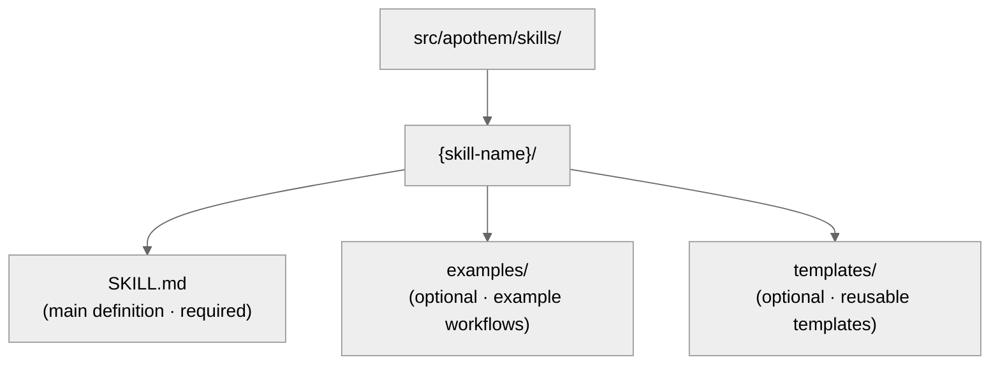

{/* SPDX-License-Identifier: MIT */}

이 가이드는 개발자가 SOTA 품질 기준에 맞춰 Apothem 생태계를 유지 관리하고
확장하도록 돕습니다.

## 빠른 참조: 아티팩트 유형

이 가이드는 각각 고유한 목적을 지닌 다섯 가지 아티팩트 유형을 다룹니다. 규칙,
명령, 헬퍼, 스킬은 YAML 프런트매터를 지니고, 훅은 `hooks.json`과
`settings.json`에 등록되며 프런트매터를 지니지 않습니다. 출력 스타일은 필수
프런트매터 키가 `name`과 `description` 두 개인 또 하나의 아티팩트 클래스입니다.
[프런트매터 스키마](/docs/reference/frontmatter-schema)를 참조하세요.

| 아티팩트 | 경로 | 목적 | 생성 시점 |
| -------- | ---- | ------- | -------------- |
| **규칙** | `src/apothem/rules/*.md` | 행동 의무 또는 운영 지침 | 새 원칙, 정책 또는 거버넌스 의무가 확립될 때 |
| **명령** | `src/apothem/commands/*.md` | 복잡한 워크플로를 위한 슬래시 명령(`/command-name`) | 새 다단계 사용자 워크플로 |
| **헬퍼** | `src/apothem/agents/*.md` | 병렬 작업을 위한 영속적인 위임 작업자 정의 | 새로운 반복적 전문 작업(감사, 탐색, 품질 검사) |
| **스킬** | `src/apothem/skills/{name}/SKILL.md` | 탐지 신호가 있는 재사용 가능한 기법 | 탐지 가능하고 재사용 가능한 새 기법 패턴 |
| **훅** | `src/apothem/hooks/` + `hooks.json` + `settings.json` | 이벤트로 트리거되는 검증 또는 상태 관리 | 새 라이프사이클 이벤트 또는 검증 필요 |

## 하니스 어댑터 계약

하니스 식별 정보와 역량 사실은 `src/apothem/lib/harness_registry.py`에
있습니다. 하니스 변경은 다음 표면이 모두 일치할 때에만 완료됩니다.

| 표면 | 필수 업데이트 |
| --- | --- |
| 레지스트리 행 | 공개 ID, 패키지 키, 진입점, 범위, 출력 형식, 대상 경로, 문서 경로, 역량 파일, 표준 핀, 픽스처 테스트, 패키지 데이터 키, 템플릿 소스, 역량 상태. |
| 어댑터 패키지 | `__init__.py`, `install.py`, `update.py`, `uninstall.py`, `verify.py`. `materializer.py`는 하니스가 네이티브 구성 파일을 렌더링할 때에만 추가합니다. |
| 전파 매니페스트 | 매니페스트 기반 어댑터의 템플릿 및 코호트 경로. |
| 역량 | 모든 필수 역량, 지원되지 않거나 디스커버리 대기 중인 상태에 대한 근거, 그리고 변환되는 각 명령, 에이전트 또는 규칙 코호트에 대한 `conversion_losses` 맵을 담은 `src/apothem/harnesses/<package>/capabilities.yml`([하니스 레지스트리](/docs/reference/harness-registry) 참조). |
| 규약 핀 | 벤더 URL, 스냅샷 날짜, 정식 파일명/스키마, 증거 참조, 지원되지 않는 역량에 대한 근거를 담은 `STANDARD-CONVENTION-PIN.md`. |
| 테스트 | 레지스트리 패리티, 어댑터 픽스처 테스트, 골든 설치 계획 행, 드라이런/쓰기 없음 동작, 멱등성, 패키지 데이터 커버리지. |
| 문서 | 하니스 레퍼런스 페이지, 비교 페이지, 역량/MCP 노트, 가짜 플레이스홀더를 사용하는 예시. |

프로젝트 범위 어댑터는 `requires_project = True`를 설정하고, 라이프사이클
메서드에서 `project: Path | None`을 받아야 하며, 쓰기 전에 누락되었거나
안전하지 않은 프로젝트 루트를 거부해야 합니다. 사용자 범위 어댑터는 경로를
하니스의 문서화된 사용자 구성 루트 아래에 유지해야 합니다.

## 골든 픽스처 정책

`tests/fixtures/harness-golden-plans.json`은 레지스트리에 있는 열일곱 개
하니스 전체의 공개 설치 계획 형태, 즉 공개 ID, 머티리얼라이즈 모드, 소스
코호트/템플릿 경로, `<ROOT>` 아래의 정규화된 대상 경로를 기록합니다.
레지스트리, 매니페스트 또는 템플릿 대상 동작이 의도적으로 바뀔 때에는, diff에
동작 차이가 드러나도록 소스 변경과 같은 커밋에서 골든 픽스처를 업데이트하세요.

## 쓰기 전 검증

공유 설치 드라이버는 첫 쓰기 전에 모든 소스와 대상을 검증합니다. 누락된
매니페스트 소스, 대상 경로 순회, 선택한 루트 밖의 대상 경로, 심볼릭 링크 경계
넘기를 거부합니다. 드라이런은 같은 검증을 실행하고, 파일을 만들지 않은 채
구조화된 `skipped` 또는 `unchanged` 결과를 반환합니다.

## 가림 처리와 예시 데이터

프로필 진단은 token, secret, password, credential, API key, private key,
authorization, auth, header 형태의 필드를 가립니다. 문서, 픽스처, 예시, JSON
스니펫은 실제처럼 보이는 시크릿이나 개인 계정 대신 `example.invalid`,
`Example User`, `example-user`와 명백한 플레이스홀더를 사용합니다.

## 작성하기 전에: 정식 스키마

**기계가 읽을 수 있고 게이트가 강제하는 계약은 `src/apothem/schemas/*.schema.json`
아래의 클래스별 JSON 스키마입니다 — `additionalProperties`가 알 수 없는 키를
거부하므로, 최종 판단은 적합성 게이트가 내립니다.** 사람이 읽기 위한 두 가지
투영이 이 스키마를 따라갑니다. `site/content/docs/reference/frontmatter-schema.mdx`
(필수 키 색인)와 `site/content/docs/reference/artifact-schema.mdx`(클래스별
템플릿과 완성 예시)입니다. 페이지가 JSON 스키마와 일치하지 않는 경우에는
스키마가 우선합니다.

- `src/apothem/schemas/` 아래에서 해당 아티팩트 유형의 JSON 스키마를 읽으세요
- 템플릿과 완성 예시는 `site/content/docs/reference/artifact-schema.mdx`
  § "Schema"에서 읽으세요
- 필수 필드를 복사하고, 필수 값을 채운 다음, 필요에 따라 선택 필드를 추가하세요

## 프런트매터 빠른 점검

모든 아티팩트 프런트매터는 다음 검사를 통과해야 합니다. `version`, `updated`,
`portability` 검사는 해당 키를 지니는 클래스에만 적용하세요. 규칙에는 이 셋이
모두 없고, 스킬에는 `portability`가 없습니다.

```yaml
✓ Valid YAML syntax (use tools: `yamllint` or PowerShell `ConvertFrom-Yaml` where available)
✓ All mandatory fields present (per schema for artifact type)
✓ name: uses kebab-case
✓ version: semantic MAJOR.MINOR.PATCH
✓ updated: ISO 8601 date (YYYY-MM-DD)
✓ description: single-line, non-empty
✓ scope fields valid per artifact type (rules: pathFilter + alwaysApply; CLAUDE.md root: scope)
✓ portability: string, for example `universal` (the schemas do not enumerate its values)
✓ No typos in field names — must match canonical schema exactly
✓ Optional fields use correct enum values
```

## 명명 규약

### 아티팩트 이름 (kebab-case)

- **규칙:** `operational-mandates`, `clean-room-generation`, `context-management`
- **명령:** `plan-execute`, `plan-spec`, `plan-generate`
- **헬퍼:** `codebase-explorer`, `convention-auditor`, `quality-gate`
- **스킬:** `plan-suite`, `ecosystem-audit`

패턴: 소문자, 단어 사이에 하이픈, 공백이나 밑줄 없음.

### 파일 명명

- **규칙:** `{name}.md`
- **명령:** `{name}.md`
- **헬퍼:** `{name}.md`
- **스킬:** 폴더 `src/apothem/skills/{name}/SKILL.md` 안 (정확한 대소문자: `SKILL.md`)
- **훅:** 폴더 `src/apothem/hooks/` 안. 모든 이벤트 핸들러는 Python입니다. Claude Code
  `settings.json` 템플릿의 모든 훅 명령은 exec 형식을 사용합니다. `command`는 설치
  시점에 해석되는 인터프리터 자리표시자 `${PYTHON_BIN}`이고, `args`에는 스크립트
  경로와 그 인수가 들어 있습니다. 이 템플릿은
  `${HARNESS_ROOT}/.apothem/support/hooks/dispatch.py <event> [<message-name>]`과
  `${HARNESS_ROOT}/.apothem/support/conformity/gate.py --hook`을 절대 경로로
  실행하므로, 설치된 사본에는 가져올 수 있는 `apothem` 패키지가 필요하지 않습니다.
  Claude Code 플러그인은 대신 `src/apothem/hooks/hooks.json`에 훅을 등록하는데,
  이 훅은 `bash`를 통해 `hooks/lib/bootstrap.sh`를 실행하는 셸 명령입니다. 이
  스텁은 Python을 찾아 `dispatch.py`를 실행하므로, 핸들러는 계속 Python으로
  남습니다. 새 훅은 `hooks.json`과 Claude Code `settings.json` 템플릿에
  등록하세요. `dispatch.py`는 `SessionStart`를
  `session_start_bootstrap.main()`으로, 허용 목록에 있는
  그 밖의 모든 이벤트를 `emit_hook_context.main()`으로 라우팅합니다. `src/apothem/hooks/`
  또는 `scripts/` 아래에 허용되는 셸 스텁은 여섯 개의 로케이터 및 부트스트랩
  파일(`find-python.{ps1,sh}`, `find-pwsh.{ps1,sh}`, `bootstrap.{ps1,sh}`)뿐이며,
  그 밖의 `.ps1` / `.sh` 파일은 `scripts/dev/validate_hooks.py` 위생 검사에
  실패합니다.

### 상호 참조

다른 아티팩트를 참조할 때는 정확한 이름을 사용하세요.

- 규칙: `"operational-mandates"` (name 필드 값)
- 명령: `/plan-execute` (사람이 읽는 문서에서는 슬래시 포함, 코드에서는 슬래시 없음)
- 헬퍼: `codebase-explorer` (name 필드 값)
- 스킬: `plan-suite` (name 필드 값)

본문에서는 파일 경로나 축약된 이름을 절대 사용하지 마세요.

## 이식성: Windows 대 Unix

모든 명령은 `portability` 필드에 자신의 이식성 상태를 명시적으로 선언해야
합니다(MUST). 헬퍼는 선언할 수 있습니다(MAY). 스킬, 규칙, 출력 스타일에는
`portability` 필드가 없습니다.

### 범용

- Windows, macOS, Linux에서 동일하게 작동
- 셸에 대한 가정 없음
- 경로에 슬래시(`/`) 사용
- 하드코딩된 절대 경로 없음
- Windows 전용 PowerShell 구문 없음

```yaml
portability: "universal"
```

### Windows 주의 사항이 있는 범용

- POSIX 호스트 전반에서 범용이며, 명시된 주의 사항은 콘텐츠에 선언된 Windows
  플랫폼 변형에 적용됨
- 콘텐츠에 주의 사항을 명시적으로 문서화
- 예: "Win 10 이전의 Windows에서는 심볼릭 링크를 지원하지 않음"

```yaml
portability: "universal-with-windows-caveats"
```

제목 바로 다음의 노트에 주의 사항을 문서화하세요.

### Unix 전용 / Windows 전용

- 한 플랫폼으로 명시적으로 제한됨
- Apothem에서는 드묾 — 대부분은 범용이어야 함
- 플랫폼 고유 기능이 필수적인 경우에만 사용

```yaml
portability: "unix-only"
```

그 이유를 아티팩트의 첫 번째 섹션에 문서화하세요.

## 범위: 상시 적용 대 경로 필터링

### 상시 적용

규칙이 모든 곳에 적용됩니다.

```yaml
pathFilter: ""
alwaysApply: true
```

### 경로 필터링

규칙이 파일 경로에 따라 조건부로 적용됩니다.

```yaml
pathFilter: "**/*.py, **/*.toml"
alwaysApply: false
```

`pathFilter`는 glob 패턴(`.gitignore`와 같은 형식)을 사용합니다. 파일이
필터와 일치하면 규칙이 활성화됩니다.

## 버전 의미 체계

버전이 매겨지는 각 아티팩트는 자체 시맨틱 버전(`MAJOR.MINOR.PATCH`)을
지닙니다. 명령과 스킬에는 필수이고, 헬퍼와 출력 스타일은 지닐 수 있으며(MAY),
규칙에는 없습니다.

- **PATCH** — 계약을 깨지 않으면서 기존 지침을 바로잡는 동작 변경.
- **MINOR** — 호환성을 깨지 않는 추가 변경: 새 선택 섹션, 새 선택 프런트매터 필드, 새 예시. 기존 소비자는 변경 없이 계속 작동합니다.
- **MAJOR** — 호환성을 깨는 스키마 또는 계약 변경: 섹션 제거, 필드 이름 변경, 기존 지침의 동작 변경, 다운스트림 아티팩트의 적응이 필요한 변경.

오타 수정, 링크 수정, 서식, 주석 전용 또는 문서 전용 편집은 버전을 그대로 둡니다. 동작 변경만 버전을 올립니다. 그런 편집도 아티팩트의 `updated` 날짜는 여전히 갱신합니다.

예시:

- `vX.Y.Z` → `vX.Y.(Z+1)` (PATCH: 동작을 바꾸는 지침의 수정)
- `vX.Y.Z` → `vX.Y.Z` (버전 변경 없음: 오타 또는 링크 수정; `updated`는 변경)
- `vX.Y.Z` → `vX.(Y+1).0` (MINOR: 새 선택 섹션 추가)
- `v0.Y.Z` → `v(0+1).0.0` (MAJOR: 계약을 안정 상태로 선언; 새 아티팩트는 `v0.Y.Z`에서 시작)
- `vX.Y.Z` → `v(X+1).0.0` (MAJOR: 필수 프런트매터 필드 제거)

이 필드들을 지닌 아티팩트의 동작을 바꾸는 모든 편집에서는 `version`과 `updated`를
함께 올리세요. 아티팩트 변경을 묶는 릴리스에 대해서는 생태계 수준의
`CHANGELOG.md`에 그에 맞는 행을 추가하세요.

## 아티팩트를 편집해야 할 때

### 규칙

- 필수/선택 구조는 전체를 떠받치는 요소로 취급하세요 — 이를 재구성하면
  모든 종속 아티팩트에 영향이 파급됩니다.
- 이해가 깊어짐에 따라 Anti-Patterns, Seriousness Scaling 예시, 인용을
  다듬으세요.
- 모든 구조적 변경의 근거를 관련 메모리 토픽 파일에 기록하세요.

### 명령

- 인자 형태는 공개 계약의 일부입니다 — 명시적인 의도가 있을 때에만 깨고,
  변경 사항을 모든 호출자에 전파하세요(MAJOR 올림).
- 워크플로 단계와 반환 계약을 간결하고 최신 상태로 유지하세요.
- 명확하지 않은 단계 순서는 인라인으로 문서화하세요.

### 헬퍼

- `disallowedTools`는 최소한이면서도 충분하게 유지하고, 변경할 때는 근거를
  문서화하세요.
- 헬퍼의 역할이 성숙해짐에 따라 Operating Principles와 Return Contract를
  다듬으세요(MINOR 올림).
- 호출자가 기대치를 다시 조정할 수 있도록 역량 변화를 인라인으로 추적하세요.

### 스킬

- Procedure 단계와 Examples를 실제와 맞게 동기화된 상태로 유지하세요.
- 탐지 신호는 현재 사용에서 나타나는 실제 사용자 표현을 반영해야 합니다.
- 스킬이 약 150줄을 넘으면 분할하세요
  (`auto-memory.md` § Topic File Management 참조).

## 단계별: 새 규칙 추가하기

### 1. 직교성 평가

이 규칙이 기존 규칙과 겹치나요? `src/apothem/rules/`에서 관련 내용을 검색하세요.

겹치는 부분이 50%를 넘으면 대신 기존 규칙을 확장하는 것을 고려하세요.
`persistent-conventions-vigilance.md` § Artifact Evolution을 참조하세요.

### 2. 내용 작성

다음 구조를 따르세요.

- 제목: `# Rule: {Title}`
- Purpose 섹션
- Obligations / Core directives (번호 매김, 링크 포함)
- Seriousness Scaling 표 (항상 필수)
- Anti-Patterns 섹션
- Enforcement 섹션

### 3. 프런트매터 작성

`site/content/docs/reference/artifact-schema.mdx` § Schema: Rules의 스키마를
사용하세요. 다음을 설정합니다.

- `name:` kebab-case 식별자
- `description:` 레지스트리용 한 줄 요약
- `pathFilter:` 경로 필터링 규칙에는 glob 목록, 상시 적용 규칙에는 빈 문자열(`""`)
- `alwaysApply:` 상시 적용 규칙에는 `true`, 경로 필터링 규칙에는 `false`

규칙에는 이 네 필드만 있습니다 — `version` / `updated` / `scope` / `portability` / `implements`는 없습니다.

예시:

```yaml
---
name: "my-new-rule"
description: "Brief one-liner"
pathFilter: ""
alwaysApply: true
---
```

### 4. 규칙 README 업데이트

`src/apothem/rules/README.md`의 Rule families 섹션에서, 해당 규칙이 속한 계열의
표에 행을 추가하세요.

```markdown
| `my-new-rule.md` | One-line concern of the new rule. |
```

다루는 사안이 해당 규칙과 맞는 계열 표를 고르세요.

### 5. CHANGELOG.md에 추가

다음 릴리스의 `### Added` 섹션 아래에 새 규칙을 설명하는 행을 추가하세요.

### 6. 검증 실행

`ecosystem-audit` 스킬을 호출하여 규칙 영역을 중심으로 새 규칙을 검증하세요.

```text
Invoke the ecosystem-audit skill with --focus rules --fix
```

새 규칙에 대해 보고된 오류가 없는지 확인하세요.

## 단계별: 새 명령 추가하기

명령은 `/plan-spec`, `/plan-execute`, `/security-audit` 등과 같은 슬래시
명령입니다.

### 1. 역할 결정

명령은 사용자가 트리거하는 워크플로입니다. 모델은 해당 명령의
`disable-model-invocation` 설정이 `false`일 때에만 스스로 명령을
실행합니다(2단계). 다음을 자문하세요.

- 사용자가 `/command-name`을 입력하는 워크플로인가요?
- 여러 단계를 오케스트레이션하나요?
- 시간 초과가 발생하거나 실행 도중 사용자 입력이 필요할 수 있나요?

이 중 하나라도 "아니요"라면, 그것은 아마 명령이 아니라 스킬일 것입니다.

### 2. 파일 생성

경로: `src/apothem/commands/{name}.md`

프런트매터(`site/content/docs/reference/artifact-schema.mdx` § Schema: Commands 기준):

```yaml
---
name: "my-command"
version: "X.Y.Z"
updated: "2026-04-20"
description: "What this command does"
argument-hint: "[path/to/input] [--flag VALUE]"
disable-model-invocation: true
portability: "universal"
allowed-tools: "Read, Glob, Grep"
---
```

`disable-model-invocation: true`는 명령을 운영자만 호출할 수 있게 합니다.
`false`이면 요청이 명령의 설명과 일치할 때 모델이 명령을 실행할 수 있습니다.
대부분의 명령은 `true`를 사용하지만, 대부분의 계획 및 리서치 파이프라인 단계는
`false`를 사용합니다. `src/apothem/commands/README.md`의 호출 표에는 모든
명령의 설정이 나열되어 있으니, 새 명령에 대한 행을 추가하세요.
`allowed-tools`는 읽기 전용으로 유지하세요. 이 필드를 따르는 하니스는 해당
도구를 묻지 않고 실행합니다. 부작용이 있는 도구는 `Bash(git log *)`처럼 범위가
지정된 규칙으로만 허용하세요. 스키마는 `"*"`를 거부하며, 범위 없이 쓴 `Bash`,
`PowerShell`, `Write`, `Edit`, `NotebookEdit`, `WebFetch`도 모두 거부합니다.

### 3. 내용 작성

구조:

- 제목: `# /{name} — Human-Readable Title`
- Role 섹션 (누가 이것을 실행하는지)
- 상위 수준 지침
- 단계가 포함된 Workflow 섹션
- 반환 계약 / 출력 형식

### 4. README와 CHANGELOG.md 업데이트

2단계의 호출 표 행에 더해, `src/apothem/commands/README.md`에서 해당 명령이 속한
섹션의 표에도 행을 추가하고, 다음 릴리스의 `### Added` 섹션 아래에 CHANGELOG
행을 추가하세요.

### 5. 검증

명령을 중심으로 `ecosystem-audit` 스킬을 호출하세요.

```text
Invoke the ecosystem-audit skill with --focus commands --fix
```

## 단계별: 새 헬퍼 추가하기

헬퍼는 병렬 작업을 위한 영속적인 위임 작업자 정의입니다.

### 1. 패턴 식별

이 헬퍼가 아래에 나열된 팀 패턴 중 하나에 해당하나요?

- 리서치 팀: 읽기 전용, 정보 수집
- 감사 팀: 검증, 일관성 검사
- 구현 팀: 병렬 코드 변경
- 품질 팀: 린트, 테스트, 타입 검사, 보안
- 문서화 팀: 문서 업데이트
- 기타: 전문 작업

### 2. 파일 생성

경로:

```text
src/apothem/agents/{name}.md
```

프런트매터:

```yaml
---
name: "my-helper"
version: "X.Y.Z"
updated: "2026-04-20"
description: "What this helper specializes in"
tools: "Read, Glob, Grep, Bash"
disallowedTools: "Write, Edit"
maxTurns: 15
portability: "universal"
---
```

헬퍼가 세션의 선택을 상속하도록 `model`, `effort`, `permissionMode`는
생략하세요(중립 태세). 또한 헬퍼에 영속 메모리 범위(`user`, `project` 또는
`local`)가 필요한 경우가 아니면 `memory`도 생략하세요.

### 3. 내용 작성

섹션:

- Operating Principles (읽기 전용, 증거 기반, 이진 판정, 망라적)
- Workflow (번호가 매겨진 단계)
- Return Contract (최대 토큰, 구조, 필수 필드)

### 4. README와 CHANGELOG.md 업데이트

`src/apothem/agents/README.md`의 Index 표에 행을 추가하고, 다음 릴리스의
`### Added` 섹션 아래에 CHANGELOG 행을 추가하세요.

### 5. 테스트

실제 시나리오에서 헬퍼를 배포하고 문서화된 대로 작동하는지 확인하세요.

## 단계별: 새 스킬 추가하기

스킬은 재사용 가능하고 탐지 가능한 기법입니다.

### 1. 재사용성 확인

스킬을 작성하기 전에:

- 이 문제/기법을 3회 이상 접했나요?
- 탐지 가능한가요? (사용자 요청 패턴이 이를 알려 주나요?)
- 재현 가능하게 체계화할 수 있나요?

세 가지 모두 예라면 스킬을 작성하세요.

### 2. 구조 생성


```mermaid
%%{ init: { "theme": "neutral" } }%%
%% verified: 2026-04-27 %%
%% provenance: site/content/docs/reference/artifact-schema.mdx (skill artifact schema) %%
%% cross-reference: src/apothem/skills/plan-suite/SKILL.md (canonical example) %%
flowchart TD
    accTitle: New skill directory structure
    accDescr: Top-down flowchart of the directory structure for a new skill under src/apothem/skills: a {skill-name} folder holding the required SKILL.md plus optional examples and templates subfolders.
    SKILLS["src/apothem/skills/"]
    SKILLS --> NAME["{skill-name}/"]
    NAME --> SKILLMD["SKILL.md<br/>(main definition · required)"]
    NAME --> EX["examples/<br/>(optional · example workflows)"]
    NAME --> TPL["templates/<br/>(optional · reusable templates)"]
```

### 3. SKILL.md 작성

프런트매터:

```yaml
---
name: "skill-name"
version: "X.Y.Z"
updated: "2026-04-20"
description: "What this skill teaches"
archetype: "workflow-template"
userInvocable: true | false
disable-model-invocation: true | false
allowed-tools: "Read, Glob, Grep"
argument-hint: "[args]"               # optional; if userInvocable
---
```

내용 구조:

- Purpose
- When to Use This Skill
- Prerequisites
- Step-by-Step Procedure
- Common Mistakes
- Examples

### 4. README와 CHANGELOG.md 업데이트

`src/apothem/skills/README.md`의 Index 표에 행을 추가하고, Folder contents 표에는
스킬의 각 파일마다 행을 하나씩 추가하세요. 다음 릴리스의 `### Added` 섹션 아래에
CHANGELOG 행을 추가하세요.

### 5. 검증

스킬을 중심으로 `ecosystem-audit` 스킬을 호출하세요.

```text
Invoke the ecosystem-audit skill with --focus skills --fix
```

## 커밋 전 검증 체크리스트

- [ ] 프런트매터가 YAML 구문 검사를 통과함
- [ ] 스키마에 따른 모든 필수 필드가 있음
- [ ] `name` 필드가 kebab-case를 사용함
- [ ] `version`(버전이 매겨지는 클래스에만 해당, 규칙에는 없음)이 시맨틱(`MAJOR.MINOR.PATCH`)이며, 동작이 바뀌었다면 올렸음
- [ ] 수정한 아티팩트 중 해당 필드를 지닌 모든 아티팩트에서 `updated`가 오늘 날짜와 일치함
- [ ] `portability` 필드가 설정되어 있고 유효함 (명령에는 필수, 헬퍼에는 선택)
- [ ] CHANGELOG.md에 다음 릴리스 섹션 아래 적절한 범주로 변경 사항이 기록됨
- [ ] 계획 내부 참조 없음 (CM-7 준수)
- [ ] 상호 참조가 다른 아티팩트와 일관됨
- [ ] 새 아티팩트가 자기 폴더의 README 색인에 등록됨
- [ ] 아티팩트를 테스트함 (해당하는 경우)
- [ ] `ecosystem-audit` 스킬이 오류 없이 실행됨
- [ ] 내용이 구조적 규약(제목 형식, 섹션 등)을 따름

## 다른 아티팩트 참조하기

다음 규약을 정확히 사용하세요.

### 규칙 참조

```markdown
See `src/apothem/rules/operational-mandates.md` or shorthand: the Operational Mandates rule.
In prose: ... per CM-1–10 (Operational Mandates rule) ...
```

### 명령 참조

```markdown
See `/plan-execute` command. Or: Run `/plan-execute`.
In prose: The `/plan-execute` command handles phase execution.
```

### 헬퍼 참조

```markdown
Deploy the `codebase-explorer` delegated worker.
In prose: The codebase-explorer worker finds patterns.
```

### 스킬 참조

```markdown
Use the `plan-suite` skill.
In prose: The plan-suite skill provides the Master Plan Suite template.
```

### CLAUDE.md 섹션 참조

```markdown
See CLAUDE.md § Harness Adapter Pattern.
Or: § Plans Discipline.
```

## 린팅과 서식

모든 아티팩트는 다음을 사용합니다.

- **Markdown:** GFM (GitHub Flavored Markdown)
- **YAML:** YAML 1.2 준수
- **줄 끝:** LF (Unix 스타일)
- **인코딩:** UTF-8
- **줄 너비:** 콘텐츠는 100자에서 소프트 랩 (하드 줄바꿈 없음)

Python 파일에는 `Ruff` 포매터 / 린터를 사용하세요. Markdown에는
`prettier` 또는 그에 상응하는 도구를 사용하세요.

## 테스트와 측정

### 스위트 실행

```bash
python -m pytest                      # unit, integration, property, conformity, scripts
python -m pytest tests/property       # Hypothesis properties (profile loader, frontmatter, merge)
```

이 스위트는 외부 환경에 의존하지 않습니다. 체크아웃이 `$TMPDIR` 아래에 있을
때에도, CLI 사전 요구 사항이 없는 `python`이 `PATH`에 있을 때에도 통과하는데,
통합 테스트가 pytest를 실행하는 인터프리터를 실행하고 중첩된 임시 경로와 소스
경로를 가장 긴 것부터 토큰화하기 때문입니다.

### 패키지별 커버리지

CI는 세 패키지를 측정하며, 각 패키지에 자체 하한을 적용합니다. 어느 패키지도
다른 패키지에 합쳐지지 않습니다.

| 패키지 | 경로 | 하한 | 하한이 정의된 위치 |
| --- | --- | --- | --- |
| engine | `cli`, `harnesses`, `lib`, `hooks`, `statuslines` | 80 | `[tool.coverage.report] fail_under` |
| conformity | `src/apothem/conformity` | 81 | `[tool.coverage.package-floors]` |
| audit | `src/apothem/audit` | 70 | `[tool.coverage.package-floors]` |

이 수치는 라인 커버리지와 브랜치 커버리지를 합한 것으로, `branch = true`일 때
coverage.py가 보고하는 것과 같은 백분율입니다. 메트릭 아티팩트는 구문 전용
수치도 `coverage_lines` 아래에 기록합니다. 각 패키지 하한은 측정된 라인 및
브랜치 값을 내림한 것입니다. 커버리지가 오르면 하한을 올리세요. 변경을
통과시키려고 하한을 낮추는 일은 절대 하지 마세요. 로컬에서 확인하려면:

```bash
python -m pytest --cov=src/apothem --cov-report=json:coverage.json
python scripts/dev/collect_metrics.py --coverage-json coverage.json --check-floors \
  --skip-hooks --skip-coldstart --harness zed
```

### 메트릭 아티팩트

CI `metrics` 작업은 모든 푸시와 풀 리퀘스트에서 `scripts/dev/collect_metrics.py`를
실행하고 `metrics.json`(`schema_version: 1`)을 업로드합니다. `null`인 모든
값에는 그 이유가 `nulls` 아래에 기록됩니다.

| 키 | 측정 대상 |
| --- | --- |
| `coverage.engine`, `coverage.conformity`, `coverage.audit` | 패키지별 라인 및 브랜치 백분율과 `coverage_floors`. |
| `always_on_bytes[harness]`, `always_on_files[harness]` | 17개 하니스 각각에 대해, 스크래치 `HOME`과 프로젝트에 `profile init`과 `install --harness <id>`를 실행한 후: 해당 하니스가 시작 시 전체를 로드하는 지침 파일의 디스크상 바이트 수. |
| `cli_coldstart_ms` | `python -m apothem --version`의 중앙값(`--help`의 경우는 `cli_coldstart_detail_ms` 아래). |
| `hook_e2e_ms[event]`, `hook_injected_chars[event]` | 등록된 이벤트와 매처(`PreToolUse:Write`, `Stop`, …)별: 실제 페이로드에서 훅 체인의 총 소요 시간 중앙값과, 훅 체인이 주입하는 컨텍스트 문자 수. |

어떤 파일을 시작 시 로드된 것으로 셀지는 각 벤더의 문서화된 지침 표면에서
가져온 하니스별 규칙으로 정해집니다. 설명만 담은 목록(스킬, 명령,
서브에이전트)은 셈에 포함되지 않습니다. 규칙 텍스트는 아티팩트의
`rules.always_on_bytes` 아래에도 기록됩니다.

```text
antigravity     ~/.gemini/{GEMINI,AGENTS}.md, ~/.gemini/config/{GEMINI,AGENTS}.md,
                ~/.gemini/config/rules/*.md with trigger: always_on, project
                GEMINI.md and AGENTS.md. The plugin rules/ folder is not a
                documented launch surface.
claude-code     ~/.claude/CLAUDE.md and ~/.claude/rules/**/*.md without paths:
                frontmatter, plus the project equivalents.
codebuddy       .codebuddy/rules/**/*.md (project and home) unless
                alwaysApply: false, plus CODEBUDDY.md.
codex           ~/.codex/AGENTS.md and the project AGENTS.md.
cursor          .cursor/rules/**/*.mdc with alwaysApply: true, and AGENTS.md.
gemini-cli      ~/.gemini/GEMINI.md and the project GEMINI.md.
github-copilot  .github/copilot-instructions.md and the project AGENTS.md.
hermes          ~/.hermes/SOUL.md, project .hermes.md, AGENTS.md, CLAUDE.md.
                The support tree and apothem/rules/ are not launch surfaces.
kimi-code       ~/.kimi-code/AGENTS.md, project AGENTS.md and .kimi-code/AGENTS.md.
kiro            .kiro/steering/**/*.md with inclusion: always or no inclusion
                key, and the project AGENTS.md.
open-claw       Workspace bootstrap files ~/.openclaw/workspace/*.md.
opencode        ~/.config/opencode/AGENTS.md, the project AGENTS.md, and every
                file the instructions globs in opencode.json match.
qwen-code       The context files named by context.fileName in
                ~/.qwen/settings.json (default QWEN.md), in ~/.qwen/ and the project.
trae            .trae/rules/**/*.md with alwaysApply: true, and
                ~/.trae/user_rules/*.md.
windsurf        .devin/rules/**/*.md and .windsurf/rules/**/*.md with
                trigger: always_on, the global global_rules.md, and AGENTS.md.
zed             The first of .rules, .cursorrules, .windsurfrules, .clinerules,
                .github/copilot-instructions.md, AGENT.md, AGENTS.md, CLAUDE.md,
                GEMINI.md in the project, plus ~/.config/zed/AGENTS.md.
glm             Nothing: GLM is a model backend and loads no instruction files.
```

### 동작 평가

`evals/` 아래의 스위트는 형식이 아니라 동작을 측정합니다. 64개의 트리거
케이스(모델이 호출할 수 있는 각 명령과 서브에이전트가 자기 도메인의 요청에는
실행되고, 도메인을 아슬아슬하게 벗어난 요청에는 반응하지 않음), 32개의 결과
케이스(계획 단계, 리서치 단계, 감사 차원마다 하나씩), 6개의 규칙 효과 쌍(상시
적용 규칙의 텍스트를 켠 경우와 끈 경우)으로 이루어집니다. 케이스는 일반
데이터이며 `python -m pytest tests/unit/test_eval_suite.py`로 비용 없이
검증됩니다. 케이스를 실행하는 데에는 비용이 청구되며 수동으로 실행합니다.
`Evals` 워크플로, 로컬 실행, 케이스 추가 방법은
[동작 평가 실행하기](/docs/how-to/evals)를 참조하세요. 쌍이 있는 상시 적용
규칙을 편집한 후에는 `python scripts/dev/sync_eval_rule_cases.py`를 실행하세요.

### 벤치마크

`make benchmarks`는 `src/apothem/benchmarks/` 아래의 클래스별 드라이버를
실행하되, `bench_agents.py`는 제외합니다. 각 드라이버는 `0`(통과), `1`(예산
초과), `2`(오류: 측정 실행이 수행되지 않음) 또는 `3`(측정되지 않음)으로
종료합니다.

- `bench_hooks.py`는 `hooks/hooks.json`이 등록하는 모든 `shell: bash` 명령을
  작성된 그대로, 이벤트와 매처마다 실제 페이로드로 실행하고, 총 소요 시간의
  중앙값, 가장 느린 명령(이벤트의 예산과 비교하여 검사), 주입된 문자 수를
  보고합니다. 등록된 대로 실행할 수 없는 명령(스크립트에 실행 비트가 없어
  종료 코드 126이 나오는 경우)은 통과가 아니라 오류입니다.
- `bench_agents.py`는 `NOT MEASURED`(종료 코드 3)를 보고합니다. 서브에이전트
  생성에는 호스트 하니스와 모델 호출이 필요하기 때문입니다.
  `make benchmarks`는 이를 실행하지 않습니다.

상시 적용 예산 검사(`always-on-budget-grep`)는 Bindings 섹션과 동반 포인터
줄을 제외하고 공백으로 구분된 단어 수를 셉니다. 이 검사의 JSON 보고서에는
`always-on-loaded`도 담겨 있습니다. 이는 하니스가 로드하는, 프런트매터를 제거한
본문의 바이트, 문자, 단어 수를 상시 적용 규칙 전체에 걸쳐 합산한 값입니다.

## 생태계 감사: 검증 실행하기

상호 보완적인 두 검증 표면이 생태계를 다룹니다.

**기계 검사 가능(Python 검증기)** — 모든 커밋 전에 실행:

```bash
python scripts/dev/validate_hooks.py       # Hook structure + Python-only hygiene
python scripts/dev/validate_ecosystem.py   # Full tree + frontmatter + delegated hook checks
python scripts/dev/chaos_pass.py           # Adversarial sweep across configured hooks
pytest tests                                    # Unit tests for the hook runtime
```

**어시스턴트 주도** — 상호 참조, 서술, 규약 감사용:

```bash
/ecosystem-audit --focus all --fix
```

다음이 병렬로 실행됩니다.

- **구조 감사:** 레지스트리 정확성, 파일 존재 여부, 프런트매터 유효성
- **아티팩트 감사:** 상호 참조, 의무 커버리지, 파이프라인 순서
- **메모리 감사:** 메모리 파일의 주장 대 파일 시스템 상태

예상 출력: 두 표면 모두에서 발견 사항이 0건인 `PASS`.

`FINDINGS`가 보고되면:

- 각 발견 사항의 심각도(Critical / Important / Advisory)를 검토하세요
- Critical 항목은 즉시 해결하세요
- Important 항목은 다음 주기에 계획하세요
- Advisory 항목은 다음 반복에서 고려하세요

---

## 질문이 있나요?

다음을 참조하세요.

- 프런트매터 스키마: `site/content/docs/reference/artifact-schema.mdx`
- 아티팩트 라이프사이클: `src/apothem/rules/persistent-conventions-vigilance.md` § Artifact Evolution
- 운영 의무: `src/apothem/rules/operational-mandates.md` CM-1–10
- 플랜 스위트 레퍼런스: `src/apothem/skills/plan-suite/master-template.md`
- 릴리스 노트: `CHANGELOG.md`
