{/* SPDX-License-Identifier: MIT */}

**Mermaid 그래프로 렌더링된 Apothem 소스 트리의 정규 구조 지도.**
`src/apothem/harnesses/<harness>/` 아래의 각 per-harness 어댑터는 이 트리를 해당
harness의 네이티브 구성 디렉터리(예: Claude Code의 경우 `~/.claude/`)로 투영합니다.
`CLAUDE.md` 7절에서 선언된 모든 아티팩트 클래스는 여기에 그 보금자리를 둡니다.
런타임 상태 디렉터리(머신 로컬, gitignore 처리됨)는 방향 잡기를 위해 포함되지만
에코시스템 구성 아티팩트를 결코 담지 않습니다.

## 레이아웃

```mermaid
%%{ init: { "theme": "neutral" } }%%
%% verified: 2026-06-16 %%
%% provenance: README.md (Quick Start · Location) %%
%% cross-reference: site/content/docs/architecture/source-layout.mdx (Directory Layout summary) %%
graph TD
    accTitle: Apothem repository layout tree
    accDescr: Top-down tree showing every top-level directory of the apothem repository with its purpose and key contents as a comprehensive navigation reference for contributors.
    ROOT["apothem source tree<br/>(materializes into the harness config<br/>directory — e.g. ~/.claude/ for Claude Code)"]
    ROOT --> CONFIG_FILES["Config files<br/>CLAUDE.md · README.md · CHANGELOG.md<br/>settings.json<br/>pyproject.toml · .gitignore · .markdownlint.json"]
    ROOT --> RULES["src/apothem/rules/<br/>(.md files)"]
    ROOT --> COMMANDS["commands/<br/>(slash-command bodies)"]
    ROOT --> SKILLS["src/apothem/skills/<br/>{skill}/SKILL.md"]
    ROOT --> AGENTS["src/apothem/agents/<br/>(flat *.md entry points)"]
    ROOT --> HOOKS["src/apothem/hooks/"]
    HOOKS --> HOOKS_LIB["lib/<br/>bootstrap.{ps1,sh}<br/>find-python.{ps1,sh}<br/>resolve_root.py"]
    HOOKS --> HOOKS_MSGS["messages/<br/>(static context per event)"]
    HOOKS --> HOOKS_PY["dispatch.py<br/>session_start_bootstrap.py<br/>emit_hook_context.py"]
    ROOT --> TOOLS["scripts/<br/>validate_hooks.py<br/>validate_ecosystem.py<br/>chaos_pass.py<br/>src/apothem/benchmarks/<br/>lib/"]
    ROOT --> TESTS["tests/hooks/<br/>(pytest coverage)"]
    ROOT --> DOCS["site/content/docs/<br/>reference/ · architecture/<br/>governance/ · harnesses/<br/>runbooks/ · developer-guide.mdx"]
    ROOT --> MEMORY["memory/<br/>MEMORY.md (index)<br/>promotion-ledger.md<br/>expertise-gap-log.md<br/>{topic}.md files"]
    ROOT --> PLANS["plans/<br/>(per-suite folders<br/>PREAMBLE · MASTER-PLAN<br/>per-phase directories<br/>_spec/ · _inputs/ scratch tiers)"]
    ROOT --> PROJECTS["projects/<br/>{hash}/<br/>memory/ · sessions/<br/>(per-project runtime state)"]
    ROOT --> RUNTIME["runtime-data/<br/>history.jsonl · backups/<br/>(machine-local · gitignored)"]
    classDef cfg fill:#fff5d6,stroke:#aa8800
    classDef runtime fill:#e8f0ff,stroke:#3366aa,stroke-dasharray: 4 2
    class CONFIG_FILES,RULES,COMMANDS,SKILLS,AGENTS,HOOKS,HOOKS_LIB,HOOKS_MSGS,HOOKS_PY,TOOLS,TESTS,DOCS,MEMORY cfg
    class PLANS,PROJECTS,RUNTIME runtime
```

## 다이어그램 읽기

- **실선 노란색 노드**는 에코시스템 구성입니다. 버전 관리되고, 검증되며, 의도적으로
  작성됩니다.
- **점선 파란색 노드**는 런타임 계층입니다. 머신 로컬 상태와, 구조 규약을 따르되
  배포되는 구성의 일부는 아닌 per-suite / per-project 아티팩트입니다.
- 화살표 방향은 데이터 흐름이 아니라 포함 관계를 나타냅니다. 각 자식은 부모의 직접
  하위 디렉터리입니다.

## 권위 있는 상호 참조

- `CLAUDE.md` 3절 — 전체 아티팩트 디렉터리 표.
- `CLAUDE.md` 7절 — 레지스트리(명령, 규칙, 위임 워커, 스킬, 훅).
- `site/content/docs/architecture/source-layout.mdx` — 서술형 디렉터리 요약.
- `README.md` Quick Start — 운영자 대상 개요.
