{/* SPDX-License-Identifier: MIT */}

Estas são as instruções com escopo de repositório para runtimes de assistentes
com múltiplos trabalhadores (plataformas de orquestração,
despachantes, plataformas autônomas de assistência) ao operarem
neste repositório. Elas são obrigatórias e acompanham todo checkout publicado.
São coerentes com
[`AGENTS.md`](https://github.com/ahmed-g-gad/apothem/blob/main/AGENTS.md),
[`CLAUDE.md`](https://github.com/ahmed-g-gad/apothem/blob/main/CLAUDE.md)
e as instruções com escopo de projeto para outras superfícies de harness
suportadas; onde as superfícies se sobrepõem em uma disciplina
compartilhada (Disciplina de planos, Cabeçalhos de arquivo, tratamento de
ambiguidade, nomenclatura, antipadrões, hierarquia modal), elas são
semanticamente equivalentes e o `AGENTS.md` é a voz canônica do projeto.

## Contexto do projeto

Este repositório é um ecossistema de ferramentas de desenvolvimento que hospeda
a configuração de um runtime de assistente: trabalhadores
delegados, comandos de barra, habilidades, hooks, estilos de saída, uma linha de
status, integração com MCP, configurações, esquemas JSON, validadores, testes e
documentação. É mantido por um único autor. O layout em disco espelha
exatamente o layout do runtime. Os trabalhadores delegados neste repositório não
armazenam estado fora da árvore publicada; a árvore publicada é o artefato
canônico.

## Convenções de trabalhadores

Uma execução com múltiplos trabalhadores neste repositório segue três
convenções:

- **Os papéis têm nome.** Cada trabalhador delegado em uma execução com
  múltiplos trabalhadores carrega um identificador de papel (kebab-case,
  descritivo: `codebase-explorer`, `convention-auditor`, `quality-gate`,
  `memory-auditor`). Nomes de papel genéricos (`worker`, `helper`) são
  proibidos.
- **Os contratos de retorno são explícitos.** Cada invocação de um trabalhador
  especifica a forma de retorno esperada — resumo estruturado, orçamento máximo
  de tokens, campos obrigatórios, redação do modo de falha. O despachante
  rejeita retornos malformados em vez de re-solicitar silenciosamente.
- **O estado compartilhado é o sistema de arquivos.** Os trabalhadores delegados
  não compartilham memória através da fronteira de despacho. O estado de que dois
  trabalhadores precisam flui por um arquivo nomeado sob a árvore publicada (ou
  o diretório `.apothem/plans/` do projeto para o estado de trabalho em andamento,
  conforme a *Disciplina de planos*).
{/* [Machine-seeded — pending review] */}
  (uma árvore `.plans/` legada é migrada via `apothem migrate-workspace`.)

Quando a tarefa de um trabalhador é de múltiplas etapas, o rastro de trabalho do
trabalhador é registrado em
`<project-root>/.apothem/plans/YYYY-MM-DD--<slug>.md` conforme a *Disciplina de planos*;
o despachante lê o plano para coordenar os trabalhadores subsequentes. Os planos
nunca são confirmados no git.

## Cabeçalhos de arquivo

Cada novo arquivo aplicável que o assistente gerar **DEVE** começar com o
cabeçalho de licença SPDX canônico de uma única linha conforme
[`site/content/docs/reference/authorship-header.mdx`](/docs/reference/authorship-header),
na variante correspondente ao tipo de arquivo. O fixture de cabeçalho exato em
nível de byte está em
[`src/apothem/schemas/authorship-header.txt`](https://github.com/ahmed-g-gad/apothem/blob/main/src/apothem/schemas/authorship-header.txt).

Para adicionar o cabeçalho, o assistente invoca o injetor canônico:

```bash
python scripts/inject-header.py --mode fix-in-place <path>
```

O injetor é idempotente e detecta a variante a partir do caminho. O cabeçalho é
**isento** para as classes enumeradas em
[`src/apothem/schemas/header-exceptions.txt`](https://github.com/ahmed-g-gad/apothem/blob/main/src/apothem/schemas/header-exceptions.txt) —
LICENSE, arquivos JSON, arquivos de lock, arquivos gerados, conteúdo vendido
(vendored), efêmeros de `.audit/`, efêmeros de
`<project-root>/.apothem/plans/`, marcadores vazios, binários.

## Disciplina de planos

O assistente **NÃO DEVE** gerar código, scripts ou prosa que escrevam em um
diretório de configuração de ferramenta ou em qualquer outra localização global
de planos. Os artefatos de planejamento — planos de coordenação entre múltiplos
trabalhadores, estratégias de refatoração, diários de depuração, notas de
exploração — vivem exclusivamente em `<project-root>/.apothem/plans/`
{/* [Machine-seeded — pending review] */}
(o diretório canônico de planos; uma árvore `<project-root>/.plans/` legada é
migrada via `apothem migrate-workspace`).

O diretório `<project-root>/.apothem/plans/` (e o `<project-root>/.plans/`
legado) é **gitignorado** conforme o trecho
{/* [Machine-seeded — pending review] */}
canônico de `.gitignore` documentado em
[`site/content/docs/reference/plans-discipline.mdx`](/docs/reference/plans-discipline).
Os planos **NUNCA DEVEM** ser confirmados no histórico git de um projeto. Os
planos transitam pelos estados do ciclo de vida
**draft → in-progress → converged** (promover a ADR)
**→ abandoned / superseded**, registrados no campo `status:` do frontmatter de
cada plano. Os nomes de arquivo dos planos seguem

```mermaid
%% provenance: hand-authored %%
%% verified: 2026-07-06 %%
%% cross-reference: the plan status: lifecycle described above; CLAUDE.md Plans Discipline %%
stateDiagram-v2
    accTitle: Apothem plan lifecycle states
    accDescr: A plan's frontmatter status field moves from draft to in-progress to converged, where a converged plan is promoted to an ADR. From draft or in-progress a plan may instead be abandoned; an in-progress or converged plan may be superseded. Abandoned and superseded are terminal.
    state "in-progress" as inprogress
    [*] --> draft
    draft --> inprogress
    inprogress --> converged
    converged --> [*]: promote to ADR
    draft --> abandoned
    inprogress --> abandoned
    inprogress --> superseded
    converged --> superseded
    abandoned --> [*]
    superseded --> [*]
```

`YYYY-MM-DD--<kebab-case-slug>.md`.



Quando a saída intermediária do assistente é coordenação de múltiplas etapas
(estruturas de divisão do trabalho, atribuições de papel, ordenação de
despacho), a saída é roteada para um novo arquivo
`<project-root>/.apothem/plans/YYYY-MM-DD--<slug>.md` em vez de para uma transcrição de
chat ou mensagem de confirmação.

## Tratamento de ambiguidade

Quando o assistente está incerto sobre um valor que de outra forma teria que
inventar, ele **NÃO DEVE** fabricá-lo silenciosamente. A resposta do assistente
carrega ou um despacho estruturado de pergunta ao operador de volta ao humano
(onde o runtime suportar) ou um comentário claramente marcado
`# TODO(clarify): ...` no artefato gerado. Ambos são o equivalente, na superfície
de múltiplos trabalhadores, do canal de consulta estruturada: um registro
revisável e nunca silencioso de que uma suposição foi adiada para o humano.

Quando incerto, o assistente **NUNCA DEVE** fabricar as seguintes classes de
dados — identidade, direção do escopo, preferência (formatador / linter /
framework de testes / provedor de CI onde o host não ratificou um), segurança,
nomenclatura (uma nova convenção introduzida onde o host não tem nenhuma),
infraestrutura (endpoints, hosts, portas, regiões, nomes de fila, nomes de
tabela), fixações de versão. Em cada um desses casos, a resposta correta é uma
superfície equivalente a uma consulta, nunca um marcador de aspecto plausível
que compile.

## Padrões proibidos

O seguinte é proibido no código, na prosa e nas mensagens de confirmação geradas
pelo assistente:

- **Adjetivos de marketing** — `powerful`, `seamless`, `robust`,
  `industry-leading`, `cutting-edge`, `world-class`. Proibidos em artefatos
  voltados ao usuário, a menos que concretamente fundamentados por uma medição
  ou citação imediatamente adjacente.
- **Enchimento evasivo** — `basically`, `kind of`, `in some sense`,
  `more or less`. Proibido em texto diretivo. Onde a incerteza for genuína,
  declare-a com precisão.
- **Detritos de depuração** — `print()`, `console.log`, `eprintln!`,
  `fmt.Println` deixados em código confirmado como saída de depuração
  improvisada.
- **Caminhos de home do usuário codificados** — `/home/<user>/...`,
  `/Users/<user>/...`, `C:\Users\<user>\...`. Use `${HOME}`, `~`,
  `pathlib.Path.home()` ou substituição em tempo de instalação.
- **Segredos em confirmações** — nunca. Hooks de pre-commit bloqueiam isso; o
  assistente não os contorna.
- **Escritas sob `<project-root>/.apothem/plans/` chegando ao git** — nunca. O diretório
  é gitignorado.
- **Contradizer o `AGENTS.md`** — quando este arquivo se sobrepõe ao
  `AGENTS.md` em uma disciplina compartilhada, os dois são semanticamente
  equivalentes. Uma substituição específica de uma superfície requer um marcador
  inline `<!-- coherence-override: <claim-id> -->` emparelhado com um Registro de
  Decisão de Arquitetura (ADR) rastreado no registro de design do projeto. A
  superfície de catálogo de ADR está por vir; até ela aterrissar, as
  substituições citam o marcador inline mais a justificativa no frontmatter do
  assistente.

## Nomenclatura

Arquivos / pastas usam **kebab-case**; exceções canônicas em maiúsculas para
`AGENTS.md`, `CLAUDE.md`, `README.md`, `LICENSE`, `CHANGELOG.md`, `SECURITY.md`,
`CODE_OF_CONDUCT.md`, `CONTRIBUTING.md`, e os poucos arquivos de nível superior
todo em maiúsculas que suas respectivas convenções exigem.

As confirmações seguem **Conventional Commits**: `type(scope): subject` com modo
imperativo e um assunto com menos de 72 caracteres. As tags de lançamento seguem
**Versionamento semântico**: `vMAJOR.MINOR.PATCH`. Os branches seguem
`type/short-description`.

## Hierarquia modal

A prosa diretiva usa a hierarquia modal da **RFC 2119**: `MUST`, `MUST NOT`,
`SHOULD`, `SHOULD NOT`, `MAY`. Os contratos de retorno carregam a mesma
hierarquia ao expressar requisitos (por exemplo, um campo de retorno declarando
"este campo MUST ser uma string não vazia").

## Formato de saída

O código gerado pelo assistente carrega:

- Uma superfície pública documentada — cada função / classe / módulo público tem
  uma docstring ou comentário de cabeçalho declarando precondições,
  poscondições e modos de falha.
- Tipos onde a linguagem os suporta (type hints em Python; tipos de TypeScript
  em cada exportação; tipos de retorno em Go; tipos em Rust por toda parte).
- Testes onde existir um andaime de testes.
- O cabeçalho de licença SPDX canônico de uma única linha no início do arquivo.
- Nenhum código comentado.

As mensagens de confirmação geradas pelo assistente seguem Conventional Commits
com um corpo que explica *por que* a mudança foi feita. As linhas de assunto são
em modo imperativo e permanecem abaixo de 72 caracteres.

## Lista de verificação de revisão

Antes de as saídas de um despacho com múltiplos trabalhadores serem aceitas para
merge — seja o revisor um humano ou um trabalhador de revisão subsequente —,
verifique cada item:

- O cabeçalho de licença SPDX canônico de uma única linha está presente no início
  de cada novo arquivo aplicável.
- Todos os nomes de arquivo são kebab-case (com as exceções canônicas em
  maiúsculas).
- Nenhum arquivo sob `<project-root>/.apothem/plans/` está em stage para confirmação;
  nenhum caminho referencia um diretório de configuração de ferramenta como
  destino de escrita.
- Nenhuma afirmação no diff contradiz o `AGENTS.md`.
- Os validadores locais rodam em verde.
- Cada comentário `TODO(clarify): ...` introduzido está resolvido ou
  explicitamente adiado com justificativa.
- Sem adjetivos de marketing, sem enchimento evasivo, sem detritos de depuração,
  sem caminhos de home do usuário codificados, sem segredos no diff.
- As mensagens de confirmação são Conventional Commits com assuntos em modo
  imperativo abaixo de 72 caracteres.

## Ponteiros

- [`AGENTS.md`](https://github.com/ahmed-g-gad/apothem/blob/main/AGENTS.md) —
  a voz canônica do projeto; cada afirmação compartilhada neste arquivo espelha
  uma afirmação lá.
- [`CLAUDE.md`](https://github.com/ahmed-g-gad/apothem/blob/main/CLAUDE.md) —
  o espelho do Claude Code.
- [`site/content/docs/reference/plans-discipline.mdx`](/docs/reference/plans-discipline) —
  a referência completa da Disciplina de planos.
- [`site/content/docs/reference/authorship-header.mdx`](/docs/reference/authorship-header) —
  a referência completa do cabeçalho de autoria.
- [`tests/fixtures/multi-surface-claims.yaml`](https://github.com/ahmed-g-gad/apothem/blob/main/tests/fixtures/multi-surface-claims.yaml) —
  a lista de afirmações contra a qual este arquivo é validado pelo validador
  `multi-surface-coherence`.
