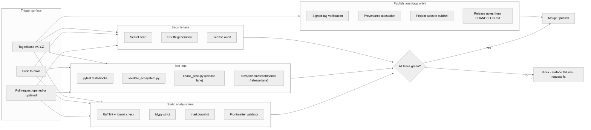

{/* SPDX-License-Identifier: MIT */}

**O mapa estrutural do fluxo de trabalho de build · validação · publicação que
controla cada alteração no ecossistema do Apothem.** Este documento instala a
superfície de visualização; os arquivos concretos de fluxo de trabalho do GitHub
Actions e o ferramental de release chegam depois, sob a instalação de prontidão
para produção.

## Forma do pipeline

## Papéis das faixas

- **Faixa de análise estática** — feedback rápido. O Ruff cobre o estilo Python e
  um conjunto curado de regras; o mypy impõe disciplina de tipos em strict; o
  markdownlint regula a superfície de documentação; o validador de frontmatter
  controla a conformidade do esquema de artefatos para regras, skills,
  trabalhadores delegados e comandos.
- **Faixa de testes** — `pytest tests/hooks` exercita o runtime de hooks contra a
  matriz completa de eventos; `validate_ecosystem.py` é a principal comporta
  estrutural para a consistência entre artefatos; `chaos_pass.py` e a suíte de
  benchmarks por classe sob `src/apothem/benchmarks/` ativam na faixa de release
  para capturar degradação sob entradas degradadas e regressões do orçamento de
  runtime.
- **Faixa de segurança** — a varredura de segredos captura credenciais
  comitadas por acidente; a geração de SBOM e as auditorias de licença controlam
  a superfície da cadeia de suprimentos para qualquer instalação de prontidão
  para produção.
- **Faixa de publicação** — roda apenas em releases com tag. A verificação de tag
  assinada confirma a procedência da branch de release; o site do projeto é
  publicado a partir de `site/dist/` para o destino do GitHub Pages; as notas de
  release derivam do formato Keep-A-Changelog do `CHANGELOG.md`.

## Configuração concreta

Os arquivos de fluxo de trabalho reais (`.github/workflows/ci.yml`,
`.github/workflows/release.yml`, etc.) são instalados durante a construção do
ecossistema de prontidão para produção. Este diagrama define a forma canônica que
toda configuração futura espelha.

## Referências cruzadas autoritativas

- `pyproject.toml` — fonte de verdade da configuração de Ruff / mypy / pytest.
- `scripts/dev/validate_ecosystem.py` — a principal comporta entre artefatos.
- `scripts/dev/validate_hooks.py` — validação estrutural específica de hooks.
- `scripts/dev/chaos_pass.py` — varredura adversarial de cada hook configurado.
- `src/apothem/benchmarks/` — verificadores do orçamento de runtime por classe.
- `site/content/docs/developer-guide.mdx` — o fluxo de trabalho do contribuidor voltado ao operador.
- `CHANGELOG.md` — fonte das notas de release.
