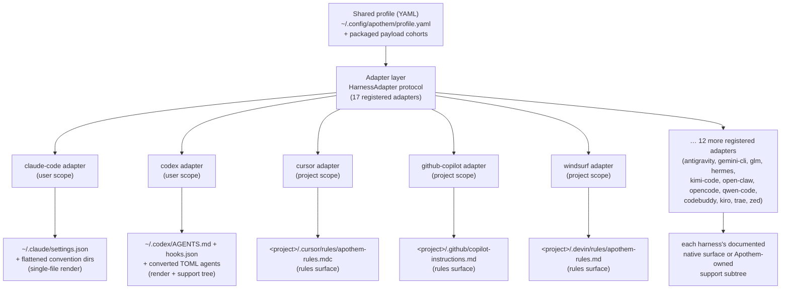

{/* SPDX-License-Identifier: MIT */}

O Apothem usa um único perfil YAML validado por esquema como a fonte semântica da
verdade e deriva cada superfície de instalação específica de harness por meio de
classes adaptadoras que implementam o protocolo `HarnessAdapter`. Cada adaptador
grava na localização de usuário ou de projeto documentada pelo harness e usa
caminhos de suporte próprios do Apothem apenas quando o harness não tem uma
primitiva nativa equivalente.

## Por que uma abstração de adaptador

Cada harness fala um dialeto de configuração diferente: um quer um arquivo de
configurações JSON, outro um diretório de arquivos de regra `.mdc`, um terceiro
um único arquivo de instruções Markdown. Se o Apothem embutisse esse conhecimento
diretamente na CLI, cada harness vazaria suas suposições para o núcleo, e
adicionar um harness significaria tocar a lógica de instalação, atualização,
desinstalação e verificação em sincronia.

O padrão adaptador inverte isso. O núcleo conhece apenas o protocolo
`HarnessAdapter` — um pequeno contrato de métodos de ciclo de vida. O dialeto de
cada harness vive dentro de um subpacote autocontido que implementa o contrato. O
núcleo pede a um adaptador que *instale* sem saber se isso significa renderizar um
arquivo JSON, gravar um diretório de regras ou assentar uma árvore de suporte. Os
novos harnesses entram satisfazendo o protocolo e registrando um ponto de
entrada; nada no núcleo muda. Essa é a razão estrutural pela qual o Apothem
permanece agnóstico ao host — a abstração é a fronteira que impede que o
conhecimento específico de harness se espalhe.

## A forma de um adaptador

Os adaptadores se dividem em duas formas de materialização, ambas visíveis no
registro:

- **Os renderizadores de arquivo único** traduzem campos do perfil em um único
  arquivo de configuração nativo do harness. O adaptador do Claude Code, por
  exemplo, sempre grava `~/.claude/settings.json` a partir do perfil compartilhado
  e achata os diretórios de convenção do Apothem (`agents/`, `rules/`, `skills/`,
  …) ao lado dele.
- **Os adaptadores de superfície de regras e de árvore de suporte** propagam o
  cohort de payload do Apothem para a localização de regras documentada pelo
  harness, convertendo os cohorts para o formato nativo onde um existe e
  estacionando o restante sob um subárvore de suporte próprio do Apothem
  referenciado a partir da âncora nativa. O adaptador do Cursor grava um único
  `.cursor/rules/apothem-rules.mdc` na raiz de projeto fornecida e entrega apenas
  a superfície de regras.

Um dado adaptador é de **escopo de usuário** (grava sob o diretório home) ou de
**escopo de projeto** (requer `--project <path>` e grava dentro daquela árvore);
o registro indica qual.

## Topologia atual de adaptadores



O leque do centro para a borda é a arquitetura que o nome do projeto codifica: um
perfil no núcleo, cada harness a uma distância igual ao longo de seu próprio
adaptador.

## Definição do protocolo

```python
from pathlib import Path
from typing import Protocol

class HarnessAdapter(Protocol):
    name: str
    output_path: Path

    def install(self, profile: dict[str, object]) -> object:
        ...

    def update(self, profile: dict[str, object]) -> object:
        ...

    def uninstall(self) -> None:
        ...

    def is_installed(self) -> bool:
        ...

    def verify(self) -> bool:
        ...
```

Os adaptadores de escopo de projeto podem adicionalmente aceitar `project: Path |
None` nos métodos de ciclo de vida e expor `resolve_output_path(project)`. A CLI
passa `--project PATH` apenas para os adaptadores cuja assinatura de método o
aceita.

## Registro de ponto de entrada

Os adaptadores se registram por meio do grupo de pontos de entrada do setuptools
`apothem.harnesses`:

```toml
[project.entry-points."apothem.harnesses"]
cursor = "apothem.harnesses.cursor:CursorAdapter"
```

O registro central em `src/apothem/lib/harness_registry.py` anota os dezessete IDs
públicos exatos, os pontos de entrada, os caminhos de documentação, os caminhos de
destino, os requisitos de dados de pacote, os estados de capacidade e os caminhos
de fixação de convenção padrão. A CLI carrega os adaptadores por meio desse
registro em vez de redescobrir fatos do produto em cada comando.

## Mapeamento de perfil para nativo

Cada adaptador implementa a lógica de tradução apropriada para seu harness:

```
YAML profile + payload cohort    Harness-native surface
-----------------------------    ----------------------
identity / preferences       --> native config fields or rendered instruction context
commands/*.md                --> native commands or SKILL.md folders
rules/*.md                   --> native rules where supported, otherwise support trees
hooks/messages/*.md          --> native hooks where supported, otherwise support trees
agents/*.md                  --> native agent formats where supported
skills/*/SKILL.md            --> native skill folders where supported
```

As células de capacidade não suportadas e pendentes de descoberta tornam-se
avisos estruturados antes das gravações. Elas não são projetadas em silêncio em
superfícies de fornecedor inventadas.

## Adicionar um novo adaptador

Veja [Escrever um adaptador de harness](/docs/examples/authoring-a-harness-adapter)
para um guia passo a passo.
