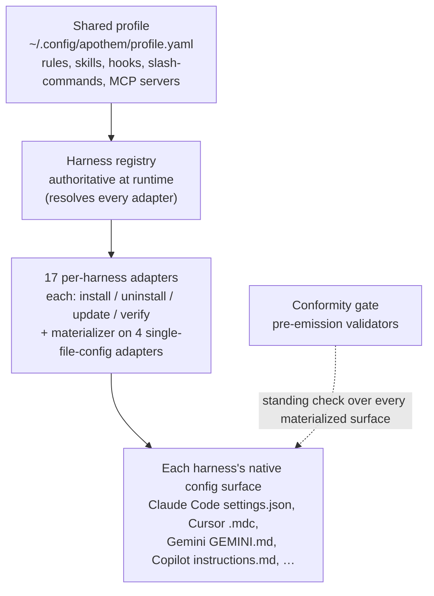

{/* SPDX-License-Identifier: MIT */}

O Apothem é construído em torno de uma única ideia: um perfil de governança
compartilhado, materializado no formato de configuração nativo de cada ambiente
de execução de assistente por um adaptador por harness. Esta
seção explica as peças estruturais — o protocolo do adaptador, o esquema do
perfil, a disposição da árvore de fontes e o fluxo de instalação que os conecta.

## Visão geral do sistema

Em um relance, o Apothem é um único pipeline: um único perfil compartilhado
alimenta o registro de harness, que resolve cada adaptador por harness; cada
adaptador materializa a superfície de configuração nativa do seu harness, e uma
verificação de conformidade permanente confere cada superfície materializada.

## Páginas

| Página | Descrição |
|------|-------------|
| [Abstração do adaptador de harness](/docs/architecture/harness-adapter-abstraction) | O protocolo `HarnessAdapter` — como os adaptadores traduzem o perfil compartilhado para a configuração nativa da plataforma. |
| [Esquema do perfil compartilhado](/docs/architecture/shared-profile-schema) | O perfil YAML respaldado por esquema em `~/.config/apothem/profile.yaml` ou `--profile PATH`. |
| [Disposição das fontes](/docs/architecture/source-layout) | Por que o Apothem usa uma disposição `src/` e como a árvore é organizada. |
| [Fluxo de instalação](/docs/architecture/installation-workflow) | Como `apothem install`, `update` e `uninstall` funcionam de ponta a ponta. |
| [Trabalhadores delegados](/docs/architecture/agents) | Instruções com escopo de repositório para ambientes de execução multi-trabalhador que operam neste repositório. |
| [Runtime autocontido](/docs/architecture/self-contained-runtime) | Como o motor do Apothem roda a partir de qualquer checkout — dependências internalizadas, o modelo de invocação PYTHONPATH=src e o bootstrap da árvore do plugin. |
| [Estratégia de internalização de dependências](/docs/architecture/vendoring-strategy) | Quais pacotes de terceiros o Apothem internaliza sob src/apothem/_vendor/, quais permanecem como pré-requisitos do sistema e como as cópias internalizadas são atualizadas. |
| [Contrato de empacotamento de cohort](/docs/architecture/cohort-packaging-contract) | O contrato estável e consumível a jusante para empacotamento de cohort e manifestos de plugin — enumere as cohorts e resolva seus alvos nativos por harness sem rederivar o mapeamento. |
| [Diagrama do pipeline de CI/CD](/docs/architecture/cicd-pipeline) | Mapa visual e detalhamento por faixas dos estágios do fluxo de trabalho de build, teste, lint, segurança e publicação que controlam cada alteração de código e cada release. |
